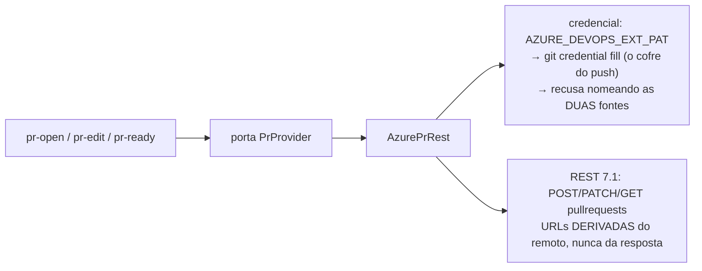

# o adaptador Azure DevOps abre PR, atualiza o corpo e tira de rascunho via REST com a credencial do git

O esqueleto honesto do #169 ganha corpo: num repositório Azure DevOps, `mustard-rt run pr-open / pr-edit / pr-ready` passam a funcionar de verdade — **com a credencial que o git da máquina já guarda**, zero configuração nova.

## Por quê

O operador trabalha num repositório corporativo (Suzano) hospedado no Azure DevOps, autenticado no git via credential helper (`credential.https://dev.azure.com.useHttpPath true`). Até aqui, toda operação de escrita de PR respondia `provider-unsupported` — honesto, mas inútil lá.

## O desenho

- **Onde o `git push` funciona, o adaptador funciona** — a credencial vem do mesmo cofre, pedida com `git credential fill` na URL https do remoto (respeitando o `useHttpPath` por caminho). `AZURE_DEVOPS_EXT_PAT` é a sobrescrita explícita (convenção da CLI `az`).
- **Nenhuma operação de merge existe** — o operador não tem alçada de merge na Suzano, e a restrição virou fronteira de arquitetura: o transporte rejeita qualquer verbo fora de GET/POST/PATCH.
- As três grafias de remoto (https, ssh v3, `visualstudio.com` legado) derivam a mesma API; um campo de URL vindo da resposta é deliberadamente ignorado (testado com isca).
- Estados `active/notSet→OPEN, completed→MERGED, abandoned→CLOSED`; `mergeStatus` viaja verbatim.
- Transporte injetável: `ureq` no real, fake em tabela nos testes — **nenhum teste toca rede nem o cofre real** (a precedência de credencial é função pura).

## Testes

4 critérios provados VERMELHOS antes do código e confirmados verdes no fechamento; `shared::` 80 verdes; suíte `rt` completa 2010 (a única falha é a instabilidade preexistente de latência do `writer_ndjson` sob carga, intocada e verde isolada). QA: pass. Revisão adversarial: aprovada com zero críticos.

## Fora de escopo, com endereço

- Percent-encoding do nome de branch na busca (`+`/`%` num branch responderia falso `no-pr-for-branch`) — achado menor da revisão, registrado em Concerns.
- Comentários/reviews de PR (o `review-prefetch` segue GitHub-only até a unidade das leituras).
- Azure DevOps Server on-premises (a sobrescrita de provedor cobre).
