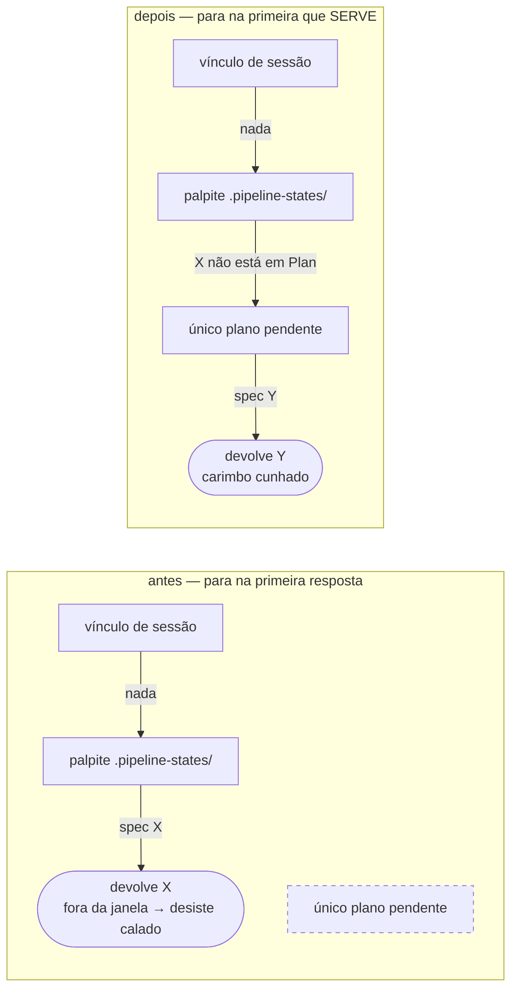

# Portão de aprovação e validador de moldes param de recusar o gesto que eles mesmos pedem

Numa sessão sem plan mode, um plano `full` deixa de ficar sem caminho de aprovação: responder o modal volta a valer, e `/mustard:spec r` digitado dentro do branch da unidade aprova em uma linha. Do outro lado, o autor de moldes de padrão para de ser recusado por copiar exatamente o que a instrução mandou copiar, e as duas ferramentas que respondiam "deu certo" sem ter feito nada passam a dizer o que falhou.

## Por quê

Um operador estava no branch da própria unidade, digitou `/mustard:spec`, leu o plano e respondeu **"Aprovar e implementar agora"** no modal. O `approve-spec` recusou logo depois por falta do carimbo `<spec>/.approved-by-user` — e listou, como caminho válido, exatamente o gesto que ele acabara de fazer. Sem plan mode restavam duas saídas, e nenhuma era a documentada: digitar a forma do seletor por letra, ou relaxar a trava com `MUSTARD_APPROVAL_MODE=warn`, que é auto-aprovação com outro nome.

O diagnóstico óbvio estava errado. A porta do modal existe, está registrada em `PostToolUse(AskUserQuestion)` e cunha o carimbo. O que falha é a pergunta **anterior** a ela: de qual spec estamos falando. E o recuo acontece antes do aviso que o explicaria, então o gesto é gasto antes de se saber que não contou.

Na mesma passada de campo, do lado dos moldes: **19 dos 79 moldes recusados na primeira tentativa**, sempre pelo mesmo detalhe — `paths:` escrito em uma linha em vez de lista. Três re-execuções, cerca de 110 mil tokens. A causa não foi desleixo do agente: o worklist entregava os globs juntados por vírgula numa linha só, sob a instrução "copie ao pé da letra". Dois outros moldes passaram com as seções fora de forma, porque o validador confere o conteúdo e nunca conferiu os títulos.

## O que mudou

### A fila que resolve qual spec está sendo aprovada

Ela tem três degraus e ficava com o primeiro que respondesse **qualquer coisa**. O terceiro degrau — o único que aplica a janela `full` + `Plan` + não-aprovada — só era consultado quando os dois primeiros calavam. Um palpite obsoleto em `.pipeline-states/` bastava para engolir a resposta certa.



O terceiro degrau continua fail-closed: zero candidatos, ou mais de um, devolve nada — uma aprovação real nunca é atribuída a uma spec ambígua.

**O recuo passa a falar.** Quando a resposta selecionada já era uma opção oferecida e afirmativa, e foi a janela que recusou, o observador nomeia em `stderr` qual metade falhou. Só nesse caso: ele vê toda pergunta da sessão, e qualquer aviso mais largo vira ruído em todas elas.

**`/mustard:spec r`, sem letra.** Dentro do branch da unidade o branch já nomeia a spec, então não sobra letra nem tabela para pedir. A regra que governa `{letra}r` governa esta forma sem afrouxar nada: continua sendo o prompt inteiro, digitado por uma pessoa. Fora de um branch de unidade — base de integração, `HEAD` solto, diretório que não é repositório — a forma não nomeia nada e não cunha nada.

A letra `r` passa a ter dono declarado: dentro do branch da unidade, o checkout vence. Nada se perde, porque uma letra sozinha nunca cunhou nada; escolher a linha `r` com aprovação junto continua sendo `rr`.

### O molde de padrão

| antes | depois |
|---|---|
| worklist: `paths (copy verbatim): a/**, b/**` | worklist: o bloco YAML literal, indentado |
| validador lê só a lista em bloco | lê as três formas, prova o **valor**, grava sempre em lista |
| títulos nunca conferidos | os quatro canônicos, uma vez cada, nessa ordem |
| relay: `ok:true, blocks:0` para arquivo ilegível | `ok:false` nomeando o arquivo |

O relatório de "li e não achei bloco" valia só para o envelope reconhecido como JSON. Um arquivo que **é** lido mas não é JSON caía em texto cru e voltava a mentir. Agora vale para o canal de arquivo inteiro. O valor literal passado direto em `--content` mantém seu relatório vazio e fail-open, então isso não vira um modo de falha novo.

### A prosa e a recusa

`refs/spec/resume-loop.md` §A dizia que a resposta ao modal cunha o marcador, e parava aí. Agora nomeia a condição **antes** de a pergunta ser feita: só **selecionar** a opção cunha, e só enquanto o rótulo dela carrega o radical que separa aprovação de recusa; texto livre não cunha nada. E nomeia a saída de uma linha. A recusa do `approve-spec` passa a listar os três gestos, não dois.

## Como validar

Nada abaixo toca a sua árvore de trabalho.

```bash
git fetch origin && git checkout fix/aprovacao-moldes-padrao
cargo build --workspace                       # 0 erros
cargo test --workspace --no-fail-fast         # 3125 passam, 0 falham (78 conjuntos)
```

O tolerar-na-leitura / normalizar-na-escrita e a recusa por título, contra o binário real:

```bash
T=$(mktemp -d) && cd "$T"
# um molde com `paths:` numa linha só — antes era recusado
printf -- '---\nname: api-x-pattern\ndescription: Use when adding or refactoring an X.\npaths: apps/api/services/**\nsource: scan\n---\n\n## Purpose\nb\n\n## Convention\nb\n\n## How to apply\nb\n\n## Examples\nb\n' > m.md
mustard-rt run scan-patterns-apply --path apps/api/.claude/skills/api-x-pattern/SKILL.md --content @m.md
grep -A2 '^paths:' apps/api/.claude/skills/api-x-pattern/SKILL.md   # gravado como lista em bloco

# um envelope que É lido mas não demarca nada — antes voltava ok:true
printf 'não achei nada que valesse um molde.\n' > ret.txt
mustard-rt run scan-patterns-relay --content @ret.txt               # ok:false, nomeando ret.txt
```

## Testes

**Cada critério foi provado VERMELHO contra a árvore antes de o código existir** — um critério que não sabe falhar não entra no plano. E no fechamento cada um foi rodado de novo com o trabalho **retirado da árvore**: todos voltaram vermelhos, nenhum estava passando por acidente.

| # | o que garante | comando |
|---|---|---|
| AC-1 | palpite obsoleto não sombreia mais o plano pendente | `cargo test -p mustard-rt a_stale_hint_never_shadows_the_pending_full_plan` |
| AC-2 | o recuo pela janela nomeia a condição em `stderr` | `cargo test -p mustard-rt a_fact_one_decline_names_its_reason` |
| AC-3 | `r` seco cunha dentro do branch da unidade e não fora | `cargo test -p mustard-rt a_bare_r_inside_the_units_branch_mints_the_marker` |
| AC-4 | o worklist entrega `paths` como o YAML que o molde carrega | `cargo test -p mustard-rt the_worklist_prints_paths_as_the_yaml_the_mold_must_carry` |
| AC-5 | `paths` inline é aceito e gravado como lista | `cargo test -p mustard-rt an_inline_paths_value_is_accepted_and_written_as_a_list` |
| AC-6 | título faltando, duplicado ou fora de ordem é recusado | `cargo test -p mustard-rt a_mold_whose_headings_are_wrong_is_refused` |
| AC-7 | arquivo lido e sem blocos volta `ok:false` nomeando o arquivo | `cargo test -p mustard-rt a_read_file_that_demarcates_nothing_is_never_a_silent_ok` |
| AC-8 | a prosa diz qual gesto conta | `! grep -q 'the answer mints the same marker' plugin/refs/spec/resume-loop.md && grep -q '/mustard:spec r' plugin/commands/spec.md` |
| AC-9 | a recusa nomeia os três gestos | `cargo test -p mustard-rt the_refusal_names_the_gestures_that_actually_mint` |
| AC-10 | a árvore compila inteira | `cargo build --workspace` |

Um teste extra percorre **todos** os moldes `-pattern` que este repositório carrega e afirma que já satisfazem a checagem nova — a regra estrita nasce verde, sem custar nenhuma recusa no corpus existente.

## Decisões que valem explicação

**Consertar qual spec a porta decide, em vez de ensinar um gesto novo a ela.** O relatório de campo atribuiu a falha à porta do modal. A leitura do código refutou isso: ela existe, está registrada e cunha. Ensinar um gesto novo teria deixado o defeito real intacto — e o defeito real atinge também a porta do plan mode, que compartilha a mesma fila e por isso herda o conserto sem uma linha de código.

**Corrigir a instrução antes de afrouxar o validador.** Só afrouxar o validador deixaria a instrução ensinando errado para sempre. Só corrigir a instrução deixaria o custo de forma cobrado de quem já tem molde escrito de outro jeito. Os dois juntos: a instrução mostra o que copiar, o validador prova o valor em qualquer forma, e a escrita normaliza — então o arquivo em disco é sempre canônico.

**Checagem de títulos estrita, não tolerante.** Um molde é escrito uma vez e depois carrega sozinho em toda edição da pasta, então um defeito de forma é permanente, não um erro de digitação. A versão estrita foi medida contra o corpus inteiro antes de ser escolhida: custa zero recusas hoje.

**O `r` seco resolve pelo checkout, nunca pela sessão.** Mesmo princípio que faz `{letra}r` resolver pela letra: o gesto é que nomeia a spec. Honrar a sessão cunharia um gesto genuíno contra a spec errada — que, para essa spec, é indistinguível de um forjado.

**A trava do `approve-spec` não foi tocada.** Ela existe por um incidente real de um modelo se auto-aprovando. O defeito era a porta que ela anuncia estar trancada, não a tranca existir.

## Fora de escopo

- **Afrouxar a exatidão de prompt inteiro.** Uma regra que casasse com trecho deixaria uma mensagem que apenas cita a forma cunhar o carimbo — que é a forma da falsificação que já aconteceu uma vez.
- **Os radicais de aprovação e a regra de opção oferecida.** São eles que carregam o peso de segurança; nada aqui os toca.
- **A metade Guards do scan.** No repositório onde o relatório nasceu ela nunca rodou, e não vai: é um projeto npm único, sem subprojetos, então ela não tem onde escrever. Não é falha, é o formato do repositório.
- **A contradição entre o texto do fluxo do scan e o instalador**, que esconde a saída via `.git/info/exclude` com o comentário "this clone only". Fica registrada; é unidade própria.
- **Os dois moldes já gravados fora de forma no repositório de campo.** Resolvem-se lá, re-executando o autor para aquelas duas pastas — que agora falha alto em vez de gravar em silêncio.

## O que fica em aberto

Três observações da revisão, nenhuma bloqueante, todas registradas em `review/findings.md` e deliberadamente **não** consertadas aqui:

1. O teste do AC-1 pula sozinho se `MUSTARD_ACTIVE_SPEC` estiver definida no ambiente. É convenção pré-existente do arquivo (mesma forma num teste vizinho que antecede esta unidade). Verificado como **não** vazio na medição: a variável estava indefinida.
2. A re-checagem da janela em `plan_approval_observer.rs` virou inalcançável, porque a fila já a garante. Inofensiva; removê-la é simplificação, não conserto.
3. O plano listou quatro arquivos que as ondas não tocaram. A revisão confirmou que está correto e não é trabalho perdido: o leitor do nome do branch já era compartilhado, o plan mode herda o conserto pela fila comum, e o teste do AC-9 caiu onde o comando dele o procura.

Números medidos, não estimados: 10 arquivos, +1193/−127 linhas, 3125 testes verdes em 78 conjuntos, 4 avisos de compilação — todos pré-existentes em arquivos que esta unidade não tocou.
