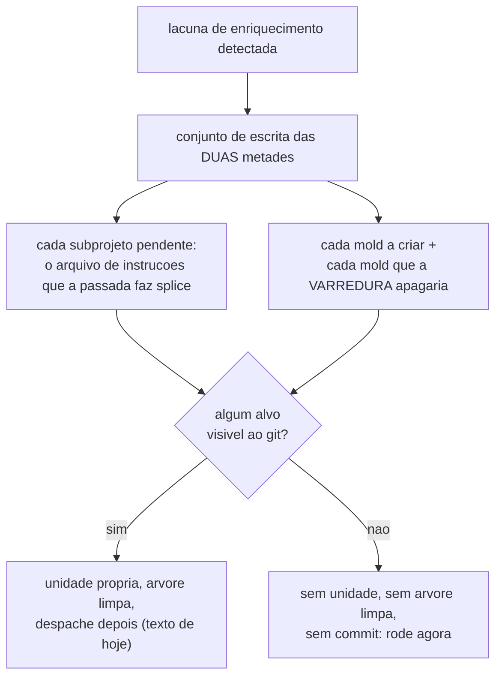

O aviso `base-gate: enrichment stale` deixa de cobrar cerimônia onde ela não se aplica. Ele aparece a cada abertura de unidade e sempre terminava mandando abrir uma **unidade de trabalho própria, em árvore limpa**. Numa instalação que esconde a saída do enriquecimento do git, as três exigências são falsas — e o aviso virava um lembrete perpétuo de agendar algo que não precisa de agendamento.

> **Empilha sobre o #191**, que por sua vez empilha sobre o #190. O alvo é `fix/censo-suja-arvore-guards-contam` para o diff mostrar só esta unidade.

## Por quê

A frase antiga era categórica: *"a passada reescreve arquivos versionados, então é unidade própria em árvore limpa — despache quando a atual fechar."*

Nesta sessão as Guards dos 8 subprojetos reais foram escritas rodando a passada **inline**, sem branch e sem commit, e a árvore ficou limpa o tempo todo — exatamente o que o aviso dizia ser impossível. As Guards vão para `CLAUDE.local.md`, que a instalação privada pôs no `info/exclude`.

Sem arquivo versionado reescrito não há commit a manter separado; sem isso não há necessidade de árvore limpa; e sem nada disso não há unidade a abrir.

## O que mudou



A lacuna reportada **não muda**: o que falta continua faltando nos dois modos. O que muda é o preço que a frase cobra para fechá-la. E a prosa do roteador foi junto — sem ela o emissor mudaria e a regra que a sessão obedece não, então a correção não chegaria ao operador.

## Como validar

Em worktree descartável:

```bash
git fetch origin fix/aviso-cobra-cerimonia-que-nao
git worktree add /tmp/rev origin/fix/aviso-cobra-cerimonia-que-nao
cd /tmp/rev && cargo test -p mustard-rt -p mustard-core -p mustard-cli
```

O comportamento fim-a-fim, num repositório descartável com instalação privada e um mold rastreado:

```bash
mustard-rt run emit-pipeline --kind pipeline.kind --spec x --type fix   # linha ESTRITA
git rm --cached apps/api/.claude/skills/api-service-pattern/SKILL.md
mustard-rt run emit-pipeline --kind pipeline.kind --spec y --type fix   # linha RELAXADA
```

## Testes

AC-1 e AC-2 foram provados **VERMELHOS antes do código existir** (`ac-negative-check`, com controle verde ao lado) e verdes depois (`confirmation: taken=true, ok=true, unproven=[]`).

| # | o que garante | comando |
|---|---|---|
| AC-1 | saída escondida: a linha não pede unidade nem árvore limpa | `cargo test -p mustard-rt a_hidden_enrichment_asks_for_no_ceremony` |
| AC-2 | saída versionada: o texto de hoje, palavra por palavra | `cargo test -p mustard-rt a_versioned_enrichment_still_asks_for_its_own_unit` |
| AC-3 | o workspace compila | `cargo build --workspace` |

**Três testes exercitam a MEDIDA contra repositório real**, e cada um trava um defeito que a revisão encontrou — nenhum deles podia ser provado vermelho antes, porque nasceram da revisão do próprio conserto:

- `one_tracked_target_among_ignored_ones_keeps_the_strict_advice` — um alvo rastreado entre ignorados, incluindo a ordem alfabética que produziu o defeito
- `an_authored_tracked_mold_still_counts_as_a_rewrite` — worklist vazia, Guards escondidas, um mold rastreado já autorado
- `every_target_ignored_relaxes_the_advice` — o outro lado

Suítes medidas: **mustard-core 674**, **mustard-rt 2155**, **mustard-cli 57**. `cargo build --workspace` sai 0 com 4 avisos pré-existentes.

## Decisões que merecem explicação

**Não silenciar o aviso.** A lacuna é real nos dois modos: sem as Guards, todo agente que edita aquele subprojeto trabalha sem elas. Calar trocaria uma cobrança errada por uma omissão.

**A medida é o conjunto de ESCRITA das duas metades, e qualquer alvo versionado basta.** As duas podem divergir: neste repositório as Guards estão escondidas enquanto **37 molds são rastreados**. Medir só uma metade anunciaria "não reescreve nada versionado" prescrevendo uma passada que reescreve 37 arquivos rastreados — a mais perigosa das duas direções de erro.

**O que a varredura APAGA também é escrita.** Esta foi a correção mais fina, e só apareceu porque o revisor rodou o binário. A worklist lista molds que **não existem**; a passada começa deletando todo mold `source: scan` que **existe**. Num repositório com todos autorados a worklist é vazia — e medir só ela respondia "escreve nada" prestes a apagar 37 arquivos versionados.

**Todos os subprojetos pendentes, nunca o primeiro.** `collect_pending` ordena por caminho; sondar só o primeiro fazia o conselho depender de ordem alfabética. Reproduzido renomeando uma pasta de `aignored/` para `zignored/`: mesmo arquivo rastreado, conselho oposto.

**Não medido conta como VERSIONADO.** A advertência estrita custa uma unidade desnecessária; a inversa manda reescrever arquivo versionado em árvore suja, que é o que o `scan_clean_gate` existe para recusar.

**Uma passada só pelos dois coletores.** Ambos são trabalho real (~34 ms) e isso roda em toda abertura de unidade; ler os caminhos das mesmas entradas que produziram a lacuna também impede que as duas discordem sobre quais subprojetos estão pendentes.

## Fora de escopo

- **Fazer o portão rodar o enriquecimento.** Ele é um processo Rust; Guards e molds são escritos por agente.
- **Mudar a contagem da lacuna** — é o #191 que remove as pastas de teste dela.

## Ainda em aberto

- O custo medido no pior caso (todo alvo escondido, sem curto-circuito, ~45 spawns de `check-ignore`) é de ~100 ms por abertura de unidade. Aceitável, e a resposta é independente de ordem, mas é custo novo.
- Esta unidade foi **reprovada três vezes** antes de aprovar, e os três achados críticos vieram de rodar o binário, não de ler o código. Os dois critérios de aceitação entregam o booleano decisivo na mão — é o que os mantém focados no texto —, e são os três testes de medida que cobrem o fato.
