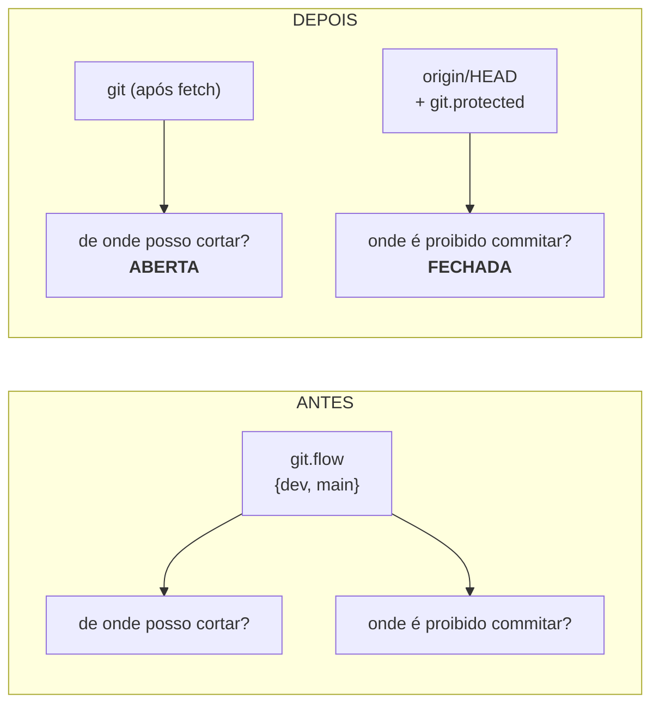

Abrir uma unidade de trabalho passa a perguntar de qual branch ela sai contra a lista **real** do repositório, buscada com `git fetch` na hora. O tipo (`feature`, `fix`, `hotfix`, `chore`, …) vira um rótulo aberto que só nomeia o prefixo do branch. E a proteção contra commit direto deixa de seguir um arquivo de configuração: passa a seguir o branch padrão que o próprio remoto declara.

## Por quê

O Mustard perguntava duas coisas ao abrir uma unidade — de qual base sair e que tipo de trabalho é — e as duas respostas vinham de `mustard.json#git.flow`, uma lista escrita **uma vez**, no dia do `mustard init`.

Num repositório próprio isso nunca incomoda. Em uso corporativo aparece no primeiro dia: cada cliente nomeia seus branches do seu jeito, times cortam `release/2026-Q3` e `integration/squad-b` durante a semana, e ninguém volta para rodar o `init` de novo. O resultado é o pior possível — o portão **recusa a abertura dizendo que um branch que existe de verdade não é uma base**, e a saída oferecida é editar configuração, projeto por projeto.

A causa é que uma lista fazia dois trabalhos com respostas opostas. `integration_bases()` respondia ao mesmo tempo *"de onde posso cortar?"* e *"onde é proibido commitar?"*. Enquanto as duas fossem a mesma, a lista precisava ser fechada — e fechada é exatamente o que quebrava o caso comum.

## O que mudou

Separar as duas perguntas é o que permite abrir a primeira sem afrouxar a segunda.



Contra este próprio repositório, o comando novo mostra a mudança inteira em duas linhas:

```
$ mustard-rt run base-candidates
dev    protected: false   preselected: true
main   protected: true    preselected: true
```

`dev` aparece no `git.flow` e **não** é protegida. `main` é — por ser o branch padrão do remoto, sem nenhuma configuração nomeando.

Quatro peças:

- **`packages/core/src/platform/git_branches.rs`** (novo) — `branch_catalog` lista os branches reais ordenados por recência; `protected_branches` resolve o conjunto protegido. O guard do `core` proíbe efeito colateral em `domain/`, então o modelo ficou puro e a sonda do git mora em `platform/`.
- **`run base-candidates`** (novo) — o menu que o fluxo oferece, com `protected` e `preselected` marcados por linha e `measured:false` quando o git não pôde ser consultado.
- **O portão de base** perde o teste de pertencimento; a recusa por base atrasada em relação ao `origin` fica.
- **`WorkKind`** deixa de ser enum fechado de três e vira rótulo validado. `base_of_kind` some: o tipo não decide mais a base.

## Como validar

Num diretório descartável, sem tocar em nada seu:

```bash
cd "$(mktemp -d)"
git init -q -b producao . && git commit -q --allow-empty -m seed
git update-ref refs/remotes/origin/producao HEAD
git update-ref refs/remotes/origin/release/2026-Q3 HEAD
git symbolic-ref refs/remotes/origin/HEAD refs/remotes/origin/producao
echo '{"git":{"flow":{"*":"producao"}}}' > mustard.json

mustard-rt run base-candidates --no-fetch
```

Esperado: as duas linhas aparecem, `release/2026-Q3` incluída **mesmo sem estar em nenhuma configuração**, e só `producao` sai com `"protected": true` — sem que a palavra `main` exista em lugar nenhum do fixture.

## Testes

Cada critério foi **provado VERMELHO** contra a árvore antes do código existir — o `ac-negative-check` recusa a fase de plano se algum passar cedo demais.

| # | O que garante | Comando |
|---|---|---|
| AC-1 | o portão aceita branch real não declarado | `cargo test -p mustard-rt --lib commands::event::base_gate::tests::accepts_any_real_branch_as_base -- --exact` |
| AC-2 | só o branch padrão do remoto é protegido | `cargo test -p mustard-rt --lib commands::event::work_branch::tests::only_the_remote_default_branch_is_protected -- --exact` |
| AC-3 | tipo fora da lista sugerida é aceito | `cargo test -p mustard-rt --lib shared::work_kind::tests::accepts_a_type_outside_the_suggested_list -- --exact` |
| AC-4 | `base-candidates` devolve os branches reais | `cargo run -p mustard-rt -- run base-candidates` |
| AC-5 | o `init` não pergunta branches nem grava `git.flow` | `cargo test -p mustard-cli --lib commands::git_flow::tests::init_does_not_ask_for_branches -- --exact` |
| AC-6 | `git.flow` antigo pré-seleciona sem restringir | `cargo test -p mustard-rt --lib commands::event::base_gate::tests::a_declared_flow_preselects_without_refusing_others -- --exact` |
| AC-7 | build do workspace verde | `cargo build --workspace` |

Suítes medidas nesta árvore: **`rt` 1984**, **`core` 624**, **`cli` 49**, todas com 0 falhas. QA do pipeline: **7/7**.

## Decisões que merecem explicação

**A sonda do branch padrão tem dois degraus, não um.** `git symbolic-ref refs/remotes/origin/HEAD` parece bastar e não basta: medido contra o git real, um clone sem `origin/HEAD` — formato comum em CI — sai com **exit 128**. Sozinha, a sonda responderia "não sei" exatamente onde a proteção mais importa. A escada é ref local (grátis) → `ls-remote --symref` (uma ida à rede, e o fluxo já ia buscar) → só então o literal.

**A degradação vai para o lado estrito.** Repositório que não dá para medir mantém `main` e `master` fechadas. É a única direção em que errar custa algo irreversível.

**`git.flow` não foi deletado.** Ele para de ser perguntado e para de restringir, mas continua sendo lido: quando existe, pré-seleciona a linha no seletor. Nenhuma instalação precisa de migração.

**A recusa "um hotfix não sai da base do trabalho comum" foi removida, e a catraca agora guarda a ausência dela.** Ela só era coerente enquanto o tipo *inferia* a base. Com a base escolhida explicitamente, mantê-la seria recusar o operador por uma resposta que o próprio fluxo pediu que ele desse.

**O coletor de worktrees passou a decidir por estrutura, não por nome.** Abrir o vocabulário quebrou o teste "este diretório é um contêiner de tipo?", e o coletor passou a listar nada. A pergunta certa é feita aos **filhos**: um contêiner guarda worktrees, e todo worktree do git carrega uma entrada `.git`. Um nível de olhar resolve para `feature/` e para `spike/` igualmente.

## Fora de escopo

- **Convenção de nome com ticket** (`feature/PROJ-123-descricao`). Não foi pedida; entra como unidade própria se a empresa exigir.
- **Proteger mais de um branch por padrão.** Times que também protegem `develop` declaram em `git.protected` — o padrão continua sendo um branch só.
- **Migração de instalações existentes.** Deliberadamente nenhuma.

## O que fica em aberto

**Instabilidade preexistente no `commands::git_settle`**, não introduzida aqui: quatro testes falham de forma intermitente em paralelo (variaram 4 → 1 → 4 sem edição no meio) e passam **30/30 com `--test-threads=1`**. São fixtures que usam `git worktree repair` em caminhos temporários e brigam entre si. Merece unidade própria.

**Um teste de `private_install` estava cego e foi consertado de passagem.** O fixture tornava `.git/info/exclude` um diretório para forçar a escrita a falhar — o que também derruba o `git status` inteiro (git 2.55: `fatal: cannot use … as an exclude file`, exit 128), de modo que a asserção final não media nada. Agora sela o diretório pai. Provavelmente nunca apareceu porque o projeto rodava no Windows.