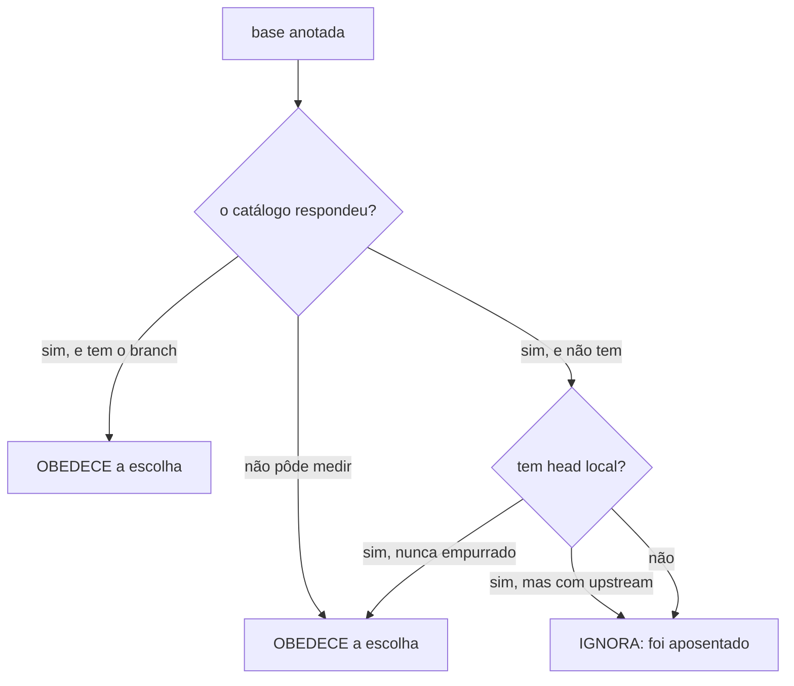

A base que você escolhe ao abrir um trabalho passa a ser a base de onde o branch é realmente cortado — em qualquer projeto, com qualquer nome de branch. E `git delete` deixa de apagar branches de integração.

## Por quê

Abrir um trabalho começa com uma escolha: de qual branch ele parte. O produto mede os branches que existem de verdade no `origin`, mostra a lista, você escolhe, e a escolha é anotada. Um passo depois, na hora de criar o branch, essa anotação era conferida contra uma lista guardada no arquivo de configuração — e descartada se não estivesse lá.

É um restaurante que mostra o cardápio de hoje, anota o pedido, e manda a cozinha conferir contra o cardápio do ano passado.

O agravante: **essa lista deixou de ser escrita.** O instalador não pergunta mais quais são os branches e não grava a chave. Sem ela, a conferência cai para dois nomes fixos, `main` e `master` — os únicos nomes de branch escritos à mão no produto inteiro. Em qualquer projeto novo cujos branches se chamem `develop`, `producao` ou `trunk`, **toda** escolha de base era descartada. Não é caso de borda: é o caminho padrão.

E o produto se contradizia por escrito. A função que devolve essa lista documenta, em letras: *"Nothing here refuses anything any more"*. Seis pontos do código usavam exatamente essa função para recusar.

## O que mudou

```
HOJE                                    DEPOIS
catálogo real ──► você escolhe          catálogo real ──► você escolhe
                      │                                      │
                   anotado                                anotado
                      │                                      │
              confere na LISTA VELHA               confere se AINDA EXISTE
                      │                                      │
          não está lá ─┴─► descarta            existe ────────┴─► corta daí
                            e corta de outra    sumiu ─────────► aí sim, deriva
```

A proteção que o filtro queria dar era legítima e continua: não obedecer a uma base que ficou obsoleta. O erro não era proteger — era o teste escolhido. "Ainda existe?" é mensurável; "está numa lista que ninguém escreve mais?" não mede nada.

Existência tem três respostas, não duas, e a terceira é a que evita repetir o defeito:



Descartar por não ter conseguido medir seria o mesmo defeito apontado para outra fonte. E o head local só vale quando o branch **nunca foi empurrado**: `git fetch --prune` limpa referências remotas, nunca as locais, então uma base apagada no `origin` com cópia local para trás não pode ser obedecida. O upstream configurado separa os dois casos, e é medido.

**A identidade de uma unidade passou a ser o registro, não o formato do nome.** O vocabulário de tipos é aberto por desenho, então `release/2026-Q3` se divide em tipo e slug exatamente como `fix/aba`. Três guardas sucessivas caíram nisso, e `git delete` chegou a apagar uma linha de release **no remoto**. Uma unidade agora é aquilo que o projeto registrou como unidade — o diretório em `.claude/spec/` —, lido no disco e nas duas referências que podem carregá-lo, porque o diretório é escrito na branch da unidade enquanto as portas rodam de fora dela. Para ação irreversível, ausência de evidência **recusa**.

Seis pontos que recusavam pela lista velha foram repontados: abrir worktree, `pr list`, `git delete`, o diagnóstico, `git settle` e a validação de `--base` ao abrir por nome de branch.

## Como validar

Num diretório descartável:

```bash
cd "$(mktemp -d)"
git clone <este-repo> m && cd m && git checkout fix/base-escolhida-pelo-operador-descartada
cargo test --workspace
cargo test -p mustard-rt a_slashed_integration_base_is_never_deleted_and_never_refused -- --nocapture
```

## Testes

Cada critério foi provado VERMELHO antes do código. Dois deles foram **reescritos durante a revisão** porque mediam a coisa errada: um procurava um trecho de texto no código-fonte — e exigia justamente a linha que produzia o defeito, ou seja, certificava o bug; outro conferia o diagnóstico por grep em vez de executá-lo.

| critério | o que garante | comando |
|---|---|---|
| AC-1 | a escolha sobrevive até o corte, em projeto com várias bases, com uma só e sem nenhuma | `cargo test -p mustard-rt the_recorded_base_survives_to_the_cut_in_any_project` |
| AC-2 | base que sumiu do remoto é ignorada; a proteção continua, medindo existência | `cargo test -p mustard-rt a_vanished_recorded_base_is_ignored` |
| AC-3 | base com barra no nome não é apagada nem recusada; unidade real continua apagável | `cargo test -p mustard-rt a_slashed_integration_base_is_never_deleted_and_never_refused` |
| AC-4 | o diagnóstico não exige o fluxo que o instalador não grava | `cargo test -p mustard-rt doctor_does_not_ask_for_a_flow_that_the_installer_no_longer_writes` |
| AC-5 | a referência que `/git` manda ler ensina o modelo medido | `cargo test -p mustard-rt --test plugin_prose_matches_shipped_behaviour the_git_reference_teaches_the_measured_model` |
| AC-6 | a suíte inteira passa | `cargo test --workspace` |

Suíte completa nesta branch, medida: **3.007 testes, 0 falhas, 6 ignorados** (78 suítes).

## Decisões que valem explicar

**A lista pré-selecionada voltou, mas só onde protege.** Ela não é permissão e não recusa mais nada; é entrada de segurança para impedir que um branch que o projeto chamou de base seja confundido com unidade descartável. Foram removidas as leituras que decidiam recusa e mantida a que evita destruição.

**A pergunta "houve escolha?" passou a ter duas fontes ligadas por OU.** A primeira tentativa substituiu a contagem da lista declarada pelo catálogo real e quebrou um teste que dependia da primeira. A forma "ou" preserva as duas garantias — a regra antiga estava errada como permissão, não como sinal.

**Uma catraca trocou de natureza.** Ela exigia a **presença** de uma linha exata e ficava verde enquanto o produto apagava branch. Agora exige **ausência**: nenhuma das portas pode consultar a lista pré-selecionada. Uma asserção de ausência não consegue certificar um defeito.

**O reescritor de comandos partia `$(mktemp -d)` ao meio.** Ele lia o valor de uma variável de ambiente procurando o primeiro espaço, e uma substituição de comando tem espaço dentro — o resultado era `D=$(mktemp rtk -d)`, que falha e deixa a variável **vazia**. Todo script que seguisse com `cd "$D"` ou `git -C "$D" init` operava no diretório corrente. Isso corrompeu um repositório real três vezes numa única sessão. A leitura agora respeita substituição, crase e aspas, contando aninhamento.

**Fixtures foram completadas, nunca asserções afrouxadas.** Cinco testes quebraram ao introduzir a identidade por registro. Em todos, o cenário é que estava incompleto: criavam um branch de unidade sem o registro que a torna uma unidade — e um deles nem criava o branch que a asserção dizia estar julgando.

## Fora de escopo

- **A trava de tamanho dos injetáveis** continua medindo por arquivo quando o limite é a soma por evento. Unidade própria já aberta (`2026-08-20-teto-injetaveis-medido-por`).
- **`git settle --unit`** ainda nomeia `main, master` como candidatas em repositório que não tem nenhuma das duas. Mesma raiz, sem efeito destrutivo, deliberadamente fora daqui.
- **O gancho instalado ainda parte `$(mktemp -d)`** até esta versão ser publicada — a correção está aqui, mas só passa a valer quando o binário instalado for o desta branch.
- **Dois pontos de leitura ainda constroem um modelo sem raiz de projeto**, então uma unidade no formato antigo cujo base o fluxo não declara resolve para nada. São caminhos somente-leitura, sem recusa.