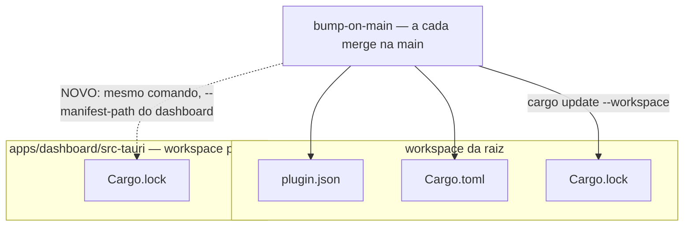

# fix(release): o selo de versão passa a alcançar o Cargo.lock do dashboard

O bump automático de versão deixava um quarto arquivo para trás a cada release, e nada no
repositório percebia. Este pull request fecha essa perna na origem e deixa um teste vigiando, para
que a próxima vez que ela cair alguém saiba no mesmo dia.

## Por quê

O bump grava o selo de versão em três arquivos, e o próprio workflow os chama de "as pernas do
selo": `plugin/.claude-plugin/plugin.json`, o `version` do `Cargo.toml` da raiz, e o `Cargo.lock` da
raiz — este último por um `cargo update --workspace`. Um comentário dentro do workflow conta que
esquecer a terceira derrubou o release da v0.1.29 nos três sistemas operacionais.

Existe uma quarta que ninguém declarou. `apps/dashboard/src-tauri` é workspace root próprio de
propósito, então tem o **seu** `Cargo.lock`, e o `cargo update --workspace` da raiz não o alcança.

O que fez isso durar é que ninguém olha esse arquivo:

- a integração contínua exclui o dashboard de propósito — ele precisa de bibliotecas de sistema
  diferentes em cada sistema operacional;
- o release o compila por `tauri build`, **sem** `--locked`, então o lockfile velho é consertado na
  hora do build e o conserto é jogado fora em vez de commitado.

Medido em 22/08/2026: aquele arquivo ainda fixava `mustard-cli` e `mustard-core` em `0.1.41` com o
repositório em `0.1.44` — três releases atrás. Quem tentasse compilar o dashboard recebia a árvore
suja sem ter pedido nada. E no dia em que alguém acrescentar `--locked` àquele build, o release
quebra pelo mesmo motivo da v0.1.29.

## O que mudou



Duas correções, porque uma sozinha não fecha.

**Na origem.** `bump-on-main.yml` ganha a quarta perna nas **duas** pernas dele — a que nasce na main
e a que propaga o selo para o dev. São três linhas em cada: o `cargo update --workspace` apontado
para o manifesto do dashboard, a conferência de que o lock realmente andou, e o arquivo entrando no
`git add`.

A perna do dev muda também na **decisão**, não só no trabalho. Ela pula a propagação inteira quando
o dev já está na versão nova, e essa comparação olhava apenas `plugin.json` e `Cargo.toml`. As três
primeiras pernas podem estar em dia com a quarta atrasada — foi exatamente o estado em que este
conserto encontrou o repositório — e nesse caso o bloco seria pulado e o lock do dashboard nunca
andaria. A condição agora consulta as quatro.

**No guarda.** `packages/core/tests/version_line.rs` passa a reprovar se esse lockfile ficar para
trás, e a mensagem de falha entrega o comando exato que resolve.

**Nota sobre o diff.** Além do commit desta unidade viaja `chore: refresh the deterministic project
census`, gravado automaticamente quando a unidade abriu sobre a base atualizada.

O `dev` também foi trazido para dentro desta branch por um merge, porque o portão de verificação
compila o dashboard e precisava do conserto do teste de telemetria que veio no #199. Por isso o diff
inclui `telemetry_test.rs` e uma linha do `.gitignore` que não pertencem a esta unidade.

## Como validar

Num diretório descartável, sem tocar em nada seu:

```sh
D=$(mktemp -d) && [ -n "$D" ] && cd "$D"
git clone --branch fix/cargo-lock-src-tauri-fica --depth 20 \
  https://github.com/rubensrpj/mustard.git .

# o guarda passa
cargo test -p mustard-core --test version_line

# e reprova quando o lock volta a ficar para trás
sed -i '0,/^name = "mustard-core"$/{n;s/^version = .*/version = "0.1.41"/}' \
  apps/dashboard/src-tauri/Cargo.lock
cargo test -p mustard-core --test version_line   # falha, e diz qual comando resolve

# o comando que resolve, sem compilar nada (0,7 s, dispensa as libs do dashboard)
cargo update --workspace --manifest-path apps/dashboard/src-tauri/Cargo.toml
```

## Testes

Os dois critérios foram provados **vermelhos** contra a árvore sem as correções — os dois arquivos
guardados de lado — e depois confirmados verdes com elas de volta. Medido, não estimado: 75 suítes,
3053 testes, zero falhas em `mustard-core`, `mustard-cli`, `mustard-rt` e `scan`, que é o conjunto
que a integração contínua roda.

| critério | o que garante | comando |
|---|---|---|
| AC-1 | todo pacote deste repositório no lock do dashboard está fixado na versão do repositório | `cargo test -p mustard-core --test version_line the_dashboard_lock_pins_this_repositorys_crates_at_this_version` |
| AC-2 | as duas pernas do bump atualizam esse lock e o incluem no commit | `test "$(grep -c 'cargo update --workspace --manifest-path apps/dashboard/src-tauri/Cargo.toml' .github/workflows/bump-on-main.yml)" = 2 && test "$(grep -c 'git add .*apps/dashboard/src-tauri/Cargo.lock' .github/workflows/bump-on-main.yml)" = 2` |
| AC-3 | rede de segurança: o build fecha verde | `cargo build -p mustard-core` |

## Decisões que valem explicação

**O `--workspace` no comando novo não é decoração.** A alternativa foi medida:
`cargo update -p mustard-core -p mustard-cli` re-resolve o grafo inteiro e arrasta terceiros junto —
rebaixou `windows-sys` de 0.61.2 para 0.60.2, `toml` de 1.1.2 para 0.9.12 e `getrandom` de 0.4.2
para 0.3.4. Com `--workspace`, mudam exatamente duas linhas. O comando também não compila nada, o
que importa: ele roda em 0,7 s numa máquina sem as bibliotecas de sistema do dashboard.

**A conferência não usa `grep -q` atrás de um cano.** Sob `set -o pipefail`, o `grep -q` fecha o cano
assim que encontra e pode derrubar o passo por SIGPIPE em vez de por divergência real — trocaria uma
falha silenciosa por uma falha aleatória dentro de um release. Ficou uma leitura com `awk` para
variável e uma comparação.

**A prosa do `version_line.rs` precisou ser reescrita, não só acrescentada.** Ela afirmava que
nenhum lockfile é verificado ali, e isso continua certo para o da raiz: o `cargo test` comum o
conserta antes de qualquer asserção rodar, e o `cargo test --locked` falha dentro do próprio cargo
antes de o binário de teste iniciar — a asserção seria decoração. O do dashboard é o caso oposto,
pela mesma razão que criou o defeito: nenhum build da raiz resolve aquele workspace, então nada
conserta o arquivo antes de um teste o ler como dado. Deixar aquele parágrafo contradizendo o teste
novo seria a mesma deriva, em prosa.

**O buraco que a revisão achou dentro do próprio conserto.** A primeira versão deste pull request
adicionava a quarta perna ao bloco de trabalho da perna do dev, mas não à condição que decide se
esse bloco roda. Como a condição comparava só as três primeiras, o cenário que este conserto existe
para resolver — três pernas em dia, a quarta atrasada — teria pulado o bloco e deixado o lock para
trás de novo. Está corrigido, e AC-2 passou a exigir que a condição consulte o lock do dashboard.

## Fora de escopo

**Acrescentar `--locked` ao `tauri build` do release.** Seria o guarda mais forte de todos, e é
deliberadamente adiado: enquanto qualquer lock estiver velho, isso troca uma falha silenciosa por um
release quebrado — a v0.1.29 de novo. A ordem certa é parar a deriva primeiro e apertar depois,
quando o fluxo já tiver provado que mantém o arquivo em dia.

**Colocar o dashboard na integração contínua.** Ele foi excluído de propósito por exigir bibliotecas
de sistema por sistema operacional; incluí-lo é uma decisão de custo de matriz, não parte deste
conserto.

**O fluxo de três pernas que já funciona.** Nada foi mexido no lockfile da raiz nem no caminho que
já estava correto.
