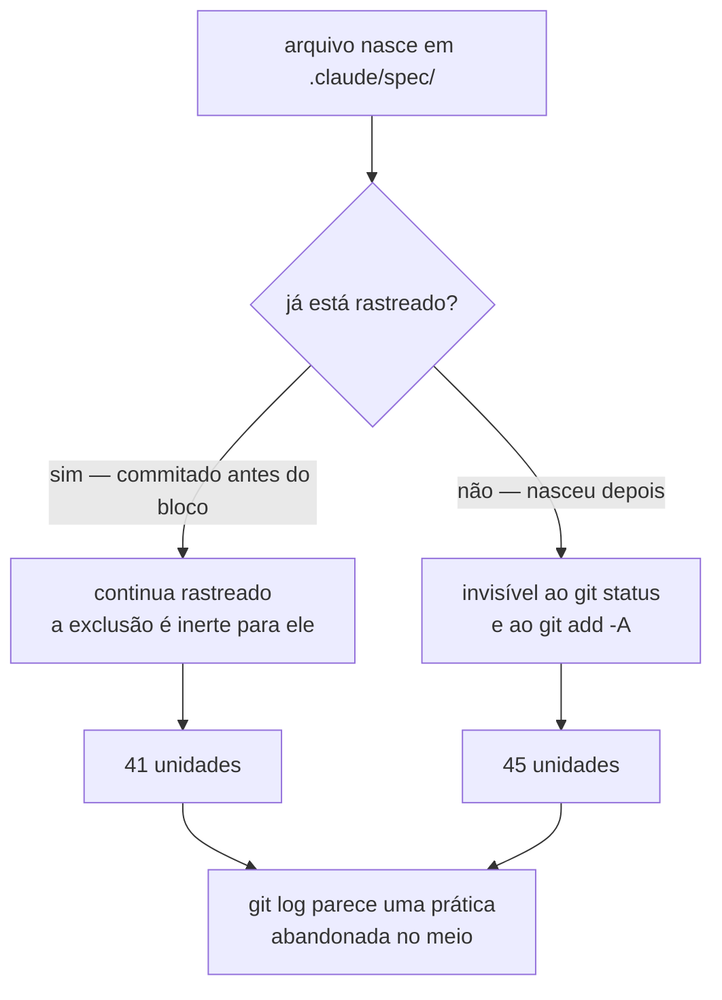

# O carimbo de aprovação para de viajar, e metade das unidades volta para o git

Duas coisas que não deviam estar como estavam. O arquivo que prova que uma pessoa aprovou um plano podia ser commitado — e 54 já estavam, então um clone novo nascia com a aprovação dada. E 45 dos 86 registros de unidade deste repositório estavam invisíveis ao git, não por decisão, mas porque uma exclusão local os escondia enquanto o `.gitignore` versionado ao lado dizia o contrário.

## Por quê

O `approve-spec` decide pela **presença** de `<spec>/.approved-by-user`. O valor inteiro desse arquivo é nascer de um ato que o modelo não consegue autorar: a pessoa aceita o plano, responde a pergunta de aprovação, ou digita a forma do seletor. Se ele entra num commit, ele viaja — e o único sinal em que o portão se apoia passa a ser produzível por `git clone`. O `.clarified`, do portão de clarificação, tem exatamente a mesma forma.

Nenhum dos dois estava listado em ignore versionado. Ninguém tinha esbarrado nisso porque uma exclusão local — `.git/info/exclude` — escondia o diretório inteiro das unidades. Essa exclusão é o conjunto de regras do **modo privado**, a instalação feita para não deixar rastro no repositório do cliente. Este clone não é essa instalação: a configuração, os ajustes, o guia da raiz, o censo, os mapas e os 37 moldes de padrão estão todos versionados aqui. O comentário do próprio código que gera essas regras já dizia o que valeria: numa instalação compartilhada, essa saída *"belongs to the repository"*.

E esconder o diretório teve custo próprio. Uma exclusão do git **nunca desrastreia nada** — ela só decide sobre arquivo ainda não rastreado. Cada bloco novo escrito naquele arquivo congelou o conjunto já rastreado e tornou invisível tudo o que nascesse depois.



O mesmo racha estava agendado para os moldes de padrão: os 37 de hoje estão rastreados, o trigésimo oitavo nasceria invisível.

## O que mudou

**Os dois carimbos passam a ser ignorados por regra versionada.** A regra entra na *semente* que escreve o `.claude/.gitignore`, não só na cópia deste repositório: o arquivo é gerado, e a semente mescla por linha, então todo projeto já instalado a recebe na próxima passada. Ela também entra no `.gitignore` da raiz, que cobre os `.claude/` de subprojeto.

**Os 54 que já estavam rastreados saem do índice.** Uma regra de ignore protege o futuro; ela não desfaz o passado. Os arquivos **permanecem em disco** — são o registro local de que uma pessoa aprovou, e os portões seguem lendo-os. O que muda é que param de viajar.

**Duas regras que só existiam na exclusão local migram para ignore versionado**: `plans/`, que é o par de `scratch/`, e o `CLAUDE.local.md`. Uma regra que todo clone quer não pode morar num arquivo que não viaja.

**O bloco de modo privado sai deste clone**, e o registro das 45 unidades atrasadas entra num commit.

Quem faz o recorte não foi escolhido aqui. É o `.claude/.gitignore` versionado, que já dizia em texto que o conteúdo da spec fica versionado e só os sidecars regeneráveis saem:

| categoria | arquivos | destino |
|---|---|---|
| prosa da unidade (spec, plano de ondas, corpo de PR, achados) | 162 | **entra** |
| `meta.json`, prova dos critérios | 98 | **entra** |
| log de eventos (`.events/`) | 11.256 | fica fora |
| prompts renderizados (`.dispatch/`) | 47 | fica fora |
| carimbos de portão | 22 | fica fora |

## Como validar

Isto testa a propriedade que importa — o que um clone **novo** recebe — e não toca nada seu.

```bash
T=$(mktemp -d) && cd "$T"
git clone -q --depth 1 -b fix/carimbo-aprovacao-nao-se-versiona https://github.com/rubensrpj/mustard.git c && cd c

# 1. quem decide sobre um carimbo é uma regra VERSIONADA (a que viaja)
git check-ignore -v .claude/spec/x/.approved-by-user
git check-ignore -v .claude/spec/x/.clarified

# 2. o registro da unidade NÃO é ignorado — o recorte é estreito de propósito
git check-ignore -q .claude/spec/x/spec.md; echo "saída $? (1 = não ignorado, correto)"

# 3. e nenhum carimbo viajou no clone
git ls-files '.claude/spec/*/.approved-by-user' '.claude/spec/*/.clarified' | wc -l   # 0

# 4. o registro das unidades, esse veio
git ls-files '.claude/spec/*/spec.md' | grep -c '^\.claude/spec/[^/]*/spec\.md$'      # 69
```

## Testes

**Cada critério foi provado VERMELHO contra a árvore antes de o trabalho existir** — um critério que não sabe falhar não prova nada.

| # | o que garante | comando |
|---|---|---|
| AC-1 | um projeto recém-semeado segura os dois carimbos, e **não** segura o registro da unidade | `cargo test -p mustard-core the_seeded_gitignore_holds_back_the_gate_markers` |
| AC-2 | quem decide sobre um carimbo é o `.claude/.gitignore` versionado, não a exclusão local | `git check-ignore -v .claude/spec/x/.approved-by-user \| grep -q '^\.claude/\.gitignore:'` |
| AC-3 | o mesmo para `CLAUDE.local.md`, agora pelo `.gitignore` da raiz | `git check-ignore -v CLAUDE.local.md \| grep -q '^\.gitignore:'` |
| AC-4 | toda unidade com `spec.md` em disco está rastreada, e nenhum carimbo aparece | contagem via `git ls-files` (ver `spec.md`) |
| AC-5 | a árvore compila inteira | `cargo build --workspace` |

O teste do AC-1 dirige o **git de verdade** e cobra as duas metades. A segunda é a que faz ele valer: uma cobertura em bloco do diretório passaria na primeira metade sozinha — e essa cobertura em bloco é exatamente o estado que isto substitui.

Suíte completa: **3114 passaram, 0 falharam**, em 78 conjuntos.

## Decisões que valem explicação

**Fechar o furo dos carimbos ANTES de remover a exclusão.** O ensaio mostrou que a ordem inversa versionaria 9 `.approved-by-user` e 13 `.clarified` no mesmo commit. Como o portão decide pela presença do arquivo, isso teria aberto o buraco enquanto o conserto era feito.

**A regra vai na semente, não só nesta cópia.** O `.claude/.gitignore` é gerado. Corrigir apenas a cópia deixaria todo projeto novo nascer com o mesmo furo — e este é furo de portão de aprovação, não de arrumação.

**O bloco privado inteiro sai, não só a linha das specs.** Cada linha dele é inerte (o caminho já está rastreado) ou é um racha futuro esperando a vez. Medido linha a linha antes de remover; a única que mordia de verdade e não estava coberta em lugar nenhum era `CLAUDE.local.md`, que por isso migrou.

**Os arquivos ficam em disco ao sair do índice.** Desrastrear não é apagar: o carimbo é o registro local de que uma pessoa aprovou, e os portões deste clone continuam lendo-o.

## Fora de escopo

- **O detector.** Nada avisa quando uma instalação compartilhada carrega regras de modo privado. Essa é a causa raiz, e é unidade própria — ampliar este conserto para absorvê-la é o movimento que já produziu defeito pior neste projeto.
- **Versionar `.events/` e `.dispatch/`.** São 11.256 arquivos e 19,8 MB de log append-only e prompts regeneráveis. O ignore versionado já os segura e continua segurando.
- **Mexer no modo privado em si.** Ele está correto para o que se propõe. O defeito é ter sido aplicado a um clone que não é privado.
- **Reescrever história.** Os carimbos saem do índice num commit novo; quem já clonou continua com eles no histórico. As specs em questão estão todas fechadas, então não há portão pendente que pudessem abrir.

## O que fica em aberto

**A prova de remoção não rodou nesta unidade.** O fechamento normalmente retira o trabalho da árvore e roda os critérios de novo, para confirmar que todos voltam vermelhos. Ele lê os digests gravados por onda, e esta é uma spec leve, sem ondas — a resposta foi `removal-no-cached-diff`, que é uma recusa honesta e não uma falha. Então estes cinco critérios têm o "vermelho antes, verde depois", mas não o "vermelho de novo quando o trabalho é retirado".

**Um critério foi emendado no meio do caminho.** O AC-4 original comparava *diretórios* de spec contra specs rastreadas, e 18 diretórios nunca chegaram a ter um `spec.md` — são restos de unidades que nasceram e nunca foram redigidas. A emenda passou pela porta própria, que recusa substituição que já nasça verde: o commit do resgate foi desfeito, o critério corrigido foi provado vermelho, e o resgate foi refeito.

Números medidos, não estimados: 347 arquivos no total, dos quais 4 são regra e código (+108 linhas), 289 são registro resgatado e 54 são carimbos saindo do índice. 3114 testes verdes em 78 conjuntos.
