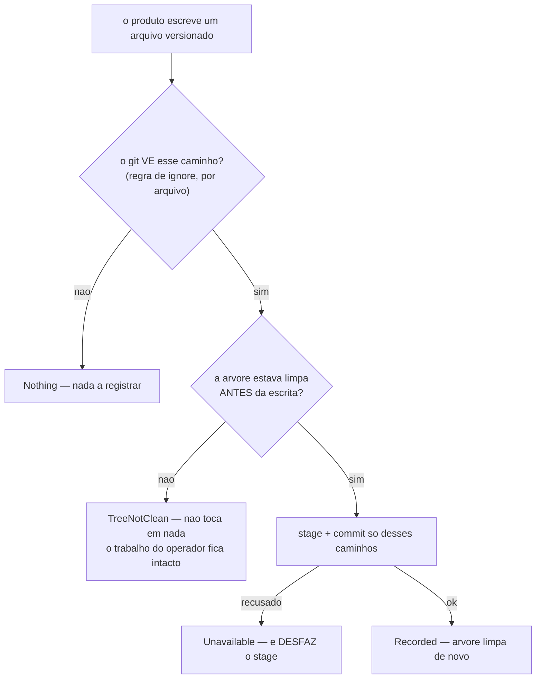

Duas tarefas que o produto criava para o operador e não terminava passam a ser terminadas por ele: o portão de base deixa de largar o censo re-minerado sujo na árvore (era um commit manual por abertura de unidade — cinco numa sessão), e a varredura de guards para de contar pastas de teste como subprojetos pendentes (**14 → 8** neste repositório).

> **Empilha sobre o #190.** A branch traz a irmã mesclada, e o alvo deste PR é `fix/scan-upsert-terminam-pela-metade` para que o diff mostre só o trabalho desta unidade. Quando o #190 entrar, este re-aponta para `dev`.

## Por quê

**A.** Ao abrir uma unidade, o portão re-minera `.claude/grain.model.json`, que é versionado. A mensagem antiga nem escondia: dizia que o resultado *"pode ser commitado à parte desta unidade"* — admitindo a dívida em vez de quitá-la. O corte da branch seguinte então recusava, atribuindo a escrita a *outra unidade de trabalho do operador*.

**B.** `scan-guards-list` reportava 14 subprojetos pendentes aqui. Seis eram projetos falsos sob `apps/scan/tests/fixtures/`, que existem só para o minerador ter o que ler nos testes. A varredura irmã, a dos molds, já descartava terreno de teste; a das guards não — as duas metades do mesmo enriquecimento discordavam.

## O que mudou



Um mecanismo, `record_written_path`, para todo arquivo versionado que o produto escreve. O selo de versão do instalador (que veio do #190) virou um invólucro fino sobre ele, e `StampOutcome` desapareceu — havia duas cópias dos mesmos ajudantes nas duas branches, contra a Decisão da própria spec de haver um mecanismo só.

Do lado das guards, a varredura passa a não descer em terreno de teste usando a **mesma** lista de segmentos que a dos molds (`TEST_SEGMENTS`, agora `pub(crate)`).

## Como validar

Em worktree descartável, sem tocar em nada seu:

```bash
git fetch origin fix/censo-suja-arvore-guards-contam
git worktree add /tmp/rev origin/fix/censo-suja-arvore-guards-contam
cd /tmp/rev && cargo test -p mustard-core -p mustard-cli -p mustard-rt
```

O efeito de campo do lado B, contra este repositório:

```bash
cd /tmp/rev && cargo build -q --workspace
./target/debug/mustard-rt run scan-guards-list --root . | jq length   # 8
mustard-rt run scan-guards-list --root . | jq length                  # 14 (binario antigo)
```

## Testes

Cada critério foi provado **VERMELHO antes do código existir** (`ac-negative-check`, com controle verde ao lado) e verde depois (`confirmation: taken=true, ok=true, unproven=[]`).

| # | o que garante | comando |
|---|---|---|
| AC-1 | a varredura de guards não desce em terreno de teste | `cargo test -p mustard-rt guards_walk_skips_test_terrain` |
| AC-2 | censo re-minerado numa árvore limpa devolve árvore limpa | `cargo test -p mustard-rt census_refresh_leaves_the_tree_clean` |
| AC-3 | árvore com trabalho do operador fica intocada | `cargo test -p mustard-rt census_refresh_never_commits_over_the_operators_work` |
| AC-4 | o workspace compila | `cargo build --workspace` |

Sete testes fora dos critérios, cada um travando um defeito que a revisão encontrou e os testes não pegavam: `a_first_write_of_an_unignored_path_is_recorded`, `an_ignored_path_is_left_alone`, `outside_a_repository_the_write_is_unavailable`, `every_written_path_is_recorded_not_just_the_first`, `a_refused_commit_leaves_nothing_staged`, `a_hidden_census_refreshes_on_a_dirty_tree`, `a_visible_census_postpones_the_refresh_on_a_dirty_tree`.

Suítes medidas nesta branch: **mustard-core 674**, **mustard-cli 57**, **mustard-rt 2150**. `cargo build --workspace` sai 0 com 4 avisos pré-existentes, nenhum em arquivo tocado.

## Decisões que merecem explicação

**A visibilidade é um fato por arquivo, não o modo de instalação.** O predicado antigo lia "instalação privada ⇒ censo invisível", e **este repositório falsifica isso**: carrega as marcas privadas em `info/exclude` E um censo rastreado. Sob a resposta grossa o portão re-minerava numa árvore suja e depois tinha de largar o resultado versionado sem commitar. Agora a pergunta é feita ao arquivo — o mesmo fato que `record_written_path` já julgava, de modo que as duas metades de uma decisão não podem mais discordar.

**Rastreado seria a pergunta errada.** Uma primeira mineração é não-rastreada por definição e ainda assim aparece como `??`. A pergunta é se alguma regra de ignore esconde o caminho.

**Um commit recusado desfaz o `stage`.** Sem isso o próximo `git commit` do operador varreria a escrita do produto para dentro do commit dele — exatamente a troca que este mecanismo existe para impedir, chegando pelo caminho da falha.

**O `run upsert` passa a dizer em qual branch commitou.** A face em prosa (`mustard init`) já nomeava a branch; a face JSON não narrava nada, então quem chamava a porta de bootstrap não sabia que ela tinha acabado de commitar na branch onde estava. `stampBranch` é ausente quando não houve commit, então a forma do JSON comum não muda.

**Duas fixtures de teste estavam mentindo, e isso era o defeito.** A do AC-2 simulava o minerador gravando **um** arquivo; o real grava dois (`grain.model.json` e `grain.dictionary.json`), então o teste passava enquanto o campo deixava o sidecar sujo. A do caso privado escrevia só as duas marcas que **detectam** o modo, não a regra que esconde o censo — modelava uma instalação privada que não existe.

## Fora de escopo

- **Escrever as guards dos 8 subprojetos reais.** É o enriquecimento, unidade própria. Esta só para de contar os 6 fantasmas.
- **Tornar o censo não-versionado.** Ele é útil no histórico; o problema era quem escreve não terminar.
- **A chave `subprojects` do `mustard.json`**, ainda declarada e nunca lida.

## Ainda em aberto

- **O auto-commit não consulta `protected_branches`.** Decisão explícita do operador, tomada no #190 e herdada aqui: o selo é configuração, não trabalho, e um clone novo está sempre na branch padrão — recusar ali devolveria a árvore suja no caso mais comum. Nomear a branch é o que mantém isso declarado em vez de silencioso.
- **Uma primeira instalação compartilhada ainda deixa parte do rastro não versionada** (`.claude/settings.json`, `.claude/mustard/*.md`, `.claude/.gitignore`): o mecanismo registra o que cada escritor lhe entrega, e o `upsert` hoje entrega só o selo. `footprint_pathspecs` já existe e é o próximo passo óbvio.
- **O teste do AC-3 exercita `record_census` direto**, não `refresh_census_if_stale`; no caminho compartilhado `TreeNotClean` é inalcançável pela porta, porque a decisão já recusa numa árvore suja.
