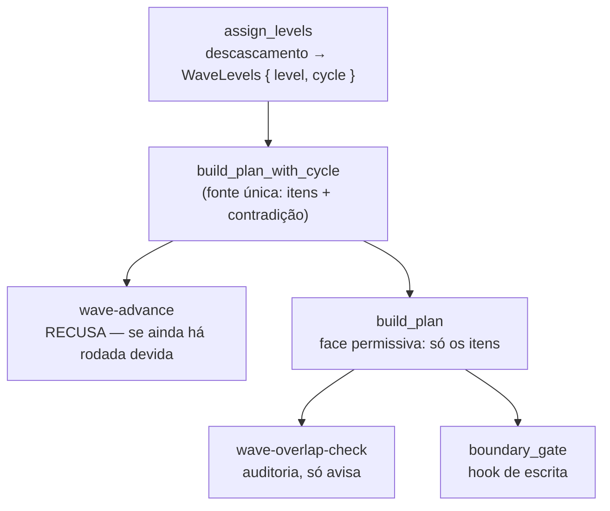

# Ciclo declarado entre waves recusa a rodada em vez de fingir uma ordem

Um plano de waves cujo `Depends on` se contradiz — wave 2 diz depender da 3, wave 3 diz depender da 2 — deixa de virar um plano sequencial de aparência normal e passa a ser recusado por nome. O despacho responde `{"error":"cyclic-dependency","cycle":[2,3]}`, não move nenhum agente e não marca nenhuma wave como iniciada. Só as waves DO LAÇO são nomeadas: uma wave que apenas espera atrás dele tem a célula certa e despacha assim que a dependência terminar.

## Por quê

`assign_levels` atribuía o nível topológico de cada wave por relaxação até um teto de iterações. O comentário dela afirmava que um ciclo "degrada para nível 0 nos nós travados", e havia um teste chamado `levels_cycle_degrades_to_zero_without_dropping` sustentando isso.

Medido, não era o que acontecia. O ramo `else if !resolved` só deixa a wave no zero na **primeira** passada; a partir da segunda todo nó já tem entrada no mapa, `resolved` é sempre verdadeiro, e cada passada **incrementa** os membros do ciclo até o teto parar o laço em valores arbitrários:

| entrada | níveis que saíam | rodadas que isso produzia |
|---|---|---|
| `1 ↔ 2` | `{1:4, 2:5}` | `[1]` → `[2]` |
| `1←3, 2←1, 3←2` | `{1:9, 2:10, 3:11}` | `[1]` → `[2]` → `[3]` |
| `2 ↔ 3`, com wave 1 limpa | `{1:0, 2:6, 3:7}` | `[1]` → `[2]` → `[3]` |

Nenhuma dessas saídas denuncia nada. A contradição autoral atravessava o sistema disfarçada de plano comum, e o único teste que cobria o caso conferia apenas que as duas chaves existiam — nunca os níveis.

E o teste do teto era o mais frágil dos dois: com uma wave a mais no plano, o mesmo ciclo produz níveis diferentes, porque o número de passadas é `rows.len() + 1`.

## O que mudou

A pergunta passou a ser feita direto, em vez de por peneira: **duas waves estão no mesmo laço exatamente quando cada uma alcança a outra pela coluna `Depends on`**, e uma wave está num laço exatamente quando alcança a si mesma. Isso é a definição de componente fortemente conexo, calculada aqui por fecho transitivo — custo cúbico sobre um punhado de waves, e correta por construção em vez de por heurística.

Colapsando cada laço num nó só, o grafo restante não tem laço nenhum, e o descascamento comum sobre ELE dá nível real a toda wave: as de um mesmo laço compartilham (não há ordem entre elas a expressar), e quem espera atrás fica acima.

Duas tentativas anteriores estão registradas no código para não voltarem. Tratar "não conseguiu ser posicionada" como "está num laço" varria junto quem só esperava atrás — e apontar essas waves mandava a pessoa consertar a célula errada, além de prendê-las para sempre, já que wave recusada nunca completa. Remendar isso tirando quem não tinha aresta de entrada ainda falhava para uma wave **entre dois laços**. E inventar níveis por ordem de numeração chegou a colocar uma wave ABAIXO da dependência dela, que é a única coisa que um cálculo de níveis não pode fazer. O teto de iterações some, porque existia apenas para conter uma relaxação que podia girar.

Sobre esse cálculo único, duas faces, porque os três chamadores de `build_plan` querem coisas diferentes:



O critério da separação é o que o chamador pode fazer com a resposta. `boundary_gate` é o guarda que decide se um arquivo pode ser gravado: se ele passasse a recusar por causa de um ciclo, um plano mal escrito viraria bloqueio de escrita no meio do trabalho de alguém. `wave-overlap-check` só emite aviso. Só o despacho tem motivo para recusar.

**Toda wave recebe nível real, laço incluído.** As de um mesmo laço compartilham — o plano não declara ordem entre elas, e inventar uma seria o defeito original de novo. Quem espera atrás fica acima. Quem diz que o plano se contradiz é o campo `cycle`, não o nível.

Consequência declarada: num plano contraditório, as waves de um laço podem compartilhar nível com uma wave independente, porque todas estão em profundidade 0. As duas leitoras permissivas agrupam por nível, então elas veem esse agrupamento. Não custa nada — a rodada é recusada, então nenhuma afirmação de mesmo nível chega a ser usada. Perseguir saída de auditoria mais bonita para um plano que não roda foi exatamente o que produziu níveis inventados, e níveis inventados chegaram a colocar uma wave abaixo da própria dependência.

**A contradição governa enquanto alguma wave DO LAÇO ainda precisa rodar.** Concluídas todas elas, a ordem entre elas é pergunta sobre o passado e não decide mais nada; o resto do plano despacha normalmente, e uma spec contraditória alcança revisão e fechamento sem ninguém editar plano congelado.

A unidade da resposta é o LAÇO, nunca a wave isolada, e isso foi aprendido duas vezes. Isentar um membro porque a dependência dele terminou parece mais gentil e é pior: num laço de três com um membro pronto, uma wave é isenta, outra ainda bloqueia, a rodada é recusada de qualquer jeito — e a isenta nunca roda, então nunca termina, então o bloqueio nunca sai. Um `wave-done` solto num membro de um laço de dois esvaziava o conjunto e a contradição parava de ser reportada.

Do lado de `wave-advance`, `advance()` passa a devolver `Result<Vec<AdvanceItem>, AdvanceRefusal>`. A recusa fica **antes** de todo emit de início de wave, então a rodada recusada não deixa `pipeline.wave.start` para trás. Mas ela grava um `pipeline.dispatch_failure`, idempotente por motivo e com carimbo de tempo — sem isso a parada seria invisível, e `resume-bootstrap` leria a spec como ociosa. O registro expira em dez minutos como qualquer falha de despacho; ver *Fora de escopo*.

A saída é um objeto e não um array vazio de propósito: `[]` já significa *"não sobrou wave, vá fechar a spec"*. Uma contradição que a pessoa precisa resolver não pode ser reportada com a palavra que quer dizer "você terminou". Ela empresta as duas **chaves** que `wave-dependency` usa para o ciclo de import, e só as chaves: lá `cycle` traz caminhos de arquivo, aqui traz números de wave.

A prosa que o orquestrador segue (`plugin/refs/spec/resume-loop.md`) descrevia apenas o array e o `[]`. Ganhou o caso da recusa, a instrução explícita de **não** cair no ramo do `[]`, a exceção da spec já concluída, o aviso sobre os dois tipos de `cycle`, e as duas formas de autoria que este leitor não enxerga.

## Como validar

Roda num diretório descartável e não toca em nada seu:

```bash
BIN=$(pwd)/target/debug/mustard-rt
cargo build -p mustard-rt
ROOT=$(mktemp -d); mkdir -p "$ROOT/.claude"; echo '{}' > "$ROOT/mustard.json"

seed() { # $1 slug, $2 depends-on da wave 2, $3 da wave 3
  d="$ROOT/.claude/spec/$1"; mkdir -p "$d"
  { echo '| Wave | Spec | Role | Depends on | Summary |'
    echo '|------|------|------|------------|---------|'
    echo '| 1 | [[wave-1-rt]] | rt | — | base |'
    echo "| 2 | [[wave-2-cli]] | cli | $2 | cli |"
    echo "| 3 | [[wave-3-core]] | core | $3 | core |"; } > "$d/wave-plan.md"
  for p in 1:rt 2:cli 3:core; do
    mkdir -p "$d/wave-${p%%:*}-${p##*:}"
    printf '# w\n\n## Tasks\n\n- [ ] t\n' > "$d/wave-${p%%:*}-${p##*:}/spec.md"
  done
}

seed clean '—'               '[[wave-2-cli]]'
seed knot  '[[wave-3-core]]' '[[wave-2-cli]]'
seed prosa '—'               'nada, ver os 2 anexos'
cd "$ROOT"

"$BIN" run wave-advance --spec clean | head -5   # array de sempre
"$BIN" run wave-advance --spec knot              # {"error":"cyclic-dependency","cycle":[2,3]}
"$BIN" run wave-advance --spec prosa | head -5   # prosa nao declara aresta: array normal
echo "exit: $?"                                  # 0
grep -rho 'pipeline.dispatch_failure' "$ROOT/.claude/spec/knot/.events" | head -1
grep -rl 'pipeline.wave.start' "$ROOT/.claude/spec/knot" || echo "nenhum wave.start gravado"
rm -rf "$ROOT"
```

## Testes

Doze casos novos; um removido. Suíte completa medida agora: **2185 passando, 39 suítes**.

| O que garante | Comando |
|---|---|
| Ciclo declarado recusa a rodada e nomeia as waves do laço | `cargo test -p mustard-rt --lib declared_cycle_refuses_the_round` |
| Laço com membro ainda pendente recusa, sem exceção por wave | `cargo test -p mustard-rt --lib loop_with_a_pending_member_still_refuses` |
| Laço de TRÊS com um membro pronto recusa inteiro | `cargo test -p mustard-rt --lib three_wave_loop_with_one_member_complete_refuses_whole` |
| Laço já concluído não bloqueia wave limpa pendente | `cargo test -p mustard-rt --lib completed_cycle_does_not_block_a_clean_pending_wave` |
| Wave atrás do laço despacha quando a dependência termina | `cargo test -p mustard-rt --lib wave_behind_a_completed_cycle_dispatches` |
| Spec contraditória já concluída alcança a revisão | `cargo test -p mustard-rt --lib completed_cyclic_spec_still_reaches_its_review_round` |
| Rodada recusada não marca wave como iniciada (com controle positivo) | `cargo test -p mustard-rt --lib refused_round_emits_no_wave_start` |
| Rodada recusada grava `pipeline.dispatch_failure` | `cargo test -p mustard-rt --lib refused_round_records_a_dispatch_failure` |
| Um registro por contradição, não um por invocação | `cargo test -p mustard-rt --lib dispatch_failure_is_recorded_once_not_per_invocation` |
| Registro volta a ser gravado depois de o anterior expirar | `cargo test -p mustard-rt --lib dispatch_failure_is_recorded_again_once_the_old_one_expired` |
| Ciclo é nomeado, não ordenado; membros compartilham nível | `cargo test -p mustard-rt --lib levels_declared_cycle_is_named_not_ordered` |
| Níveis sobre um plano contraditório, num fixture só | `cargo test -p mustard-rt --lib levels_over_a_contradictory_plan` |
| Wave ENTRE dois laços não está em nenhum, e não é nomeada | `cargo test -p mustard-rt --lib levels_wave_between_two_loops_is_not_named` |
| Nenhuma wave fica ABAIXO da própria dependência | `cargo test -p mustard-rt --lib levels_never_place_a_wave_below_its_dependency` |
| Ordem respeitada ENTRE dois laços distintos | `cargo test -p mustard-rt --lib levels_order_two_distinct_loops` |
| Coluna com PROSA não declara aresta nenhuma | `cargo test -p mustard-rt --lib prose_in_the_depends_cell_declares_no_edge` |
| Dependência para fora do plano não é contradição | `cargo test -p mustard-rt --lib levels_unknown_dependency_is_not_a_cycle` |
| Face permissiva devolve todas as waves | `cargo test -p mustard-rt --lib declared_cycle_refuses_the_dispatch_face_and_drops_nothing` |

**Sobre a prova RED, com precisão.** O critério central foi provado vermelho antes: a asserção do teste antigo, traduzida para a API nova e rodada contra este código, falha com `assertion left == right failed, left: 0, right: 2`. Os testes acima **não** foram rodados contra o código antigo, e não poderiam ter sido: exercitam `WaveLevels`, `build_plan_with_cycle` e `AdvanceRefusal`, tipos que não existiam. Para um conserto que muda assinatura, é a asserção antiga que carrega a prova, e é ela que está registrada aqui.

**O que duas revisões adversariais derrubaram deste PR.**

A primeira: a autodependência não era pega, e o teste que afirmava cobri-la construía a linha da tabela à mão, pulando o leitor que a descartava — verde para sempre, provando nada. A recusa estava antes da checagem de conclusão, prendendo specs já terminadas. E colapsar as waves travadas no nível 0 mudava a saída de duas leitoras que o PR dizia não ter tocado.

A segunda, sobre o código que corrigiu a primeira: a recusa ainda prendia um caso (waves do ciclo concluídas, wave limpa pendente); o registro da recusa não tinha carimbo de tempo nem idempotência; e ao tentar ler `Depends on` de forma mais ampla — números nus, autorreferência — surgiram efeitos piores que o defeito original.

A terceira derrubou justamente essas ampliações, e a decisão foi **reverter, não remendar**:

| ampliação tentada | o que ela provocou | decisão |
|---|---|---|
| ler números nus da coluna | célula com prosa (`nada, ver os 2 anexos`) virava aresta; dois desses e o plano inteiro era recusado sem ter contradição | revertido |
| tratar autorreferência como ciclo | a célula nomeando o próprio papel da wave — atalho que o leitor existe para absorver — parava o plano inteiro; distinguir os dois exigia adivinhar pela grafia do token, e quebrava para papel começando com `wave` | revertido |
| isentar a recusa do prazo de 10 minutos | esse prazo é a **única** coisa que limpa o registro; sem ele, plano já consertado seguia reportando `mode: ask` para sempre | revertido |

As duas lacunas que sobram — ciclo escrito com números nus, e autorreferência — **já existiam antes deste PR** e continuam declaradas em *Fora de escopo*. Consertá-las de verdade é definir a gramática da célula, que é outra unidade.

O que a terceira revisão apontou e **foi consertado**: `cycle` passa a nomear só quem está no laço, não quem espera atrás. Uma wave atrás do ciclo tem a célula certa como escrita — nomeá-la mandava a pessoa consertar o lugar errado, e a prendia para sempre, já que ela nunca completava e por isso nunca saía do conjunto bloqueante.

## Decisões que valem explicação

**Recusar em vez de avisar.** `wave_dependency` reporta ciclo de *import* como WARN, e ali o WARN está certo: aquela inferência é heurística, e `plan_materialize.rs:365-374` argumenta que as fronteiras explícitas do planejador prevalecem sobre ela. O caso aqui é outro — alguém escreveu as duas células. Não há ordem que satisfaça, e despachar em qualquer ordem seria inventar uma resposta que o plano não contém.

**Duas faces em vez de uma recusa geral.** Detalhada acima: um dos três chamadores é um hook de escrita, e endurecê-lo transformaria um plano mal escrito num bloqueio de gravação.

**Não ampliar o leitor da coluna.** Foi tentado e revertido. A tese da unidade é não abafar contradição — mas ler dígitos de texto livre não descobre contradição, INVENTA. Um leitor que recusa planos corretos é pior que um que deixa passar um caso raro, e a lacuna fica declarada em vez de remendada.

**A recusa depois da checagem de conclusão, não antes.** Uma spec cujas waves já terminaram não tem ordem a decidir. Recusá-la a prenderia sem saída, e as vítimas seriam justamente as specs despachadas enquanto o defeito existia.

**A recusa viaja no JSON, não no código de saída.** `wave-advance` sai com 0 sempre. Bloqueio se expressa no documento, nunca via exit não-zero — é a regra que este crate já segue nos hooks, e o degrade de `run()` foi escrito para nunca cair em `"[]"` na recusa, porque `[]` manda fechar.

**`cycle` nomeia o laço, não quem espera atrás dele.** Quem vai consertar a tabela precisa das células erradas. Uma wave que apenas depende de uma wave travada tem a célula certa, e nomeá-la mandava consertar o lugar errado — além de prendê-la para sempre, já que ela nunca completava e por isso nunca saía do conjunto bloqueante.

## Fora de escopo

- **O WARN do ciclo de import continua WARN.** Deliberado, pelo motivo acima.
- **`wave-overlap-check` e `boundary_gate` não foram tocados, e agora isso é verdade.** Uma versão anterior deste PR mudava a saída de ambos sem editá-los, porque as waves travadas caíam no nível 0 e as duas agrupam por nível. Dar a cada travada o seu próprio nível restaura a leitura que elas sempre tiveram.
- **`--wave N` não filtra o ciclo.** A contradição é do plano, não da fatia que alguém pediu para olhar. Hoje é teórico: só `wave-advance` lê o campo, e sempre com `None`.
- **Ciclo escrito com NÚMEROS NUS continua invisível.** `| 2 | ui | 1, 3 |` não gera aresta neste leitor, embora `dependency-precheck` leia essa forma. Lacuna anterior a este PR; ampliar o leitor foi tentado e revertido acima.
- **Autorreferência continua descartada, não recusada.** Mesma origem, mesma decisão.
- **O registro da recusa expira em 10 minutos**, como qualquer falha de despacho. Isentá-lo foi tentado e revertido: esse prazo é a única coisa que limpa o registro, e sem ele um plano já consertado seguia reportando parada. Consequência declarada: quem conserta o plano em 30 segundos ainda vê `mode: ask` pelos ~9 minutos restantes. Retirar o registro na hora exige um sinal de limpeza — um despacho bem-sucedido o supera —, que fica para outra unidade.
- **Linha de wave DUPLICADA na tabela perde as dependências dela.** `deps` é um mapa por número de wave, então só a última linha sobrevive, enquanto os itens ainda materializam as duas. Defeito anterior a esta unidade; consertá-lo é decidir o que uma tabela com linha repetida significa, que não é pergunta deste conserto.
- **Continua existindo uma segunda caminhada topológica no crate.** `wave_dependency::topological_waves` resolve ordenação por contagem de grau de entrada, sobre o grafo de imports. Unificar as duas num auxiliar só é refatoração de outra unidade; aqui a documentação apenas para de prometer que os dois `cycle` são o mesmo conjunto.
- **Uma segunda passagem topológica continua existindo.** `wave_dependency::topological_waves` resolve o mesmo problema com contagem de grau de entrada, e um dia as duas deveriam compartilhar um só auxiliar. Fica de fora porque unificá-las é refatoração de outra unidade; a documentação do campo `cycle` foi corrigida para não prometer identidade que ninguém verifica.
- **Um commit de recenseamento viaja junto.** Atualiza `.claude/grain.model.json`. Foi regravado **depois** dos commits de código, para registrar o arquivo como ele ficou — na primeira versão ele era o primeiro commit e descrevia um layout que a correção já tinha mudado.

<!-- wikilinks-footer-start -->
- [wave-1-rt](?) ⚠ unresolved
- [wave-2-cli](?) ⚠ unresolved
- [wave-3-core](?) ⚠ unresolved
<!-- wikilinks-footer-end -->