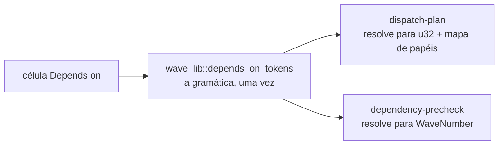
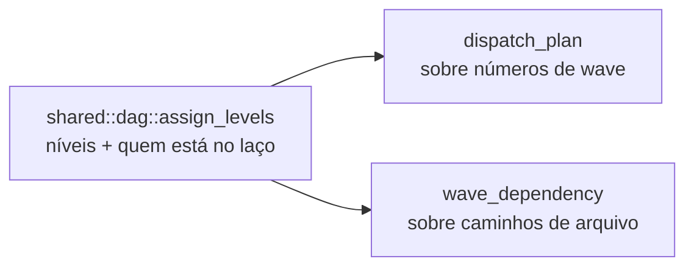

# Uma gramática para a coluna Depends on, e uma caminhada topológica só

A coluna `Depends on` do plano de waves tinha **dois leitores que discordavam**, e cada um errava para um lado. Agora ela tem uma gramática, escrita uma vez. De brinde, some a segunda caminhada topológica do projeto — e com ela a segunda definição de "ciclo", que estava desatualizada.

## Por quê

**O leitor do despacho só enxergava `[[…]]`.** Um ciclo escrito com números nus não gerava aresta nenhuma:

```
| 2 | [[wave-2-cli]]  | cli  | 3 | cli  |
| 3 | [[wave-3-core]] | core | 2 | core |

antes:  nenhuma aresta lida  →  plano achata numa rodada paralela
```

Ou seja: o defeito que o PR anterior existia para consertar seguia intacto, por uma porta que ninguém tinha aberto.

**O leitor da checagem prévia varria todos os tokens da célula**, e `parse_wave_number_from_token` pega os dígitos **iniciais** de qualquer um deles. Uma célula com prosa declarava dependência:

```
| 1 | [[wave-1-rt]] | rt | nada, ver os 2 anexos | base |
                          └─ lido como "depende da wave 2"
```

Isso não é cosmético: uma dependência fantasma faz a checagem procurar símbolos numa wave que não é dependência de verdade, e reportá-los faltando — o que leva o orquestrador a levantar um bloqueio.

**E havia duas caminhadas topológicas**, resolvendo o mesmo problema e discordando da resposta. A de imports acusava como ciclo tudo que não conseguiu visitar, incluindo quem apenas **espera atrás** de um laço — a mesma imprecisão que o PR anterior corrigiu do lado das waves.

## O que mudou

### A gramática, escrita uma vez

`wave_lib::depends_on_tokens` decide o que a célula declara:

| a célula | declara |
|---|---|
| `—`, `nenhuma`, vazia | nada |
| contém `[[…]]` | esses links, e o resto é comentário |
| `1, 3` | as duas waves |
| `nada, ver os 2 anexos` | **nada** — um token sem forma de wave e a célula é prosa |

A última regra é **tudo-ou-nada de propósito**. Escolher os tokens com cara de wave *dentro* de prosa foi tentado no PR anterior e revertido: transformava uma frase em contradição e recusava um plano correto. Uma célula é uma lista, ou não é; não se lê número solto de dentro de uma sentença.

Cada leitor segue resolvendo os tokens para o seu próprio tipo. O que precisava ser compartilhado era a decisão sobre **o que é uma dependência**, não como resolvê-la.



### Uma caminhada topológica

`shared/dag.rs` passa a ser a única, genérica sobre o tipo do nó. Os dois antigos viram adaptadores finos:



A caminhada de imports **herda a correção** do PR anterior: ela deixa de acusar quem apenas espera atrás do laço.

### Uma acusação refutada, não consertada

A revisão afirmou que uma linha de wave duplicada perde as dependências e faz a wave despachar duas vezes. **Medido no binário: nenhuma das duas coisas acontece.** `parse_wave_plan_table` ordena e deduplica por número antes de construir qualquer linha, mantendo a primeira. Há teste novo para a acusação continuar refutada, em vez de alguém "consertar" isso de novo.

## Como validar

Roda num diretório descartável:

```bash
BIN=$(pwd)/target/debug/mustard-rt
cargo build -p mustard-rt
R=$(mktemp -d); mkdir -p "$R/.claude"; echo '{}' > "$R/mustard.json"

seed() { d="$R/.claude/spec/$1"; mkdir -p "$d"
  { echo '| Wave | Spec | Role | Depends on | Summary |'
    echo '|------|------|------|------------|---------|'
    echo '| 1 | [[wave-1-rt]] | rt | — | base |'
    echo "| 2 | [[wave-2-cli]] | cli | $2 | cli |"
    echo "| 3 | [[wave-3-core]] | core | $3 | core |"; } > "$d/wave-plan.md"
  for p in 1:rt 2:cli 3:core; do x="$d/wave-${p%%:*}-${p##*:}"; mkdir -p "$x"
    printf '# w\n\n## Tasks\n\n- [ ] t\n' > "$x/spec.md"; done; }

seed nus   '3'                     '2'
seed prosa 'nada, ver os 2 anexos' 'nenhuma real, so a 1'
seed misto 'depende de [[wave-1-rt]] (2 anexos)' '—'
cd "$R"

"$BIN" run wave-advance --spec nus     # {"error":"cyclic-dependency","cycle":[2,3]}
"$BIN" run wave-advance --spec prosa   # array normal — prosa não declara nada
"$BIN" run wave-advance --spec misto   # array normal — só o wikilink conta
```

## Testes

Suíte completa medida agora: **2204 passando, 39 suítes**. O módulo compartilhado nasce com oito casos próprios.

| O que garante | Comando |
|---|---|
| Ciclo com números nus é lido como o com wikilinks | `cargo test -p mustard-rt --lib bare_number_deps_are_read_like_wikilinks` |
| A gramática da célula, inteira | `cargo test -p mustard-rt --lib depends_on_tests` |
| Wikilink com prosa em volta: só o link conta | `cargo test -p mustard-rt --lib wikilinks_are_the_dependencies_and_prose_around_them_is_not` |
| Prosa não declara aresta, nem contendo dígitos | `cargo test -p mustard-rt --lib prose_declares_nothing_even_when_it_contains_a_number` |
| Quem espera atrás do laço não é acusado | `cargo test -p mustard-rt --lib what_waits_behind_a_loop_is_not_named` |
| Nó entre dois laços não está em nenhum | `cargo test -p mustard-rt --lib a_node_between_two_loops_is_not_named` |
| Dois laços distintos se ordenam | `cargo test -p mustard-rt --lib two_distinct_loops_are_ordered` |
| Linha de wave duplicada: uma linha, deps da primeira | `cargo test -p mustard-rt --lib a_wave_listed_twice_keeps_the_first_rows_dependencies` |
| A caminhada compartilhada, inteira | `cargo test -p mustard-rt --lib shared::dag` |

**Sobre a prova RED.** Os dois defeitos foram reproduzidos ANTES: o de números nus por leitura direta (`parse_depends_cell` só chamava o extrator de wikilinks) e o de prosa por construção (`parse_wave_number_from_token` pega dígitos iniciais de qualquer token, e a varredura passava todos os tokens da célula). Os testes novos exercitam funções que não existiam antes, então não poderiam ter sido rodados contra o código anterior.

## Decisões que valem explicação

**Compartilhar a gramática, não o tipo.** Um leitor resolve para `u32` com mapa de papéis; o outro para `WaveNumber`. Forçar um tipo comum acoplaria dois módulos por um detalhe; compartilhar só a decisão de *o que é uma dependência* elimina a divergência sem esse custo.

**A regra da lista nua é tudo-ou-nada.** Detalhada acima. Um leitor que recusa planos corretos é pior que um que deixa passar um caso raro.

**A caminhada compartilhada é genérica sobre o nó, não sobre o resultado.** Ela devolve níveis e a lista de quem está em laço; cada chamador monta a sua forma a partir disso — a de imports agrupa por nível para obter as rodadas dela.

## Fora de escopo

- **Autorreferência continua descartada, não recusada.** Decisão do PR anterior, mantida pelo mesmo motivo: a forma de papel nu existe para absorver autoria solta, e recusar o spec inteiro por causa desse atalho custa mais do que o caso vale.
- **Linha de wave duplicada não foi tocada.** A acusação foi refutada por medição; o comportamento atual está travado por teste.
- **O registro da recusa continua expirando em dez minutos.** Torná-lo durável exige um sinal de limpeza, que segue fora de escopo.
- **Nenhum destes defeitos foi observado.** Nos 32 planos de wave do repositório: zero contraditórios, zero usando a forma de número nu. São correções de defeito latente, não de sintoma reportado — e essa medida está aqui porque ela deveria ter acompanhado a proposta, não sucedido o trabalho.

<!-- wikilinks-footer-start -->
- […](?) ⚠ unresolved
- [wave-2-cli](?) ⚠ unresolved
- [wave-3-core](?) ⚠ unresolved
- [wave-1-rt](?) ⚠ unresolved
<!-- wikilinks-footer-end -->