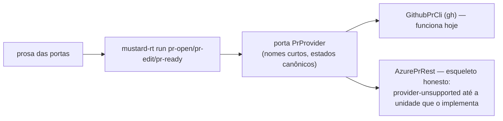

# os comandos de PR passam por uma porta de provedor, com adaptador GitHub e esqueleto Azure

Criar um pull request, editar o corpo dele e tirá-lo de rascunho deixam de ser instruções de prosa mandando rodar `gh` cru — viram comandos (`mustard-rt run pr-open / pr-edit / pr-ready`) atrás de uma porta que escolhe o adaptador pelo provedor em vigor. Este PR foi aberto pelo próprio `pr-open` que ele introduz.

## Por quê

O #165 tornou o FATO do provedor correto (detectado do remoto), mas nada o consumia: toda operação de escrita de PR ia direto à CLI `gh`, que só fala GitHub — e metade das chamadas vivia na PROSA das portas `/mustard:pr` e `/mustard:git`, um caminho que nenhum teste cobre e que quebra em silêncio num repositório Azure DevOps (o caso corporativo real que motivou a série).

## O que mudou (3 ondas)

- **`apps/rt/src/shared/pr_provider.rs`** (novo) — a porta: `open`/`edit_body`/`ready`/`view`; normalização de refs NA porta (Azure devolve `refs/heads/x`, GitHub devolve `x`; a porta fala sempre o curto); estados `active/notSet→OPEN, completed→MERGED, abandoned→CLOSED`; `mergeStatus` do Azure viaja verbatim (6 valores, conferidos na REST oficial 7.1). Provedor sem adaptador responde `provider-unsupported`, nunca uma ausência fingida.
- **`pr_publish.rs`** (novo) — os três comandos com relatório JSON (ok/provider/number/url/erro em campo, exit sempre 0), as quatro inscrições completas, e `pr-open` derivando o título do primeiro cabeçalho do `--body-file` — um título digitado à parte deriva do corpo que o acompanha.
- **A prosa migrada + catraca**: `plugin/commands/pr.md` e `git.md` chamam os comandos; `apps/rt/tests/pr_prose_door.rs` reprova qualquer volta de `gh pr create/edit/ready` cru nas duas portas.

## Testes

6 critérios provados VERMELHOS antes do código e CONFIRMADOS verdes no fechamento (`ac-proof.json` carrega as duas colunas). Revisão adversarial: 1 rejeição real (4 testes batizados fora dos nomes que os critérios fixam — rodavam zero testes com `--exact`), corrigida e re-aprovada com zero críticos. QA: pass.

## Fora de escopo, com endereço

- **REST real do Azure**: unidade seguinte, agora de UM arquivo (o adaptador).
- **`plugin/refs/git/submodule-rules.md`** ainda usa `gh pr create --fill` (abertura sem corpo — decisão de desenho pendente na porta) e `gh pr ready` (este já conversível; achado menor da revisão).
- Leituras existentes (`gh pr view/list`) de `review_prefetch`/`branch_state`.
