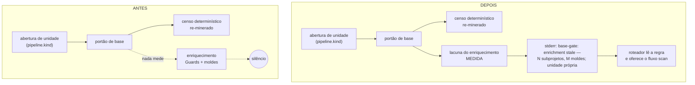

A abertura de uma unidade passa a dizer, em uma linha, quanto da metade **escrita** do censo ainda falta — os `## Guards` de subprojeto que continuam no esqueleto e os moldes `{papel}-pattern` que ninguém autorou. Antes essa metade envelhecia em silêncio, e o silêncio se lia exatamente como "está tudo em dia".

## Por quê

O censo tem duas metades. A determinística é o `grain.model.json`, minerada por um processo Rust. A outra é prosa — Guards e moldes — e prosa é escrita por agente.

A onda 6 (`surface-fold`) da spec `work-unit-lives-on-its` reduziu a superfície digitável a quatro comandos e tornou o scan um passo automático do portão de base. Ela automatizou **apenas a metade determinística**. A metade escrita ficou sem gatilho: nenhuma regra de roteamento a despachava, e a descrição do próprio fluxo dizia *"use when the model is visibly stale"* — "visivelmente" é palpite, não medida.

O caso que expôs isso: um operador digitou o comando de scan, levou a recusa correta da trava de quatro portas, e não havia do outro lado nenhum caminho medido. Medido neste repositório em 21/08/2026 — **6 moldes candidatos sem autor** (`core-entry`, `core-outcome`, `dashboard-section`, `rt-azure`, `rt-branch`, `rt-pr`) e **0 subprojetos** com Guards pendente. Nenhuma linha, em lugar nenhum, dizia isso. Todo agente despachado nesses subprojetos escrevia sem o molde que ensina a convenção da casa.

## O que mudou



A medida **não abre travessia nova**: os Guards em esqueleto vêm de `scan_guards::list::collect_pending` — a mesma travessia única que o `doctor --check guards-scaffold` já reusa — e os moldes de `scan_patterns::list::collect`, que já exclui molde presente no disco (`list.rs:927-938`) e slug declinado (`list.rs:670`). Uma terceira cópia da travessia divergiria em silêncio das outras duas.

A linha, na forma exata em que sai:

```
base-gate: enrichment stale — 1 subproject on the pending ## Guards scaffold (apps/api)
and 1 mold with no author (api-service); the enrich pass rewrites versioned files, so it is
a work unit of its OWN on a clean tree — dispatch it once the current unit closes
```

## Como validar

Tudo abaixo é leitura ou teste; nada escreve na sua árvore além de `target/`.

```bash
# a medida e sua degradação (3 testes)
cargo test -p mustard-rt --lib enrichment_gap

# prosa e código travados no mesmo literal (22 testes, 1 novo)
cargo test -p mustard-rt --test plugin_prose_matches_shipped_behaviour

# a impressão digital superseded e o teto por evento
cargo test -p mustard-core --lib project_seed

# o que a linha reportaria no SEU projeto, sem abrir unidade nenhuma
mustard-rt run scan-patterns-list   # moldes sem autor
mustard-rt run scan-guards-list     # subprojetos com Guards em esqueleto
```

Para ver a linha sair de verdade, abra uma unidade num clone descartável: com lacuna, ela sai em stderr; com a lacuna fechada à mão (molde autorado no disco + Guards curados), o stderr fica com **zero bytes** e a linha JSON do stdout não muda. As duas direções foram exercitadas em repositórios temporários durante a revisão.

Custo medido nesta árvore, por abertura de unidade: `scan-guards-list` **20 ms**, `scan-patterns-list` **57 ms**.

## Testes

Cada critério foi executado contra a árvore **antes** de o código existir e só entrou no plano por ter voltado **VERMELHO** — um critério que já passa antes do trabalho não prova nada. Depois do trabalho, todos foram executados de novo: **5/5 verdes**.

O passe de remoção — que arranca o trabalho e verifica se algum critério continua verde sem ele — **não se pronunciou sobre estes critérios**, e isso é estrutural, não uma falha. O comando de cada um nomeia `enrichment_gap`, que a própria remoção apaga da árvore; o vermelho resultante seria fato sobre o corte, não sobre o comportamento. Ele só fala de critério cuja evidência sobrevive ao trabalho que ele checa. A prova aqui repousa nas duas metades que se aplicam: vermelho antes, verde depois.

| Critério | O que garante | Comando |
|---|---|---|
| AC-1 | molde candidato sem autor entra na contagem | `cargo test -p mustard-rt --lib commands::event::enrichment_gap::tests::counts_molds_with_no_author -- --exact` |
| AC-2 | subprojeto com Guards em esqueleto é nomeado | `cargo test -p mustard-rt --lib commands::event::enrichment_gap::tests::names_a_subproject_whose_guards_are_still_a_scaffold -- --exact` |
| AC-3 | sem censo, a lacuna volta vazia e o portão fica mudo, sem pânico | `cargo test -p mustard-rt --lib commands::event::enrichment_gap::tests::no_census_means_an_empty_gap -- --exact` |
| AC-4 | a prosa semeada e o emissor carregam o MESMO literal | `cargo test -p mustard-rt --test plugin_prose_matches_shipped_behaviour the_router_prose_names_the_signal_the_gate_emits -- --exact` |
| AC-5 | o build passa verde | `cargo build --workspace` |

Suíte completa medida nesta branch: **3023 passaram, 0 falharam, 6 ignorados**. `cargo clippy -p mustard-rt --all-targets`: **0 erros**.

## Decisões que valem explicar

**A linha sai em stderr, jamais no stdout.** A única linha JSON do `emit-pipeline` é comparada byte a byte por gates; um campo novo ali quebraria comparações que não têm nada a ver com este assunto. O aviso de refresh do censo, que já mora nesse mesmo ponto, usa stderr exatamente por isso.

**Ela repete a cada abertura enquanto a lacuna existir — não uma vez por sessão.** Um aviso que emudecesse com a lacuna de pé se leria como "resolvido". Guards pendentes nascem da instalação e sobrevivem a qualquer quantidade de censo fresco, então amarrar o aviso ao re-minério esconderia justamente o caso mais comum.

**A regra de roteamento foi para `orchestrator.md`, não para `dispatch.md`.** Medido: `dispatch.md` viaja no evento `sessionStart`, que soma 8.072 caracteres do próprio arquivo mais o censo (~950) e as advertências, dentro de um teto de 10.000. `orchestrator.md` viaja no `userPromptSubmit`; ficou em **6.388 bytes**, com a catraca do teto em 9.500. Estourar o teto não corta o texto ao meio: ele vira referência de arquivo e **para de estar em vigor** — é uma falha silenciosa, não um erro.

**Nenhum subcomando novo.** A medida é chamada em processo pelo portão. Um subcomando exigiria os quatro registros que a casa cobra e cresceria a superfície sem nenhum chamador real — a catraca reversa de `template_parity` reprova exatamente isso.

**Só mede onde há censo.** Sem `grain.model.json` a lacuna volta vazia: sem a primeira onda do scan nenhum `CLAUDE.md` carrega o sentinela e nenhum cluster foi proposto, então um relato não-vazio ali seria afirmação sobre um passe que nunca rodou. É a mesma regra que o `doctor --check guards-scaffold` já mantém.

**O teste compara a prosa com a constante compilada**, não com um literal copiado. É a única forma que fica vermelha se o texto for reescrito no emissor.

## Fora de escopo

- **Reabrir o comando de scan como porta digitável** — a superfície de quatro portas fica como está, trancada por `tests/command_frontmatter.rs`. O problema nunca foi a trava; foi o gatilho ausente do outro lado.
- **Rodar o enriquecimento automaticamente** — ele reescreve arquivos versionados e exige árvore limpa. Continua sendo unidade própria, aberta por decisão, e a linha diz isso ao leitor.
- **`dispatch.md` e o evento `sessionStart`** — pela medida de teto acima.
- **Fechar a lacuna deste repositório** — os 6 moldes continuam sem autor depois deste PR. Ele faz o aviso existir; autorar os moldes é o próximo trabalho, e agora ele tem quem o peça.

## O que fica em aberto

- Um `WARN context-not-prose` da validação estrutural foi **registrado, não corrigido** — a seção `## Contexto` da spec cita `grain.model.json`, e o validador prefere caminho de arquivo em `## Evidence`. Mantido de propósito, com o motivo escrito em `## Concerns`: ali o nome não é evidência, é o nome próprio da metade determinística.
- Dois achados menores da revisão ficaram sem ação, ambos não-bloqueantes: os campos de `EnrichmentGap` são `pub(crate)` embora só o módulo os leia; e a meia-asserção que verifica a chamada de `report_if_stale` é por substring, então continuaria passando se a chamada migrasse para o braço `Abstain`.
- A spec desta unidade **não viaja neste PR**: `.claude/spec/` está excluído localmente por `.git/info/exclude` neste clone.