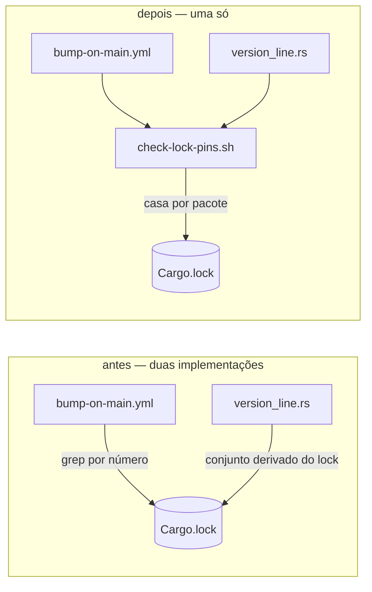

# Seis guardas do selo de versão verificavam menos do que declaravam

O bump automático grava a versão em quatro arquivos, e cada um deles carrega uma linha cuja única função é reprovar quando aquele arquivo não andou. Seis dessas linhas aprovavam sem medir o que diziam medir, e a catraca do frontmatter dos agentes reprovava YAML válido. Nada disso quebrava comportamento hoje — é exatamente por isso que valia consertar agora, com árvore limpa, e não no dia em que uma delas precisasse ter reprovado.

## Por quê

Uma guarda que aprova sem medir só é descoberta no dia em que precisava ter reprovado, e nesse dia o release já saiu quebrado. Foi assim com a v0.1.29: o lock da raiz ficou para trás, a tag saiu, e todo job com `--locked` morreu antes de compilar uma linha — em três sistemas operacionais.

Os casos abaixo não são hipóteses; todos foram medidos.

**A guarda da terceira perna casava por número, não por pacote.** Ela rodava `grep -q '^version = "$nv"$' Cargo.lock`, e essa linha está no arquivo sempre que *qualquer* dependência estiver naquele número. Medido na v0.1.44: `tracing` estava em 0.1.44 com o repositório também em 0.1.44, e a guarda passava sozinha por causa dela — num lock que não tinha andado. O comentário três linhas acima já avisava contra essa confusão exata, mas o aviso tinha sido escrito para o comando que trabalha e nunca foi aplicado à linha que confere.

**A guarda da quarta perna lia um dos dois crates.** O lock do dashboard fixa `mustard-core` e `mustard-cli`; a guarda lia só o primeiro. Se o segundo atrasasse, a guarda aprovava, o commit era tagueado, e o teste ficava vermelho num commit que a integração contínua não roda.

**A decisão da perna do dev consultava três pernas enquanto a mensagem dizia quatro.** Faltava o `Cargo.lock` da raiz. Com ele atrasado e os outros três em dia, o bloco inteiro era pulado e ele nunca andava.

**A catraca dos agentes reprovava YAML válido.** `model: sonnet   # comentário` — que o runtime resolve para `sonnet` — era reprovado com a mensagem de que o runtime não resolve. E, no sentido oposto, `model: "claude-opus-5"  # papel` passava, certificando um valor que nenhum runtime carrega.

## O que muda

O alvo é só o que **verifica**. O que faz cada perna andar (`cargo update`, os `sed`) está correto e continua byte a byte idêntico.

Antes existiam dois critérios para a mesma coisa: o workflow lia um nome digitado à mão, e o teste em Rust derivava o conjunto do próprio lock. Duas implementações da mesma ideia, mantidas em passo por ninguém.



A guarda virou um roteiro, `.github/scripts/check-lock-pins.sh`, que o workflow e os testes rodam. Isso é o que permite ao teste exercitar **a guarda que o release realmente executa**, em vez de uma segunda cópia dela.

O roteiro reprova quando qualquer das duas metades está errada:

- um crate **nomeado** sumiu do lock. Um conjunto derivado do lock não enxerga isso: o pacote que sumiu simplesmente para de ser perguntado, todos os que restaram estão no número certo, e a guarda fica verde justamente no caso para o qual existe — uma dependência removida por engano;
- qualquer pacote **local** do lock (bloco `[[package]]` sem linha `source`) está fixado em outro número. Esse conjunto é derivado, então cobre todos os nossos crates em vez do único nome que alguém digitou.

As duas metades são deliberadas: só um nome escrito pode ser *notado como ausente*, e só um conjunto derivado *cobre o que ninguém lembrou de escrever*.

A decisão da perna do dev passa a consultar as quatro pernas. A catraca dos agentes passa a ler o valor através de aspas e comentários, e depois da aspa de fechamento aceita só vazio ou comentário — qualquer sobra devolve a linha inteira, que a checagem de vocabulário reprova mostrando o que está escrito ali.

## Como validar

Nada abaixo toca seu repositório — tudo roda num diretório descartável.

```sh
# 1. A guarda reprova um lock que não andou, mesmo com terceiro no número alvo.
d=$(mktemp -d) && printf '[workspace]\nresolver = "2"\nmembers = []\n' > "$d/Cargo.toml"
cat > "$d/Cargo.lock" <<'EOF'
[[package]]
name = "mustard-core"
version = "0.1.44"

[[package]]
name = "tracing"
version = "0.1.45"
source = "registry+https://github.com/rust-lang/crates.io-index"
EOF
bash .github/scripts/check-lock-pins.sh "$d/Cargo.lock" 0.1.45 mustard-core ; echo "saída: $?"
# esperado: saída 1, dizendo que ainda fixa mustard-core@0.1.44
# a linha `version = "0.1.45"` ESTÁ no arquivo — é o que a guarda antiga aceitava

# 2. A guarda nomeia qual crate sumiu, em vez de aprovar o resto.
bash .github/scripts/check-lock-pins.sh "$d/Cargo.lock" 0.1.44 mustard-core mustard-cli ; echo "saída: $?"
# esperado: saída 1, nomeando mustard-cli

# 3. Os locks reais deste repositório passam.
bash .github/scripts/check-lock-pins.sh Cargo.lock "$(grep -m1 '^version' Cargo.toml | cut -d'"' -f2)" \
  mustard-cli mustard-core mustard-mcp mustard-rt scan ; echo "saída: $?"
# esperado: saída 0

# `$d` é um diretório temporário do sistema; nada aqui escreveu no repositório.
```

## Testes

Cada critério abaixo foi provado **vermelho por mutação**: recolocando a implementação anterior no lugar, ou mutilando o workflow, o teste reprova. Um teste que continua verde com o defeito de volta não mede nada.

| garante | comando | prova de que não é decoração |
|---|---|---|
| lock parado é reprovado mesmo com terceiro no número alvo | `cargo test -p mustard-core --test version_line bump_guard_rejects_a_lock_whose_local_crates_did_not_move` | a fixture carrega de propósito a linha `version = "0.1.45"` que a guarda antiga aceitava |
| a guarda confere todos os crates locais, não um nome escolhido | `cargo test -p mustard-core --test version_line bump_guard_checks_every_local_crate_of_each_lock` | reduzir a chamada do dashboard a um crate deixa o teste vermelho |
| crate que sumiu é nomeado, não passado por cima | `cargo test -p mustard-core --test version_line bump_guard_rejects_a_lock_that_lost_one_of_our_crates` | apagar `mustard-cli` do lock reprova nomeando qual sumiu |
| a decisão do dev consulta as quatro pernas | `cargo test -p mustard-core --test version_line dev_leg_decision_consults_what_the_work_block_repairs` | tirar `root_pin` da condição deixa o teste vermelho |
| a catraca lê valor com aspas e comentário, e segue reprovando sobra | `cargo test -p mustard-rt --test plugin_agents scalar_` | com o leitor anterior de volta, reprova em `model: "sonnet" garbage` |
| a lista de crates do dashboard não existe em duas cópias divergentes | `cargo test -p mustard-core --test version_line the_dashboard_guard_is_asked_about_exactly_the_crates_this_file_names` | encurtar qualquer um dos dois lados deixa vermelho, dizendo qual ficou curto |

Medido nesta árvore: **3073 testes passando, zero falhando**. `cargo build --workspace` e `cargo clippy --workspace --all-targets` saem com 0. Os dois controles verdes: `version_line` 9, `plugin_agents` 5.

O leitor de escalar do frontmatter foi conferido por execução diferencial contra um interpretador YAML de referência, em 376 linhas geradas: **zero entradas** que a versão nova aceita e a anterior reprovava, e zero modelos válidos reprovados.

## Decisões que merecem explicação

**A guarda saiu do YAML para um roteiro.** A tabela de arquivos original previa três arquivos, imaginando as guardas continuando dentro do workflow. Não dava: reimplementá-las em Rust para testá-las criaria um terceiro critério para a mesma coisa, que é o defeito sendo consertado. Extrair para um roteiro que os dois rodam é a única forma de o teste exercitar a guarda que o release executa.

**A lista nomeada não foi trocada por um conjunto puramente derivado.** Foi medido: um conjunto derivado do lock não percebe um crate que sumiu dele. A guarda ficaria verde justamente quando uma dependência fosse removida por engano — o oposto do que ela existe para fazer.

**A colisão de versão com terceiro é descrita como classe, não como estado presente.** Ela foi medida na v0.1.44, quando `tracing` estava exatamente nesse número. Na v0.1.45 ela não está viva. Descrevê-la como presente seria falso; como resolvida seria pior, porque ela volta toda vez que um crate de terceiros cair no nosso número de patch.

**A variável `dash_pin` foi preservada de propósito.** O critério de aceite de uma mudança já fechada (`cargo-lock-src-tauri-fica`) procura essa variável por expressão regular. Unificar as guardas removendo-a deixaria aquele critério vermelho sem que a intenção dele deixasse de ser satisfeita. Verificado: segue verde, sem emenda.

**O comentário que justificava o interpretador de TOML escrito à mão era falso.** Ele dizia existir para não puxar um interpretador para as dependências de teste, mas `toml = "1"` já é dependência regular do `mustard-core`. Um parser escrito para evitar um custo que não existe é um segundo leitor de formato de lock para manter correto à toa.

## Fora do escopo

- **`--locked` no build do dashboard durante o release.** É a trava que transformaria a garantia em bloqueio, mas tem risco próprio e é outra mudança.
- **Fazer a integração contínua compilar o dashboard.** Ela o exclui de propósito, por causa das bibliotecas de sistema de cada sistema operacional.
- **Reescrever `bump-on-main.yml` além das guardas.** O que faz cada perna andar está correto e medido.
- **Reunir o leitor de frontmatter dos agentes com o leitor canônico do projeto.** O leitor dos testes entra em pânico diante de arquivo salvo com marca de ordem de bytes, dizendo que falta a cerca que está lá. É defeito real e registrado, mas mexer no leitor compartilhado tem alcance próprio.

## O que continua aberto

Três observações de revisão que não bloqueiam e não foram consertadas aqui:

- o varredor `awk` do roteiro leria blocos `[[patch.unused]]` como pacotes locais, enquanto o leitor de TOML em Rust não. Falha fechada, e nenhum dos dois locks tem esses blocos;
- duas advertências novas de `clippy::format_push_string` (categoria pedante) vindas da função que forja locks nos testes. A integração contínua roda `clippy` sem `-D warnings` e sem `--all-targets`;
- `model: "sonnet"\t# c` — com tabulação antes do `#` — é aceito, enquanto o interpretador de referência reprova. YAML 1.2 permite tabulação como espaço de separação, e as duas versões anteriores se comportam igual, então não é regressão.

<!-- wikilinks-footer-start -->
- [package](?) ⚠ unresolved
- [patch.unused](?) ⚠ unresolved
<!-- wikilinks-footer-end -->