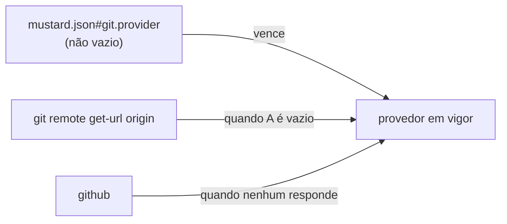

O `mustard init` para de perguntar quem hospeda o repositório. O provedor passa a ser **detectado** da URL do remoto `origin`, e a chave `git.provider` sobrevive como sobrescrita opcional — para o caso em que a detecção genuinamente não tem como saber.

## Por quê

O init perguntava "Git provider" num menu de três itens e congelava a resposta em `mustard.json`. É a mesma forma do defeito que a unidade anterior (#164) corrigiu para as bases: uma resposta dada no dia da instalação, sobre um projeto que o operador muitas vezes acabara de conhecer, e nunca mais revisitada.

Aqui é ainda mais desnecessária, porque a resposta está a um comando de distância:

```
git remote get-url origin
  https://github.com/org/repo.git            → github
  https://dev.azure.com/org/proj/_git/repo   → azure
  git@bitbucket.org:team/repo.git            → bitbucket
```

O gatilho concreto: o Mustard passou a ser usado em repositório corporativo hospedado no **Azure DevOps** — que o menu de três itens nem oferecia. Antes de qualquer adaptador de provedor, o fato precisa estar certo e vir de onde ele mora.

## O que mudou



`packages/core/src/platform/git_provider.rs` (novo) faz a sonda e a resolução. Fica em `platform/` pelo mesmo motivo do `git_branches`: o guard do `core` proíbe efeito colateral em `domain/`.

## A precedência é invertida em relação às bases — e isso é decisão

Na unidade anterior o git venceu e o `git.flow` virou dica. **Aqui a configuração vence a detecção.** Os dois fatos falham de formas diferentes:

| | envelhece? | detecção falha? |
|---|---|---|
| lista de bases | **sim** — o repositório muda toda semana | não |
| provedor | quase nunca | **sim** — instância auto-hospedada |

Um GitHub Enterprise em `git.empresa.com.br` não se parece com nada. Uma sobrescrita que perdesse para a detecção seria inútil justamente no caso que a justifica.

Por isso o init também para de **gravar** a chave. Se continuasse escrevendo `"github"` por padrão, toda instalação nova nasceria com uma sobrescrita permanente e a detecção nunca rodaria — exatamente o mecanismo que tornou o `git.flow` uma restrição em vez de uma dica.

## Como validar

Num diretório descartável, sem tocar em nada seu:

```bash
cd "$(mktemp -d)"
git init -q .
git remote add origin https://dev.azure.com/suzano/florestal/_git/portal
```

Depois, do checkout deste branch:

```bash
cargo test -p mustard-core --lib platform::git_provider
```

Esperado: 4 testes verdes, incluindo o caso do Azure, o da sobrescrita e o do host que não denuncia produto nenhum.

## Testes

Cada critério foi **provado VERMELHO** contra a árvore antes do código existir.

| # | O que garante | Comando |
|---|---|---|
| AC-1 | o provedor vem do remoto | `cargo test -p mustard-core --lib platform::git_provider::tests::the_provider_comes_from_the_remote_url -- --exact` |
| AC-2 | a sobrescrita vence a detecção | `cargo test -p mustard-core --lib platform::git_provider::tests::an_explicit_setting_overrides_detection -- --exact` |
| AC-3 | o init não pergunta e não grava a chave | `cargo test -p mustard-cli --lib commands::git_flow::tests::init_does_not_ask_for_the_provider -- --exact` |
| AC-4 | build do workspace verde | `cargo build --workspace` |

Suítes medidas nesta árvore: **`core` 623**, **`rt` 1980**, **`cli` 49**, todas com 0 falhas.

## Decisões que merecem explicação

**A tabela de hosts é literal e pequena de propósito.** Um host pertence ao serviço do fornecedor ou não pertence; uma heurística mais esperta é o que mandaria um GitLab auto-hospedado para o `github`. O que a tabela não sabe é respondido pela sobrescrita, não por uma regra mais fina.

**Casa por host ou subdomínio, nunca por substring.** `github.com.evil.example` não é o GitHub, e há teste para isso.

**Uma coerção escondida foi removida no caminho:** o init transformava vazio em `"github"` antes de gravar. Ficando, ela sozinha teria anulado a feature inteira.

## Fora de escopo

- **Fazer o Azure DevOps funcionar.** Esta unidade só torna o FATO correto. Os três executores (`pr_door`, `review_prefetch`, `branch_state`) continuam chamando `gh` direto — é a unidade seguinte que os coloca atrás de uma porta.
- **Adivinhar instância auto-hospedada.** Resolvido pela sobrescrita.
- **Remover a chave `git.provider`.** Ela sobrevive, e é o que salva o caso acima.

## O que fica em aberto

Este branch foi cortado de `dev` enquanto o **#164 está aberto**, e os dois tocam `config.rs`, `git_flow.rs` e a prosa. **Vai precisar de rebase depois que o #164 mergear** — foi escolha consciente, para não inventar um atalho no portão de base.