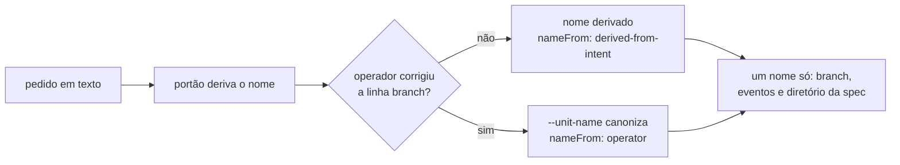

A pergunta que abre uma unidade de trabalho passa a ser um formulário de três campos corrigíveis: a base primeiro, o tipo depois, e o nome do branch apresentado para você confirmar ou reescrever. O nome que você escrever vence a derivação automática.

## Por quê

A pergunta de abertura pedia duas coisas — o tipo do branch e a base de onde sair — e três defeitos apareceram de uma vez no uso real:

1. **A ordem estava invertida.** O tipo vinha antes da base, o que faz a base parecer consequência do tipo. Essa implicação já tinha sido removida do produto quando a base passou a ser escolhida contra o catálogo real do `origin`; o texto ainda a sugeria.
2. **Os campos eram apresentados pareados.** "Ask both together" foi lido como *combinar*, e o resultado é o produto cartesiano de duas escolhas independentes: quem quer `hotfix` saindo da base comum não encontra a linha.
3. **`hotfix` sumia da lista.** A superfície de pergunta aceita no máximo 4 opções por campo. O texto sugeria seis tipos e nunca mencionava esse teto, então a sugestão que sobrava era cortada — e era justamente `hotfix`.

E um quarto, encontrado ao investigar: **o nome da unidade não podia ser corrigido por ninguém.** A linha `branch:` só mostrava o nome. O portão deriva o nome do texto do pedido e descarta qualquer nome sugerido, dizendo em voz alta *"uma unidade tem um nome só"*. A regra existe por um motivo real — antes dela uma unidade carregava dois nomes ao mesmo tempo — mas o alvo estava errado: ela foi escrita para calar o CHAMADOR que inventava um nome em silêncio e acabou calando também o OPERADOR, a única pessoa que sabe como a unidade deveria se chamar. A documentação da própria função registra onde está a linha: *"o que não está em jogo é o silêncio"*.

## O que mudou

Antes e depois da pergunta:

```
ANTES                              DEPOIS
┌──────────────────────────┐       ┌────────────────────────────────────┐
│ tipo:   [fix] feature …  │       │ sai de: [dev]  main  release/…     │
│ sai de: [dev] main …     │  ──►  │ tipo:   [fix]  hotfix  feature  ✎  │
│ branch: fix/o-botao-…    │       │ branch: fix/o-botao-…           ✎  │
└──────────────────────────┘       └────────────────────────────────────┘
 renderizado como pares             3 campos independentes; ✎ = corrigível
 branch: só aviso                   o nome do operador vence a derivação
```

O caminho do nome, de ponta a ponta:



O sinal novo é `--unit-name`, e ele é explícito de propósito: `--spec` continua sendo palpite do chamador e continua perdendo, enquanto `--unit-name` é uma pessoa corrigindo uma sugestão que leu. Os dois nunca se confundem porque chegam por flags diferentes. O valor recebido passa pela **mesma** canonização do nome derivado, então "Corrigir a Barra" e `corrigir-a-barra` viram o mesmo nome — a lei "uma unidade, um nome, uma grafia" segue de pé. O relatório do portão passa a emitir `nameFrom`, e apenas quando um nome foi realmente cunhado: as demais chamadas continuam byte-idênticas, porque catracas comparam essa saída byte a byte.

**O roteador virou dois injetáveis.** O texto de regras é injetado no contexto por um gancho, e o harness limita esse canal a 10.000 caracteres — acima disso o conteúdo deixa de estar embutido e vira um arquivo com prévia e caminho, ou seja, deixa de estar *em vigor* a cada mensagem. O texto passou de 9.433 para 12.041 caracteres. A saída não foi comprimir prosa: foi dividir em dois arquivos pendurados em **eventos diferentes** (`userPromptSubmit` e `sessionStart`), porque o compositor funde todos os injetáveis de um mesmo evento num único texto. Nenhuma linha foi espremida — o diff da seção movida tem **uma** palavra alterada.

| arquivo | evento | caracteres |
|---|---|---|
| `orchestrator.md` | `userPromptSubmit` | 5.853 |
| `dispatch.md` | `sessionStart` | 7.995 |

Uma migração acompanha a divisão: sem ela, instalações existentes receberiam o segundo arquivo no disco enquanto o `mustard.json` declarasse só o primeiro, e a seção da pergunta não alcançaria ninguém. Ela é condicional — quem removeu o roteador de propósito não o recebe de volta.

## Como validar

Num diretório descartável, sem tocar em nada seu:

```bash
cd "$(mktemp -d)"
git clone <este-repo> m && cd m && git checkout hotfix/pergunta-abertura-unidade-pergunta-tipo
cargo test --workspace
cargo run -p mustard-rt -- run emit-pipeline --help | grep -A3 unit-name
```

## Testes

Cada critério foi provado VERMELHO antes de o código existir — o portão de prova negativa recusa um critério que já passa contra a árvore atual, e recusou uma primeira versão destes.

| critério | o que garante | comando |
|---|---|---|
| AC-1 | `sai de:` aparece antes de `tipo:`, e `tipo:` contém `hotfix` | `cargo test -p mustard-rt --test plugin_prose_matches_shipped_behaviour router_asks_the_base_before_the_type` |
| AC-2 | a regra nomeia o teto de opções, proíbe parear e pina `hotfix` | `cargo test -p mustard-rt --test plugin_prose_matches_shipped_behaviour router_forbids_pairing_and_pins_hotfix` |
| AC-3 | a cópia entregue coincide com a semente também na linha `sai de:` | `cargo test -p mustard-rt --test plugin_prose_matches_shipped_behaviour delivered_copy_matches_the_seed_at_the_base_row` |
| AC-4 | o nome do operador vence a derivação; `--spec` continua perdendo | `cargo test -p mustard-rt operator_name_wins_over_the_derivation` |
| AC-5 | a linha `branch:` se apresenta como campo corrigível | `cargo test -p mustard-rt --test plugin_prose_matches_shipped_behaviour router_offers_the_name_for_correction` |
| AC-6 | cada injetável cabe embutido no contexto | `cargo test -p mustard-cli --test template_budget` |

Suíte completa nesta branch, medida: **3.004 testes, 0 falhas, 6 ignorados** (78 suítes).

## Decisões que valem explicar

**O teto não foi removido, e não podia ser.** A leitura inicial era que o corte em 10.000 caracteres fosse invenção deste produto. Não é: está na documentação do harness, e o excedente vira arquivo com prévia. Remover a verificação tornaria a perda silenciosa em vez de visível — trocaríamos um teste vermelho por uma degradação que ninguém vê.

**A catraca da divisão prende o motivo, não o resultado.** Ela exige que as duas metades **não** compartilhem evento. Se alguém as mover para o mesmo gancho no futuro, os arquivos continuariam pequenos e um teste de tamanho passaria — mas o problema voltaria, porque o compositor funde tudo de um mesmo evento. A catraca fecha essa porta.

**Um comentário falso foi corrigido em três lugares.** O teste de orçamento, sua mensagem de falha e a documentação do módulo de instalação afirmavam que o excedente era cortado no meio da frase. A afirmação é falsa perante a documentação atual, e foi ela que levou dois revisores independentes a relatarem uma amputação que não acontece. Agora os três descrevem o mecanismo real e apontam o remédio certo: dividir num segundo evento, nunca comprimir.

**`hotfix` está pinado com metade de código.** Não bastava escrever "não corte `hotfix`": a lista de sugestões precisa mantê-lo entre os quatro primeiros tokens, então nem um renderizador que pegue os quatro primeiros consegue derrubá-lo.

## Fora de escopo

- **Não fecha o vocabulário de tipos.** Continua rótulo aberto: qualquer token válido como segmento de ref é aceito, e as sugestões são convenção.
- **Não cria um terceiro nome.** Editar a linha `branch:` é editar `tipo` + nome numa string só, cortada no primeiro `/`. Um campo de branch livre para discordar dos outros dois ressuscitaria o defeito dos dois nomes.
- **Não mexe no catálogo de bases nem no portão de abertura** — os dois já mediam corretamente.
- **A trava de tamanho ainda mede por arquivo, não por evento.** O `sessionStart` funde o censo de terreno, os injetáveis e dois avisos num texto só; medido, um repositório com cerca de 50 subprojetos estoura a soma enquanto cada arquivo isolado cabe. Está registrado como unidade própria (`2026-08-20-teto-injetaveis-medido-por`) e deliberadamente fora deste PR.