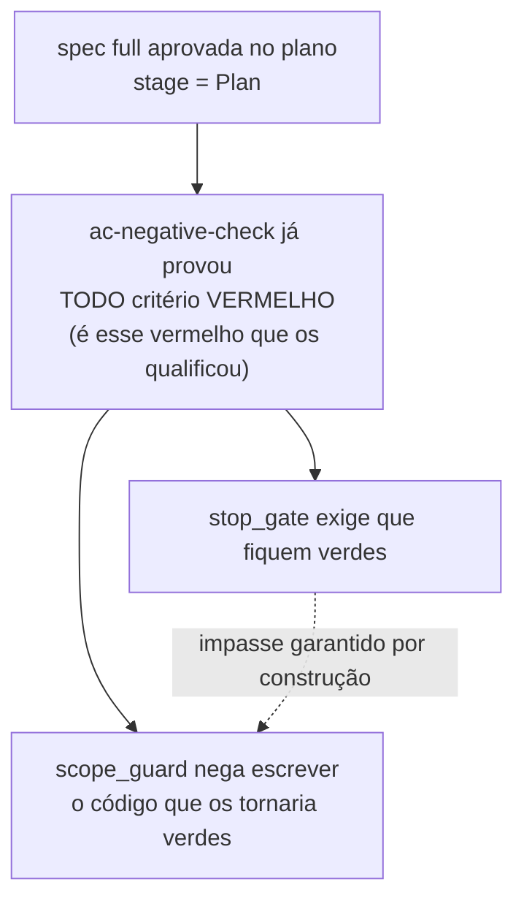

# O portão de parada não cobra mais QA de uma spec parada em PLAN

O portão que roda os critérios de aceitação no fim de cada turno passa a ler em que ponto do ciclo de vida a spec está. Uma spec aprovada que ainda não teve o EXECUTE liberado é solta em silêncio, em vez de ser cobrada por critérios que naquele momento não têm como passar.

## Por quê

A função de auto-restrição do portão fazia duas perguntas — existe o marcador `.approved-by-user`? há critério executável? — e nenhuma sobre o estágio.

Mas o marcador é cunhado na aprovação do **plano**, não na liberação do EXECUTE. Entre um e outro existe uma janela onde três coisas são verdadeiras ao mesmo tempo:



Não é azar de configuração: toda spec `full` atravessa essa janela. Neste repositório são 35 specs `full`, e as 35 carregam o marcador. Havia dois contadores de bloqueio gravados em disco quando o defeito foi diagnosticado.

O prejuízo era limitado — o portão tem teto próprio de 8 bloqueios consecutivos e depois solta — mas eram até 8 turnos gastos exigindo algo que outro portão do mesmo produto proíbe.

## O que mudou

Antes, em `resolve_gated_spec`:

```
marcador presente?  →  há critério executável?  →  VERIFICA
```

Depois:

```
marcador presente?  →  meta.json#stage lê "Plan"?  →  SOLTA em silêncio
                    →  senão, há critério executável?  →  VERIFICA
```

Um arquivo tocado: `apps/rt/src/hooks/task/stop_gate.rs`.

A leitura é **positiva-only**, e essa é a parte que exigiu cuidado. `meta.json` ausente, ilegível ou sem estágio mantém a verificação exatamente como era. O helper de teste deste módulo semeia `spec.md` e nenhum `meta.json`, então soltar por sinal ausente deixaria a bateria inteira verde por acidente e apagaria a cobertura do portão.

## Como validar

Num diretório descartável, sem tocar em nada seu:

```bash
cargo test -p mustard-rt stop_gate
```

Para ver o comportamento contra uma spec real parada em PLAN, com o binário recém-compilado:

```bash
cargo build -p mustard-rt
echo '{"hook_event_name":"Stop","cwd":"'"$PWD"'"}' \
  | MUSTARD_ACTIVE_SPEC=<uma spec full em stage Plan> ./target/debug/mustard-rt check stop_gate
# saída vazia = liberou em silêncio
```

## Testes

| Critério | O que garante | Comando |
|---|---|---|
| AC-1 | com estágio `Plan` e critério vermelho, o portão libera — e não gasta bloqueio do teto de 8 | `cargo test -p mustard-rt stop_gate_releases_a_spec_still_in_plan` |
| AC-2 | a bateria inteira do portão passa, incluindo o teste que prova que ele ainda bloqueia por critério vermelho | `cargo test -p mustard-rt stop_gate` |

O AC-1 foi executado contra a árvore **antes** do código existir e voltou vermelho (`exit 1`), com o comando de controle voltando verde no mesmo instante. Um critério que só é visto passar nunca provou saber falhar.

Há um segundo teste que não é critério mas é o que dá sentido ao primeiro: `stop_gate_still_blocks_once_the_spec_leaves_plan` — mesma spec, mesmo critério vermelho, estágio `Execute`, e o portão **bloqueia**. Sem ele, o AC-1 poderia estar passando porque eu desarmei o portão inteiro.

Medições desta branch: `cargo test -p mustard-rt` → 2206 passam, 0 falham. `cargo clippy` não reclama de nenhuma linha deste arquivo. Os dois avisos de build são pré-existentes, em `feature.rs:488` e `work_kind.rs:539`.

## Decisões que valem explicação

**O sensor de estágio fica duplicado aqui, não hasteado para `shared/`.** O gate irmão `scope_guard` tem uma normalização igual, de duas linhas. Hastear obrigaria a mexer também naquele arquivo e nos seus 9 testes, ampliando um conserto de um arquivo para três sem ganho de comportamento. São duas cópias, não as três que renderam ao `gate_mode` o seu próprio módulo — a regra de três ainda não foi alcançada.

**Nenhuma variável de ambiente nova.** O portão é incondicional por decisão da spec que o criou, e isto é condição de ciclo de vida, não de política.

**`scope_guard` não foi tocado.** Ele está certo, e é ele que define a janela.

## Fora de escopo

- A spec `close-the-qa-verification-loop`, que construiu este portão e tem as duas ondas completas, não é fechada nem reaberta aqui.
- Nenhuma mudança no teto de 8 bloqueios consecutivos.