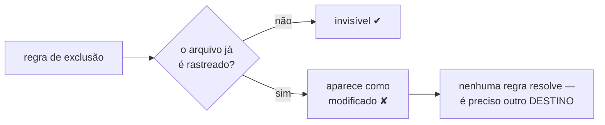
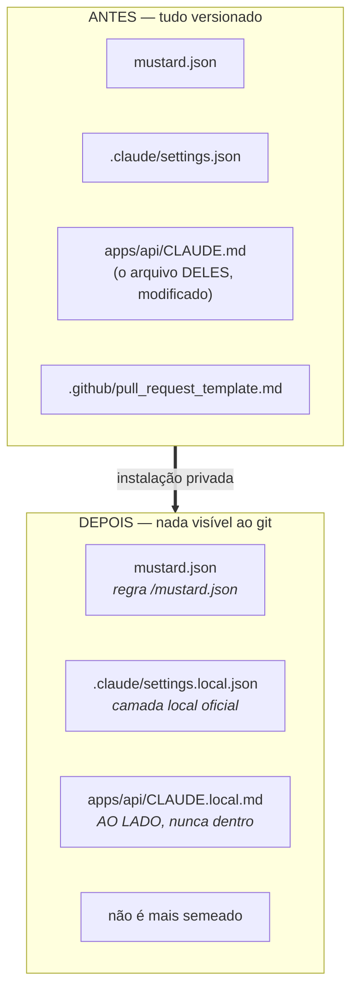

# Instalação privada: o Mustard deixa de subir qualquer arquivo seu

O Mustard agora se instala sem deixar nenhum rastro versionado no repositório. Tudo que ele gera continua no disco — o harness precisa dos arquivos ali — mas nada disso é visto pelo git daquele clone. Não há flag para ligar nem para desligar: é o único modo de instalação que existe.

---

## Por que

O harness está sendo usado dentro de repositórios de clientes, em consultoria. Cada instalação plantava cinco caminhos versionados na raiz, e cada `scan --full` escrevia mais um por subprojeto — um arquivo de Guards ao lado do código deles.

Essa pegada era versionada **de propósito**: o Mustard assume que o repositório é seu, onde a spec é o registro da unidade e os Guards são conhecimento do time. Numa consultoria a premissa se inverte, e não havia como dizer isso.

O contorno óbvio falha justamente no arquivo que importa. Uma entrada no `.gitignore` do projeto é ela mesma uma linha versionada anunciando a ferramenta escondida. E uma regra de exclusão local só age sobre caminho que o git **ainda não rastreia** — então um cliente que já versiona o próprio `CLAUDE.md` vê o arquivo aparecer como modificado depois de cada scan, por mais regras que existam.



A saída não foi uma regra melhor: foi **escrever ao lado do arquivo do cliente**, na camada local que o editor já lê.

---

## O que mudou



Três destinos trocaram de lugar, e cada um por um motivo diferente:

| O que | Antes | Depois | Por quê |
|---|---|---|---|
| Configuração do harness | `.claude/settings.json` | `.claude/settings.local.json` | é a camada local que o Claude Code documenta para isso, e o `.gitignore` do template já a cobria |
| Guards por subprojeto | `<sub>/CLAUDE.md` | `<sub>/CLAUDE.local.md` | uma regra não salva arquivo já rastreado; escrever **ao lado** é a única forma de nunca tocar o do cliente |
| Restante da pegada | versionada | regras no exclude local do clone | o arquivo fica no disco, invisível ao git, e não viaja em clone nenhum |

O `CLAUDE.local.md` funciona porque a documentação oficial garante duas coisas verificadas nesta unidade: ele é descoberto **em subdiretório** exatamente como o `CLAUDE.md` de lá, e dentro de um mesmo diretório é anexado **depois** dele. Os Guards do cliente sobrevivem e os nossos são aditivos.

---

## Como validar

Tudo abaixo roda num diretório temporário e não toca nada seu.

### 1. A pegada some, o do cliente fica

```bash
cd $(mktemp -d) && git init -q -b dev .
git config user.email t@e.com && git config user.name t
mkdir -p apps/api && echo "# cliente" > README.md
git add -A && git commit -qm "código do cliente"

mustard-rt run upsert            # sem flag nenhuma

git status --porcelain -uall     # → VAZIO
```

Agora escreva coisas **do cliente** e confirme que continuam visíveis:

```bash
mkdir -p .claude/commands
echo "x" > .claude/commands/comando-deles.md
echo "x" > apps/api/CLAUDE.md
git status --porcelain -uall
# ?? .claude/commands/comando-deles.md
# ?? apps/api/CLAUDE.md
```

### 2. Não existe como pedir o contrário

```bash
mustard-rt run upsert --private   # error: unexpected argument '--private'
mustard init --shared             # error: unexpected argument '--shared'
```

### 3. Monorepo

```bash
mkdir -p apps/api/.claude/skills/api-pattern packages/ui/.claude
echo m > apps/api/.claude/scan-map.md
echo m > apps/api/.claude/skills/api-pattern/SKILL.md
echo g > apps/api/CLAUDE.local.md
mkdir -p packages/ui/.claude/skills/skill-deles
echo s > packages/ui/.claude/skills/skill-deles/SKILL.md

git status --porcelain -uall
# só a skill do cliente aparece — os moldes `*-pattern` do Mustard, não
```

Repare no último par: dentro da **mesma pasta** `skills/`, os moldes do Mustard somem e a skill que o cliente escreveu aparece. A regra é o sufixo `-pattern`, não a pasta.

---

## Testes

Onze critérios, cada um com um comando que qualquer pessoa roda. Todos foram provados **vermelhos antes** do código existir — nenhum deles pode passar por acidente.

| # | O que garante | Comando |
|---|---|---|
| AC-1 | as regras vão para o exclude local, resolvido pelo git, de forma idempotente | `cargo test -p mustard-core --test private_install ac1_…` |
| AC-2 | a configuração vai para a camada local; a versionada nunca nasce | `… ac2_…` |
| AC-3 | caminho já rastreado é **relatado**, nunca desvinculado | `… ac3_…` |
| AC-4 | nenhuma regra alcança profundidade que não é nossa | `… ac4_…` |
| AC-5 | os Guards vão para `CLAUDE.local.md`; o `CLAUDE.md` do cliente fica byte a byte igual | `cargo test -p mustard-rt --test private_scan ac5_…` |
| AC-6 | a instalação é privada sem argumento, e nenhum argv alcança o contrário | `cargo test -p mustard-rt --test private_surface ac6_…` |
| AC-7 | o `init` não semeia `.github/` no repositório do cliente | `cargo test -p mustard-cli --test private_init ac7_…` |
| AC-8 | **a prova de campo**: repo real que já versiona seu `CLAUDE.md` → `git status` vazio e arquivo intocado | `cargo test -p mustard-core --test private_install_leaves_no_trace ac8_…` |
| AC-10 | os Guards **chegam** ao prompt despachado — alcance, não presença | `cargo test -p mustard-rt --test private_guards ac10_…` |
| AC-11 | quando não consegue esconder, a instalação **recusa** e não escreve nada | `cargo test -p mustard-core --test private_install ac11_…` |
| AC-9 | o workspace compila | `cargo build --workspace` |

Suíte completa: **2936 testes, exit 0.**

**Cada teste carrega um controle negativo.** Toda asserção aqui tem a forma "o arquivo visível está ausente" — e um código que **não escreve nada** satisfaz todas elas. Por isso cada teste prova também que a instalação *aconteceu*: o `mustard.json` aterrissou, o arquivo de exclusão cresceu. Sem isso, verde poderia significar "nada foi feito".

---

## Decisões que valem explicar

**O modo não é uma escolha.** Não há flag para pedir privado nem para pedir o contrário. Os dois erros não custam o mesmo: uma instalação visível no repositório de outra pessoa vaza material que nunca foi para ser dela, e você descobre vendo commitado. Um interruptor que alcança esse desfecho é a mesma falha com um passo a mais.

**Nada que o cliente já rastreia é desvinculado em silêncio.** `git rm --cached` reescreve o índice **deles**. O relatório nomeia o resíduo e o comando que resolve; a decisão é do operador.

**O caminho do exclude nunca é literal.** Em submódulo e worktree linkado, `.git` é um **arquivo**, não uma pasta. É resolvido por `git rev-parse --git-path info/exclude`, e o retorno é relativo num repo comum e absoluto nos outros dois — medido nas três formas, não presumido.

**Quando não consegue esconder, recusa.** Se o arquivo de exclusão existir mas não puder ser escrito, a instalação para antes de criar qualquer coisa. Degradar em silêncio seria a pior falha possível aqui: você acreditaria estar privado sem estar.

---

## A lição desta unidade

Seis defeitos apareceram na revisão, todos com **a mesma causa**:

> Uma regra de exclusão só pode nomear **exatamente** o que o Mustard escreve.

| Regra vs. autoria | Consequência | Quantos |
|---|---|---|
| mais **ampla** que a autoria | some arquivo do cliente | 5 |
| mais **estreita** que a autoria | vaza arquivo do Mustard | 1 |

O caso estreito foi o mais instrutivo: a lista tinha sido digitada à mão e omitia `.claude/plans/` — que é preenchido pelo **próprio seed do Mustard**, e cujos nomes de arquivo são os títulos dos prompts do operador. Hoje a lista é **derivada** do catálogo que já existia, e a catraca faz as **duas** perguntas: toda regra casa algo nosso, e todo caminho nosso é casado por alguma regra. Só validar as regras emitidas foi o que deixou o vazamento passar verde por onze critérios e três rodadas de revisão.

---

## Fora de escopo, por decisão

- **Tirar a pegada da árvore de trabalho.** Os hooks leem os arquivos do disco em caminhos fixos; movê-los quebraria o harness. Privado significa invisível ao git, não ausente.
- **Reescrever histórico.** Pegada já commitada numa sessão anterior continua no log; isto muda o que acontece dali para a frente.
- **Nomes de branch.** `feature/…` e `fix/…` ainda viajam no push — não são arquivos, e nenhum mecanismo de arquivo os esconde.
- **O link do dashboard** (`project_overview.rs`) ainda resolve `CLAUDE.md` fixo. Aquele crate está **fora do workspace do cargo** e só compila por `pnpm dashboard:build`, então nenhum portão desta unidade compilaria a edição. Mandar um one-liner não verificável para um crate que ninguém compila é a troca pior; a constante já está exportada e a correção é de uma linha quando houver um build do dashboard em escopo.