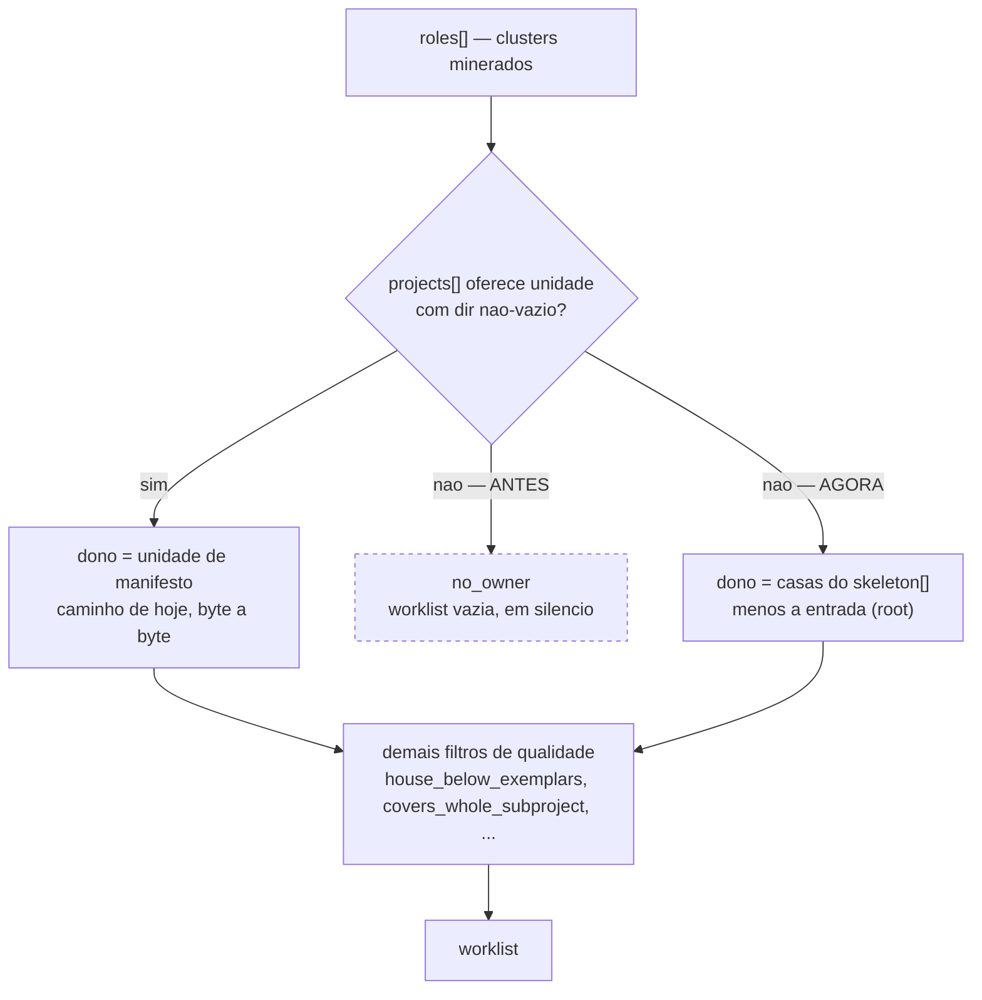

Três pontos em que o mustard terminava o trabalho pela metade e não dizia passam a terminá-lo: o `scan` volta a escrever molds num repositório cujo único manifesto está na raiz (medido em campo: de zero para **83 candidatos**), o instalador deixa de largar o selo de versão sujo na árvore para a próxima unidade levar a culpa, e uma sessão rodando um plugin antigo passa a dizer isso em vez de parecer alinhada.

## Por quê

Os três apareceram na mesma sessão, e o segundo e o terceiro travaram o trabalho sobre o primeiro.

**O caso concreto do defeito 1** é um backend NestJS de 1085 arquivos com um único `package.json`. O `scan-patterns-list` devolvia `[]` ali. Não por falta de material: o minerador tinha encontrado 47 clusters de papel e derrubado 34 deles com o motivo `no_owner` — `Service` ×111 em `src/sira/service`, `Strategy` ×7 em `src/mlplan/strategies`, `Env` ×7 em `src/core/config/env`. A resolução de dono lê `projects[]`, derivado dos **manifestos** da árvore; com um manifesto só, essa lista tem uma entrada — a raiz — que é filtrada fora, e todo cluster fica órfão.

O mesmo modelo já carregava as casas do projeto o tempo todo, em `skeleton[]`: 25 unidades arquiteturais (`src/puzzle`, `src/mlplan`, `src/sira`, `src/core`…), mineradas pela **estrutura** do caminho em vez do manifesto. Ninguém as consultava.

**Defeito 2:** toda execução de `init` reescreve `mustard.json#version`, arquivo versionado, e não commitava. O corte da branch da unidade seguinte reprovava nessa árvore suja com um texto que atribuía a escrita a *outra unidade de trabalho do operador* — quando quem escreveu foi o instalador.

**Defeito 3:** o aviso de deriva compara o selo do projeto com o plugin **em execução**. Depois de instalar uma versão nova, a sessão segue com a antiga carregada até alguém recarregar à mão; nesse intervalo os dois valores são iguais, o aviso não dispara, e nada no produto mencionava que recarregar era preciso.

## O que mudou



No repositório de campo, os 34 `no_owner` viraram **zero**. Eles não viraram 34 molds: migraram para motivos de qualidade — 40 em `house_below_exemplars`, 3 em `no_exemplars`, 1 em `covers_whole_subproject`. É o funil passando a **julgar** cada cluster em vez de abortar antes de olhar.

Nenhuma regra de nome nova foi precisa: `owner_of` já resolve por prefixo mais longo (então `src/puzzle` vence a entrada agregada `src`), e `basename("src/sira")` já dá o prefixo do slug. O caminho do mold sai como `src/sira/.claude/skills/sira-service-pattern/SKILL.md`.

Os outros dois: `init` e `upsert` registram sozinhos o selo que acabaram de escrever **quando encontraram a árvore limpa**, e a linha de log nomeia a branch em que o commit caiu; numa árvore já suja não tocam em nada e dizem por quê. E o início de sessão compara a versão carregada com a registrada como instalada, emitindo uma linha só quando a carregada é estritamente mais antiga.

## Como validar

Tudo em diretório descartável, sem tocar em nada seu:

```bash
git fetch origin fix/scan-upsert-terminam-pela-metade
git worktree add /tmp/rev origin/fix/scan-upsert-terminam-pela-metade
cd /tmp/rev && cargo test -p mustard-core -p mustard-cli -p mustard-rt
```

A prova de não-regressão, comparando o binário desta branch com o instalado — vale **enquanto o instalado for anterior a este merge**:

```bash
cd /tmp/rev && cargo build -q --workspace
diff <(./target/debug/mustard-rt run scan-patterns-list --root . --rejected) \
     <(mustard-rt run scan-patterns-list --root . --rejected) && echo "identico"
```

Aqui isso deu **195 linhas de descarte idênticas byte a byte**: num repositório com unidades de manifesto o caminho novo não é tomado.

E, num repositório seu de manifesto único, se tiver um:

```bash
/tmp/rev/target/debug/mustard-rt run scan-patterns-list --root <seu-repo> --rejected
```

Nenhum `no_owner` deve sobrar.

## Testes

Cada critério foi provado **VERMELHO antes do código existir** (`ac-negative-check`, com um comando de controle verde ao lado provando que a falha era do defeito e não do ambiente), e verde de novo depois (`confirmation: taken=true, ok=true, unproven=[]`).

| # | o que garante | comando |
|---|---|---|
| AC-1 | sem unidade de manifesto, as casas do esqueleto viram dono e a worklist sai com `subproject` real | `cargo test -p mustard-rt skeleton_houses_own_clusters_when_no_manifest_unit_exists` |
| AC-2 | havendo unidade de manifesto, o esqueleto NÃO é consultado — a saída é a de hoje | `cargo test -p mustard-rt skeleton_fallback_stays_out_when_manifest_units_exist` |
| AC-3 | sem unidade e sem `skeleton[]` (modelo antigo), a worklist é `[]` e o comando sai 0 | `cargo test -p mustard-rt no_skeleton_degrades_to_empty_worklist` |
| AC-4 | `init` que encontrou a árvore limpa a devolve limpa, sem passo manual | `cargo test -p mustard-cli install_leaves_the_git_tree_clean` |
| AC-5 | plugin carregado atrás do instalado gera UMA linha no início da sessão | `cargo test -p mustard-rt stale_plugin_is_announced_at_session_start` |
| AC-6 | o workspace compila | `cargo build --workspace` |

Dois testes fora dos critérios, escritos porque o caso merece trava própria: `install_never_commits_over_the_operators_own_work` (a árvore suja do operador nunca é varrida para dentro de um commit do instalador) e `install_commits_the_stamp_on_a_protected_branch` (o commit do selo cai na branch padrão também, e isso é decisão, não acidente).

Suítes completas, medidas nesta branch: **mustard-core 669**, **mustard-cli 57**, **mustard-rt 2146**. `cargo build --workspace` sai 0 com 4 avisos, todos pré-existentes e em arquivos não tocados.

## Decisões que merecem explicação

**Reusar `skeleton[]` em vez de minerar uma segunda lista de casas.** A lista já está no modelo, é determinística e é a mesma que o censo de orientação exibe. Minerar de novo criaria uma segunda verdade sobre quais são as unidades do projeto.

**O caminho novo só dispara quando `projects[]` não oferece unidade alguma.** Isso faz o conjunto de repositórios afetados ser exatamente o conjunto onde a saída de hoje é `[]` — não existe comportamento anterior a regredir. Neste repositório há 14 unidades de manifesto, então a condição é falsa e o ramo novo nem é tomado.

**O commit automático do selo acontece em qualquer branch, inclusive numa protegida.** Foi levantado na revisão: `work_branch_gate` nega ao operador uma edição que cairia na branch padrão, e aqui o instalador commita justamente ali. É caso diferente — o selo é configuração do projeto, não trabalho do operador, e um clone novo está sempre na branch padrão, que é onde se instala; recusar ali devolveria a árvore suja no caso mais comum de todos, que é o defeito que este trabalho veio remover. O que a decisão devia era deixar de ser acidental: a linha de log nomeia a branch, e um teste tranca o comportamento.

**O commit usa `git commit -m … -- mustard.json`.** A forma com caminho explícito nunca toca no index, então nada que a instalação criou ao lado do selo pega carona e o que você tem preparado para commit sobrevive intacto.

**Mover o selo para fora do `mustard.json` foi considerado e recusado.** Seria o conserto mais limpo — dado volátil não pertence a arquivo versionado — mas três leitores dependem dele, e um deles vive em `apps/dashboard/src-tauri`, que não compila na máquina onde este trabalho foi feito.

## Fora de escopo

- **Guards na raiz do workspace.** A mesma cegueira atinge `scan-guards-list`/`apply`, mas ali a recusa é decisão declarada (`scan_claude.rs:555-558`): o arquivo da raiz pertence ao usuário. Estender isso é unidade própria, e o caminho de menor atrito seria `CLAUDE.local.md`.
- **O teto de 25 entradas do `build_skeleton`** (`apps/scan/src/condense.rs:29`). Num repositório de manifesto único com mais de 25 domínios, as casas menores continuam sem mold. Cobertura parcial, aceita e declarada.
- **A chave `subprojects` do `mustard.json`.** Está declarada e nunca lida — a única ocorrência no workspace é a própria declaração. Não foi revivida nem removida aqui.
- **Qualquer mudança em `apps/dashboard`.**

## Ainda em aberto

- `packages/core/src/lib.rs` e `packages/core/src/platform/git_branches.rs` entraram como cascata de re-export e não constavam da tabela original de arquivos da spec; foram acrescentados a ela, e o portão de fronteira avisou nos dois casos.
- A cobertura do defeito 1 é limitada pelo teto de 25 do esqueleto, acima.
