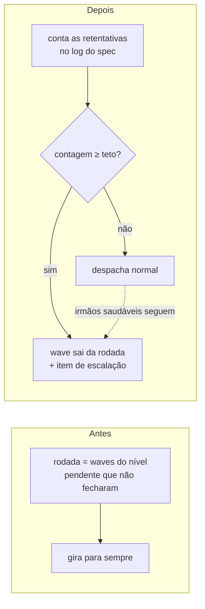

# Um teto de retentativa, e o wave que estoura sai da rodada

Nenhum laço de correção gira mais sem limite. Um wave redespachado além do teto deixa de ser entregue, sai da rodada, e no lugar dele entra uma linha que diz ao operador qual wave parou de ser tentado, quantas vezes, e as três maneiras de destravá-lo.

## Por quê

Nada no projeto comparava contagem de retentativa com limite. Os dois contadores que existiam — `metrics_wave_status.rs:229` e `event_projections/pipeline.rs:71` — somam para relatório e param aí.

E `advance()` montava a rodada de despacho filtrando por uma coisa só: o wave já fechou, ou não fechou. Um wave que abriu, falhou, voltou para correção e está sendo entregue pela quinta vez era, para esse filtro, idêntico a um que nunca começou.

## O que mudou



O evento tem **nome próprio**, e isso é metade do desenho. `retry.attempt` já existe, já é emitido a cada retry de hook medido, e o roteador o classifica como `friction` por comparação de texto exata (`route.rs:77`). Reusar o nome misturaria dois sinais sem parentesco e estragaria a telemetria de fricção que já roda. O novo `pipeline.wave.retry` cai no primeiro braço de `classify_kind` (`route.rs:62`) e vira balde `pipeline`, longe da fricção.

A contagem é lida em `advance()` pela mesma via que `completed_waves` já usa. O ponto de emissão se resolveu sozinho na leitura do código: `wave_advance.rs:310-315` já sabia quais waves foram iniciados e não completados, e um wave entregue de novo nesse estado **é** a retentativa. Não há outro sinal de despacho persistido confiável — as docs do módulo já registravam isso.

Acima do teto o wave sai da rodada e os **irmãos saudáveis do mesmo nível seguem despachando**. Recusar a rodada inteira por causa de um wave já estrangulou trabalho limpo duas vezes neste arquivo, e o comentário de `wave_advance.rs:231-247` registra as duas.

## Como validar

```bash
cargo test -p mustard-rt retry_ceiling
cargo test -p mustard-rt retry_event_is_not_routed_as_friction
```

Para ver o teto agir de ponta a ponta, num projeto descartável que não toca em nada seu:

```bash
cargo build -p mustard-rt
D=$(mktemp -d) && cd "$D"
# monte um spec de fixture com um plano de 2 waves, depois:
#   rodadas 1-4 despacham; a rodada 5 volta com role: "escalation"
mustard-rt run wave-advance --spec <fixture>
```

Os três modos respondem: `MUSTARD_RETRY_GATE_MODE=off` não olha, `warn` registra e despacha, valor irreconhecível cai no padrão `strict` sem endurecer nem desligar sozinho.

## Testes

| Critério | O que garante | Comando |
|---|---|---|
| AC-1 | log com retentativas acima do teto faz a rodada voltar sem aquele wave e com o item de escalação | `cargo test -p mustard-rt retry_ceiling_pulls_wave_from_round` |
| AC-2 | o evento novo cai no balde `pipeline` e `retry.attempt` continua em `friction` | `cargo test -p mustard-rt retry_event_is_not_routed_as_friction` |
| AC-3 | os três agentes do plugin declaram `maxTurns` com inteiro positivo | `grep -lE '^maxTurns: [1-9][0-9]*$' plugin/agents/mustard-{guards,patterns,review}.md` |

AC-1 e AC-2 foram executados contra a árvore **antes** do código existir e voltaram vermelhos (`exit 1`). Depois do trabalho, ambos foram executados de novo e voltaram verdes — a prova tem as duas colunas preenchidas. AC-3 é o critério de posição final, isento da prova negativa por desenho, mas foi verificado à mão.

Medições: `cargo test --workspace` → **3109 passam, 6 ignorados, 0 falham**. `cargo clippy` limpo nos arquivos tocados.

Além dos critérios, quatro testes de comportamento: a retentativa contada no redespacho, os três modos governando olhar e retirar, e o teto que nunca resolve para zero.

## Decisões que valem explicação

**Modo e número são duas variáveis, não uma.** O resolvedor compartilhado devolve um enum de três estados (`off`/`warn`/`strict`) e não tem como carregar um número. Então `MUSTARD_RETRY_GATE_MODE` resolve pelo cascade compartilhado, padrão `strict`, e `MUSTARD_RETRY_CEILING` tem parse próprio, padrão 3. O par já tinha precedente no projeto em `MUSTARD_DELEGATION_WARN_MODE` + `MUSTARD_DELEGATION_WARN_THRESHOLD`.

**`MUSTARD_RETRY_CEILING=0` cai no padrão em vez de ser honrado.** Zero retiraria todo wave antes do primeiro despacho — a primeira entrega não é retentativa — e o pipeline nunca começaria. Para desligar o teto existe `MODE=off`.

**Padrão `strict`, não `warn`.** Este portão existe para PARAR um laço que gira sem limite; em `warn` ele seria decorativo. `off` continua sendo a saída de escape.

**As instruções do relay ganharam o ramo do item de escalação, e isso foi achado em revisão.** A onda criou um formato de linha novo na rodada e nenhum consumidor foi ensinado a lê-lo. Os dois passos do relay são incondicionais: o primeiro despacharia para um agente com permissão de escrita uma linha que começa com `STOP — do not dispatch this item to an agent`; o segundo rodaria `wave-done` no wave puxado, escrevendo `pipeline.wave.complete` — exatamente o evento que `advance()` lê para tirar um wave de toda rodada futura. **Marcar um wave puxado como completo não pausa o teto, apaga o teto**, e declara pronto um trabalho que nunca rodou. A mudança anterior nesta mesma função publicou o parágrafo dela naquele arquivo pelo mesmo motivo.

**`maxTurns` nos três agentes do plugin (25 / 40 / 80).** Conferido na documentação oficial da plataforma: o campo é honrado para agente de plugin, e o conjunto não suportado é `hooks` + `mcpServers` + `permissionMode`. O aviso do binário local nomeia só dois dos três e não serve de allowlist.

## O que fica aberto

Cinco achados de revisão ficaram **declarados e não consertados**, em `## Concerns` da spec. Ampliar um conserto por achado adjacente já produziu defeito pior neste projeto três vezes seguidas.

- **Maior — a retentativa é contada por invocação de `advance()`, não por despacho.** Chamadas cruas de `wave-advance`, sem nenhum agente despachado, escalam o wave. É a decisão declarada do plano e as duas saídas de escape funcionam, mas com o padrão `strict` o custo de errar é escalar um wave que ninguém tentou. Um sinal de despacho de verdade é unidade própria.
- **Menor — `MODE=off` não zera a contagem.** Suspende a retirada, mas as linhas continuam sendo escritas; voltar para `strict` re-escala na rodada seguinte. O texto da escalação agora diz isso; o comportamento não mudou.
- **Menor — o texto da escalação afirma sempre que os irmãos foram despachados normalmente**, o que é falso quando todos estouraram o teto. Observado ao vivo.
- **Menor — os números de `maxTurns` foram escolhidos por natureza do trabalho, sem medição.** Não existe telemetria de turnos por agente. Usos de ferramenta observados neste repositório chegam a 64, então os 80 do revisor têm folga fina.
- **Menor, justificado — o item de escalação carrega o texto inline** em vez do stub de prompt, contrariando o molde. O sentido de uma escalação é o operador ler sem despachar agente nenhum para buscar o texto.

## Fora de escopo

- `retry.attempt` e tudo que o consome ficam intactos.
- O laço de revisão por subprojeto não ganha teto: a chave de contagem dele é o subprojeto, não o número do wave. Se precisar, é outra unidade.
- A tabela `classify_kind` não muda.
- A contagem começa a valer a partir dos eventos que este trabalho passa a escrever; retentativas passadas não são reconstruídas.