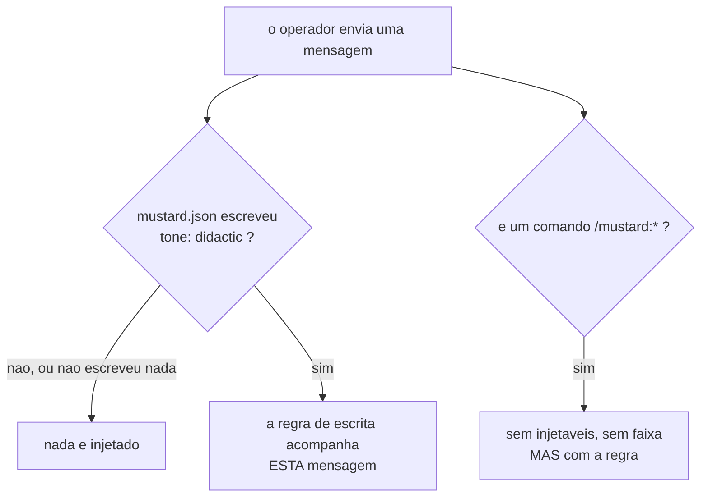

O tom que o projeto declara no `mustard.json` passa a chegar à conversa. O campo `tone` existia, significava exatamente isto, e era lido em **um lugar só** — o pedido enviado aos agentes que escrevem arquivos. Quem conversa com o operador não recebia nada, então escrever simples dependia de lembrança.

## Por quê

Este repositório declara `"tone": "didactic"` desde antes da sessão em que isto nasceu. Mesmo assim, duas vezes na mesma sessão o operador não entendeu explicações escritas com jargão não traduzido, siglas sem o nome por extenso e caminhos longos de raciocínio.

Ele apontou o certo: *"no mustard.json já é solicitado o tipo de interação, acredito que isso não é aplicado de forma correta"*. Estava mesmo — a configuração existia, o produto sabia dela, e ela não chegava até onde importava.

## O que mudou



**A cada mensagem, não uma vez por sessão.** Entregue uma vez, a regra se afasta a cada troca enquanto o que ela governa — a próxima resposta — é sempre o mais novo. Custo medido antes de ser aprovado: 126 tokens por mensagem, cerca de 0,04% de uma sessão longa, contra os mais de mil que um único mal-entendido custa em resposta errada, correção e reescrita.

## Como validar

```bash
git fetch origin fix/tom-configurado-nao-chega-conversa
git worktree add /tmp/rev origin/fix/tom-configurado-nao-chega-conversa
cd /tmp/rev && cargo test -p mustard-rt
```

O comportamento, com o gancho de verdade e um projeto de mentira:

```bash
cd /tmp/rev && cargo build -q
t=$(mktemp -d); echo '{"specLang":"pt-BR","tone":"didactic"}' > "$t/mustard.json"
echo "{\"session_id\":\"p\",\"cwd\":\"$t\",\"prompt\":\"oi\"}" \
  | ./target/debug/mustard-rt on UserPromptSubmit
```

Troque `didactic` por `technical`, ou apague a chave, e a saída fica vazia.

## Testes

Os três critérios foram provados **VERMELHOS antes do código existir** (`ac-negative-check`, cada um com controle verde ao lado) e verdes depois (`confirmation: taken=true, ok=true, unproven=[]`).

| # | o que garante | comando |
|---|---|---|
| AC-1 | mensagem comum carrega a regra | `cargo test -p mustard-rt the_writing_rule_rides_every_prompt` |
| AC-2 | quem não declarou não recebe nada — outro tom, chave ausente, ou nenhum `mustard.json` | `cargo test -p mustard-rt an_undeclared_tone_injects_nothing` |
| AC-3 | comando `/mustard:*` carrega a regra também | `cargo test -p mustard-rt the_writing_rule_rides_a_slash_command_too` |
| AC-4 | o workspace compila | `cargo build --workspace` |

**Os três passam pelo portão real, nunca pela função interna** — e isso é o achado central da revisão. A primeira versão testava só o ajudante privado; o revisor provou por mutação que, removendo a ligação, o teste continuava verde. Reescritos, e eu repeti a mesma mutação: agora ficam vermelhos.

Um quarto teste, `the_accented_spelling_counts_as_declared`, tranca um defeito real que a revisão encontrou — ver abaixo.

Suítes medidas: **mustard-rt 2159**, **mustard-core 674**, **mustard-cli 57**.

## Decisões que merecem explicação

**O campo é lido como foi ESCRITO, nunca resolvido.** O valor resolvido tem `didactic` por padrão. Lê-lo poria a regra diante de todo projeto que apenas tem um `mustard.json`, incluindo quem nunca pediu. Padrão é a ausência de escolha.

**A leitura usa o interpretador canônico, não uma comparação à mão.** Este foi um defeito real, provado em campo pela revisão: minha comparação aceitava `didactic` e `didatico`, mas não `didático` — a grafia que um operador brasileiro escreve, e que o interpretador do próprio produto aceita. Um projeto declarando a palavra na própria língua era lido como quem nunca declarou: exatamente o defeito que esta unidade remove, reintroduzido uma linha abaixo do conserto.

**Um comando `/mustard:*` recebe a regra, e é o único que recebe alguma coisa.** Esses comandos não recebem injetáveis nem faixa porque já conhecem o próprio contexto. A regra é de outra natureza: governa como a **resposta** é escrita, e quem lê é a mesma pessoa. Deixá-la de fora tiraria a regra justamente das mensagens que geram as explicações mais longas.

**Não entra no início da sessão.** Aquela ocasião já está em 8.594 de um teto de 10.000 caracteres — uma revisão anterior mediu 9.327 com este texto lá, folga menor que o próprio parágrafo. E a entrega por mensagem torna a de lá redundante.

## Fora de escopo

- **Deixar o texto editável no `mustard.json`.** `tone` é lista fechada de três palavras: o operador escolhe qual, não escreve o texto. Quem quiser palavras próprias já tem a lista `inject`, que aponta para um arquivo — sem código nenhum.
- **Regras para `technical` e `concise`.** Esta unidade atende o tom que foi declarado e que falhou.
- **O renderizador de pedido de agente**, que continua lendo `tone` como sempre leu.

## Ainda em aberto

- O `hook_output` sobrescreve o texto injetado quando também há avisos. Inofensivo hoje — nenhum módulo desta ocasião emite avisos — mas a regra agora viaja em toda mensagem, então esse ponto ganhou uma vítima nova se algum dia emitir.
- A Evidência da spec diz que `tone` é lido em um lugar só; há um segundo leitor (`amend_window_inject`), que usa o valor resolvido. Pré-existente, fora do escopo desta unidade.
