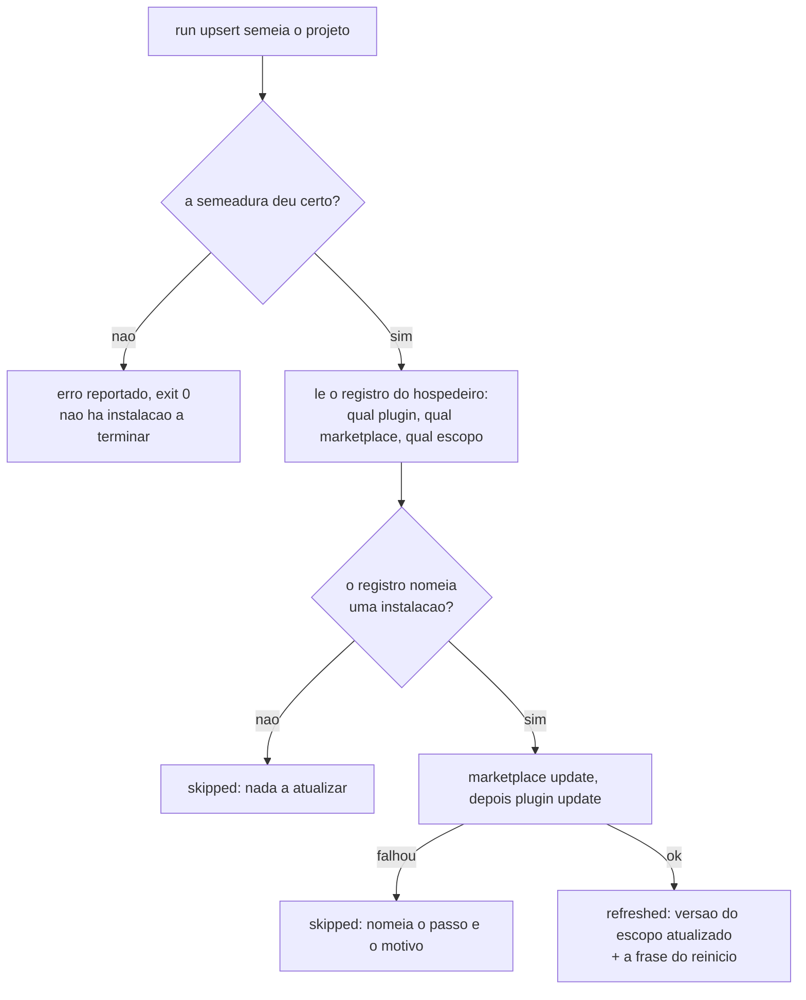

A instalação passa a terminar a si mesma. O `upsert` atualiza o plugin sozinho — os dois comandos que o operador digitava à mão no menu de plugins — e diz, em uma frase, a única metade que ninguém de dentro da sessão consegue fazer: aplicar exige reiniciar.

## Por quê

O fim da instalação entregava duas tarefas. O `init` dizia, literalmente: *digite `/plugin marketplace add` e `/plugin install` dentro do Claude Code, depois recarregue*. Na atualização era a mesma coisa por outro caminho — foi assim que isto nasceu: *"sempre depois preciso ir em plugins e recarregar"*.

**As duas metades não são iguais, e tratá-las como uma só é o defeito.**

**Atualizar é automatizável.** O hospedeiro publica `claude plugin marketplace update <marketplace>` e `claude plugin update <plugin>`. Medido: `claude plugin list` roda de dentro de uma sessão, sem interação, exit 0.

**Aplicar não é.** `claude plugin update --help` declara `(restart required to apply)`. Uma sessão carrega o plugin no início e o segura até terminar, porque quem carrega é o hospedeiro.

O `upsert` não fazia **nem uma coisa nem outra**: não atualizava, e não avisava. A deriva era real no momento em que isto foi escrito — registro em `0.1.42`, `main` já publicando `0.1.43`.

## O que mudou



Cada caminho sai com código 0: o assunto deste comando é a instalação do **projeto**, que não depende do estado do plugin.

## Como validar

Em diretório descartável, sem tocar na sua instalação:

```bash
git fetch origin fix/upsert-nao-termina-propria-instalacao
git worktree add /tmp/rev origin/fix/upsert-nao-termina-propria-instalacao
cd /tmp/rev && cargo test -p mustard-core -p mustard-cli -p mustard-rt
```

O comportamento, com um `claude` falso e um diretório de configuração de mentira — assim nada na sua máquina é alterado:

```bash
export CLAUDE_CONFIG_DIR=$(mktemp -d) MUSTARD_CLAUDE_BIN=/nao/existe
cd /tmp/rev && ./target/debug/mustard-rt run upsert | tail -8
```

## Testes

AC-1 e AC-2 foram provados **VERMELHOS antes do código existir** (`ac-negative-check`, cada um com um comando de controle verde ao lado) e verdes depois (`confirmation: taken=true, ok=true, unproven=[]`).

| # | o que garante | comando |
|---|---|---|
| AC-1 | refresh bem-sucedido nomeia a versão **e** a frase do reinício | `cargo test -p mustard-rt a_successful_refresh_names_the_version_and_the_restart` |
| AC-2 | sem o CLI do hospedeiro, o upsert continua bem-sucedido e diz por que pulou | `cargo test -p mustard-rt an_unavailable_cli_degrades_to_a_reported_skip` |
| AC-3 | o workspace compila | `cargo build --workspace` |

Seis testes fora dos critérios, cada um travando algo que a revisão encontrou: id vindo do registro com forma estranha é recusado em vez de executado; a versão reportada é a do escopo atualizado; caminho absoluto entre aspas, colado a parêntese ou a `=`, é encurtado; caminho relativo fica intacto; e o relatório é byte-idêntico em duas execuções seguidas.

Suítes medidas: **mustard-core 674**, **mustard-rt 2165**, **mustard-cli 57**. `cargo build --workspace` sai 0 com 4 avisos pré-existentes, nenhum em arquivo tocado.

## Decisões que merecem explicação

**O alvo é lido, nunca presumido.** O par `plugin@marketplace` e o escopo saem do registro do hospedeiro. Um nome fixo no código atualizaria a instalação errada, ou nenhuma. Registro que não lista instalação vira um `skipped` nomeado — o limite de "não instalar o que não existe".

**Valor vindo do registro é validado antes de virar comando.** Chave com caractere fora de `[A-Za-z0-9._@-]` é recusada e reportada, nunca executada.

**`--yes` aceita algo em nome do operador, e isso está dito.** Sem a marca o passo falha sempre — a saída aqui é um cano, não um terminal. O que ela aceita: um marketplace pode declarar um comando de instalação próprio. A confiança já foi dada antes (o operador escolheu esse marketplace, instalou esse plugin dele, e o alvo vem do registro **dele**), e o marketplace deste projeto não declara comando nenhum — verificado.

**A versão reportada é a do escopo atualizado.** A maior entre todos os escopos seria verdade sobre a máquina e mentira sobre o que acabou de acontecer.

**45 segundos por passo, não 120.** São dois passos dentro de uma chamada cujo tempo o hospedeiro limita; se o par estourasse esse limite, a porta seria morta de fora e nada reportaria. O prazo do próprio módulo é o único que consegue produzir um `skipped` que alguém lê.

**Os testes fixam o diretório de configuração.** Sem isso, rodar a suíte atualizaria a instalação real da máquina — passando verde enquanto muta o ambiente de quem roda.

## Fora de escopo

- **Automatizar o recarregamento.** O hospedeiro exige reinício; nenhum plugin reinicia o hospedeiro. Prometer isso seria pior que o estado anterior.
- **A primeira instalação pelo terminal** (`mustard init`). Ali o plugin pode nem existir e o marketplace pode não estar adicionado — outro fluxo, outras recusas.

## Ainda em aberto

- **O ajuste de tom saiu desta unidade e vira unidade própria.** Foi pedido aqui, implementado e movido por decisão do operador, registrada em `change-log.md` (08:26Z) e explicada em `spec.md`. O motivo é do produto: a prova negativa é tudo-ou-nada, os três critérios desta unidade já estavam verdes, e sem critério a unidade passaria com o recurso apagado. A unidade própria nasce com critérios provados antes e já com a entrega a cada mensagem.
- `mustard init` continua entregando os passos manuais da PRIMEIRA instalação. O mecanismo agora existe; estendê-lo é outra unidade.
