# Mustard — Comandos e Fluxos

Referência visual de **cada comando do Mustard** e seu fluxo de execução.
Os diagramas usam [Mermaid](https://mermaid.js.org/) — renderizam direto no GitHub, no VS Code (com extensão Mermaid) e no dashboard.

> **Convenções dos diagramas**
> - **AI** = passo de raciocínio que o orquestrador (Claude) faz.
> - **rust** = trabalho determinístico delegado ao binário `mustard-rt` (sem AI).
> - **Task** = subagente despachado em contexto isolado.
> - **gate** = portão bloqueante (só passa se a condição for satisfeita).
> - Termos técnicos (nomes de comandos, fases, eventos, arquivos) ficam no original.

---

## Mapa do ecossistema

Como os comandos se encaixam. O eixo central é o **pipeline orientado a especificação** (SDD): tudo nasce de uma varredura determinística (`/scan`) e converge para o fechamento auditável (`/close`).

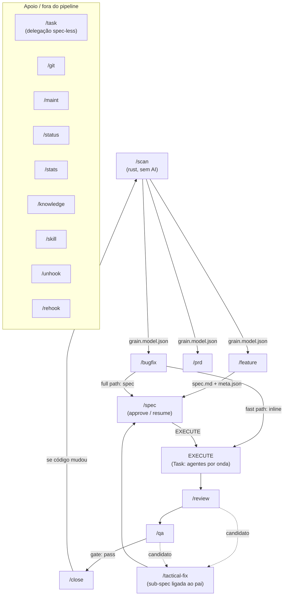

**Princípio central:** o código-fonte **nunca é lido em massa**. O `/scan` minera o repositório uma vez para `grain.model.json`; os comandos de pipeline consomem esse modelo via *digest* (`mustard-rt run feature`, `scan spec`) e leem apenas as ~12 *anchors* (arquivos-âncora) que o digest aponta. É assim que o Mustard economiza contexto.

---

## Pipeline canônico

Vocabulário único de fases (fonte: `refs/canonical-phases.md`):

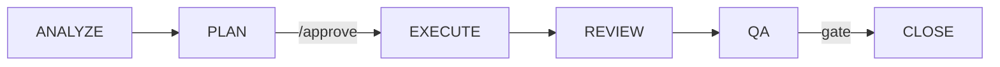

- **Light scope** (1-2 camadas, ≤5 arquivos, padrão conhecido): pula o **PLAN** → `ANALYZE → EXECUTE → REVIEW → QA → CLOSE`.
- **Full scope** (3+ camadas, entidade nova): pipeline completo com aprovação humana entre PLAN e EXECUTE.

---

# Comandos do pipeline (core)

## `/scan` — Modelo do código-base

Minera o repositório para `grain.model.json` (determinístico, agnóstico de linguagem, **sem AI**). É o produto durável que `/feature` e `/bugfix` consomem.

| | |
|---|---|
| **Trigger** | `/scan`, `/scan --root <dir>`, `/scan --out <path>` |
| **Backend** | `mustard-rt run scan` |
| **Produz** | `.claude/grain.model.json` |
| **Regra** | Não escreve nada nos subprojetos; não gera skills/agentes; sem confirmação (o próprio `/scan` é a aprovação) |

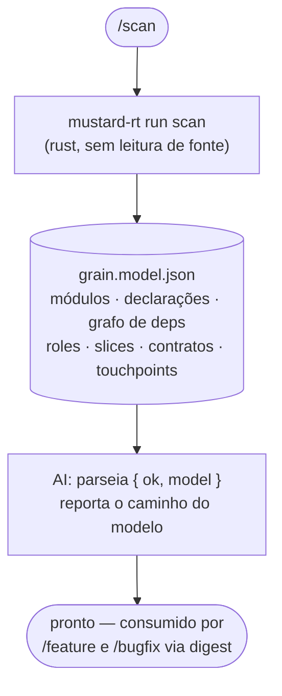

---

## `/feature` — Pipeline de feature

Entende o cliente, pesquisa o repositório via *digest* do scan (nunca lendo fonte à mão), planeja e implementa. É o pipeline mais completo.

| | |
|---|---|
| **Trigger** | `/feature <request>` |
| **Fases** | `ANALYZE → DECOMPOSE → PLAN → (/approve) → EXECUTE → REVIEW → QA → CLOSE` |
| **Escopo** | light / extended-light / full (auto-detectado) |
| **Materializa** | `.claude/spec/{slug}/spec.md` + `meta.json` (apenas via `spec-draft`) |

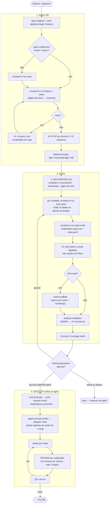

---

## `/bugfix` — Pipeline de correção

Diagnóstico + correção autônomos, sem troca de contexto. **Consome** o scan (não roda varredura interativa).

| | |
|---|---|
| **Trigger** | `/bugfix <error-description>` |
| **Caminhos** | Fast Path (1-2 arquivos, causa clara, pula PLAN) · Full Path (3+ arquivos, spec enxuta) |
| **Usa o scan** | Entrada (consome `grain.model.json` via digest) e saída (re-scan se o código mudou) |

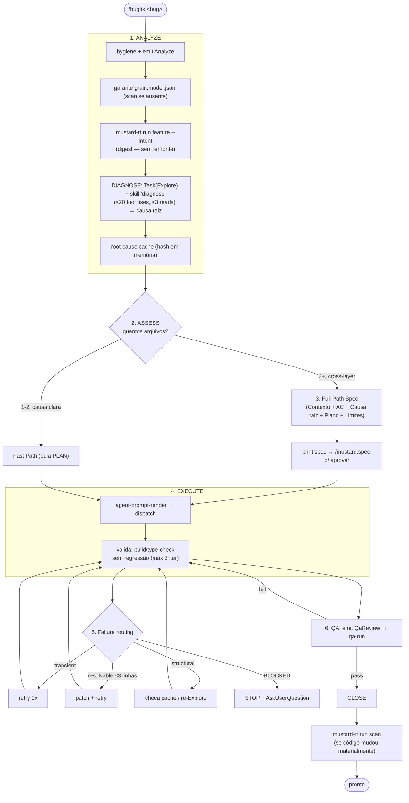

---

## `/spec` — Seletor unificado de specs

Substitui `/approve` (PLAN) e `/resume` (EXEC). Um único *picker*: a letra aprova (PLAN) ou continua (EXEC); letra + `r` aprova e executa inline na mesma sessão.

| | |
|---|---|
| **Trigger** | `/mustard:spec [letra[r]]` |
| **Backend** | `active-specs` (render) · `resume-bootstrap` (rota) · `wave-advance` (despacho renderizado) |
| **Regra** | A ordem das ondas é decidida pelo Rust (`wave-advance`), nunca pela AI |

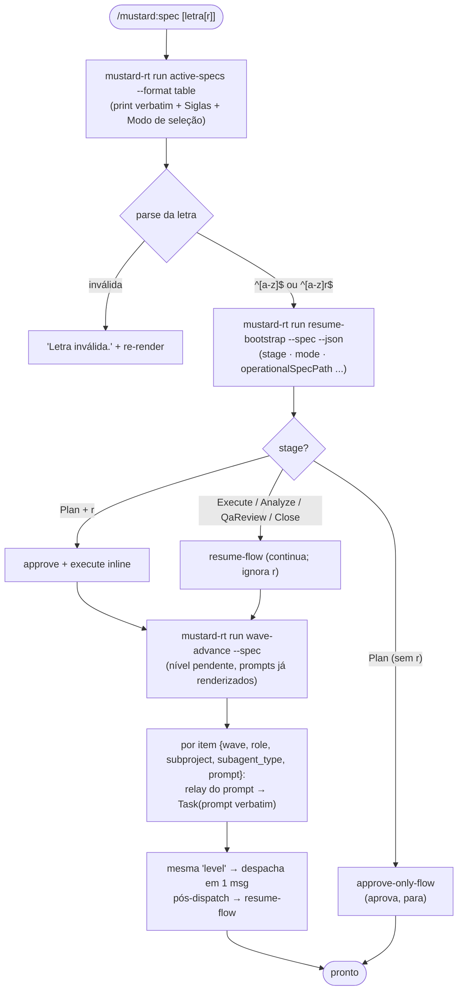

---

## `/qa` — Fase de QA (Wave 10)

Roda cada Critério de Aceitação (AC) e reporta pass/fail. **Bloqueia o CLOSE** em caso de falha. Read-only — nunca modifica código.

| | |
|---|---|
| **Trigger** | `/mustard:qa [--spec <name>]` |
| **Backend** | `qa-run` (emite `qa.result`) · `tactical-fix-detect` |
| **Gate** | `close-gate` exige `qa.result.overall=pass` (`MUSTARD_QA_GATE_MODE=strict\|warn\|off`) |

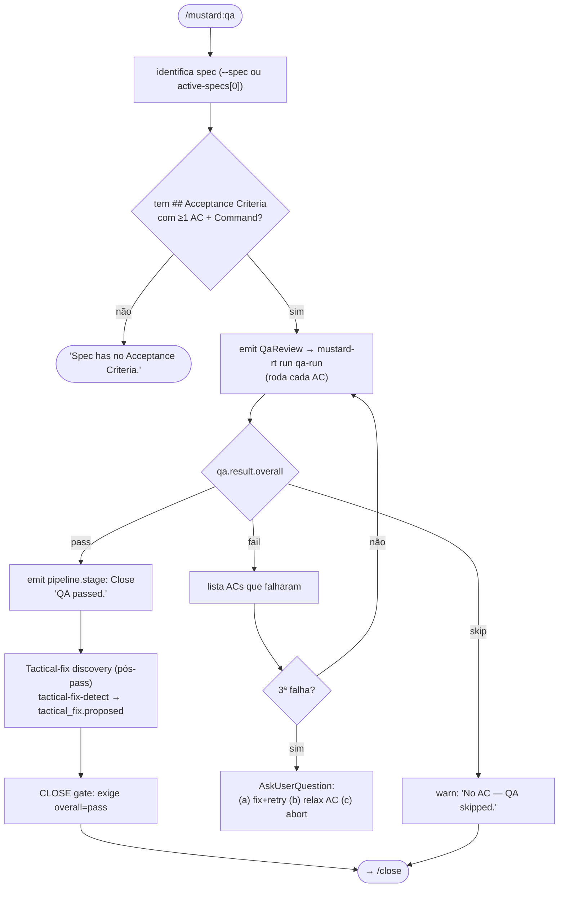

---

## `/close` — Finalizar pipeline

Verifica build/review/QA, arquiva a spec (semântico, sem mover diretório) e emite o banner de conclusão. A finalização é **automática e determinística**.

| | |
|---|---|
| **Trigger** | `/close` |
| **Backend** | `close-orchestrate` (1 relatório JSON; encadeia `complete-spec` em processo) |
| **Gates** | build+tests · QA · review-spans · docs audit · checklist/concerns |
| **Regra** | Nunca chamar `complete-spec` à mão; nunca mover o diretório da spec |

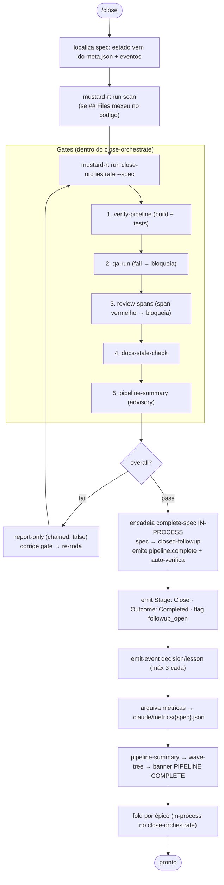

---

## `/tactical-fix` — Sub-spec para correção tática

Cria uma sub-spec ligada a um pai quando REVIEW ou QA descobre um ajuste adjacente pequeno. Preserva a pureza SDD: o pai fica congelado após o approve.

| | |
|---|---|
| **Trigger** | `/mustard:tactical-fix <parent> "<descrição>" [--scope touch\|light\|full]` |
| **Backend** | `tactical-fix-create` (slug, dir, spec.md narrativo, meta.json, evento `spec.link`) |
| **Qualifica** | ≤100 LOC · sem mudança de contrato público · sem decisão de design pendente · sem nova dependência |

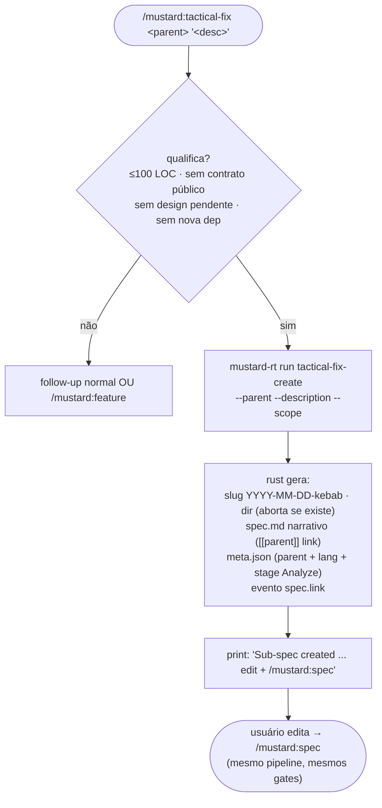

---

# Comandos de delegação / revisão

## `/task` — Execução delegada (spec-less)

Delega cada ação em contexto Task isolado (L0 Universal Delegation). Sem spec, sem gates de higiene — modo vibe/prototype.

| Ação | Agente | Modelo | Descrição |
|---|---|---|---|
| `analyze` | Explore | sonnet | Exploração / análise de padrões |
| `audit` | general-purpose | sonnet | Auditoria de qualidade com checklist |
| `compare` | explorers paralelos → Plan | sonnet | Alinhamento entre subprojetos |
| `review` | general-purpose | opus | SOLID / segurança / performance |
| `docs` | general-purpose | sonnet | Geração de documentação |
| `refactor` | Plan → general-purpose | sonnet/opus | Plano + approve + implementa |
| `implement` | general-purpose | sonnet | Despacho único com slices inline |

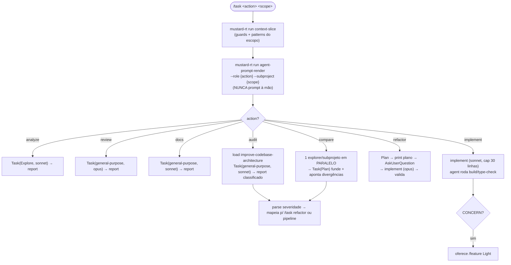

---

## `/review` — Revisão de Pull Request

Detecta o PR, invoca a revisão e reporta. ZERO confirmações.

| | |
|---|---|
| **Trigger** | `/review [pr-number-or-url]` |
| **Backend** | `review-prefetch` · `diff-context` · skill `code-review` (fallback Task opus) |
| **Provider** | `mustard.json#git.provider` (github/gitlab) |

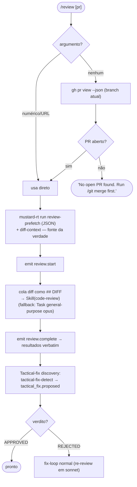

---

# Comandos de git e manutenção

## `/git` — Operações de git

Lê `mustard.json` para o fluxo de branches. Apenas operações **reversíveis** — nunca reescreve histórico ou apaga arquivos.

| Ação | Descrição |
|---|---|
| `sync` | Puxa a branch-pai para a atual (rebase) |
| `commit` | Cria commit (sem push); aceita `--scope=all\|staged\|<pattern>` |
| `push` | Sync, depois commit + push |
| `merge` | Sync + fast-forward para a pai (sempre até `dev`) |
| `merge main` | Cascata: branch → dev → main → volta à branch |

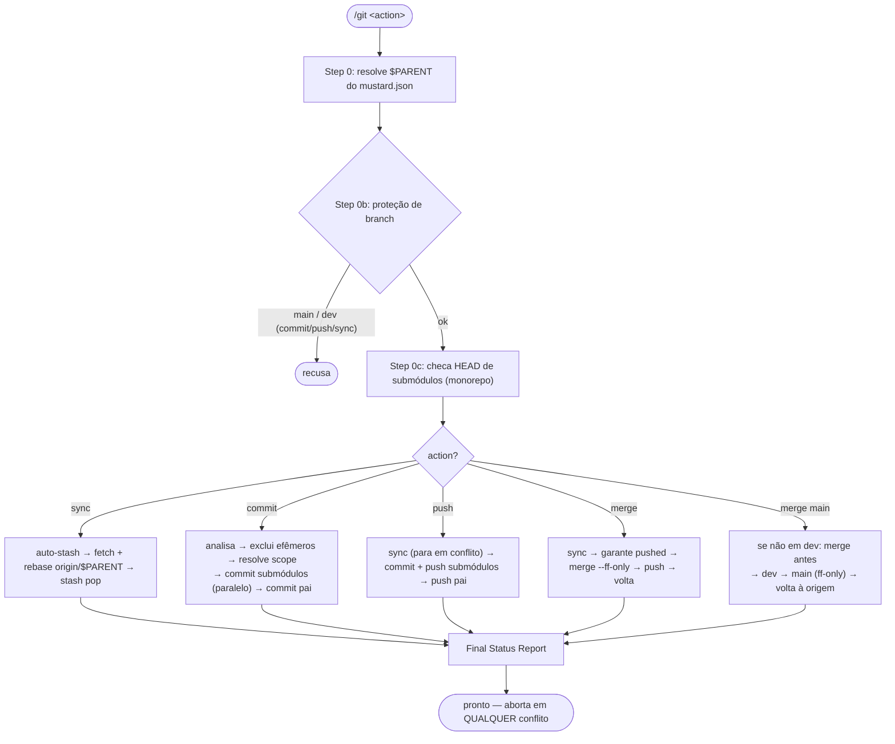

---

## `/maint` — Utilitários de manutenção

| Ação | Descrição |
|---|---|
| `deps` | Instala dependências de todos os subprojetos |
| `validate` | Build + type-check entre subprojetos |
| `sync` | `mustard-rt run scan` — refresca o `grain.model.json` |
| `doctor` | Health check da instalação (wiring, drift, state + OTEL) |

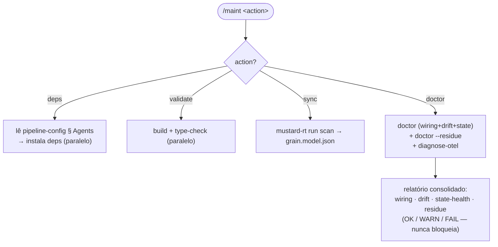

---

## `/status` — Status consolidado

| | |
|---|---|
| **Trigger** | `/status [--harness]` |
| **Backend** | `mustard-rt run status --format table` |
| **Regra** | Sempre delega ao binário; `--harness` é estritamente read-only |

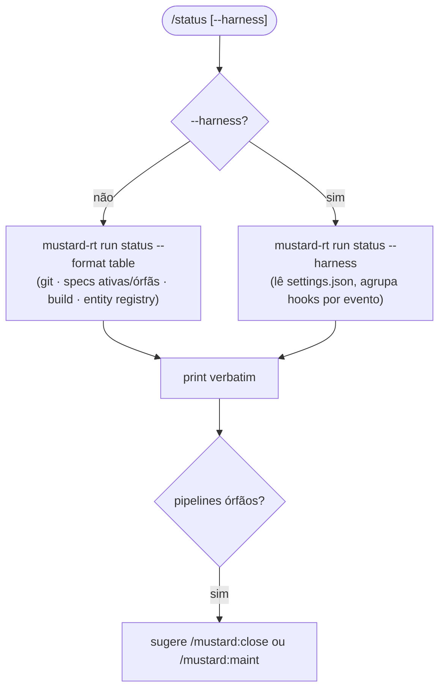

---

## `/stats` — Métricas do pipeline

| | |
|---|---|
| **Trigger** | `/stats [--hooks] [--since] [--event] [--compare] [--pr] [--days]` |
| **Backend** | `metrics collect` (default) · `metrics report` (--hooks) · `event-projections --view pr-metrics` (--pr) |

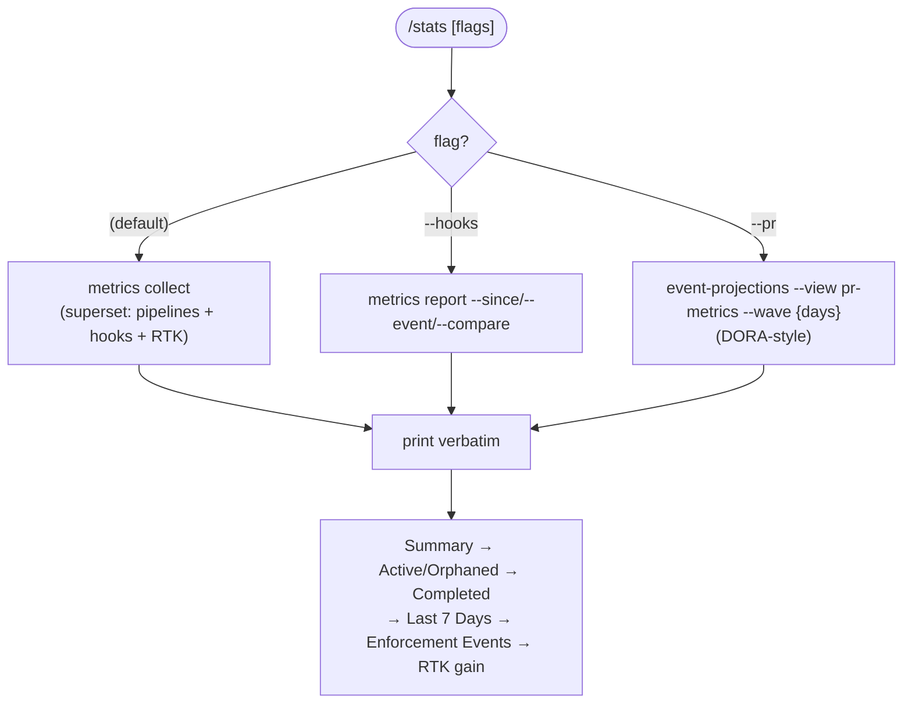

---

## `/knowledge` — Gestão de conhecimento

Conhecimento = memória nativa do Claude Code (prosa durável) + eventos `decision`/`lesson` no NDJSON por spec (emitidos no CLOSE via `emit-event`).

| Ação | Backend / propósito |
|---|---|
| `list [spec]` | `event-projections --view pipeline-state` — decisions[]/lessons[] da spec |
| `search <term>` | MCP `search_knowledge` — match em title/detail dos eventos |
| `add` | interativo → `emit-event --event decision`/`lesson` |
| `notes [target]` | edita `notes.md` (nunca sobrescrito por `/scan`) |
| `audit` | compara memória nativa vs CLAUDE.md/skills (report-only) |
| `report <period>` | relatórios de progresso via git |

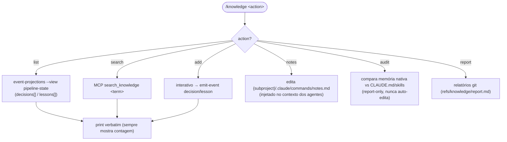

---

# Skills

## `/skill` — Gerenciador de skills

| Ação | Backend |
|---|---|
| `install <name>` | manual — cópia para `.claude/skills/<name>/` (sem fetch embutido) |
| `create <name>` | skill `skill-creator` (interativo) |
| `list` | listagem manual de `.claude/skills/` (sem comando dedicado) |
| `remove <name>` | apaga `.claude/skills/{name}/` (avisa se `source: scan`) |
| `optimize / eval` | loops do `skill-creator` (requer Python 3 + `claude` CLI) |
| `update skill-creator` | sparse-clone `anthropics/skills` |

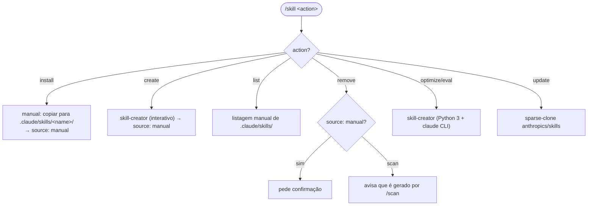

---

# Harness (liga/desliga dos hooks)

## `/unhook` — Kill-switch do harness

Desabilita os hooks renomeando `settings.json` para `settings.json.disabled-<timestamp>` e limpa estado volátil. Reversível via `/rehook`.

| Scope | O que toca |
|---|---|
| `this` | só `<repo>/.claude/settings.json` (default) |
| `monorepo` | `<repo>/.claude/` + todos `apps/*` e `packages/*` |
| `all` | monorepo + `~/.claude/settings.json` global (requer `--confirm`) |

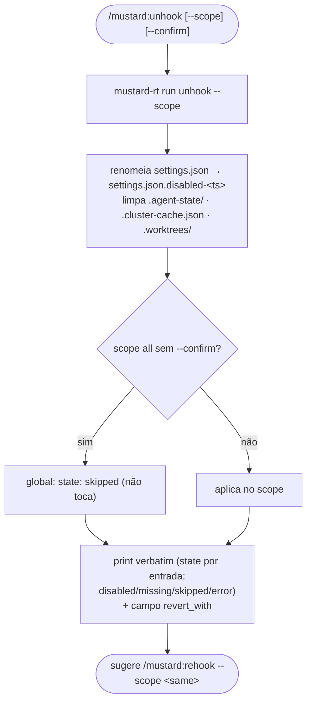

---

## `/rehook` — Restaurar o harness

Reverte o `/unhook`: acha o snapshot `settings.json.disabled*` mais recente em cada `.claude/` do escopo e renomeia de volta.

| | |
|---|---|
| **Trigger** | `/mustard:rehook [--scope this\|monorepo\|all] [--confirm]` |
| **Backend** | `mustard-rt run rehook --scope` |
| **States** | restored · already-active · no-snapshot · missing · skipped · error |

---

## Tabela-resumo de todos os comandos

| Comando | Categoria | Backend principal (`mustard-rt run …`) | Usa `grain.model.json`? |
|---|---|---|---|
| `/scan` | core | `scan` | **produz** |
| `/feature` | core | `feature`, `scan spec`, `spec-draft`, `wave-scaffold` | consome (digest) |
| `/bugfix` | core | `feature`, `qa-run`, `scan` | consome (digest) + refresca |
| `/spec` | core | `active-specs`, `resume-bootstrap`, `wave-advance` | indireto |
| `/qa` | core | `qa-run`, `tactical-fix-detect` | não |
| `/close` | core | `close-orchestrate` (+ `scan`) | refresca se mudou |
| `/tactical-fix` | core | `tactical-fix-create` | não |
| `/task` | delegação | `context-slice`, `agent-prompt-render` | indireto |
| `/review` | revisão | `review-prefetch`, `diff-context` | não |
| `/git` | git | (git nativo via `rtk`) | não |
| `/maint` | manutenção | `scan`, `doctor`, `diagnose-otel` | refresca (sync) |
| `/status` | observabilidade | `status` | não |
| `/stats` | observabilidade | `metrics collect/report`, `event-projections` | não |
| `/knowledge` | conhecimento | `memory list/search/knowledge` | não |
| `/skill` | skills | manual (copiar para `.claude/skills/`; sem backend `run`) | não |
| `/unhook` | harness | `unhook` | não |
| `/rehook` | harness | `rehook` | não |

---

*Gerado a partir dos comandos do plugin em `plugin/commands/`. Quando um fluxo mudar, re-derive deste diretório — ele é a fonte da verdade.*
