# Mustard — Comandos e Fluxos

Referência visual de **cada comando do Mustard** e seu fluxo de execução.
Os diagramas usam [Mermaid](https://mermaid.js.org/) — renderizam direto no GitHub, no VS Code (com extensão Mermaid) e no dashboard.

> **Convenções dos diagramas**
> - **AI** = passo de raciocínio que o orquestrador (Claude) faz.
> - **rust** = trabalho determinístico delegado ao binário `mustard-rt` (sem AI).
> - **Task** = subagente despachado em contexto isolado.
> - **gate** = portão bloqueante (só passa se a condição for satisfeita).
> - Termos técnicos (nomes de comandos, fases, eventos, arquivos) ficam no original.

Instalado como plugin do Claude Code, todo comando vive no namespace **`/mustard:`**. A entrada do dia a dia é a **porta única** (`/mustard`, ou simplesmente descrever o pedido em linguagem natural).

> **Fluxos internos:** `feature`, `bugfix`, `task` e `tactical-fix` são despachados pelo **roteador** (a porta única) — você descreve o que quer e ele escolhe o fluxo. Invocá-los direto (`/mustard:feature …`) continua valendo como atalho de força; não é necessário no dia a dia.

---

## Mapa do ecossistema

Como os comandos se encaixam. Tudo entra pela **porta única**, nasce de uma varredura determinística (`/mustard:scan`) e converge para o fechamento auditável (`/mustard:close`).

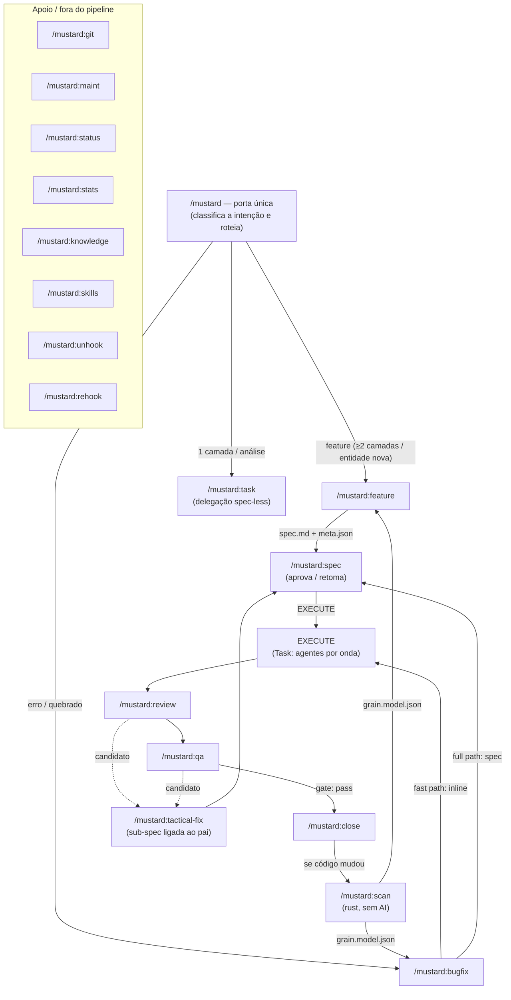

**Princípio central:** o código-fonte **nunca é lido em massa**. O `/mustard:scan` minera o repositório uma vez para `grain.model.json`; os fluxos de pipeline consomem esse modelo via *digest* (`mustard-rt run feature`) e leem apenas as *anchors* (arquivos-âncora) que o digest aponta. É assim que o Mustard economiza contexto.

---

## Pipeline canônico

Vocabulário único de fases (fonte: `plugin/refs/canonical-phases.md`):

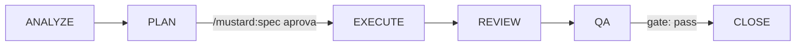

Sequência canônica: `ANALYZE → PLAN → EXECUTE → REVIEW → QA → CLOSE` (+ `COORDINATE` para roadmaps com specs-filhas).

| Escopo | Orientação | Fluxo |
|---|---|---|
| **Light** | 1-2 camadas, ≤5 arquivos, espelha um *slice* existente | Pula o PLAN: `ANALYZE → EXECUTE → REVIEW → QA → CLOSE` |
| **Extended-light** | *slice* casado + modifica existente, 6-8 arquivos | Igual ao Light (execução inline) |
| **Full** | 3+ camadas, entidade nova, ≥2 slices ou >8 arquivos | Completo, com **clarify + aprovação humana** entre PLAN e EXECUTE (via `/mustard:spec`) |

O escopo é decidido **deterministicamente** (`plan-prepare` sobre o censo da spec), nunca só pelo olho da AI. Cada fase emite eventos; os *gates* bloqueiam o avanço. O **close-gate** não deixa fechar sem `qa.result.overall=pass`; editar a spec depois de um QA aprovado marca o pass como *stale* e re-bloqueia até o QA rodar de novo.

---

# A porta única

## `/mustard` — Roteamento por intenção

Descreva o que quer em linguagem natural — o roteador classifica (funcionalidade / mudança / correção / investigação + escopo), **narra como leu o pedido** e despacha o fluxo interno certo. Só pergunta em ambiguidade genuína.

| | |
|---|---|
| **Trigger** | `/mustard` — ou simplesmente descreva o trabalho ("adiciona importação de CSV", "tá com erro ao importar") |
| **Backend** | nenhum — roteia via `CLAUDE.md § Intent Routing` |
| **Regra** | Nunca edita produção sem rotear; `/mustard:feature`, `/mustard:bugfix`, `/mustard:task`, `/mustard:tactical-fix` seguem disponíveis como atalhos de força |

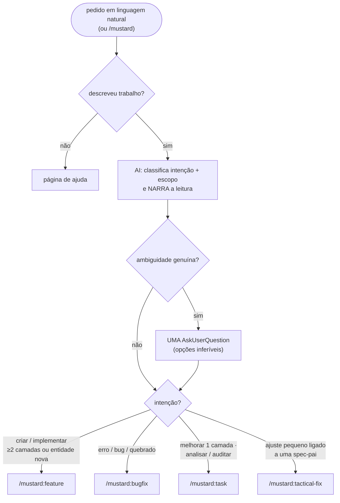

---

# Comandos do pipeline (core)

## `/mustard:scan` — Modelo do código-base

Minera o repositório para `grain.model.json` (determinístico, agnóstico de linguagem, **sem AI**) e enriquece os mapas por subprojeto — Guards (prosa do/don't) e moldes de padrão. O enriquecimento é **padrão**: roda em silêncio ou pula em silêncio (fail-open), **nunca** pede confirmação de custo.

| | |
|---|---|
| **Trigger** | `/mustard:scan [--root <dir>] [--out <path>]` |
| **Backend** | `scan --full` · `scan-guards-list/apply` · `scan-patterns-sweep/list/apply/decline` · `agent-prompt-render --role guards` |
| **Produz** | `.claude/grain.model.json` · `.claude/scan-map.md` por unidade (+ a linha `@.claude/scan-map.md` no topo do `CLAUDE.md` do projeto) · blocos `## Guards` · moldes `{role}-pattern/SKILL.md` frescos |
| **Regra** | O passo determinístico nunca lê fonte; a AI do enriquecimento escreve SÓ Guards (~6 linhas) e moldes — todo molde `source: scan` é varrido e re-autorado do zero a cada scan (adoção = `source: manual`); recusa vale UMA rodada |

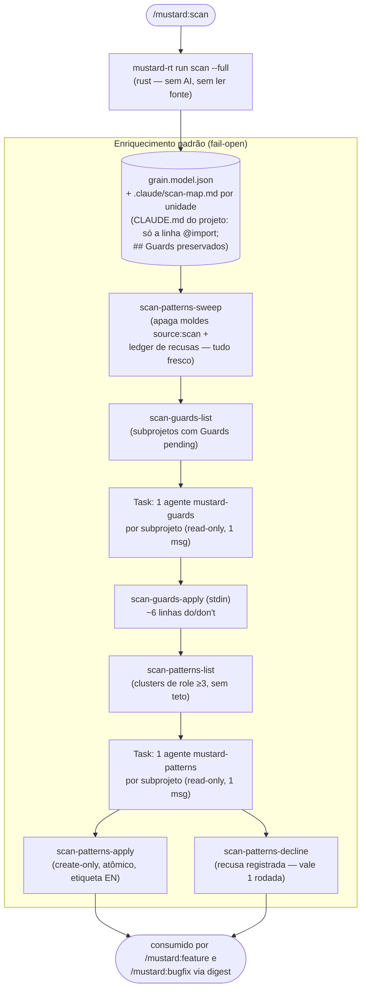

> Um Guard pode abrir com `[critical]` na forma checável `never <proibido> in <glob>` — vira gate de edição (`MUSTARD_GUARD_GATE_MODE=strict|warn`, default `warn`). Guards sem marca são consultivos.

---

## `/mustard:feature` — Pipeline de feature *(fluxo interno)*

Entende o pedido, pesquisa o repositório via *digest* do scan (nunca lendo fonte à mão), roteia o escopo deterministicamente e implementa. Este fluxo é o caminho Light + ANALYZE compartilhado; a maquinaria de PLAN do escopo Full vive em `refs/feature/full-plan.md`.

| | |
|---|---|
| **Despacho** | pelo roteador; atalho: `/mustard:feature <request>` |
| **Fases** | `ANALYZE → (rota/escopo) → PLAN (só Full) → EXECUTE → REVIEW → QA → CLOSE` |
| **Backend** | `feature` (digest) · `spec-draft` · `plan-prepare` · `analyze-validation` · `emit-pipeline`/`emit-phase` · `exec-rewave-check` · `dependency-precheck` · `agent-prompt-render` · `qa-run` |
| **Lei** | Nenhum código antes da spec aprovada (o hook `scope_guard` recusa de qualquer forma); Full para no PLAN — só `/mustard:spec` destrava o EXECUTE |

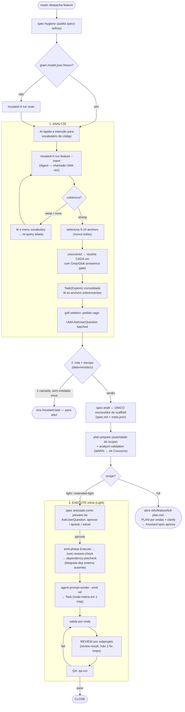

> Digest com ≥2 `concerns` → cada concern vira sua própria unidade, com suas próprias anchors (no Full: uma onda; no light/task: um despacho). Ponte de vocabulário confirmada → `equivalence-learn` persiste o aprendizado (sobrevive a re-scans).

---

## `/mustard:bugfix` — Pipeline de correção *(fluxo interno)*

Diagnóstico + correção autônomos. Lei de ferro: **nenhum fix antes de localizar e reproduzir a causa**. A triagem decide a localização: sintoma com token literal → `grep` direto; só conceito → digest.

| | |
|---|---|
| **Despacho** | pelo roteador; atalho: `/mustard:bugfix <descrição-do-erro>` |
| **Caminhos** | Fast Path (1-2 arquivos, causa clara, pula PLAN) · Full Path (3+ arquivos, spec enxuta) · **Promote** → vira `/mustard:feature` se o escopo real for de feature |
| **Backend** | `feature` (digest, só conceito) · `agent-prompt-render` · `digest-adherence-finalize` · `qa-run` · `scan` (pós-CLOSE) |

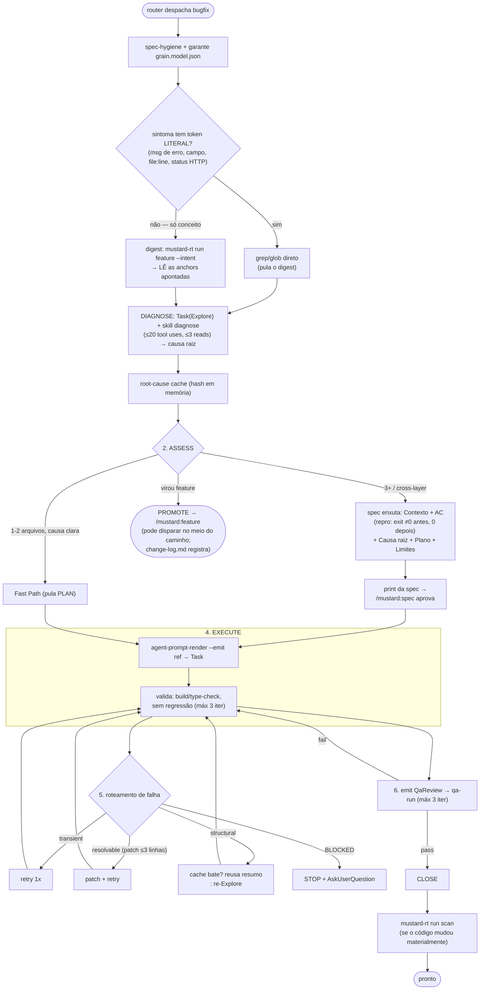

---

## `/mustard:spec` — Seletor unificado de specs

Substituiu `/approve` (PLAN) e `/resume` (EXEC). Um único *picker*: letra age na linha; letra + `r` aprova **e** executa inline; um **nome de spec** vai direto (modo focado, sem tabela).

| | |
|---|---|
| **Trigger** | `/mustard:spec [alvo]` — vazio (tabela) · `a`-`z` · `<letra>r` · nome da spec |
| **Backend** | `active-specs --format table` (só picker/letra) · `resume-bootstrap --spec --json` · downstream: `approve-spec`, `wave-advance`, `wave-tree` |
| **Regra** | Ordem das ondas e prompts decididos pelo Rust (`wave-advance`) — a AI só faz o *relay*; nome de spec NUNCA passa pela tabela |

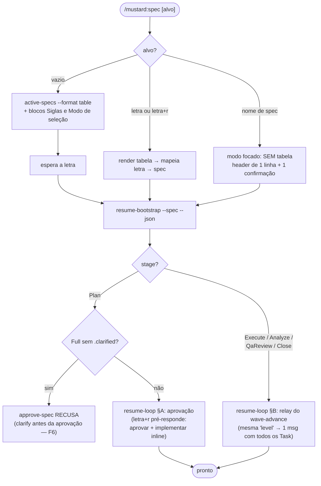

> Casos de borda: 0 specs → "Nenhuma spec ativa."; >26 → 26 primeiras + contagem; nome desconhecido → erro + tabela como fallback.

---

## `/mustard:qa` — Fase de QA

Roda cada Critério de Aceitação (AC) e reporta pass/fail. **Bloqueia o CLOSE** em falha. Read-only — um pass é um *exit code observado*, nunca uma inferência.

| | |
|---|---|
| **Trigger** | `/mustard:qa [--spec <name>]` |
| **Backend** | `qa-run` (emite `qa.result`) · `tactical-fix-detect` |
| **Gate** | `close-gate` exige `qa.result.overall=pass` (`MUSTARD_QA_GATE_MODE=strict\|warn\|off`); editar a spec após um pass → QA **stale** |

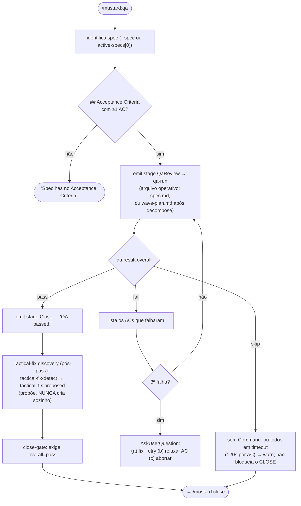

---

## `/mustard:close` — Finalizar pipeline

Roda todos os gates num comando só e, se tudo passa, **finaliza em-processo automaticamente** — a spec vira `completed` sem janela de carência; follow-up vai numa sub-spec ligada (`/mustard:tactical-fix`), nunca numa flag desta spec.

| | |
|---|---|
| **Trigger** | `/mustard:close` (gate de docs aceita `--skip-docs` para spec não-arquitetural) |
| **Backend** | `close-orchestrate --spec` (encadeia a finalização em-processo) · `scan` condicional · `emit-event` (decision/lesson) |
| **Pré-condição** | `BLOCKED` aberto ou item `- [ ]` no Checklist → ABORTA antes de qualquer gate |
| **Regra** | NUNCA chamar `complete-spec` à mão, NUNCA emitir `pipeline.stage`/`outcome` à mão, NUNCA mover o diretório da spec (arquivamento é só evento) |

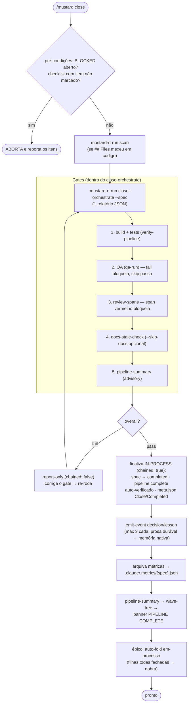

> Cancelamento: emite `pipeline.stage: Close` + `pipeline.outcome: Cancelled` — também sem mover nada no filesystem.

---

## `/mustard:tactical-fix` — Sub-spec para correção tática *(fluxo interno)*

Cria uma sub-spec ligada a um pai quando REVIEW ou QA descobre um ajuste adjacente pequeno. Preserva a pureza SDD: o pai fica congelado após o approve; o vínculo é unidirecional (filha → pai).

| | |
|---|---|
| **Despacho** | pelo roteador; atalho: `/mustard:tactical-fix <parent> "<descrição>" [--scope touch\|light\|full]` (default `light` ≤100 LOC; `touch` ≤30 LOC) |
| **Backend** | `tactical-fix-create --parent --description --scope` |
| **Qualifica** | ≤100 LOC · sem mudança de contrato público · sem decisão de design pendente · sem nova dependência |

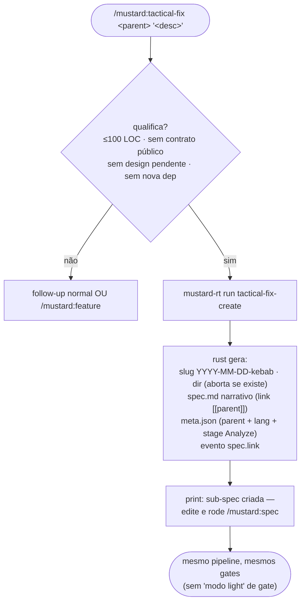

> Fail-open na existência do pai: a sub-spec é criada mesmo se `<parent>` não existir (só a navegação do dashboard degrada). Nunca auto-aprova — o usuário revisa a semente e roda `/mustard:spec`.

---

# Delegação e revisão

## `/mustard:task` — Execução delegada (spec-less) *(fluxo interno)*

Delega cada ação em contexto Task isolado. Lei de ferro: **UMA camada** — no momento em que crescer para duas, é `/mustard:feature`. O orquestrador nunca lê fonte nem implementa; localiza primeiro, despacha depois.

| Ação | `--role` | `subagent_type` |
|---|---|---|
| `analyze` | `explore` | Explore (read-only) |
| `audit` | `audit` | general-purpose |
| `compare` | `explore` ×N → `plan` | Explore em paralelo → Plan |
| `review` | `review` | mustard-review (read-only) |
| `docs` | `docs` | general-purpose |
| `refactor` | `plan` → `implement` | Plan → general-purpose |
| `implement` | `implement` | general-purpose |

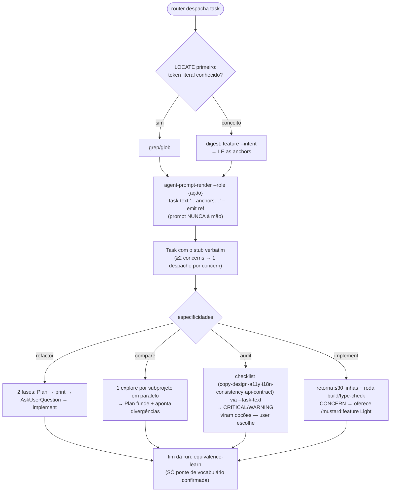

> Sem spec e sem close por design — precisa de rastro? Promova para `/mustard:feature` Light ou `/mustard:tactical-fix`.

---

## `/mustard:review` — Revisão de Pull Request

Detecta o PR, invoca a revisão e reporta. ZERO confirmações. Ao final, **emite o veredito** — sem `review.result` a spec fica presa em `ReviewPending`.

| | |
|---|---|
| **Trigger** | `/mustard:review [nº-ou-URL do PR]` (sem arg: auto-detecta o PR da branch) |
| **Backend** | `review-prefetch` · `diff-context` · `emit-event review.start/complete` · `review-result --verdict --critical` · `tactical-fix-detect` |
| **Provider** | `mustard.json#git.provider` (github/gitlab) |
| **Budget** | ≤1 Bash p/ detecção · ≤1 Skill/Task · ≤4 chamadas de API |

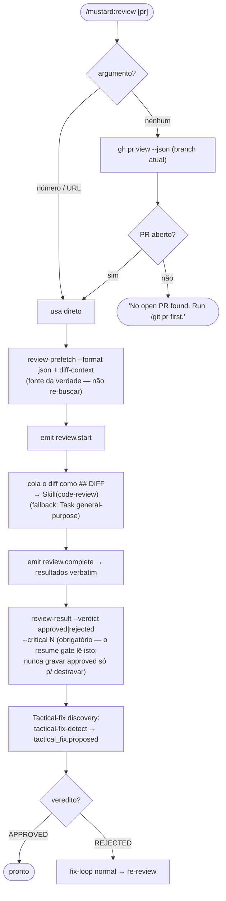

---

# Git e manutenção

## `/mustard:git` — Operações de git

Lê o *git flow* do `mustard.json`. **PR é o único caminho de integração** — uma branch de trabalho chega à base via `pr`, nunca por push local na base. Apenas operações reversíveis; aborta em QUALQUER conflito.

| Ação | Descrição |
|---|---|
| `sync` | Rebase da branch atual sobre `origin/<base>` (base derivada do prefixo `{base}_`) |
| `commit` | Commit sem push; `--scope` default `all` (`add -A` — nunca escopo parcial silencioso) |
| `push` | Sync → commit + push SÓ da branch atual (com upstream) |
| `pr [<target>]` | Abre/atualiza PR (idempotente) — um por repo, submódulo antes do pai; cada `push`/`pr` atualiza o MESMO PR até o `pr close`. Base pura `B` → promove/backporta via `flow[B]` |
| `pr close [<worktree>]` | Ritual de saída pós-merge: confirma o merge, volta à base, remove worktree + branch local e remota. Não mergeado → só avisa |

Não existe ação `merge` — a integração acontece no provedor, via PR.

| | |
|---|---|
| **Backend** | `git-settle` (+ `git-settle --unit <branch>`) no `pr close`; todo git/gh cru via `rtk git` / `rtk gh` |
| **Regras de ferro** | Sobe TUDO (`add -A`); nunca operar numa base pura (exceto `pr`); `rtk` prefixa todo `git` (até em `&&` e `$(…)`); submódulos antes do pai, cada um na sua branch `{base}_{slug}` com PR próprio |

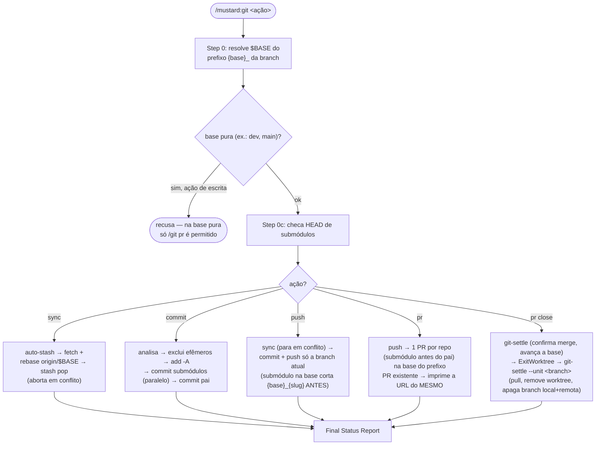

---

## `/mustard:maint` — Utilitários de manutenção

| Ação | Backend | Descrição |
|---|---|---|
| `deps [--dry-run]` | `maint-deps` | Instala dependências de todos os subprojetos (comando por tipo: `pnpm install`, `cargo fetch`, `dotnet restore`…) |
| `validate [--dry-run]` | `maint-validate` | Build + type-check por subprojeto (`pnpm typecheck`, `cargo check`…) |
| `sync` | `scan` | Refresca o `grain.model.json` |
| `doctor [--residue]` | `doctor` + `diagnose-otel` | Health check: wiring, drift, state-health, residue + telemetria OTEL — nunca bloqueia |

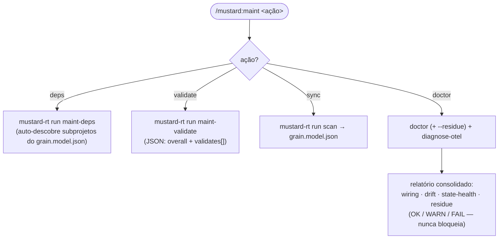

> O binário resolve os comandos por subprojeto sozinho — nunca ler a tabela de Agents ou o `CLAUDE.md` do subprojeto à mão para isso.

---

# Observabilidade e conhecimento

## `/mustard:status` — Status consolidado

| | |
|---|---|
| **Trigger** | `/mustard:status [--harness]` |
| **Backend** | `status --format table` · `status --harness --format table` |
| **Regra** | Sempre delega ao binário (nunca parsear NDJSON à mão); `--harness` é estritamente read-only |

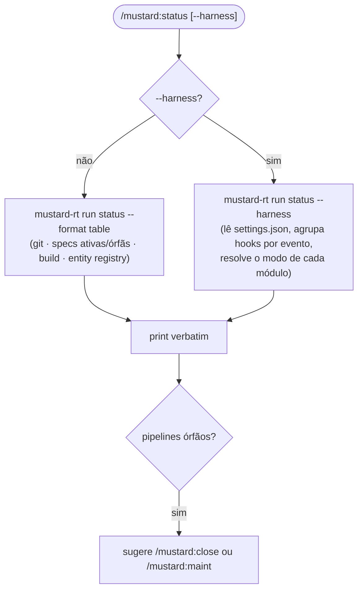

---

## `/mustard:stats` — Métricas do pipeline

| | |
|---|---|
| **Trigger** | `/mustard:stats [--hooks] [--since] [--event] [--compare] [--pr] [--days <n>]` |
| **Backend** | `metrics collect` (default) · `metrics report` (--hooks) · `event-projections --view pr-metrics` (--pr, estilo DORA) |

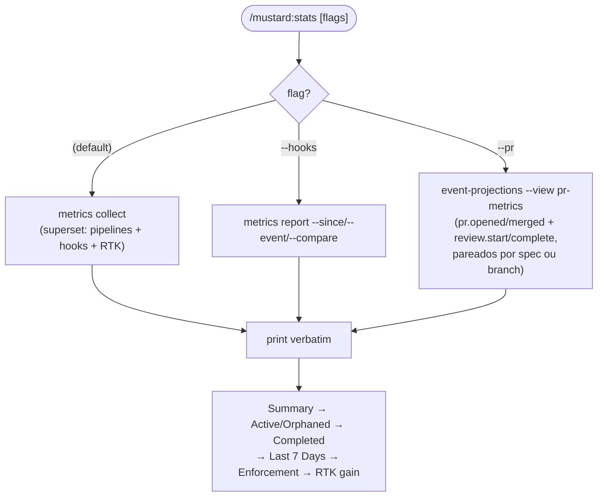

---

## `/mustard:knowledge` — Gestão de conhecimento

Conhecimento = memória nativa do Claude Code (prosa durável) + eventos `decision`/`lesson` no NDJSON por spec (emitidos no CLOSE via `emit-event`).

| Ação | Backend / propósito |
|---|---|
| `list [spec]` | `event-projections --view pipeline-state` — decisions[]/lessons[] da spec |
| `search <term>` | MCP `search_knowledge` — match em title/detail dos eventos |
| `add` | interativo → `emit-event --event decision`/`lesson` |
| `notes [target]` | edita `notes.md` (injetado nos agentes; nunca sobrescrito pelo `/mustard:scan`) |
| `audit` | compara memória nativa vs CLAUDE.md/skills (report-only) |
| `report <period>` | relatórios de progresso via git |

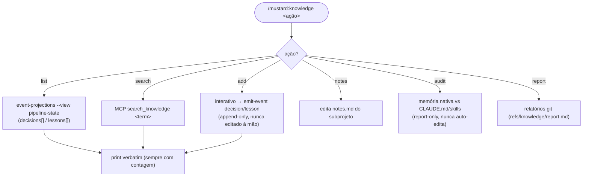

---

# Skills

## `/mustard:skills` — Gerenciador de skills

| Ação | Backend |
|---|---|
| `install <name-or-path>` | manual — cópia para `.claude/skills/<name>/` + validação do frontmatter (sem fetch embutido) |
| `create <name>` | skill `skill-creator` (não vem no pacote — instalar à parte) |
| `list` | listagem de `.claude/skills/*/SKILL.md` + frontmatter |
| `remove <name>` | apaga `.claude/skills/{name}/` (avisa se `source: scan`; `source: manual` exige confirmação) |
| `optimize` / `eval` | loops do `skill-creator` (requer Python 3 + `claude` CLI) |
| `update` | skills embutidas atualizam com o plugin (marketplace); as manuais são suas |

O campo `source:` é territorial: `/mustard:scan` escreve só `source: scan`; `install`/`create` escrevem só `source: manual`; ausente → tratado como `manual` (conservador).

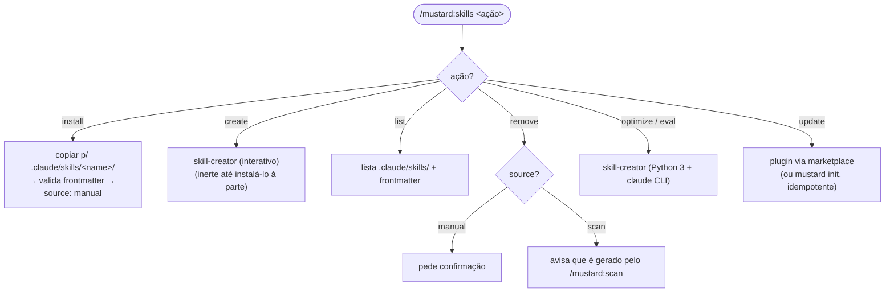

> Curiosidade que virou regra: o arquivo do comando chama-se `skills.md` (plural) porque `skill.md` colide com o marcador `SKILL.md` em filesystems case-insensitive (Windows/macOS) — e o plugin inteiro perderia a pasta `commands/`.

---

# Harness (liga/desliga dos hooks)

## `/mustard:unhook` — Kill-switch do harness

Desabilita os hooks renomeando `settings.json` para `settings.json.disabled-<timestamp>` e limpa estado volátil (`.agent-state/`, `.cluster-cache.json`, `.worktrees/`). Reversível via `/mustard:rehook`.

| Scope | O que toca |
|---|---|
| `this` | só `<repo>/.claude/settings.json` (default) |
| `monorepo` | `<repo>/.claude/` + todos `apps/*` e `packages/*` |
| `all` | monorepo + `~/.claude/settings.json` global (requer `--confirm`) |

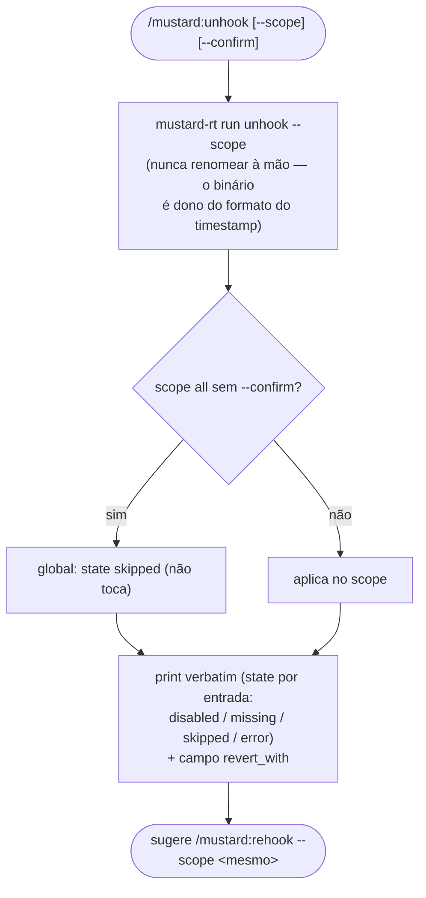

---

## `/mustard:rehook` — Restaurar o harness

Reverte o `/mustard:unhook`: acha o snapshot `settings.json.disabled*` mais recente em cada `.claude/` do escopo e renomeia de volta. Diretórios voláteis não são recriados — o runtime os regenera.

| | |
|---|---|
| **Trigger** | `/mustard:rehook [--scope this\|monorepo\|all] [--confirm]` |
| **Backend** | `mustard-rt run rehook --scope` |
| **States** | restored · already-active · no-snapshot · missing · skipped · error |

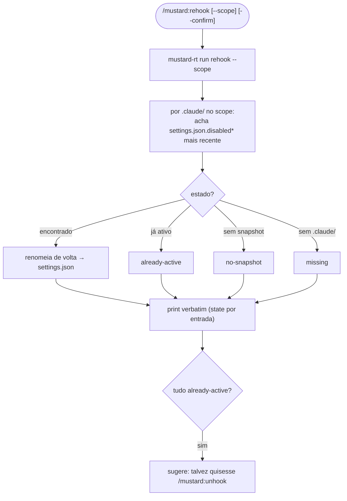

---

## Tabela-resumo de todos os comandos

| Comando | Categoria | Backend principal (`mustard-rt run …`) | Usa `grain.model.json`? |
|---|---|---|---|
| `/mustard` | porta única | — (roteia via `CLAUDE.md § Intent Routing`) | não |
| `/mustard:scan` | core | `scan --full`, `scan-guards-*`, `scan-patterns-*` | **produz** |
| `/mustard:feature` | core · fluxo interno | `feature`, `spec-draft`, `plan-prepare`, `analyze-validation`, `agent-prompt-render` | consome (digest) |
| `/mustard:bugfix` | core · fluxo interno | `feature`, `agent-prompt-render`, `qa-run`, `scan` | consome (digest) + refresca |
| `/mustard:spec` | core | `active-specs`, `resume-bootstrap`, `wave-advance` | indireto |
| `/mustard:qa` | core | `qa-run`, `tactical-fix-detect` | não |
| `/mustard:close` | core | `close-orchestrate` (+ `scan`) | refresca se mudou |
| `/mustard:tactical-fix` | core · fluxo interno | `tactical-fix-create` | não |
| `/mustard:task` | delegação · fluxo interno | `agent-prompt-render`, `feature` (digest), `equivalence-learn` | indireto |
| `/mustard:review` | revisão | `review-prefetch`, `diff-context`, `review-result`, `tactical-fix-detect` | não |
| `/mustard:git` | git | `git-settle` (+ git nativo via `rtk`) | não |
| `/mustard:maint` | manutenção | `maint-deps`, `maint-validate`, `scan`, `doctor`, `diagnose-otel` | refresca (sync) |
| `/mustard:status` | observabilidade | `status` | não |
| `/mustard:stats` | observabilidade | `metrics collect/report`, `event-projections` | não |
| `/mustard:knowledge` | conhecimento | `event-projections`, `emit-event`, MCP `search_knowledge` | não |
| `/mustard:skills` | skills | manual (sem backend `run`) | não |
| `/mustard:unhook` | harness | `unhook` | não |
| `/mustard:rehook` | harness | `rehook` | não |

---

*Derivado dos comandos do plugin em `plugin/commands/`. Quando um fluxo mudar, re-derive deste diretório — ele é a fonte da verdade.*
