# Mustard — Comandos e Fluxos

Referência visual de **cada comando do Mustard** e seu fluxo de execução.
Os diagramas usam [Mermaid](https://mermaid.js.org/) — renderizam direto no GitHub, no VS Code (com extensão Mermaid) e no dashboard.

> **Convenções dos diagramas**
> - **AI** = passo de raciocínio que o orquestrador (Claude) faz.
> - **rust** = trabalho determinístico delegado ao binário `mustard-rt` (sem AI).
> - **Task** = subagente despachado em contexto isolado.
> - **gate** = portão bloqueante (só passa se a condição for satisfeita).
> - Termos técnicos (nomes de comandos, fases, eventos, arquivos) ficam no original.

Instalado como plugin do Claude Code, todo comando vive no namespace **`/mustard:`**. A entrada do dia a dia **não é um comando**: você descreve o pedido em linguagem natural e o roteador — injetado em todo prompt — classifica e despacha.

> **Fluxos internos:** `feature`, `bugfix`, `task` e `tactical-fix` são despachados pelo **roteador** (a porta única) — você descreve o que quer e ele escolhe o fluxo. Invocá-los direto (`/mustard:feature …`) continua valendo como atalho de força; não é necessário no dia a dia.

---

## Mapa do ecossistema

Como os comandos se encaixam. Tudo entra pela **porta única**, nasce de uma varredura determinística que o **porteiro de base** dispara sozinho, e converge para o merge auditável de `/mustard:pr`.

**São QUATRO portas, e só quatro** — `/mustard:git`, `/mustard:pr`, `/mustard:spec`, `/mustard:upsert`. Todo o resto é fluxo interno: o roteador despacha, o usuário não digita. Revisão, QA e fechamento são passos de `/mustard:pr merge`; a varredura é um passo do porteiro de base; ligar/desligar o harness e diagnosticar a instalação são flags de `/mustard:upsert`; cancelar uma unidade abandonada é `/mustard:git delete`.

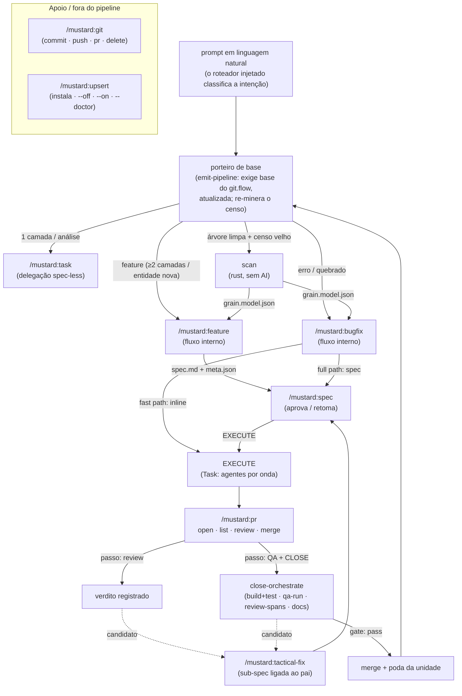
```mermaid
flowchart TD
    door["prompt em linguagem natural<br/>(o roteador injetado classifica a intenção)"] --> gate["porteiro de base<br/>(emit-pipeline: exige base do git.flow,<br/>atualizada; re-minera o censo)"]
    gate -->|"feature (≥2 camadas / entidade nova)"| feat["/mustard:feature<br/>(fluxo interno)"]
    gate -->|"erro / quebrado"| bug["/mustard:bugfix<br/>(fluxo interno)"]
    gate -->|"1 camada / análise"| task["/mustard:task<br/>(delegação spec-less)"]

    gate -->|"árvore limpa + censo velho"| scan["scan<br/>(rust, sem AI)"]
    scan -->|grain.model.json| feat
    scan -->|grain.model.json| bug

    feat -->|spec.md + meta.json| spec["/mustard:spec<br/>(aprova / retoma)"]
    bug -->|"fast path: inline"| exec
    bug -->|"full path: spec"| spec

    spec -->|EXECUTE| exec["EXECUTE<br/>(Task: agentes por onda)"]
    exec --> pr["/mustard:pr<br/>open · list · review · merge"]
    pr -->|"passo: review"| rev["verdito registrado"]
    pr -->|"passo: QA + CLOSE"| gates["close-orchestrate<br/>(build+test · qa-run · review-spans · docs)"]
    gates -->|"gate: pass"| merge["merge + poda da unidade"]

    rev -. candidato .-> tf["/mustard:tactical-fix<br/>(sub-spec ligada ao pai)"]
    gates -. candidato .-> tf
    tf --> spec

    merge --> gate

    subgraph apoio["Apoio / fora do pipeline"]
        git["/mustard:git<br/>(commit · push · pr · delete)"]
        upsert["/mustard:upsert<br/>(instala · --off · --on · --doctor)"]
    end
```

**Princípio central:** o código-fonte **nunca é lido em massa**. A varredura minera o repositório para `grain.model.json`; os fluxos de pipeline consomem esse modelo via *digest* (`mustard-rt run feature`) e leem apenas as *anchors* (arquivos-âncora) que o digest aponta. É assim que o Mustard economiza contexto.

---

## Pipeline canônico

Vocabulário único de fases (fonte: `plugin/pipeline-config.md § Pipeline Phases`):

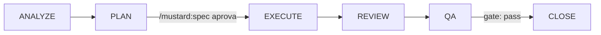
```mermaid
flowchart LR
    A["ANALYZE"] --> P["PLAN"]
    P -->|"/mustard:spec aprova"| E["EXECUTE"]
    E --> R["REVIEW"]
    R --> Q["QA"]
    Q -->|"gate: pass"| C["CLOSE"]
```

Sequência canônica: `ANALYZE → PLAN → EXECUTE → REVIEW → QA → CLOSE` (+ `COORDINATE` para roadmaps com specs-filhas).

| Escopo | Orientação | Fluxo |
|---|---|---|
| **Light** | 1-2 camadas, ≤5 arquivos, espelha um *slice* existente | Pula o PLAN: `ANALYZE → EXECUTE → REVIEW → QA → CLOSE` |
| **Extended-light** | *slice* casado + modifica existente, 6-8 arquivos | Igual ao Light (execução inline) |
| **Full** | 3+ camadas, entidade nova, ≥2 slices ou >8 arquivos | Completo, com **clarify + aprovação humana** entre PLAN e EXECUTE (via `/mustard:spec`) |

O escopo é decidido **deterministicamente** (`plan-prepare` sobre o censo da spec), nunca só pelo olho da AI. Cada fase emite eventos; os *gates* bloqueiam o avanço. O **close-gate** não deixa fechar sem `qa.result.overall=pass`; editar a spec depois de um QA aprovado marca o pass como *stale* e re-bloqueia até o QA rodar de novo.

---

# A porta única

## Roteamento por intenção — sem comando

Descreva o que quer em linguagem natural — o roteador classifica (funcionalidade / mudança / correção / investigação + escopo), **narra como leu o pedido** e despacha o fluxo interno certo. Só pergunta em ambiguidade genuína. **Não há comando de entrada:** o roteador é injetado em todo prompt via `mustard.json#inject`, então digitar algo antes de descrever o trabalho não mudaria nada.

| | |
|---|---|
| **Trigger** | descrever o trabalho ("adiciona importação de CSV", "tá com erro ao importar") |
| **Backend** | nenhum — roteia via `CLAUDE.md § Intent Routing` |
| **Regra** | Nunca edita produção sem rotear; `/mustard:feature`, `/mustard:bugfix`, `/mustard:task`, `/mustard:tactical-fix` seguem disponíveis como atalhos de força |

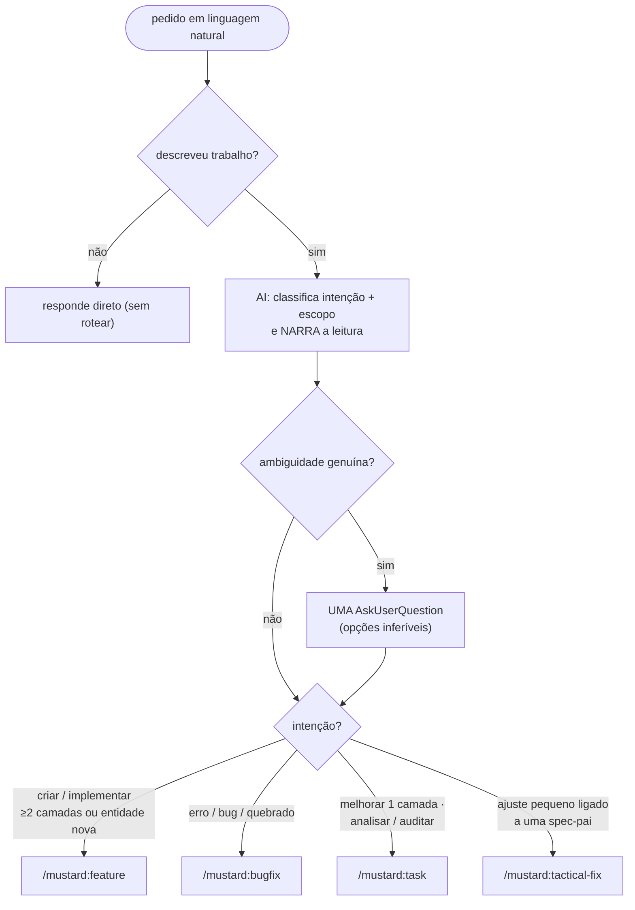
```mermaid
flowchart TD
    start(["pedido em linguagem natural"]) --> desc{"descreveu trabalho?"}
    desc -->|não| help["responde direto (sem rotear)"]
    desc -->|sim| classify["AI: classifica intenção + escopo<br/>e NARRA a leitura"]
    classify --> amb{"ambiguidade genuína?"}
    amb -->|sim| ask["UMA AskUserQuestion<br/>(opções inferíveis)"]
    amb -->|não| route
    ask --> route{"intenção?"}
    route -->|"criar / implementar<br/>≥2 camadas ou entidade nova"| f["/mustard:feature"]
    route -->|"erro / bug / quebrado"| b["/mustard:bugfix"]
    route -->|"melhorar 1 camada ·<br/>analisar / auditar"| t["/mustard:task"]
    route -->|"ajuste pequeno ligado<br/>a uma spec-pai"| tfx["/mustard:tactical-fix"]
```

---

# Comandos do pipeline (core)

## `scan` — Modelo do código-base *(fluxo interno)*

Minera o repositório para `grain.model.json` (determinístico, agnóstico de linguagem, **sem AI**) e enriquece os mapas por subprojeto — Guards (prosa do/don't) e moldes de padrão. O enriquecimento é **padrão**: roda em silêncio ou pula em silêncio (fail-open), **nunca** pede confirmação de custo.

**Não é passo que se roda.** O censo determinístico é re-minerado sozinho no **porteiro de base** — a base recém-atualizada, antes da primeira edição, é o único momento em que a árvore está limpa por construção, que é a pré-condição desta varredura (tudo que ela escreve é versionado). O que o porteiro não faz é o enriquecimento: ele é um processo Rust, e Guards e moldes são escritos por agentes. Por isso este fluxo existe, e quem o alcança é o roteador.

| | |
|---|---|
| **Trigger** | despachado pelo roteador (nunca digitado); `[--root <dir>] [--out <path>]` |
| **Backend** | `scan --full` · `scan-guards-list/apply` · `scan-patterns-sweep/list/relay/apply/decline` · `agent-prompt-render --role guards\|patterns` |
| **Produz** | `.claude/grain.model.json` · `.claude/scan-map.md` por unidade (+ a linha `@.claude/scan-map.md` no topo do `CLAUDE.md` do projeto) · blocos `## Guards` · moldes `{role}-pattern/SKILL.md` frescos |
| **Regra** | O passo determinístico nunca lê fonte; a AI do enriquecimento escreve SÓ Guards (~6 linhas) e moldes — todo molde `source: scan` é varrido e re-autorado do zero a cada scan (adoção = `source: manual`); recusa vale UMA rodada |

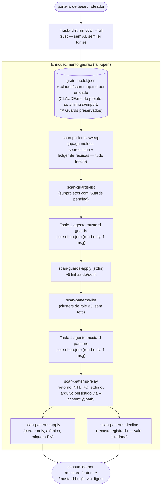
```mermaid
flowchart TD
    start(["porteiro de base / roteador"]) --> full["mustard-rt run scan --full<br/>(rust — sem AI, sem ler fonte)"]
    full --> model[("grain.model.json<br/>+ .claude/scan-map.md por unidade<br/>(CLAUDE.md do projeto: só a linha @import;<br/>## Guards preservados)")]

    subgraph enrich["Enriquecimento padrão (fail-open)"]
        model --> sw["scan-patterns-sweep<br/>(apaga moldes source:scan +<br/>ledger de recusas — tudo fresco)"]
        sw --> gl["scan-guards-list<br/>(subprojetos com Guards pending)"]
        gl --> gag["Task: 1 agente mustard-guards<br/>por subprojeto (read-only, 1 msg)"]
        gag --> gap["scan-guards-apply (stdin)<br/>~6 linhas do/don't"]
        gap --> pl["scan-patterns-list<br/>(clusters de role ≥3, sem teto)"]
        pl --> pag["Task: 1 agente mustard-patterns<br/>por subprojeto (read-only, 1 msg)"]
        pag --> rel["scan-patterns-relay<br/>(retorno INTEIRO: stdin ou<br/>arquivo persistido via --content @path)"]
        rel --> pap["scan-patterns-apply<br/>(create-only, atômico, etiqueta EN)"]
        rel --> pd["scan-patterns-decline<br/>(recusa registrada — vale 1 rodada)"]
    end

    pap --> done(["consumido por /mustard:feature e<br/>/mustard:bugfix via digest"])
    pd --> done
```

> Um Guard pode abrir com `[critical]` na forma checável `never <proibido> in <glob>` — vira gate de edição (`MUSTARD_GUARD_GATE_MODE=strict|warn`, default `warn`). Guards sem marca são consultivos.

> **Retorno do agente de moldes.** Ele vai INTEIRO para `scan-patterns-relay`: `--content -` (stdin, o padrão) ou `--content @<caminho>` quando o harness passou do limite inline e persistiu o retorno em arquivo — o mesmo leitor aceita o envelope cru **e** o JSON do harness (desembrulha os campos `text`), e um caminho ilegível vira `ok:false` em vez de envelope vazio. `scan-patterns-apply` aceita os mesmos três canais (`-`, `@<caminho>`, corpo literal). Dividir o envelope só nas fronteiras `=== END ===` é permitido (o relay é idempotente por bloco e o relatório é aditivo); dentro de um bloco, nunca. Para medir a convergência de um subprojeto: `scan-patterns-list --subproject <dir>` (com `--rejected`, os motivos de descarte).

---

## `/mustard:feature` — Pipeline de feature *(fluxo interno)*

Entende o pedido, pesquisa o repositório via *digest* do scan (nunca lendo fonte à mão), roteia o escopo deterministicamente e implementa. Este fluxo é o caminho Light + ANALYZE compartilhado; a maquinaria de PLAN do escopo Full vive em `refs/feature/full-plan.md`.

| | |
|---|---|
| **Despacho** | pelo roteador; atalho: `/mustard:feature <request>` |
| **Fases** | `ANALYZE → (rota/escopo) → PLAN (só Full) → EXECUTE → REVIEW → QA → CLOSE` |
| **Backend** | `feature` (digest) · `spec-draft` · `plan-prepare` · `analyze-validation` · `emit-pipeline`/`emit-phase` · `exec-rewave-check` · `dependency-precheck` · `agent-prompt-render` · `qa-run` |
| **Lei** | Nenhum código antes da spec aprovada (o hook `scope_guard` recusa de qualquer forma); Full para no PLAN — só `/mustard:spec` destrava o EXECUTE |

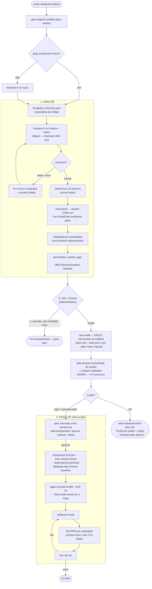
```mermaid
flowchart TD
    start(["router despacha feature"]) --> hyg["spec-hygiene (audita specs velhas)"]
    hyg --> fresh{"grain.model.json fresco?"}
    fresh -->|não| sc["mustard-rt run scan"]
    fresh -->|sim| lap
    sc --> lap["AI lapida a intenção para<br/>vocabulário de código"]

    subgraph an["1. ANALYZE"]
        lap --> dig["mustard-rt run feature --intent<br/>(digest — chamado UMA vez)"]
        dig --> res{"cobertura?"}
        res -->|weak / none| requery["lê o menu vocabulary<br/>→ re-query afiada"]
        requery --> dig
        res -->|strong| sel["seleciona 5-10 anchors<br/>(nunca todas)"]
        sel --> unc["uncovered → resolve CADA um<br/>com Grep/Glob (existence gate)"]
        unc --> read["Task(Explore) consolidado<br/>lê as anchors sobreviventes"]
        read --> grill["grill seletivo: pedido vago →<br/>UMA AskUserQuestion batched"]
    end

    grill --> route2{"2. rota + escopo<br/>(determinístico)"}
    route2 -->|"1 camada, sem entidade nova"| totask(["vira /mustard:task — para aqui"])
    route2 -->|senão| draft["spec-draft — ÚNICO escrevedor do scaffold<br/>(spec.md + meta.json; com --plan, todo o layout)"]
    draft --> prep["plan-prepare (autoridade do scope)<br/>+ analyze-validation (WARN → ## Concerns)"]
    prep --> scope{"scope?"}
    scope -->|full| fullp(["abre refs/feature/full-plan.md:<br/>PLAN por ondas + clarify<br/>→ /mustard:spec aprova"])
    scope -->|"light / extended-light"| approve

    subgraph ex["3. EXECUTE inline (Light)"]
        approve["spec anexada como preview da<br/>AskUserQuestion: aprovar / ajustar / salvar"] -->|aprovar| pre["emit-phase Execute → exec-rewave-check<br/>→ dependency-precheck (bloqueia dep externa ausente)"]
        pre --> disp["agent-prompt-render --emit ref<br/>→ Task (onda inteira em 1 msg)"]
        disp --> val["valida por onda"]
        val --> rev["REVIEW por subprojeto<br/>(review-result, máx 2 fix-loops)"]
        rev --> qa2["QA: qa-run"]
    end
    qa2 -->|pass| c(["CLOSE"])
    qa2 -->|fail| val
```

> Digest com ≥2 `concerns` → cada concern vira sua própria unidade, com suas próprias anchors (no Full: uma onda; no light/task: um despacho). Ponte de vocabulário confirmada → `equivalence-learn` persiste o aprendizado (sobrevive a re-scans).

---

## `/mustard:bugfix` — Pipeline de correção *(fluxo interno)*

Diagnóstico + correção autônomos. Lei de ferro: **nenhum fix antes de localizar e reproduzir a causa**. A triagem decide a localização: sintoma com token literal → `grep` direto; só conceito → digest.

| | |
|---|---|
| **Despacho** | pelo roteador; atalho: `/mustard:bugfix <descrição-do-erro>` |
| **Caminhos** | Fast Path (1-2 arquivos, causa clara, pula PLAN) · Full Path (3+ arquivos, spec enxuta) · **Promote** → vira `/mustard:feature` se o escopo real for de feature |
| **Backend** | `feature` (digest, só conceito) · `agent-prompt-render` · `digest-adherence-finalize` · `qa-run` · `scan` (pós-CLOSE) |

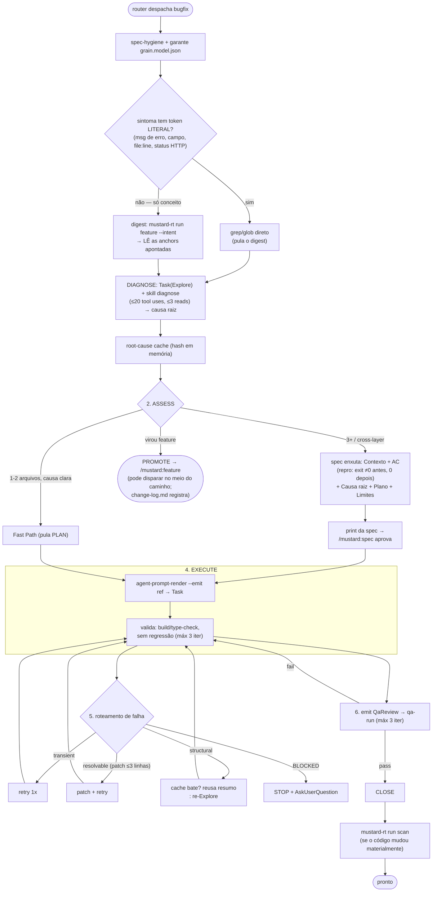
```mermaid
flowchart TD
    start(["router despacha bugfix"]) --> hyg["spec-hygiene + garante grain.model.json"]
    hyg --> triage{"sintoma tem token LITERAL?<br/>(msg de erro, campo, file:line, status HTTP)"}
    triage -->|sim| grep["grep/glob direto<br/>(pula o digest)"]
    triage -->|"não — só conceito"| dig["digest: mustard-rt run feature --intent<br/>→ LÊ as anchors apontadas"]
    grep --> diag["DIAGNOSE: Task(Explore) + skill diagnose<br/>(≤20 tool uses, ≤3 reads) → causa raiz"]
    dig --> diag
    diag --> cache["root-cause cache (hash em memória)"]

    cache --> assess{"2. ASSESS"}
    assess -->|"1-2 arquivos, causa clara"| fast["Fast Path (pula PLAN)"]
    assess -->|"3+ / cross-layer"| full["spec enxuta: Contexto + AC<br/>(repro: exit ≠0 antes, 0 depois)<br/>+ Causa raiz + Plano + Limites"]
    assess -->|"virou feature"| promote(["PROMOTE → /mustard:feature<br/>(pode disparar no meio do caminho;<br/>change-log.md registra)"])
    full --> appr["print da spec →<br/>/mustard:spec aprova"]
    appr --> exec
    fast --> exec

    subgraph ex["4. EXECUTE"]
        exec["agent-prompt-render --emit ref → Task"] --> validate["valida: build/type-check,<br/>sem regressão (máx 3 iter)"]
    end

    validate --> routef{"5. roteamento de falha"}
    routef -->|transient| retry["retry 1x"] --> validate
    routef -->|"resolvable (patch ≤3 linhas)"| patch["patch + retry"] --> validate
    routef -->|structural| reexp["cache bate? reusa resumo<br/>: re-Explore"] --> validate
    routef -->|BLOCKED| blocked["STOP + AskUserQuestion"]

    validate --> qa["6. emit QaReview → qa-run (máx 3 iter)"]
    qa -->|pass| close["CLOSE"]
    qa -->|fail| validate
    close --> rescan["mustard-rt run scan<br/>(se o código mudou materialmente)"]
    rescan --> done(["pronto"])
```

---

## `/mustard:spec` — Seletor unificado de specs

Substituiu `/approve` (PLAN) e `/resume` (EXEC). Um único *picker*: letra age na linha; letra + `r` aprova **e** executa inline; um **nome de spec** vai direto (modo focado, sem tabela).

| | |
|---|---|
| **Trigger** | `/mustard:spec [alvo]` — vazio (tabela) · `a`-`z` · `<letra>r` · nome da spec |
| **Backend** | `active-specs --format table` (só picker/letra) · `resume-bootstrap --spec --json` · downstream: `approve-spec`, `wave-advance`, `wave-tree` |
| **Regra** | Ordem das ondas e prompts decididos pelo Rust (`wave-advance`) — a AI só faz o *relay*; nome de spec NUNCA passa pela tabela |

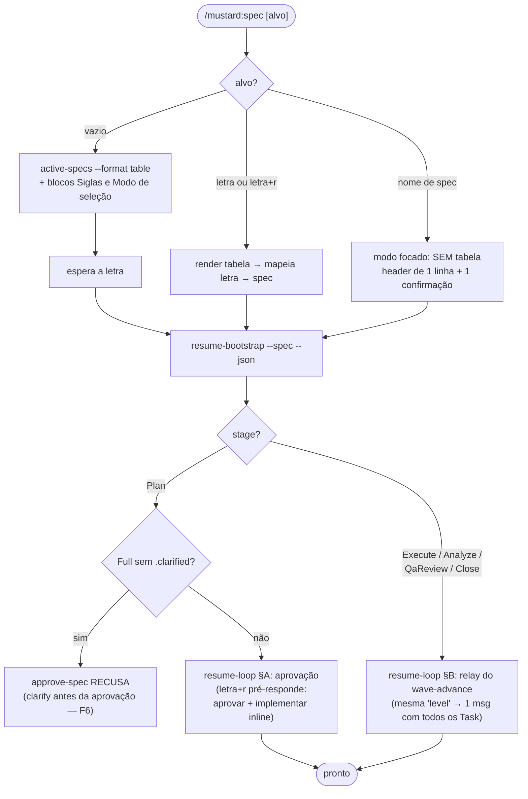
```mermaid
flowchart TD
    start(["/mustard:spec [alvo]"]) --> parse{"alvo?"}
    parse -->|vazio| table["active-specs --format table<br/>+ blocos Siglas e Modo de seleção"]
    parse -->|"letra ou letra+r"| table2["render tabela → mapeia letra → spec"]
    parse -->|"nome de spec"| focused["modo focado: SEM tabela<br/>header de 1 linha + 1 confirmação"]
    table --> wait["espera a letra"]
    wait --> boot
    table2 --> boot
    focused --> boot["resume-bootstrap --spec --json"]

    boot --> stage{"stage?"}
    stage -->|Plan| clar{"Full sem .clarified?"}
    clar -->|sim| refuse["approve-spec RECUSA<br/>(clarify antes da aprovação — F6)"]
    clar -->|não| approve["resume-loop §A: aprovação<br/>(letra+r pré-responde:<br/>aprovar + implementar inline)"]
    stage -->|"Execute / Analyze /<br/>QaReview / Close"| loop["resume-loop §B: relay do wave-advance<br/>(mesma 'level' → 1 msg com todos os Task)"]
    approve --> done(["pronto"])
    loop --> done
```

> Casos de borda: 0 specs → "Nenhuma spec ativa."; >26 → 26 primeiras + contagem; nome desconhecido → erro + tabela como fallback.

---

## `/mustard:pr` — A porta do Pull Request

Abre, lista, revisa e mergeia. **Revisão, QA e fechamento são PASSOS daqui, não portas.** Nenhum deles é o que o operador se propõe a fazer — são o que precisa acontecer no caminho até o merge, e eram comandos só por herança. O merge também poda a unidade: volta pra base, puxa, remove a worktree e apaga o branch local e remoto.

**Esta porta é dona do pull request no provedor E dos portões que podem recusar o trabalho** — é essa a linha contra `/mustard:git`, que move bits na sua árvore e não decide nada. `open` mora aqui (era `/mustard:git pr`) exatamente por isso: publicar toca o provedor. É a única ação daqui que **não** cruza portão nenhum — publicar não é integrar.

| | |
|---|---|
| **Trigger** | `/mustard:pr <open\|list\|review\|merge> [<nº do PR>] [--confirm]` |
| **Backend** | `pr-list` · `pr-review` · `pr-merge` (dobra `git-settle`) · `review-prefetch` · `diff-context` · `close-orchestrate` (build+test · `qa-run` · review-spans · `docs-stale-check` · `pipeline-summary`) · `tactical-fix-detect` |
| **Lei de ferro** | Merge nunca é silencioso: sem verdito `approved` registrado ele **avisa e pergunta** — nunca recusa de saída, nunca mergeia calado. `--confirm` é a resposta voltando |
| **Regra** | NUNCA chamar `complete-spec` à mão, NUNCA mover o diretório da spec (arquivamento é só evento), NUNCA rodar QA antes do EXECUTE nem editar código durante o QA (read-only) |

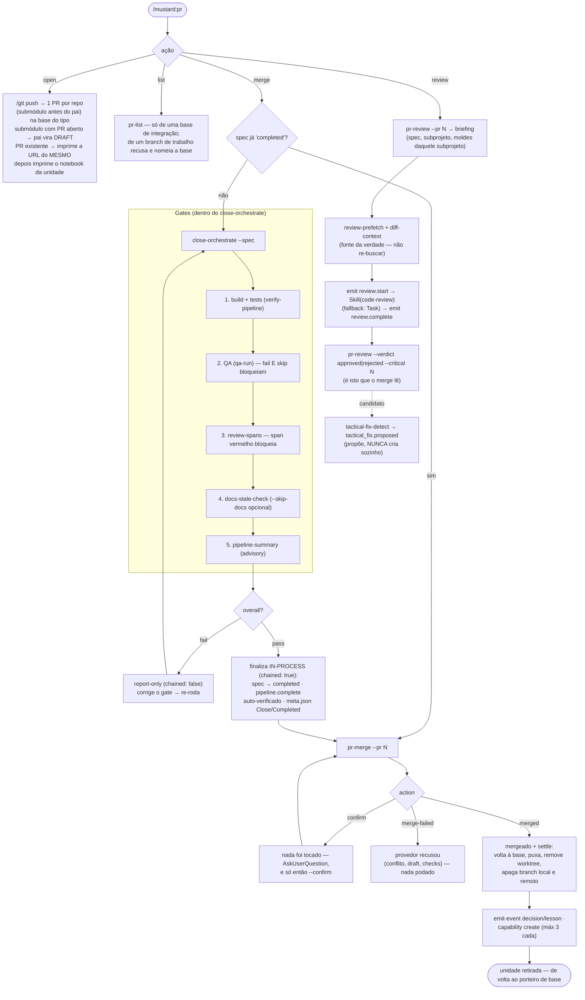
```mermaid
flowchart TD
    start(["/mustard:pr"]) --> act{"ação"}

    act -->|open| open["/git push → 1 PR por repo<br/>(submódulo antes do pai) na base do tipo<br/>submódulo com PR aberto → pai vira DRAFT<br/>PR existente → imprime a URL do MESMO<br/>depois imprime o notebook da unidade"]

    act -->|list| list["pr-list — só de uma base de integração;<br/>de um branch de trabalho recusa e nomeia a base"]

    act -->|review| brief["pr-review --pr N → briefing<br/>(spec, subprojeto, moldes daquele subprojeto)"]
    brief --> fetch["review-prefetch + diff-context<br/>(fonte da verdade — não re-buscar)"]
    fetch --> skill["emit review.start → Skill(code-review)<br/>(fallback: Task) → emit review.complete"]
    skill --> verdict["pr-review --verdict approved|rejected --critical N<br/>(é isto que o merge lê)"]
    verdict -. candidato .-> tf["tactical-fix-detect → tactical_fix.proposed<br/>(propõe, NUNCA cria sozinho)"]

    act -->|merge| pre{"spec já 'completed'?"}
    pre -->|não| orch["close-orchestrate --spec"]

    subgraph gates["Gates (dentro do close-orchestrate)"]
        orch --> g1["1. build + tests (verify-pipeline)"]
        g1 --> g2["2. QA (qa-run) — fail E skip bloqueiam"]
        g2 --> g3["3. review-spans — span vermelho bloqueia"]
        g3 --> g4["4. docs-stale-check (--skip-docs opcional)"]
        g4 --> g5["5. pipeline-summary (advisory)"]
    end

    g5 --> overall{"overall?"}
    overall -->|fail| report["report-only (chained: false)<br/>corrige o gate → re-roda"]
    report --> orch
    overall -->|pass| chain["finaliza IN-PROCESS (chained: true):<br/>spec → completed · pipeline.complete<br/>auto-verificado · meta.json Close/Completed"]

    pre -->|sim| merge
    chain --> merge["pr-merge --pr N"]
    merge --> answer{"action"}
    answer -->|confirm| ask["nada foi tocado — AskUserQuestion,<br/>e só então --confirm"]
    ask --> merge
    answer -->|merge-failed| failed["provedor recusou<br/>(conflito, draft, checks) — nada podado"]
    answer -->|merged| settled["mergeado + settle:<br/>volta à base, puxa, remove worktree,<br/>apaga branch local e remoto"]
    settled --> know["emit-event decision/lesson ·<br/>capability create (máx 3 cada)"]
    know --> done(["unidade retirada — de volta ao porteiro de base"])
```

> **Cancelar ≠ fechar.** Uma unidade abandonada sai por `/mustard:git delete <branch>`, da base: um gesto remove o branch, o remoto e o PR aberto — e tudo que a unidade produziu vivia naquele branch.

---

## `/mustard:tactical-fix` — Sub-spec para correção tática *(fluxo interno)*

Cria uma sub-spec ligada a um pai quando REVIEW ou QA descobre um ajuste adjacente pequeno. Preserva a pureza SDD: o pai fica congelado após o approve; o vínculo é unidirecional (filha → pai).

| | |
|---|---|
| **Despacho** | pelo roteador; atalho: `/mustard:tactical-fix <parent> "<descrição>" [--scope touch\|light\|full]` (default `light` ≤100 LOC; `touch` ≤30 LOC) |
| **Backend** | `tactical-fix-create --parent --description --scope` |
| **Qualifica** | ≤100 LOC · sem mudança de contrato público · sem decisão de design pendente · sem nova dependência |

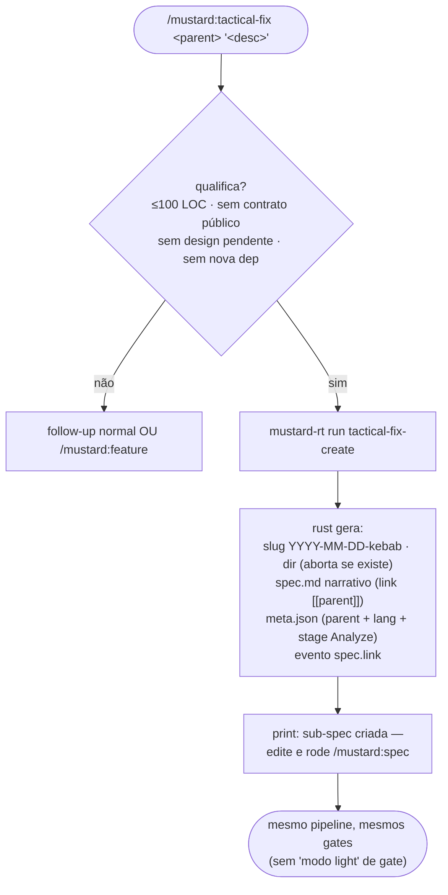
```mermaid
flowchart TD
    start(["/mustard:tactical-fix &lt;parent&gt; '&lt;desc&gt;'"]) --> qual{"qualifica?<br/>≤100 LOC · sem contrato público<br/>sem design pendente · sem nova dep"}
    qual -->|não| route["follow-up normal OU /mustard:feature"]
    qual -->|sim| create["mustard-rt run tactical-fix-create"]

    create --> gen["rust gera:<br/>slug YYYY-MM-DD-kebab · dir (aborta se existe)<br/>spec.md narrativo (link [[parent]])<br/>meta.json (parent + lang + stage Analyze)<br/>evento spec.link"]
    gen --> print["print: sub-spec criada —<br/>edite e rode /mustard:spec"]
    print --> done(["mesmo pipeline, mesmos gates<br/>(sem 'modo light' de gate)"])
```

> Fail-open na existência do pai: a sub-spec é criada mesmo se `<parent>` não existir (só a navegação do dashboard degrada). Nunca auto-aprova — o usuário revisa a semente e roda `/mustard:spec`.

---

# Delegação

## `/mustard:task` — Execução delegada (spec-less) *(fluxo interno)*

Delega cada ação em contexto Task isolado. Lei de ferro: **UMA camada** — no momento em que crescer para duas, é `/mustard:feature`. O orquestrador nunca lê fonte nem implementa; localiza primeiro, despacha depois.

| Ação | `--role` | `subagent_type` |
|---|---|---|
| `analyze` | `explore` | Explore (read-only) |
| `audit` | `audit` | general-purpose |
| `compare` | `explore` ×N → `plan` | Explore em paralelo → Plan |
| `review` | `review` | mustard-review (read-only) |
| `docs` | `docs` | general-purpose |
| `refactor` | `plan` → `implement` | Plan → general-purpose |
| `implement` | `implement` | general-purpose |

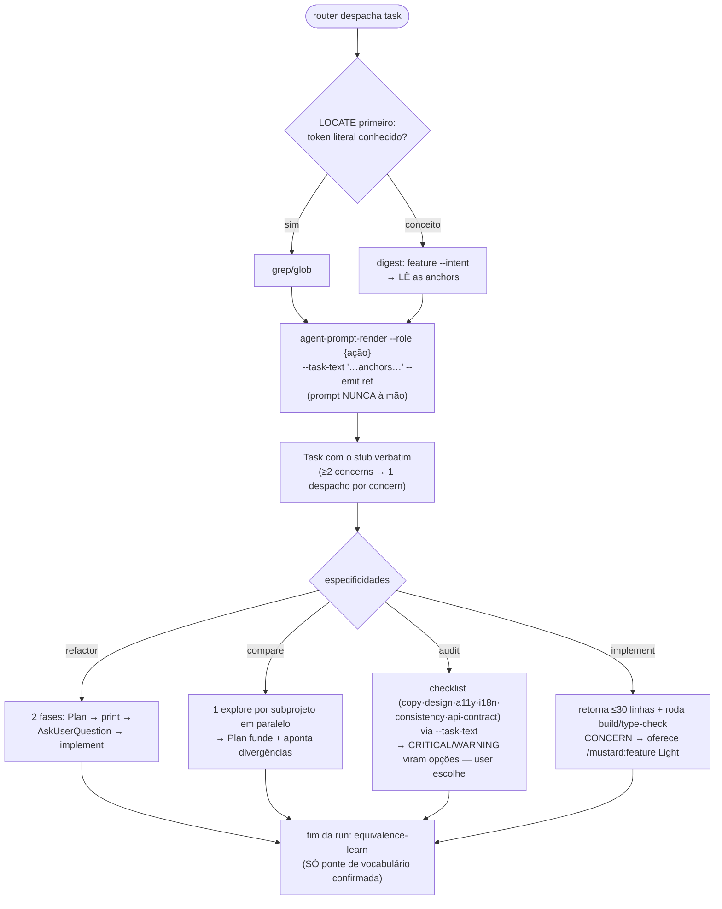
```mermaid
flowchart TD
    start(["router despacha task"]) --> locate{"LOCATE primeiro:<br/>token literal conhecido?"}
    locate -->|sim| grep["grep/glob"]
    locate -->|conceito| dig["digest: feature --intent<br/>→ LÊ as anchors"]
    grep --> render
    dig --> render["agent-prompt-render --role {ação}<br/>--task-text '…anchors…' --emit ref<br/>(prompt NUNCA à mão)"]
    render --> disp["Task com o stub verbatim<br/>(≥2 concerns → 1 despacho por concern)"]

    disp --> acts{"especificidades"}
    acts -->|refactor| two["2 fases: Plan → print →<br/>AskUserQuestion → implement"]
    acts -->|compare| par["1 explore por subprojeto em paralelo<br/>→ Plan funde + aponta divergências"]
    acts -->|"audit"| chk["checklist (copy·design·a11y·i18n·<br/>consistency·api-contract) via --task-text<br/>→ CRITICAL/WARNING viram opções — user escolhe"]
    acts -->|implement| impl["retorna ≤30 linhas + roda build/type-check<br/>CONCERN → oferece /mustard:feature Light"]

    two --> lex
    par --> lex
    chk --> lex
    impl --> lex["fim da run: equivalence-learn<br/>(SÓ ponte de vocabulário confirmada)"]
```

> Sem spec e sem close por design — precisa de rastro? Promova para `/mustard:feature` Light ou `/mustard:tactical-fix`.

---

# Git e manutenção

## `/mustard:git` — Operações de git

Lê o *git flow* do `mustard.json`. **PR é o único caminho de integração** — uma branch de trabalho chega à base via `pr`, nunca por push local na base. Apenas operações reversíveis; aborta em QUALQUER conflito.

| Ação | Descrição |
|---|---|
| `sync` | Rebase da branch atual sobre `origin/<base>` (base derivada do TIPO da branch via `git.flow`; nome antigo `{base}_` ainda resolve pelo prefixo) |
| `commit` | Commit sem push; `--scope` default `all` (`add -A` — nunca escopo parcial silencioso) |
| `push` | Sync → commit + push SÓ da branch atual (com upstream) |
| ~~`pr`~~ | **Moveu para `/mustard:pr open`.** Publicar toca o PROVEDOR, e esta porta só mexe na sua árvore. Digitar aqui imprime essa linha e para |
| `finish [<worktree>]` | Ritual de saída pós-merge — **um por repo, submódulo antes do pai**: confirma o merge, volta à base, remove worktree + branch local e remota. O relatório traz `repos` (uma entrada por repositório da unidade) e `complete`; `complete:false` significa que ainda falta fechar algum. Não mergeado → só avisa. Chamava-se `pr close` até as portas serem separadas. **Você só recorre a ele quando o PR mergeou POR FORA** — `/mustard:pr merge` faz essa mesma poda |

Não existe ação `merge` — a integração acontece no provedor, via PR.

**A linha entre as duas portas:** `/mustard:git` move bits e não decide nada — tudo reversível, exceto `delete`. `/mustard:pr` é dono do pull request no provedor **e dos portões que podem recusar o trabalho**. Por isso `open` mora lá: duas portas que ambas criavam PR liam-se como duplicata uma da outra, e a que não podia recusar nada era a casa errada.

| | |
|---|---|
| **Backend** | `git-settle` (+ `git-settle --unit <branch>`) no `finish`; todo git/gh cru via `rtk git` / `rtk gh` |
| **Regras de ferro** | Sobe TUDO (`add -A`); nunca operar numa base pura (exceto `delete`; e `/mustard:pr open`, que é de outra porta); `rtk` prefixa todo `git` (até em `&&` e `$(…)`); submódulos antes do pai, cada um carregando a unidade na branch `{kind}/{slug}` (cortada da base do PRÓPRIO repo) com PR próprio |

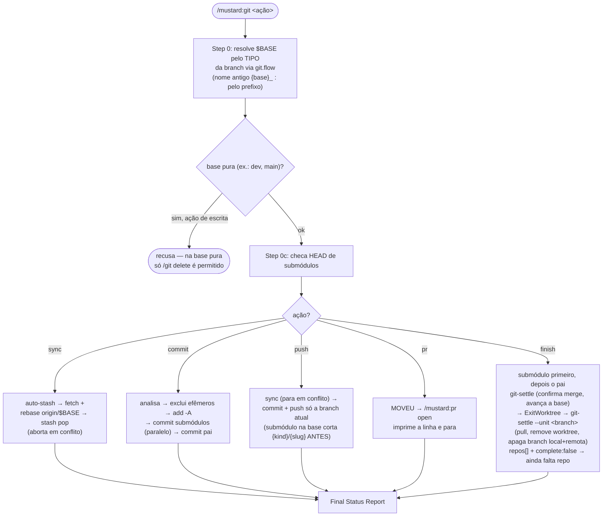
```mermaid
flowchart TD
    start(["/mustard:git &lt;ação&gt;"]) --> s0["Step 0: resolve $BASE pelo TIPO<br/>da branch via git.flow<br/>(nome antigo {base}_ : pelo prefixo)"]
    s0 --> prot{"base pura (ex.: dev, main)?"}
    prot -->|"sim, ação de escrita"| refuse(["recusa — na base pura<br/>só /git delete é permitido"])
    prot -->|ok| sub["Step 0c: checa HEAD de submódulos"]

    sub --> action{"ação?"}
    action -->|sync| sync["auto-stash → fetch +<br/>rebase origin/$BASE → stash pop<br/>(aborta em conflito)"]
    action -->|commit| commit["analisa → exclui efêmeros → add -A<br/>→ commit submódulos (paralelo) → commit pai"]
    action -->|push| push["sync (para em conflito) →<br/>commit + push só a branch atual<br/>(submódulo na base corta {kind}/{slug} ANTES)"]
    action -->|pr| pr["MOVEU → /mustard:pr open<br/>imprime a linha e para"]
    action -->|finish| settle["submódulo primeiro, depois o pai<br/>git-settle (confirma merge, avança a base)<br/>→ ExitWorktree → git-settle --unit &lt;branch&gt;<br/>(pull, remove worktree, apaga branch local+remota)<br/>repos[] + complete:false → ainda falta repo"]

    sync --> reportx["Final Status Report"]
    commit --> reportx
    push --> reportx
    pr --> reportx
    settle --> reportx
```

---

# Instalação

## `/mustard:upsert` — A porta da instalação

Um assunto, uma porta: **o estado da instalação do Mustard neste projeto**. Sem flag, instala ou atualiza. As três flags são as outras três perguntas sobre esse mesmo estado — desliga, religa, e está saudável. Eram três portas separadas; partir um assunto em quatro comandos era divisão sem motivo.

| Flag | O que faz | Backend |
|---|---|---|
| *(nenhuma)* | Instala/atualiza: `.claude/settings.json`, os injetáveis de `.claude/mustard/`, `.claude/.gitignore` e o `mustard.json` da raiz. Idempotente e merge-only — o que já existe é preservado, com UMA exceção: `.claude/mustard/orchestrator.md` e `.claude/mustard/dispatch.md` são as regras do próprio harness, não configuração do projeto, então toda execução regrava o texto embarcado | `upsert` |
| `--off` | Kill-switch: grava `"disableAllHooks": true` e limpa estado volátil (`.agent-state/` e `.cluster-cache.json`, só isso). **Worktrees não são tocadas** — as unidades em `.claude/worktrees/` guardam trabalho não commitado, e silenciar o harness não é motivo para destruí-lo; quem as recolhe é `mustard-rt run worktree-gc`. `permissions.deny/allow`, `statusLine` e `env` ficam intactos — silenciar o harness nunca remove as regras de segurança | `unhook` |
| `--on` | Reverte o `--off`: remove a chave `disableAllHooks`; sem arquivo vivo, renomeia de volta o snapshot `settings.json.disabled*` mais recente. Diretórios voláteis não são recriados — o runtime os regenera | `rehook` |
| `--doctor` | Relatório read-only de saúde da instalação. `--residue` audita estado residual; `--check <nome>` estreita para um check | `doctor` |

| Scope (`--off` / `--on`) | O que toca |
|---|---|
| `this` | só `<repo>/.claude/settings.json` (default) |
| `monorepo` | `<repo>/.claude/` + todos `apps/*` e `packages/*` |
| `all` | monorepo + `~/.claude/settings.json` global (requer `--confirm`) |

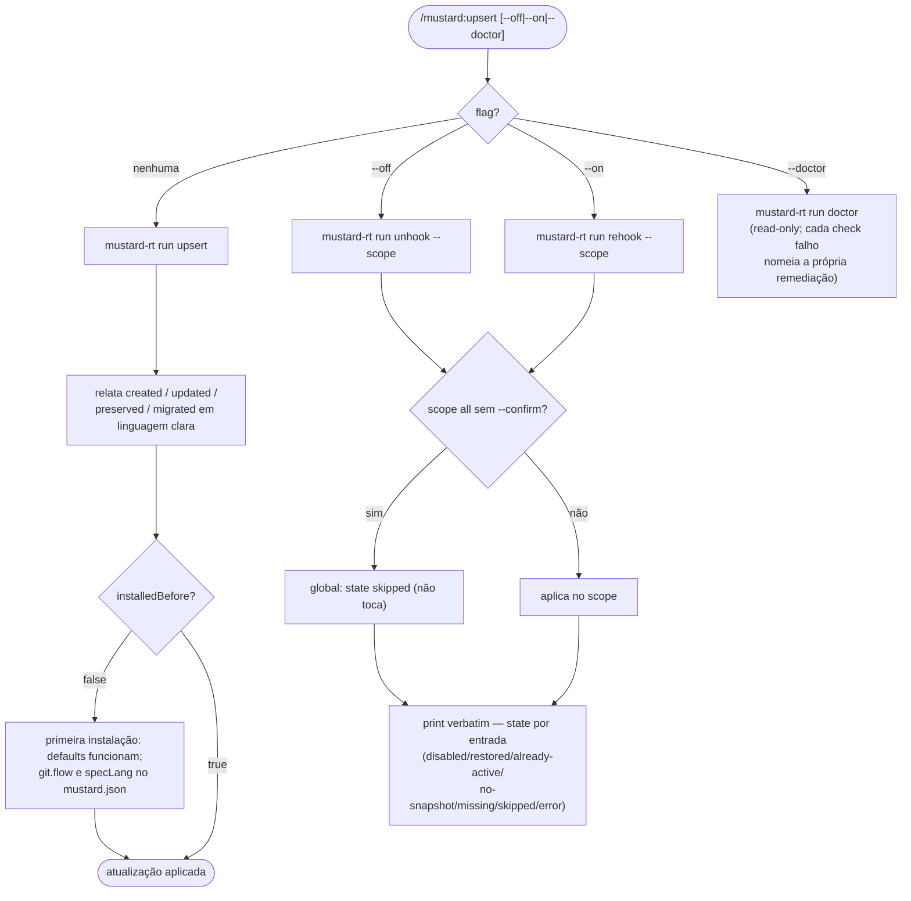
```mermaid
flowchart TD
    start(["/mustard:upsert [--off|--on|--doctor]"]) --> which{"flag?"}

    which -->|nenhuma| ups["mustard-rt run upsert"]
    ups --> lists["relata created / updated /<br/>preserved / migrated em linguagem clara"]
    lists --> first{"installedBefore?"}
    first -->|false| hint["primeira instalação: defaults funcionam;<br/>git.flow e specLang no mustard.json"]
    first -->|true| doneU(["atualização aplicada"])
    hint --> doneU

    which -->|--off| off["mustard-rt run unhook --scope"]
    which -->|--on| on["mustard-rt run rehook --scope"]
    off --> scopeChk{"scope all sem --confirm?"}
    on --> scopeChk
    scopeChk -->|sim| skip["global: state skipped (não toca)"]
    scopeChk -->|não| apply["aplica no scope"]
    skip --> report
    apply --> report["print verbatim — state por entrada<br/>(disabled/restored/already-active/<br/>no-snapshot/missing/skipped/error)"]

    which -->|--doctor| doc["mustard-rt run doctor<br/>(read-only; cada check falho<br/>nomeia a própria remediação)"]
```

> Nunca editar `settings.json` à mão nem renomear um snapshot `settings.json.disabled*` — o binário é o único escritor. Arquivo ilegível vira `error` e fica byte a byte intacto: ele é a rede de segurança, e sobrescrever no escuro é o único desfecho pior que não agir.

---

## Tabela-resumo de todos os comandos

**Quatro portas** (o usuário digita) e o resto são fluxos internos (o roteador despacha).

| Comando | Categoria | Backend principal (`mustard-rt run …`) | Usa `grain.model.json`? |
|---|---|---|---|
| _(prompt em linguagem natural)_ | porta única | — (roteia via `CLAUDE.md § Intent Routing`) | não |
| `/mustard:git` | **porta** · git | `git-settle`, `git-delete`, `notebook` (+ git nativo via `rtk`) | não |
| `/mustard:pr` | **porta** · PR | `pr-list`, `pr-review`, `pr-merge`, `review-prefetch`, `diff-context`, `close-orchestrate`, `tactical-fix-detect` | não |
| `/mustard:spec` | **porta** · core | `active-specs`, `resume-bootstrap`, `wave-advance`, `close-pipeline` | indireto |
| `/mustard:upsert` | **porta** · instalação | `upsert`, `unhook`, `rehook`, `doctor` | não |
| `scan` | fluxo interno (porteiro de base) | `scan --full`, `scan-guards-*`, `scan-patterns-*` | **produz** |
| `/mustard:feature` | fluxo interno · core | `feature`, `spec-draft`, `plan-prepare`, `analyze-validation`, `agent-prompt-render` | consome (digest) |
| `/mustard:bugfix` | fluxo interno · core | `feature`, `agent-prompt-render`, `qa-run`, `scan` | consome (digest) + refresca |
| `/mustard:tactical-fix` | fluxo interno · core | `tactical-fix-create` | não |
| `/mustard:task` | fluxo interno · delegação | `agent-prompt-render`, `feature` (digest), `equivalence-learn` | indireto |

---

*Derivado dos comandos do plugin em `plugin/commands/`. Quando um fluxo mudar, re-derive deste diretório — ele é a fonte da verdade.*

> **Regra de nomenclatura em `plugin/commands/`:** nunca nomeie um arquivo de comando `skill.md`. Em filesystems case-insensitive (Windows/macOS) ele colide com o marcador `SKILL.md` de pasta de skill, o loader do plugin trata a pasta `commands/` inteira como UMA skill, e todos os comandos somem.
