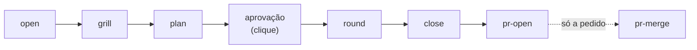

# Mustard — Comandos e Fluxo

Referência de tudo o que o Mustard publica: o fluxo, os três comandos de barra, os textos que chegam à janela, os ganchos e os comandos `mustard-rt run`. Nomes de comando, opções e chaves ficam como são.

---

## O fluxo

Todo trabalho que muda arquivo passa por um fluxo só. Cada passo é uma chamada ao binário, e a resposta de cada chamada diz qual é o próximo passo: o modelo repassa essa resposta, em vez de decidir a ordem.

```mermaid
flowchart LR
    A["open"] --> B["grill"] --> C["plan"] --> D["aprovação<br/>(clique)"] --> E["round"] --> F["close"] --> G["pr-open"]
    G -.->|"só a pedido"| H["pr-merge"]
```

| Passo | Comando | O que faz |
|---|---|---|
| 1. Abertura | `mustard-rt run open --kind <tipo> --name "<nome>" --base <base>` | Cria a branch `<tipo>/<nome>` e a spec com o mesmo nome. O que falta volta como pergunta, com os candidatos. `--pending P-<n>` liga a spec à pendência de onde ela veio. |
| 2. Levantamento | `mustard-rt run grill --spec <spec> --kinds feature` | Grava o tipo de trabalho e monta a lista de pontos. `--condensed` junta todos os pontos num bloco só, para um pedido que cabe numa frase. Cada resposta é gravada com `write`, que devolve o próximo ponto. |
| 3. Plano | `mustard-rt run plan --spec <spec>` | Monta o pedido de cada onda e confere o plano; prepara a cópia da spec para o banco de dados da página e manda publicar a página que ainda não tem endereço, mandar com a ferramenta `ArtifactData` as escritas de cada lote, que a resposta já traz prontas, e fazer a pergunta de aprovação. A cópia da página da spec se grava sozinha quando o último lote volta; a gravação à mão (`write copy`) fica para quando o gancho não avisar que gravou, e para a página do projeto. A rodada, o fechamento e o pedido que muda o plano mandam copiar do mesmo jeito o que entrou desde a última cópia; a entrega que a onda grava só entra na cópia depois que a rodada a assume. |
| 4. Aprovação | nenhum | O clique em "Aprovar" é gravado pela testemunha. "Ajustar" não aprova. |
| 5. Ondas | `mustard-rt run round --spec <spec>` | Despacha as ondas que podem sair juntas, sem pedir a revisão de onda nenhuma. A onda sai na mesma rodada, sem parada de quem conduz: o item que o pedido não leva nem tira sozinho — o do projeto todo sem a marca `every_wave` e o sem ligação com a onda — passa por uma chamada ao Jev por onda, que diz se ele governa algo que as tarefas dela mudam; o item de toda onda, o que a tarefa faz, o dos arquivos dela e as lições vão sempre. Sem chave, ou com a chamada falhando, o pedido leva o padrão: o projeto todo vai, e o sem ligação fica fora. A onda grava a própria entrega com `mustard-rt run write delivered --spec <spec> --json '<a entrega>'`, só com o envio dela aberto; a rodada seguinte assume a entrega gravada, faz o commit da rodada, grava cada sobra como tarefa da spec e despacha a seguinte. `--report '<as linhas do orquestrador>'` leva o consumo e a pausa. |
| 6. Fechamento | `mustard-rt run close --spec <spec>` | Roda cada critério uma vez e pede o agente de teste dedicado, mesmo com uma onda só; ele confere a obra inteira de uma vez, aponta e não conserta. Reprovado, o orquestrador monta o pedido do conserto, um agente conserta e o agente de teste confere só o conserto — até duas voltas; depois, a decisão é do usuário. Só fecha a spec com a linha dele aprovada. `--report '<as linhas>'` traz as linhas da última rodada e a do agente de teste, no mesmo formato da rodada; a entrega das ondas já está na spec. Na resposta, cada pendência aberta nascida na obra vem com a pergunta de destino e a linha da resposta: `--pending-later "P-<n>=<o motivo>"` grava o "fica para depois", que solta a pendência da obra e a passa ao projeto — uma por pendência, e vale também depois de a obra fechar. |
| 7. Pull request | `mustard-rt run pr-open --base <base> --head <branch> --spec <spec>` | Envia a branch ao servidor (o envio recusado para o comando, sem abrir nada), monta o título e o corpo a partir da spec e abre o pull request; o que já existe só tem o corpo reescrito. Com submódulo mexido pela spec, abre antes o de cada submódulo e o do principal como rascunho, que fica pronto quando eles entram (`pr-merge --root <submódulo>` ou o início da sessão). `--draft` abre como rascunho; `--fill` monta título e corpo pelos commits, para o repositório sem spec. |
| 8. Merge | `mustard-rt run pr-merge --pr <n>` | Só quando o usuário pede. Sem veredito aprovado, pergunta e não mexe em nada; `--confirm` é a resposta. |

A entrega da onda mora na spec: o agente a grava com `mustard-rt run write delivered`, e só com o envio da onda aberto — sem ele, a gravação é recusada com `no-open-send`, sem gravar nada. A gravação já confere o título do commit (até 60 caracteres), o resumo com cara de SHA, o arquivo que o projeto não conhece, a prova nova e a leitura do pedido (recusa `delivery-read-missing`, nomeando o item, se algum item que o pedido da onda lista não foi lido com `run read` de dentro da cópia), e grava a entrega como volta, escondida da leitura até a rodada assumi-la. A entrega traz `wave`, `text`, `files` e `commit` — o resumo de onde a mensagem do commit é montada, exigido quando há arquivo —, e ainda `proofs` (o critério e o comando de cada teste novo), `fixes` (as ondas que um conserto fecha), `replan` (a mudança, quando o plano da onda não funciona; ela só segue com o clique em "Aceitar"), `undone` (o código de cada tarefa da onda que o agente não fez, obrigatório com `replan` — `[]` quando fez todas —, e só com tarefa da própria onda; com a volta assumida, cada uma volta ao backlog sem a onda, a mudança aceita fica anotada na parte do agente dela, e a resposta da rodada avisa com `tasks-returned`) e `leftovers` (cada sobra com `title` e `detail`, que a rodada grava como tarefa da spec, no backlog; a sobra que só muda comentário, documentação ou texto de ajuda leva `cleanup` (`true`), e a rodada a segura até o fim da obra, junto das outras limpezas numa onda só; o `kind` de uma volta antiga é ignorado). A rodada assume a volta: grava a entrega oficial, com `replaces` apontando as voltas desde o último envio, e comita com o resumo dela. O relatório da rodada são as linhas que o orquestrador escreve, uma por linha, quantas forem: `<PAUSED>{…}</PAUSED>` da onda que pausou e `<USAGE>{…}</USAGE>` da onda cujo agente terminou. O resto do texto não é lido; um relatório sem nenhuma dessas marcas é recusado, e a linha `<DELIVERED>` no relatório também, sem gravar nada. O envio grava os itens que ficaram e, à parte, em `analysis`, o que o Jev tirou e o que pôs, cada um com a chance dele (`Jev p=0.03`). O veredito é do agente de teste dedicado, que o fechamento pede a toda obra, e ele o grava com `mustard-rt run write verdict`, só com o pedido de revisão aberto e depois de ler, de dentro da cópia, cada item que esse pedido lista (senão recusa `verdict-read-missing`, nomeando o item); a linha `<VERDICT>` no relatório é recusada, como a de entrega. O veredito traz `result` (`approved` ou `rejected`) e `final:true`; a aprovada é a única que vem sem `wave`, e a reprovada traz nele a onda que o conserto refaz. Quando o agente de uma onda termina, o orquestrador escreve a linha `<USAGE>{"wave":1}</USAGE>`, só com a onda: o consumo — o modelo, os passos e os tokens do agente, e os da conversa principal no ramo da spec — a rodada mede nos arquivos de conversa que a plataforma grava, e avisa a onda cujo arquivo não acha. Nenhum número digitado, na linha ou na entrega, vira consumo, e a entrega com o campo de consumo é recusada. A linha de consumo sozinha completa a onda que já voltou; a de uma onda de lote com envio aberto, sem entrega gravada e com o Claude Code dela fechado marca a onda cortada, e as tarefas dela voltam para o backlog. O fechamento lê o relatório da última rodada pela mesma porta.

---

## Comandos de barra

| Comando | O que faz |
|---|---|
| `/mustard:continue` | Retoma a spec pelo `resume` e repassa o próximo passo. É o botão de reserva: a retomada já acontece no início da sessão. |
| `/mustard:pr` | Abre o pull request, revisa o de um colega ou faz o merge, só a pedido. |
| `/mustard:upsert` | Instala ou atualiza o Mustard no projeto, e diagnostica a instalação. |

Não há comando de entrada: um pedido que muda arquivo, dito na conversa, abre a spec.

---

## O que chega à janela

- **O mapa do início da sessão** (`.claude/mustard/session-map.md`, até 3 kB): o fluxo, quando uma spec abre e onde cada coisa mora. Entra no início da sessão, depois de `/clear` e da compactação.
- **A linha de cada mensagem** (até 100 caracteres): o idioma do texto e "texto simples". Depois de uma resposta com erro de escrita, ela leva mais uma frase curta com o erro, como "Na última resposta: frase com 29 palavras.", uma vez só.
- **O estilo de resposta** do plugin, um por idioma (`mustard:mustard-pt-BR`, `mustard:mustard-en-US`), escolhido pelo instalador na chave `outputStyle` do `.claude/settings.local.json`.
- **Os dois agentes**, em `.claude/agents/mustard/`, no idioma do texto: `wave` implementa uma onda, e `review` confere uma onda, um levantamento ou o pull request de um colega. O modelo e o esforço de cada um vêm de `agents.model` e `agents.effort` do `mustard.json`; sem esses campos, a instalação os grava com `sonnet` e `xhigh`.

---

## Os ganchos

| Gancho | Quando | O que faz |
|---|---|---|
| `session_start_inject` | início da sessão | Coloca o mapa, a linha de retomada e os avisos, até 3 kB. Num projeto sem a página do projeto publicada, manda publicar o template dela e gravar o endereço. Em todo início de sessão (menos depois da compactação), com ou sem spec aberta, manda rodar `mustard-rt run spend`, que conta o dia aberto de novo. |
| `statusline_heal_observer` | início da sessão | Conserta a barra de status. |
| `prompt_entry` | cada mensagem | Grava a mensagem na spec atual; depois de uma resposta com erro de escrita, coloca a linha curta com o erro, uma vez. |
| `write_gate` | antes de escrever | Recusa escrita sem spec aprovada, numa base, em arquivo de segredo e nos `spec.*`. |
| `command_guard` | antes de um comando | Recusa comando que apaga trabalho. |
| `subagent_inject` | antes de despachar um agente | Troca o bilhete `MUSTARD-WAVE: <spec> <n>` pelo pedido montado da onda. |
| `approval_witness` | depois de uma pergunta com opções | Grava o clique em "Aprovar" ou "Aceitar". |
| `copy_witness` | depois de um lote mandado ao banco da página | Guarda a versão que o banco devolveu a cada documento do lote. Quando o último lote da cópia da página da spec volta, grava a cópia com essas versões e avisa. |
| `end_of_turn_check` | fim da resposta | Confere a escrita: o erro achado vai na linha da mensagem seguinte, sem barrar. Barra quando a resposta sai noutro idioma que não o do projeto, para o assistente escrevê-la de novo, e quando a spec fecha ou entra no merge e a resposta não cita uma pendência aberta nascida nela. |
| `session_cleanup_observer` | fim da sessão | Solta a spec da sessão. |

---

## Os comandos `mustard-rt run`

Quase todos aceitam `--root <pasta>`, que diz de que pasta o repositório é lido; sem ela, vale a pasta atual. Não a aceitam `clean`, `upsert`, `doctor` e `statusline`, que trabalham sempre na pasta atual. Os que trabalham numa spec aceitam `--spec <spec>`; sem ela, vale a spec atual.

| Comando | O que faz |
|---|---|
| `read <bloco>` | Devolve um bloco da spec: `state`, `specification`, `agreed`, `waves`, `wave-<n>`, `criteria`, `review`, `progress`, `notes` ou `conversation`. `--term <termo>` filtra pelo termo ou pelo código do item. |
| `write <tipo>` | Grava um evento: `mustard-rt run write point --spec <spec> --json '{…}'`. Com o tipo `lesson`, grava no banco de lições. A publicação da página do projeto sem `--spec` grava o endereço direto no índice das specs. Com `--copy`, a gravação prepara a cópia da página: vai só na última gravação de um pedido do usuário que muda o plano, ou no próprio pedido quando ele não gera outra. |
| `resume` | A fase, o próximo passo em palavras e o comando que o faz. |
| `reopen` | `mustard-rt run reopen --reason "<motivo>"` reabre a spec para um pedido novo: a que ainda não fechou volta ao levantamento; a fechada ou com o pull request aberto volta à execução, já aprovada, na mesma branch, e o pedido novo entra pelo `write request`; a entregue e a descartada são recusadas. Com `--fix`, é a porta de conserto do pull request que o servidor reprovou: só com o vermelho relatado, abre a onda de conserto dentro da mesma spec e, com ela entregue e comitada pela rodada, empurra a branch para o servidor — sem reabrir a obra e sem spec nova. |
| `discard` | Descarta a spec em duas chamadas: a primeira mostra o que sai e devolve um código; a segunda, com `--confirm <código>`, faz. `--remote` apaga também a branch do servidor; `--delete` apaga a pasta da spec em vez de guardá-la. |
| `pending` | A lista de pendências. `--add --title "…" --detail "…"` acrescenta; `--close P-<n> --reason "…"` dá como entregue; `--remove` com `--id`, `--term` ou `--before <dia>` tira em duas chamadas, a segunda com `--confirm <código>`; `--drop P-<n>` é a mesma saída para um item; `--reopen P-<n>` traz de volta; `--stale` mostra as paradas há 30 dias e `--expire --keep P-<a>,P-<b>` tira as outras. |
| `index` | Refaz o índice das specs. |
| `scan` | Atualiza o mapa do projeto, lendo só o que mudou; nunca escreve no git. `--full` refaz o mapa de cada subprojeto; `--out <caminho>` grava o modelo em outro lugar. |
| `map <pergunta>` | Pergunta ao mapa: `examples` (`--file <arquivo>`), `importers --file`, `tests --file`, `slice --file <arquivo> --name <declaração>`, `users --name <declaração>` (quem usa a declaração, como `arquivo:linha:quem chama`; com `--file`, só a desse arquivo), `search "<padrão>" [<pasta>]` (o mesmo texto que o `Grep` recebe, com `-i` (`--ignore-case`), `-w` (`--word-regexp`), `-F` (`--fixed-strings`), `--glob` e `--type`; a resposta é a que o Mustard dá a essa busca: cravado, parcial ou não achei) e `summary`. |
| `page` | Gera uma página no layout do Mustard a partir de um arquivo markdown: `--body <pagina.md> --out <pagina.html>`, com `--title`, `--subtitle` e `--kind` opcionais. A página da spec e a do projeto são templates que leem um banco de dados; o comando que as refazia saiu. |
| `clean` | Lista as cópias descartáveis que os agentes deixaram no diretório temporário. `--dry-run` só lista, que é o padrão; `--apply` apaga as listadas; `--path <pasta>` apaga só aquela pasta. |
| `pr-review` | Sem número, lista os pull requests abertos da base; `--pr <n>` mostra o pedido de revisão. Não grava veredito: `--verdict` recusa na entrada, porque o veredito de cada onda é gravado pela rodada. |
| `upsert` | Instala ou atualiza. Na mesma chamada, tira as sobras do Mustard antigo nos `CLAUDE.md` e no `settings.json` da equipe, com as regras das Guards indo antes para um item só da lista de pendências, e diz o que saiu; o arquivo sem marca só aparece na lista. Enquanto o `mustard.json` não tem `localFiles`, responde `localFilesFound`, os arquivos que o git ignora fora das pastas ignoradas; `--local-files <a,b>` grava a lista confirmada e `--prepare <comando>` o comando que prepara cada cópia, e o valor vazio grava que não há. |
| `doctor` | Diagnóstico só de leitura. `--check <nome>` roda uma conferência; `--residue` procura também referências mortas; `--format json` ou `--json` responde em JSON. |
| `spend` | O gasto de cada dia, contado pelas conversas da máquina (tokens, ações e procuras de código, por dia e por projeto com `mustard.json`) e mostrado numa página só da máquina, com o resumo no topo (hoje até agora, ontem, médias de 3 e 7 dias e do mês, e a previsão do Jev no mês). Funciona sem spec aberta. Sem argumento, conta os dias fechados que faltam, guarda as linhas num arquivo da máquina (um dia fechado é contado uma vez; apagar o arquivo refaz a conta), conta hoje de novo, que vai à página como parcial e nunca ao arquivo dos fechados, e prepara o template, os lotes e a ordem de copiar. `--republish` prepara a publicação nova e a cópia de todos os dias, para quem perdeu o link; `--url <endereço>` grava o endereço que a publicação devolveu. |
| `statusline` | A barra de status, chamada pelo Claude Code. `--preview` mostra cada tema numa linha. |

---

## A instalação

`mustard-rt run upsert` grava, escondidos do git do projeto:

- `.claude/settings.local.json`, `.claude/.gitignore` e `mustard.json`, que são da pessoa: o que existe fica, e só o que falta é acrescentado;
- o mapa `.claude/mustard/session-map.md`, os dois templates das páginas em `.claude/mustard/pages/` (`spec.html` e `project.html`) e os dois agentes em `.claude/agents/mustard/`, no idioma do `language.text`. Esses são textos do próprio Mustard: toda execução regrava o texto embarcado, então uma cópia editada volta em `updated`, e uma idêntica volta em `preserved`, porque não havia o que escrever.

O `.claude/settings.local.json` recebe as liberações do próprio Mustard, na instalação nova e na atualização: os comandos `mustard-rt run`, a ferramenta `ArtifactData`, que grava no banco de dados das páginas publicadas, e a pasta das cópias das ondas, que mora fora do projeto, em `permissions.additionalDirectories`. As liberações que a pessoa já tem ficam como estão.

Uma instalação antiga que declarava as três partes do roteador (`orchestrator.md`, `dispatch.md` e `material.md`) passa a declarar o mapa no lugar delas, e os três arquivos saem do disco. Uma instalação com o mapa de nome antigo, `mapa-inicio-sessao.md`, passa a declarar o `session-map.md` no `mustard.json`, sem mudar o resto dele, e o arquivo antigo sai do disco. Nada é commitado.
