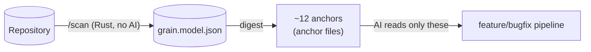

# Mustard

[Português](README.md) · **English**

> An AI-assisted software development *harness* — it enforces a disciplined, auditable, context-thrifty pipeline on top of Claude Code.

**Mustard** wraps Claude Code and turns "ask the AI for a feature" into a **spec-driven pipeline** (Spec-Driven Development / SDD): named phases, blocking gates, and an auditable event trail. The discipline does not rely on the model's good will — the **machine enforces it** through *hooks* and *gates*.

The project's thesis is **minimum AI, maximum determinism**: anything that can be solved by statistics, a graph, or a rule lives in a Rust core; AI shows up only in orchestration and reasoning, never baked into the engine.

---

## Core principle

> **Source code is never read in bulk.**



1. **`/scan`** mines the repository **once** into a durable model (`grain.model.json`) — **deterministically, with no AI, and language/architecture agnostic**: modules, declarations, dependency graph, *roles*, *slices*, contracts, and *touchpoints*.
2. Pipeline commands consume that model via a **digest** (`mustard-rt run feature`, `scan spec`) and read only the ~12 *anchors* the digest points to.
3. The payoff: **context savings** — the digest finds *where to look*; it does not replace reading.

> The harness's real cost is not the commands, but the **re-injection of the ceremony into context on every turn**. That is why routing always picks the **cheapest path that fits** — the full pipeline is the exception that must justify itself (≥2 layers/subprojects **or** a new entity), not the default.

---

## Canonical pipeline


| Scope | Detection | Flow |
|---|---|---|
| **Light** | 1-2 layers, ≤5 files, known pattern | Skips PLAN: `ANALYZE → EXECUTE → REVIEW → QA → CLOSE` |
| **Full** | 3+ layers or a new entity | Complete, with **human approval** between PLAN and EXECUTE |

Each phase emits events; *gates* block progress. The **close-gate** won't let you close without a `qa.result` whose `overall=pass`; editing the spec after a passing QA marks that pass *stale* and re-blocks until QA runs again.

---

## Commands

### Pipeline (core)

| Command | Role |
|---|---|
| `/scan` | Mines the repository into `grain.model.json` (deterministic, no AI). The durable artifact everything else feeds on. |
| `/feature` | Full feature pipeline: understand, research via digest, plan, implement. |
| `/bugfix` | Autonomous diagnose + fix. *Fast path* (1-2 files) or *full path* (lean spec). |
| `/spec` | Single picker — approve a planned spec or resume an in-progress one. |
| `/review` | Adversarial review per subproject (auto-detects the branch PR or takes a number/URL). |
| `/qa` | Runs the acceptance criteria (AC) and reports pass/fail. Blocks CLOSE on failure. |
| `/close` | Verifies build/review/QA, archives the spec, and emits the completion banner. |
| `/tactical-fix` | Creates a sub-spec linked to a parent, preserving SDD purity. |
| `/prd` | Lapidates a free-text intent into a PRD JSON for the dashboard. |

### Support (outside the pipeline)

| Command | Role |
|---|---|
| `/task` | Spec-less work delegation (analyze, audit, refactor, docs…). |
| `/git` | Commit/push/sync/merge — reads the *git flow* from `mustard.json`. Reversible operations only. |
| `/maint` | Project hygiene: dependencies, validate, sync, doctor. |
| `/status` · `/stats` | Pipeline and entity state · metrics (DORA, token savings). |
| `/knowledge` | Knowledge base, patterns, conventions, memory audit. |
| `/skill` | Install/create/list/optimize/eval *skills*. |
| `/unhook` · `/rehook` | Turn the harness (hooks) off / back on. |

---

## Spec-Driven Development

Specs live in a **flat** layout under `.claude/spec/{name}/`:

- **`spec.md`** — pure narrative (no lifecycle metadata).
- **`meta.json`** — single source of truth for the lifecycle (`stage` + `outcome` + `flags`). There are no `active/`, `completed/`, or `superseded/` folders: archival is semantic (a `pipeline.status` event), not a filesystem *move*.
- **`wave-plan.md`** + `wave-N-{role}/spec.md` — for full scope (one sub-spec per wave).

Mid-flight change requests are auto-recorded (`change-requests.ndjson` + a human-readable `change-log.md`) — nothing is lost, and the frozen narrative is left untouched.

---

## Architecture (monorepo)

| Path | Crate/App | Stack | Role |
|---|---|---|---|
| `apps/rt` | `mustard-rt` | Rust | **Deterministic core** — scan-digest, events, gates, hooks, pipeline commands. The engine. |
| `apps/scan` | `scan` | Rust | Repository miner → `grain.model.json`. |
| `apps/cli` | `mustard` | Rust | Install and *scaffold* — `init`, grammars, git-flow, fonts. |
| `apps/mcp` | — | Rust | MCP server. |
| `packages/core` | `core` | Rust | Shared types and logic (e.g. `ProjectConfig`). |
| `apps/dashboard` | `mustard-dashboard` | Tauri + React | Telemetry UI (specs, runs, trace, metrics). Reads NDJSON; outside the Cargo workspace. |

`cargo build --workspace` covers the Rust crates; the dashboard is built with `pnpm`.

---

## Installation

Requires **Rust** (`cargo`), **pnpm**, and **PowerShell** (the installer is `pwsh`).

```powershell
# Builds the three binaries (scan, mustard-rt, mustard) in release,
# installs them to ~/.cargo/bin, and runs `mustard init` in the target project.
.\install.ps1                  # target = current directory (with prompt)
.\install.ps1 -Target ..\app   # install into another project (no prompt)
.\install.ps1 -Force           # overwrite an existing .claude/
```

The *hooks* in `.claude/settings.json` invoke `mustard-rt` from the PATH, which is why the binaries go to `~/.cargo/bin`. Pre-built packages (Windows/Linux) can be produced via `packaging/build-packages.ps1` → `dist/*.zip` + `*.tar.gz`.

---

## Build & tests

```bash
# Rust (workspace)
cargo build --workspace            # or: pnpm build:rust
cargo test  --workspace            # or: pnpm test:rust
cargo clippy --workspace           # lint

# Dashboard (Tauri + React)
pnpm dashboard:dev                 # dev with HMR
pnpm dashboard:build               # production build

# Everything together
pnpm build                         # Rust workspace + dashboard
pnpm test                          # idem
```

---

## Configuration

The root `mustard.json` is the **single source** of project configuration:

```jsonc
{
  "git":  { "flow": { "*": "dev", "dev": "main" }, "provider": "github" },
  "buildCommand": "cargo build",
  "testCommand":  "cargo test",
  "lintCommand":  "cargo clippy",
  "typeCheckCommand": "cargo check",
  "specLang": "pt-BR",      // language of generated artifacts
  "tone":     "didactic",   // tone of generated prose
  "runtime":  { "kind": "native", "os": "windows", "arch": "x86_64" },
  "version":  "3.1.36"
}
```

Mustard is **agnostic** to language and architecture: generated output follows `specLang` + `tone`; the build/test/lint commands are read from here.

---

## Repository layout

```
apps/
  rt/         mustard-rt — deterministic core (Rust)
  scan/       repository miner (Rust)
  cli/        mustard — installer/scaffold (Rust)
  mcp/        MCP server (Rust)
  dashboard/  Tauri + React — telemetry
packages/
  core/       shared types/logic (Rust)
packaging/    Win/Linux packaging scripts
docs/         architectural analyses and redesigns
.claude/      harness config (hooks, skills, refs, specs, grain.model.json)
install.ps1   installer (build + scaffold)
mustard.json  project configuration
```

---

## Documentation

- **[MUSTARD-COMMANDS.md](MUSTARD-COMMANDS.md)** — visual reference for each command and its flow (Mermaid diagrams).
- **[.claude/pipeline-config.md](.claude/pipeline-config.md)** — rules, phases, naming, *role rules*, and hooks.
- **[docs/](docs/)** — architectural redesigns (agnostic index/digest, multi-signal stack detection, self-enriched lexicon, outcome loop).

---

*Private project. Version 3.1.36.*
