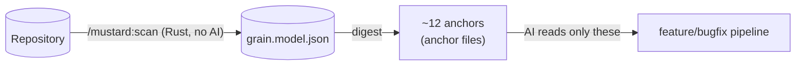
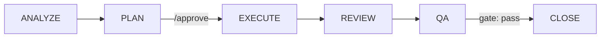

# Mustard

[Português](README.md) · **English**

> AI-assisted software development *harness* — enforces a disciplined, auditable, context-frugal pipeline on top of Claude Code.

**Mustard** wraps Claude Code and turns "ask the AI for a feature" into a **spec-driven pipeline** (Spec-Driven Development / SDD): named phases, blocking gates, and an auditable event trail. Discipline does not depend on the model's goodwill — the **machine enforces it** through hooks and gates.

The project's thesis is **minimum AI, maximum determinism**: everything statistics, graphs, or rules can solve lives in a Rust core; AI shows up only for orchestration and reasoning, never inside the engine.

---

## Core principle

> **Source code is never bulk-read.**



1. **`/mustard:scan`** mines the repository **once** into a durable model (`grain.model.json`) — **deterministic, AI-free, language- and architecture-agnostic**: modules, declarations, dependency graph, roles, slices, contracts, and touchpoints.
2. Pipeline commands consume that model through a **digest** (`mustard-rt run feature`, `scan spec`) and read only the ~12 anchors the digest points at.
3. Result: **context economy** — the digest finds *where to look*; it does not replace reading.

> The harness's real weight is not the commands but the **re-injection of ceremony into the context on every turn**. Routing therefore always picks the **cheapest path that serves** — the full pipeline is the exception that must justify itself (≥2 layers/subprojects **or** a new entity), never the default.

---

## Installation

Single prerequisite on every OS: **[Claude Code](https://docs.claude.com/claude-code)** installed and logged in (`claude --version` answers). You do **not** need Rust, Node, or any development tooling — the installers ship everything pre-compiled.

### Step 1 — your OS installer

Download **one** file from the [**Releases**](https://github.com/rubensrpj/mustard/releases) page (*Assets* section). Each installer carries the full CLI (`mustard`, `mustard-rt`, `mustard-mcp`, `scan`, `rtk`) **and** the **Mustard Dashboard**:

| OS | File | After downloading |
|---|---|---|
| 🪟 **Windows** 10/11 | `Mustard Dashboard_<version>_x64-setup.exe` | Double-click. On the SmartScreen warning (the installer is unsigned): **"More info" → "Run anyway"**. When done, **open a new terminal** — PATH only applies to terminals opened after the install. |
| 🍎 **macOS** 11+ (Intel + Apple Silicon) | `Mustard-<version>-universal.pkg` | The package is unsigned: **right-click → Open** (Gatekeeper). Follow the wizard, then open a new terminal. |
| 🐧 **Linux** (Ubuntu 22.04+) | `mustard_<version>_amd64.deb` + `install.sh` | Put both in the same folder and run `./install.sh` (uses `apt` to resolve dependencies). |

Verify in a fresh terminal:

```bash
mustard --version
mustard-rt --version
```

The complete walkthrough for each OS (including common issues and uninstall) ships as release *Assets*: `TUTORIAL-WINDOWS.md`, `TUTORIAL-MACOS.md`, `TUTORIAL-LINUX.md`.

### Step 2 — the Claude Code plugin

The harness (the `/mustard:*` commands, hooks, gates, agents, and the memory MCP server) is distributed as a **Claude Code plugin**:

```
/plugin marketplace add <marketplace repository>
/plugin install mustard@mustard-local
```

Restart (or reload) Claude Code so the hooks kick in. Until the public marketplace is published, `add` accepts the path of a local clone of this repository — the root containing `.claude-plugin/marketplace.json`.

> **Automatic binaries:** the plugin ships no binaries in git. On the **first session**, the bootstrap (`mustard-boot`) downloads the `mustard-bins-<version>-<os>` package from the Release assets matching the plugin's version and installs it inside the plugin — silent and fail-open (no network → the session continues normally and it retries next time). If you also ran Step 1, the CLI is on your PATH anyway; both paths coexist.

### Step 3 — prepare a project

At the **root of your project's git repository** (`init` refuses subfolders of a repo — in a monorepo, everything lives at the root):

```bash
cd /path/to/your/project
mustard init
```

This creates `mustard.json` (the single configuration) and the `.claude/` folder (hooks, skills, templates). From there, **open Claude Code normally inside the project** and run:

```
/mustard:scan       ← maps the repository (once; re-run after big changes)
/mustard            ← the single door: describe what you want in your own words
```

### For developers of this repository

```powershell
# Builds the binaries in release, installs them, and runs `mustard init` on the target:
.\install.ps1                  # target = current directory (with prompt)
.\install.ps1 -Target ..\app   # another project (no prompt)
```

---

## Canonical pipeline



| Scope | Detection | Flow |
|---|---|---|
| **Light** | 1-2 layers, ≤5 files, known pattern | Skips PLAN: `ANALYZE → EXECUTE → REVIEW → QA → CLOSE` |
| **Full** | 3+ layers or a new entity | Complete, with **human approval** between PLAN and EXECUTE |

Every phase emits events; gates block progress. The **close-gate** refuses to close without a `qa.result` with `overall=pass`; editing the spec after an approved QA marks the pass *stale* and re-blocks until QA runs again.

---

## Commands

Installed as a plugin, every command lives under the `/mustard:` namespace.

### The single door

| Command | Role |
|---|---|
| `/mustard` | **Start here.** Describe what you want in natural language — it classifies (feature / change / bugfix / investigation + scope), narrates how it read the request, and dispatches the right flow. Asks only on genuine ambiguity. |

### Pipeline

| Command | Role |
|---|---|
| `/mustard:scan` | Mines the repository into `grain.model.json` (deterministic, no AI) and enriches per-subproject maps (Guards + pattern molds). |
| `/mustard:feature` | Full feature pipeline: understand, research via digest, plan, implement. |
| `/mustard:bugfix` | Autonomous diagnosis + fix. Fast path (1-2 files) or full path (lean spec). |
| `/mustard:spec` | Single picker — approves a planned spec or resumes one in progress. |
| `/mustard:review` | Adversarial per-subproject review (auto-detects the branch's PR or takes a number/URL). |
| `/mustard:qa` | Runs the acceptance criteria (ACs) and reports pass/fail. Blocks CLOSE on failure. |
| `/mustard:close` | Verifies build/review/QA, archives the spec, and emits the completion banner. |
| `/mustard:tactical-fix` | Creates a sub-spec linked to a parent, preserving SDD purity. |

### Support

| Command | Role |
|---|---|
| `/mustard:task` | Spec-less work delegation (analyze, audit, refactor, docs…). |
| `/mustard:git` | Commit/push/sync/merge — reads the git flow from `mustard.json`. Always ships the complete work; reversible operations only. |
| `/mustard:maint` | Project hygiene: dependencies, validate, sync, doctor. |
| `/mustard:status` · `/mustard:stats` | Pipeline/entity state · metrics (DORA, token savings). |
| `/mustard:knowledge` | Knowledge base, patterns, conventions, memory audit. |
| `/mustard:skills` | Install/create/list/optimize/evaluate skills. |
| `/mustard:unhook` · `/mustard:rehook` | Turns the harness (hooks) off / back on. |

---

## Dashboard

The **Mustard Dashboard** is the desktop telemetry app (Tauri + React) for the harness: it reads the NDJSON events the hooks write under each project's `.claude/`, **straight from disk and live** — no server, no database, no open session required.

### Opening it

| OS | How |
|---|---|
| Windows | Start Menu → **"Mustard Dashboard"** |
| macOS | Launchpad / **Applications** folder → **"Mustard Dashboard"** |
| Linux | Application menu → **"Mustard Dashboard"** |

### First use

1. Open **Settings** in the sidebar.
2. Point the **projects root folder** — the directory containing your repositories (e.g. `C:\Atiz` or `~/code`).
3. The dashboard **auto-discovers** every Mustard-initialized project (`mustard.json` + `.claude/`) inside it.

### What each area shows

| Area | Content |
|---|---|
| **Workspace** | Aggregated overview of all discovered projects: active pipelines, latest events, health. |
| **Activity** | The **live** execution: running pipeline, waves, dispatched agents, and the trace grouped by agent/wave. |
| **Specs** | Every specification with its lifecycle state (active, suspicious, closed), acceptance criteria, and waves. |
| **Economy** | Token metrics: per-session/per-spec consumption and the savings obtained (rtk, digest, routing). |
| **Knowledge** | The project's knowledge base (patterns, conventions, recorded decisions). |
| **Commands** | History of executed pipeline commands. |
| **Sessions** | Claude Code session history for the project, with per-session drill-down. |
| **Project detail** | Per project: specs, execution trace, and the live pipeline card. |

> Tip: keep the dashboard open on a second monitor while Claude Code works — **Activity** shows each wave and agent in real time, and **Specs** reflects the gates (QA passed, CLOSE blocked, etc.) the moment they happen.

---

## Spec-Driven Development

Specs live in a **flat** layout under `.claude/spec/{name}/`:

- **`spec.md`** — pure narrative (no lifecycle metadata).
- **`meta.json`** — single source of truth for the lifecycle (`stage` + `outcome` + `flags`). There are no `active/`, `completed/`, or `superseded/` folders: archiving is semantic (a `pipeline.status` event), not a filesystem move.
- **`wave-plan.md`** + `wave-N-{role}/spec.md` — for full scope (one sub-spec per wave).

Mid-flight changes are auto-recorded (`change-requests.ndjson` + a readable `change-log.md`) — nothing is lost, and the frozen narrative is never touched.

---

## Architecture (monorepo)

| Path | Crate/App | Stack | Role |
|---|---|---|---|
| `apps/rt` | `mustard-rt` | Rust | **Deterministic core** — scan-digest, events, gates, hooks, pipeline commands. The engine. |
| `apps/scan` | `scan` | Rust | Repository miner → `grain.model.json`. |
| `apps/cli` | `mustard` | Rust | Install & scaffold — `init`, grammars, git-flow, fonts. |
| `apps/mcp` | `mustard-mcp` | Rust | MCP server (harness memory/queries). |
| `packages/core` | `core` | Rust | Shared types and logic (e.g. `ProjectConfig`). |
| `apps/dashboard` | `mustard-dashboard` | Tauri + React | Telemetry UI (specs, runs, trace, metrics). Reads NDJSON; outside the Cargo workspace. |
| `plugin/` | — | — | The Claude Code plugin: commands, hooks, agents, MCP, and the `mustard-boot` bootstrap (downloads the binaries from the Release on the first session). |

`cargo build --workspace` covers the Rust crates; the dashboard builds via `pnpm`.

---

## Build & tests

```bash
# Rust (workspace)
cargo build --workspace            # or: pnpm build:rust
cargo test  --workspace            # or: pnpm test:rust
cargo clippy --workspace           # lint

# Dashboard (Tauri + React)
pnpm dashboard:dev                 # dev with HMR
pnpm dashboard:build               # production build

# Everything
pnpm build                         # Rust workspace + dashboard
pnpm test                          # same
```

**Official release:** a `vX.Y.Z` tag triggers the workflow that builds one complete installer per OS + the `mustard-bins-*` packages (consumed by the plugin bootstrap) and publishes everything as a GitHub Release. The tag version **must** match `plugin/.claude-plugin/plugin.json` — the workflow refuses a desynchronized tag. Manual dispatch (Actions → Release → Run workflow) is a **rehearsal**: builds everything without publishing.

---

## Configuration

`mustard.json` at the root is the project's **single source** of configuration:

```jsonc
{
  "git":  { "flow": { "*": "dev", "dev": "main" }, "provider": "github" },
  "buildCommand": "cargo build",
  "testCommand":  "cargo test",
  "lintCommand":  "cargo clippy",
  "typeCheckCommand": "cargo check",
  "specLang": "en-US",      // language of generated artifacts
  "tone":     "didactic"    // tone of generated prose
}
```

Mustard is language- and architecture-**agnostic**: generated output follows `specLang` + `tone`; build/test/lint commands are read from here. Monorepo rule: all state lives at the git repository **root**; a subproject is its own Mustard project only when it is an independent git repository (submodule).

---

## Repository layout

```
apps/
  rt/         mustard-rt — deterministic core (Rust)
  scan/       repository miner (Rust)
  cli/        mustard — installer/scaffold (Rust)
  mcp/        MCP server (Rust)
  dashboard/  Tauri + React — telemetry
packages/
  core/       shared types/logic (Rust)
plugin/       Claude Code plugin (commands, hooks, agents, bootstrap)
packaging/    Win/macOS/Linux installers + tutorials
docs/         architecture analyses and redesigns
.claude/      harness config (hooks, skills, refs, specs, grain.model.json)
install.ps1   development installer (build + scaffold)
mustard.json  project configuration
```

---

## Documentation

- **[MUSTARD-COMMANDS.md](MUSTARD-COMMANDS.md)** — visual reference for each command and its flow (Mermaid diagrams).
- **Install tutorials** — `packaging/installer/TUTORIAL-{WINDOWS,MACOS,LINUX}.md` (also attached to every release).
- **[docs/](docs/)** — architecture redesigns (agnostic index/digest, multi-signal stack detection, plugin validation).

---

*Distributed under the MIT license.*
