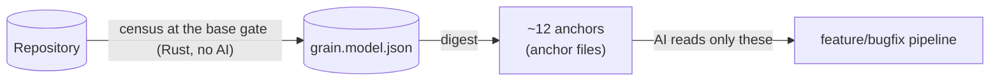
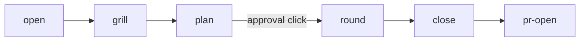

# Mustard

[Português](README.md) · **English**

> AI-assisted software development *harness* — enforces a disciplined, auditable, context-frugal pipeline on top of Claude Code.

**Mustard** wraps Claude Code and turns "ask the AI for a feature" into a **spec-driven pipeline** (Spec-Driven Development / SDD): named phases, blocking gates, and an auditable event trail. Discipline does not depend on the model's goodwill — the **machine enforces it** through hooks and gates.

The project's thesis is **minimum AI, maximum determinism**: everything statistics, graphs, or rules can solve lives in a Rust core; AI shows up only for orchestration and reasoning, never inside the engine.

---

## Core principle

> **Source code is never bulk-read.**


```mermaid
flowchart LR
    repo[("Repository")] -->|"census at the base gate (Rust, no AI)"| model[("grain.model.json")]
    model -->|digest| anchors["~12 anchors<br/>(anchor files)"]
    anchors -->|"AI reads only these"| work["feature/bugfix pipeline"]
```

1. The **census** mines the repository into a durable model (`grain.model.json`) — **deterministic, AI-free, language- and architecture-agnostic**: modules, declarations, dependency graph, roles, slices, contracts, and touchpoints. It is not a command: the **base gate** triggers it on its own whenever the census is stale and the tree is clean.
2. The flow's commands consume that model through a **digest** and read only the ~12 anchors the digest points at.
3. Result: **context economy** — the digest finds *where to look*; it does not replace reading.

> The harness's real weight is not the commands but the **re-injection of ceremony into the context on every turn**. Routing therefore always picks the **cheapest path that serves** — the full pipeline is the exception that must justify itself (≥2 layers/subprojects **or** a new entity), never the default.

---

## Installation

Single prerequisite on every OS: **[Claude Code](https://docs.claude.com/claude-code)** installed and logged in (`claude --version` answers). You do **not** need Rust, Node, or any development tooling — the installers ship everything pre-compiled.

### Step 1 — your OS installer

On Windows and macOS, download **one** file from the [**Releases**](https://github.com/rubensrpj/mustard/releases) page (*Assets* section); on **Linux**, a single terminal line does it. Each installer carries the full CLI (`mustard`, `mustard-rt`, `scan`, `rtk`):

| OS | What to download | What to do |
|---|---|---|
| 🪟 **Windows** 10/11 | `Mustard_<version>_x64-setup.exe` | Double-click. On the SmartScreen warning (the installer is unsigned): **"More info" → "Run anyway"**. When done, **open a new terminal** — PATH only applies to terminals opened after the install. |
| 🍎 **macOS** 11+ (Intel + Apple Silicon) | `Mustard-<version>-universal.pkg` | The package is unsigned: **right-click → Open** (Gatekeeper). Follow the wizard, then open a new terminal. |
| 🐧 **Linux** (Ubuntu 22.04+) | none — install in one line:<br>`curl -fsSL https://github.com/rubensrpj/mustard/releases/latest/download/install.sh \| sh` | The script downloads the `.deb` from the latest Release and hands it to `apt` (which resolves the dependencies). Manual route, for whoever wants to check the `sha256` first: download `mustard_<version>_amd64.deb` + `install.sh` into the same folder and run `chmod +x install.sh && ./install.sh` — Release assets arrive **without** the executable bit, and without the `chmod` the shell answers `Permission denied`. |

Verify in a fresh terminal:

```bash
mustard --version
mustard-rt --version
```

The complete walkthrough for each OS (including common issues and uninstall) ships as release *Assets*: `TUTORIAL-WINDOWS.md`, `TUTORIAL-MACOS.md`, `TUTORIAL-LINUX.md`.

### Step 2 — the Claude Code plugin

The harness (the `/mustard:*` commands, hooks, gates and agents) is distributed as a **Claude Code plugin**:

```
/plugin marketplace add rubensrpj/mustard
/plugin install mustard@mustard-local
```

Restart (or reload) Claude Code so the hooks kick in. `add` registers the Mustard repository as a marketplace (it is the one carrying `.claude-plugin/marketplace.json`); the `@mustard-local` in `install` is the **marketplace name**, not a path. `add` also accepts the path of a local clone of this repository — the root containing `.claude-plugin/marketplace.json` — and the repository's full URL (`https://github.com/rubensrpj/mustard.git`), which is the form to use when the `owner/repo` shorthand cannot clone.

> **Automatic binaries:** the plugin ships no binaries in git. On the **first session**, the bootstrap (`mustard-boot`) downloads the `mustard-bins-<version>-<os>` package from the Release assets matching the plugin's version and installs it inside the plugin — silent and fail-open (no network → the session continues normally and it retries next time). If you also ran Step 1, the CLI is on your PATH anyway; both paths coexist.

### Step 3 — prepare a project

At the **root of your project's git repository** (`init` refuses subfolders of a repo — in a monorepo, everything lives at the root):

```bash
cd /path/to/your/project
mustard init
```

This creates `mustard.json` (the single configuration) and the `.claude/` folder (hooks, skills, templates). From there, **open Claude Code normally inside the project** and **describe the work in your own words** — there is no command to "get started", and no mapping step to run. The router is injected on every prompt and classifies the request on its own; the base gate mines the repository on the way in.

### For developers of this repository

```powershell
# Builds the binaries in release, installs them, and runs `mustard init` on the target:
.\install.ps1                  # target = current directory (with prompt)
.\install.ps1 -Target ..\app   # another project (no prompt)
```

---

## The flow


```mermaid
flowchart LR
    A["open"] --> G["grill"]
    G --> P["plan"]
    P -->|approval click| R["round"]
    R --> C["close"]
    C --> PR["pr-open"]
```

Every step is a single call, and every command ends by naming the next one. `open` starts the spec; `grill` surveys what is missing, one question at a time; `plan` builds the waves and puts them up for approval; the approval is the user's click, recorded by the conversation hook; `round` dispatches the waves that can go out together, each in its own copy, and records what they delivered and each review's verdict; `close` runs, in a clean environment, the lint and the suite `mustard.json` declares and every criterion once and, on a spec of two waves or more, asks for the final review of the whole; `pr-open` opens the pull request. The merge is the only step that happens only when the user asks.

The close refuses while any criterion lacks an approved run in `spec.ndjson`, while the project lint or suite fails, or while the final review of the whole has not been approved.

---

## Commands

Installed as a plugin, every command lives in the `/mustard:` namespace. There is no entry command: a request that changes a file, said in the conversation, opens the spec, and every step of the flow answers what comes next.

| Command | Role |
|---|---|
| `/mustard:continue` | Picks the spec back up where it stopped. It is the reserve button: resuming already happens at the start of a session. |
| `/mustard:pr` | Opens the pull request, reviews a colleague's, or merges one, only when asked. |
| `/mustard:upsert` | Installs or updates Mustard in the project and diagnoses the installation. To turn Mustard off in a project, set `"enabled": false` in `mustard.json`. |

The full reference — the flow, the hooks and every `mustard-rt run` command — is in [`MUSTARD-COMMANDS.md`](MUSTARD-COMMANDS.md).

---

## Spec-Driven Development

Specs live in a **flat** layout under `.claude/spec/{name}/`:

- **`spec.md`** — pure narrative (no lifecycle metadata).
- **`meta.json`** — single source of truth for the lifecycle (`stage` + `outcome` + `flags`). There are no `active/`, `completed/`, or `superseded/` folders: archiving is semantic (a `pipeline.status` event), not a filesystem move.
- **`wave-plan.md`** + `wave-N-{role}/spec.md` — for full scope (one sub-spec per wave).

Mid-flight changes are auto-recorded (`change-requests.ndjson` + a readable `change-log.md`) — nothing is lost, and the frozen narrative is never touched.

---

## Architecture (monorepo)

| Path | Crate/App | Stack | Role |
|---|---|---|---|
| `apps/rt` | `mustard-rt` | Rust | **Deterministic core** — scan-digest, events, gates, hooks, pipeline commands. The engine. |
| `apps/scan` | `scan` | Rust | Repository miner → `grain.model.json`. |
| `apps/cli` | `mustard` | Rust | Install & scaffold — `init`, grammars, git-flow, fonts. |
| `packages/core` | `core` | Rust | Shared types and logic (e.g. `ProjectConfig`). |
| `plugin/` | — | — | The Claude Code plugin: commands, hooks, agents and the `mustard-boot` bootstrap (downloads the binaries from the Release on the first session). |

`cargo build --workspace` covers every Rust crate.

---

## Build & tests

```bash
cargo build --workspace
cargo test  --workspace
cargo clippy --workspace           # lint
```

**Official release:** a `vX.Y.Z` tag triggers the workflow that builds one complete installer per OS + the `mustard-bins-*` packages (consumed by the plugin bootstrap) and publishes everything as a GitHub Release. The tag version **must** match `plugin/.claude-plugin/plugin.json` — the workflow refuses a desynchronized tag. Manual dispatch (Actions → Release → Run workflow) is a **rehearsal**: builds everything without publishing.

---

## Configuration

`mustard.json` at the root is the project's **single source** of configuration:

```jsonc
{
  // "flow" is OPTIONAL and restricts nothing: it only PRE-SELECTS a base in the
  // picker. Where a unit may be cut from comes from git;
  // where a direct commit is refused comes from the remote's default branch plus
  // whatever "protected" adds. A fresh install writes no "flow".
  "git":  { "provider": "github" },
  "buildCommand": "cargo build",
  "testCommand":  "cargo test",
  "lintCommand":  "cargo clippy",
  "typeCheckCommand": "cargo check",
  "language": {             // the two languages, each on its own key
    "text": "en-US",        // conversation, specs, pages, comments and commits
    "code": "en"            // names in the code: always English
  }
}
```

Mustard is language- and architecture-**agnostic**: generated text follows `language.text`; names in the code (variables, functions, files, commands) are always English, so the install does not ask for a code language. The install asks only for the text language and writes only what you choose. Build/test/lint commands are read from here. Monorepo rule: all state lives at the git repository **root**; a subproject is its own Mustard project only when it is an independent git repository (submodule).

---

## Repository layout

```
apps/
  rt/         mustard-rt — deterministic core (Rust)
  scan/       repository miner (Rust)
  cli/        mustard — installer/scaffold (Rust)
packages/
  core/       shared types/logic (Rust)
plugin/       Claude Code plugin (commands, hooks, agents, bootstrap)
packaging/    Win/macOS/Linux installers + tutorials
docs/         architecture analyses and redesigns
.claude/      harness config (hooks, skills, refs, specs, grain.model.json)
install.ps1   development installer (build + scaffold)
mustard.json  project configuration
```

---

## Documentation

- **[MUSTARD-COMMANDS.md](MUSTARD-COMMANDS.md)** — visual reference for each command and its flow (Mermaid diagrams).
- **Install tutorials** — `packaging/installer/TUTORIAL-{WINDOWS,MACOS,LINUX}.md` (also attached to every release).
- **[docs/](docs/)** — architecture redesigns (agnostic index/digest, multi-signal stack detection, plugin validation).

---

*Distributed under the MIT license.*
