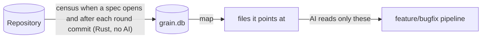
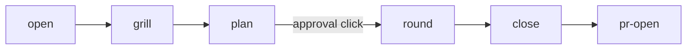

# Mustard

[Português](README.md) · **English**

> AI-assisted software development *harness* — enforces a disciplined, auditable, context-frugal pipeline on top of Claude Code.

**Mustard** wraps Claude Code and turns "ask the AI for a feature" into a **spec-driven pipeline** (Spec-Driven Development / SDD): named phases, blocking gates, and an auditable event trail. Discipline does not depend on the model's goodwill — the **machine enforces it** through hooks and gates.

The project's thesis is **minimum AI, maximum determinism**: everything statistics, graphs, or rules can solve lives in a Rust core; AI shows up only for orchestration and reasoning, never inside the engine.

---

## Core principle

> Search starts with local evidence; the model expands code reading when needed.


```mermaid
flowchart LR
    repo[("Repository")] -->|"census when a spec opens and after each round commit (Rust, no AI)"| model[("grain.db")]
    model -->|map| anchors["files it points at"]
    anchors -->|"AI reads only these"| work["feature/bugfix pipeline"]
```

1. The **census** mines the repository into a durable model (`grain.db`, a SQLite database in blocks that rewrites only the block that changed) — **deterministic, AI-free, language- and architecture-agnostic**: modules, declarations, dependency graph, roles, slices, and contracts. It runs at initialization, when a spec opens and after round commits; `mustard-rt run scan` refreshes it explicitly. Parsing limits and relation origins remain visible.
2. The **search gateway** (`mustard-rt run search`) searches source with the received arguments, records verified discoveries and crosses the result with the scan. New/changed sources refresh the structural index without AI. The map provides expansion and references; relations and candidate tests do not prove behavior or coverage.
3. Goal: **context economy** — the map finds *where to look*, and the model checks the necessary excerpts. Billed token savings must be measured in the actual workflow.

`mustard-rt run search --intent "<task>" --purpose implement -- rg -n --with-filename "<pattern>" src` preserves the original search and adds current owners and read ranges. Mods register `mcp__mustard__search`; hooks also route supported inputs. Intent never replaces the pattern. Contracts and limits: [search gateway](docs/2026-10-09-gateway-de-busca.md).

`mustard-rt run knowledge --query "<subject>"` remains an analytical query for symbols/documentation/configuration with lines and hashes; `--detail` expands and `--all --markdown --out inventory.md` exports. Explicit references can connect documents to code; a mention does not validate a rule. `mustard-rt run map audit` checks database/index consistency without an auxiliary model.

`run knowledge --coverage` explains grammar gaps, unreadable files and exclusions. `--topics plan.json --markdown --out report.md` composes current evidence and reviewed interpretations by topic. `--evaluate questions.json` compares compact/detailed retrieval and configured Choice without executing a spec. `--responsibility` enables experimental selection inside discovered files; an external regression prevented promotion to the default. Optional Jev in that mode only handles ambiguities with multiple written clues, sharing the judgement interface, cache and physical attempt ledger. Formats and limits are documented in [Scan as an oracle](docs/2026-10-08-scan-oraculo.md).

Search also uses identifiers inside functions and complete fixed text values. Initial responses show short matching witnesses; `--detail` retrieves the full evidence. Banks with evidence packs older than version 3 need a new scan.

> The binary handles state, retrieval, context, orchestration, validation, calculations and page generation. The model reasons and implements. Auxiliary operations work without AI by default. Jev requires `ai.fallback: true` and an explicit purpose-specific filter; vectors require `ai.vectors: true`. Credentials and legacy settings do not enable inference. The provider interface and versioned cache remain available for an evaluated exception. Literal Grep/rg preserve their arguments and do not call Jev routinely.

---

## Installation

Single prerequisite on every OS: **[Claude Code](https://docs.claude.com/claude-code)** installed and logged in (`claude --version` answers). You do **not** need Rust, Node, or any development tooling — the installers ship everything pre-compiled.

### Step 1 — your OS installer

On Windows and macOS, download **one** file from the [**Releases**](https://github.com/rubensrpj/mustard/releases) page (*Assets* section); on **Linux**, a single terminal line does it. Each installer carries the full CLI (`mustard`, `mustard-rt`, `scan`, `rtk`):

| OS | What to download | What to do |
|---|---|---|
| 🪟 **Windows** 10/11 | `Mustard_<version>_x64-setup.exe` | Double-click. On the SmartScreen warning (the installer is unsigned): **"More info" → "Run anyway"**. When done, **open a new terminal** — PATH only applies to terminals opened after the install. |
| 🍎 **macOS** 11+ (Intel + Apple Silicon) | `Mustard-<version>-universal.pkg` | The package is unsigned: **right-click → Open** (Gatekeeper). Follow the wizard, then open a new terminal. |
| 🐧 **Linux** (Ubuntu 22.04+) | none — install in one line:<br>`curl -fsSL https://github.com/rubensrpj/mustard/releases/latest/download/install.sh \| sh` | The script downloads the `.deb` from the latest Release and hands it to `apt` (which resolves the dependencies). Manual route, for whoever wants to check the `sha256` first: download `mustard_<version>_amd64.deb` + `install.sh` into the same folder and run `chmod +x install.sh && ./install.sh` — Release assets arrive **without** the executable bit, and without the `chmod` the shell answers `Permission denied`. |

Verify in a fresh terminal:

```bash
mustard --version
mustard-rt --version
```

The complete walkthrough for each OS (including common issues and uninstall) ships as release *Assets*: `TUTORIAL-WINDOWS.md`, `TUTORIAL-MACOS.md`, `TUTORIAL-LINUX.md`.

### Step 2 — the Claude Code plugin

The harness (the `/mustard:*` commands, hooks, gates and agents) is distributed as a **Claude Code plugin**:

```
/plugin marketplace add rubensrpj/mustard
/plugin install mustard@mustard-local
```

Restart (or reload) Claude Code so the hooks kick in. `add` registers the Mustard repository as a marketplace (it is the one carrying `.claude-plugin/marketplace.json`); the `@mustard-local` in `install` is the **marketplace name**, not a path. `add` also accepts the path of a local clone of this repository — the root containing `.claude-plugin/marketplace.json` — and the repository's full URL (`https://github.com/rubensrpj/mustard.git`), which is the form to use when the `owner/repo` shorthand cannot clone.

> **Automatic binaries:** the plugin ships no binaries in git. On the **first session**, the bootstrap (`mustard-boot`) downloads the `mustard-bins-<version>-<os>` package from the Release assets matching the plugin's version and installs it inside the plugin — silent and fail-open (no network → the session continues normally and it retries next time). If you also ran Step 1, the CLI is on your PATH anyway; both paths coexist.

### Step 3 — prepare a project

At the **root of your project's git repository** (`init` refuses subfolders of a repo — in a monorepo, everything lives at the root):

```bash
cd /path/to/your/project
mustard init
```

This creates `mustard.json`, local settings, the session map and wave/review agents, then builds the project map. Open Claude Code inside the project and describe the work. The native commands provide the next step; the hooks record and guard the flow. Personal rules, models and effort are preserved when updating.

### For developers of this repository

```powershell
# Builds the three binaries in release in a single call (`cargo build --release --locked`),
# copies them to ~/.cargo/bin, and runs `mustard init` on the target:
.\install.ps1                  # target = current directory (with prompt)
.\install.ps1 -Target ..\app   # another project (no prompt)
```

---

## The flow


```mermaid
flowchart LR
    A["open"] --> G["grill"]
    G --> P["plan"]
    P -->|approval click| R["round"]
    R --> C["close"]
    C --> PR["pr-open"]
```

Every command names the next step. `open` starts the spec; `grill` surveys open points; `plan` checks the plan for user approval. `round` dispatches waves in separate copies, integrates authorized deliveries, runs build and targeted proofs, commits and releases dependent tasks. `close` runs the configured lint, general suite and criteria on integrated code, reusing only current validation. A final reviewer uses wave summaries to guide code/diff verification, including a single-wave spec. Failures open traceable repairs. `pr-open` opens the pull request; merge requires a user request.

The close refuses while any criterion lacks an approved run in `spec.ndjson`, while the project lint or suite fails, or while the final review of the whole has not been approved.

---

## Commands

The plugin provides `/mustard:*` workflow commands and immediate Mods commands for local tracking. A request that changes files starts a spec; each native command reports the next step.

| Command | Role |
|---|---|
| `/mustard:continue` | Picks the spec back up where it stopped. It is the reserve button: resuming already happens at the start of a session. |
| `/mustard:pr` | Opens the pull request, reviews a colleague's, or merges one, only when asked. |
| `/mustard-panel` | Project, specs, execution and local usage, updated without a model turn. Requires Mods support (CLI 2.1.287+). |
| `/mustard-pages` | Explicit `project`, `spec [name]` or `report <file.md>` publication using the native Cloudflare Pages adapter. Unconfigured projects keep local files; no model turn. |
| `/mustard:upsert` | Installs or updates Mustard in the project and diagnoses the installation. To turn Mustard off in a project, set `"enabled": false` in `mustard.json`. |

The full reference — the flow, the hooks and every `mustard-rt run` command — is in [`MUSTARD-COMMANDS.md`](MUSTARD-COMMANDS.md).

---

## Spec-Driven Development

Specs live under `.claude/spec/{name}/`. `spec.ndjson` is the canonical event log: requirements, decisions, tasks, waves, reads, deliveries, validation and review. The binary creates and queries projections through `mustard-rt run write` and `mustard-rt run read`. Mid-flight requests join this same history.

The Mods panel combines project/spec tracking and statusline data. Completed tool/turn/compaction/agent events refresh local state; a 2-second poll covers external changes. Project publication requires no active spec; the default spec is resolved from the current branch. Requested Markdown analyses and management reports share the existing layout. External pages are generated only on explicit request, as dated snapshots. `run publish` generates HTML/JSON/manifest and uploads through the configured native Cloudflare Pages adapter. Only a ready deployment reports `published:true` and a confirmed URL; unconfigured projects keep local files. Starting a session or completing a wave does not synchronize remote pages. `run spend` measures locally; `--publish`/`--republish` explicitly generate/publish a complete static expense snapshot. Setup is documented in `MUSTARD-COMMANDS.md`; the API token stays in the environment.

---

## Architecture (monorepo)

| Path | Crate/App | Stack | Role |
|---|---|---|---|
| `apps/rt` | `mustard-rt` | Rust | **Deterministic core** — scan, map, events, gates, hooks, pipeline commands. The engine. |
| `apps/scan` | `scan` | Rust | Repository miner → `grain.db` (SQLite). |
| `apps/cli` | `mustard` | Rust | Installation, project configuration and optional fonts. |
| `packages/core` | `core` | Rust | Shared types and logic (e.g. `ProjectConfig`). |
| `plugin/` | — | — | The Claude Code plugin: commands, hooks, agents and the `mustard-boot` bootstrap (downloads the binaries from the Release on the first session). |

`cargo build --workspace` covers every Rust crate.

---

## Build & tests

```bash
cargo build --workspace --locked
cargo build --profile mustard-dev --locked  # incremental development
cargo test --workspace --locked
cargo clippy --workspace --all-targets --locked -- -D warnings
```

**Official release:** a `vX.Y.Z` tag triggers the workflow that builds one complete installer per OS + the `mustard-bins-*` packages (consumed by the plugin bootstrap) and publishes everything as a GitHub Release. The tag version **must** match `plugin/.claude-plugin/plugin.json` — the workflow refuses a desynchronized tag. Manual dispatch (Actions → Release → Run workflow) is a **rehearsal**: builds everything without publishing.

---

## Configuration

`mustard.json` at the root is the project's **single source** of configuration:

```jsonc
{
  // "flow" is OPTIONAL and restricts nothing: it only PRE-SELECTS a base in the
  // picker. Where a unit may be cut from comes from git;
  // where a direct commit is refused comes from the remote's default branch plus
  // whatever "protected" adds. A fresh install writes no "flow".
  "git":  { "provider": "github" },
  "buildCommand": "cargo build",
  "testCommand":  "cargo test",
  "lintCommand":  "cargo clippy",
  "typeCheckCommand": "cargo check",
  "language": {             // the two languages, each on its own key
    "text": "en-US",        // conversation, specs, pages, comments and commits
    "code": "en-US"         // names in the code: variables, functions, tests, files, commands and tables; without the key, English
  }
}
```

Mustard is language- and architecture-**agnostic**: generated text follows `language.text`; names in the code (variables, functions, tests, files, commands and database tables) follow `language.code`. The install asks for both languages and writes only what you choose; with no choice, names in the code stay in English. Build/test/lint commands are read from here. Monorepo rule: all state lives at the git repository **root**; a subproject is its own Mustard project only when it is an independent git repository (submodule).

---

## Repository layout

```
apps/
  rt/         mustard-rt — deterministic core (Rust)
  scan/       repository miner (Rust)
  cli/        mustard — installer/scaffold (Rust)
packages/
  core/       shared types/logic (Rust)
plugin/       Claude Code plugin (commands, hooks, agents, bootstrap)
packaging/    Win/macOS/Linux installers + tutorials
docs/         architecture analyses and redesigns
.claude/      harness config (hooks, skills, refs, specs, grain.db)
install.ps1   development installer (build + scaffold)
mustard.json  project configuration
```

---

## Documentation

- **[MUSTARD-COMMANDS.md](MUSTARD-COMMANDS.md)** — visual reference for each command and its flow (Mermaid diagrams).
- **Install tutorials** — `packaging/installer/TUTORIAL-{WINDOWS,MACOS,LINUX}.md` (also attached to every release).
- **[docs/](docs/)** — architecture redesigns (agnostic index, multi-signal stack detection, plugin validation).

---

*Distributed under the MIT license.*
