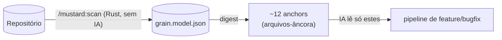
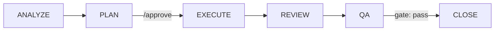

# Mustard

**Português** · [English](README.en.md)

> *Harness* de desenvolvimento de software assistido por IA — impõe um pipeline disciplinado, auditável e econômico em contexto sobre o Claude Code.

O **Mustard** envolve o Claude Code e transforma "peça uma feature para a IA" em um **pipeline orientado a especificação** (Spec-Driven Development / SDD): fases nomeadas, portões bloqueantes e um rastro de eventos auditável. A disciplina não depende da boa vontade do modelo — a **máquina a impõe** via *hooks* e *gates*.

A tese do projeto é **mínimo de IA, máximo de determinismo**: tudo que pode ser resolvido por estatística, grafo ou regra fica num núcleo em Rust; a IA aparece só na orquestração e no raciocínio, nunca embutida no motor.

---

## Princípio central

> **O código-fonte nunca é lido em massa.**



1. **`/mustard:scan`** minera o repositório **uma vez** para um modelo durável (`grain.model.json`) — de forma **determinística, sem IA e agnóstica de linguagem/arquitetura**: módulos, declarações, grafo de dependências, *roles*, *slices*, contratos e *touchpoints*.
2. Os comandos de pipeline consomem esse modelo via **digest** (`mustard-rt run feature`, `scan spec`) e leem apenas as ~12 *anchors* que o digest aponta.
3. Resultado: **economia de contexto** — o digest acha *onde olhar*, não substitui ler.

> O peso real do harness não são os comandos, e sim a **reinjeção da cerimônia no contexto a cada turno**. Por isso o roteamento escolhe sempre o **caminho mais barato que serve** — o pipeline completo é a exceção que precisa se justificar (≥2 camadas/subprojetos **ou** entidade nova), não o default.

---

## Instalação

Pré-requisito único em todos os ambientes: **[Claude Code](https://docs.claude.com/claude-code)** instalado e logado (`claude --version` responde). Você **não** precisa de Rust, Node ou qualquer ferramenta de desenvolvimento — os instaladores trazem tudo pré-compilado.

### Passo 1 — instalador do seu sistema

Baixe **um** arquivo na página de [**Releases**](https://github.com/rubensrpj/mustard/releases) (seção *Assets*). Cada instalador traz o CLI completo (`mustard`, `mustard-rt`, `mustard-mcp`, `scan`, `rtk`) **e** o **Mustard Dashboard**:

| Sistema | Arquivo | Depois de baixar |
|---|---|---|
| 🪟 **Windows** 10/11 | `Mustard Dashboard_<versão>_x64-setup.exe` | Duplo-clique. No aviso do SmartScreen (o instalador não é assinado): **"Mais informações" → "Executar assim mesmo"**. Ao final, **abra um terminal novo** — o PATH só vale em terminais abertos depois da instalação. |
| 🍎 **macOS** 11+ (Intel + Apple Silicon) | `Mustard-<versão>-universal.pkg` | O pacote não é assinado: **botão direito → Abrir** (Gatekeeper). Siga o assistente e abra um terminal novo. |
| 🐧 **Linux** (Ubuntu 22.04+) | `mustard_<versão>_amd64.deb` + `install.sh` | Coloque os dois na mesma pasta e rode `./install.sh` (usa `apt` para resolver dependências). |

Verifique num terminal novo:

```bash
mustard --version
mustard-rt --version
```

O passo a passo completo de cada sistema (incluindo problemas comuns e desinstalação) está nos *Assets* de cada release: `TUTORIAL-WINDOWS.md`, `TUTORIAL-MACOS.md`, `TUTORIAL-LINUX.md`.

### Passo 2 — plugin no Claude Code

O harness (comandos `/mustard:*`, hooks, gates, agentes e o servidor MCP de memória) é distribuído como **plugin do Claude Code**:

```
/plugin marketplace add <repositório do marketplace>
/plugin install mustard@mustard-local
```

Reinicie (ou recarregue) o Claude Code para os hooks entrarem. Enquanto o marketplace público não é publicado, o `add` aceita o caminho de um clone local deste repositório — a raiz que contém `.claude-plugin/marketplace.json`.

> **Binários automáticos:** o plugin não carrega binários no git. Na **primeira sessão**, o bootstrap (`mustard-boot`) baixa o pacote `mustard-bins-<versão>-<sistema>` dos *Assets* do Release correspondente à versão do plugin e o instala dentro do próprio plugin — silencioso e à prova de falha (sem rede, a sessão segue normal e ele tenta de novo na próxima). Quem instalou pelo Passo 1 já tem o CLI no PATH de qualquer forma; os dois caminhos convivem.

### Passo 3 — preparar um projeto

Na **raiz do repositório git** do seu projeto (o `init` recusa subpastas de um repo — num monorepo, tudo vive na raiz):

```bash
cd /caminho/do/seu/projeto
mustard init
```

Isso cria o `mustard.json` (configuração única) e a pasta `.claude/` (hooks, skills, templates). A partir daí, **abra o Claude Code normalmente dentro do projeto** e rode:

```
/mustard:scan       ← mapeia o repositório (uma vez; re-rode após grandes mudanças)
/mustard            ← a porta única: descreva o que quer em palavras suas
```

### Para desenvolvedores deste repositório

```powershell
# Compila os binários em release, instala e roda `mustard init` no alvo:
.\install.ps1                  # alvo = diretório atual (com prompt)
.\install.ps1 -Target ..\app   # outro projeto (sem prompt)
```

---

## Pipeline canônico



| Escopo | Detecção | Fluxo |
|---|---|---|
| **Light** | 1-2 camadas, ≤5 arquivos, padrão conhecido | Pula o PLAN: `ANALYZE → EXECUTE → REVIEW → QA → CLOSE` |
| **Full** | 3+ camadas ou entidade nova | Completo, com **aprovação humana** entre PLAN e EXECUTE |

Cada fase emite eventos; os *gates* bloqueiam o avanço. O **close-gate** não deixa fechar sem um `qa.result` com `overall=pass`; editar a spec depois de um QA aprovado marca o pass como *stale* e re-bloqueia até o QA rodar de novo.

---

## Comandos

Instalado como plugin, todo comando vive no namespace `/mustard:`.

### A porta única

| Comando | Papel |
|---|---|
| `/mustard` | **Comece por aqui.** Descreva o que quer em linguagem natural — ele classifica (feature / mudança / correção / investigação + escopo), narra como leu o pedido e despacha o fluxo certo. Só pergunta em ambiguidade genuína. |

### Pipeline

| Comando | Papel |
|---|---|
| `/mustard:scan` | Minera o repositório em `grain.model.json` (determinístico, sem IA) e enriquece os mapas por subprojeto (Guards + moldes de padrão). |
| `/mustard:feature` | Pipeline completo de feature: entende, pesquisa via digest, planeja, implementa. |
| `/mustard:bugfix` | Diagnóstico + correção autônomos. *Fast path* (1-2 arquivos) ou *full path* (spec enxuta). |
| `/mustard:spec` | *Picker* único — aprova uma spec planejada ou retoma uma em andamento. |
| `/mustard:review` | Revisão adversarial por subprojeto (auto-detecta o PR do branch ou aceita número/URL). |
| `/mustard:qa` | Executa os critérios de aceitação (AC) e reporta pass/fail. Bloqueia o CLOSE em falha. |
| `/mustard:close` | Verifica build/review/QA, arquiva a spec e emite o banner de conclusão. |
| `/mustard:tactical-fix` | Cria uma sub-spec ligada a um pai, preservando a pureza do SDD. |

### Apoio

| Comando | Papel |
|---|---|
| `/mustard:task` | Delegação de trabalho sem spec (analyze, audit, refactor, docs…). |
| `/mustard:git` | Commit/push/sync/merge — lê o *git flow* do `mustard.json`. Sobe sempre o trabalho completo; apenas operações reversíveis. |
| `/mustard:maint` | Higiene do projeto: dependências, validate, sync, doctor. |
| `/mustard:status` · `/mustard:stats` | Estado do pipeline e da entidade · métricas (DORA, economia de tokens). |
| `/mustard:knowledge` | Base de conhecimento, padrões, convenções, auditoria de memória. |
| `/mustard:skills` | Instala/cria/lista/otimiza/avalia *skills*. |
| `/mustard:unhook` · `/mustard:rehook` | Desliga / religa o harness (hooks). |

---

## Dashboard

O **Mustard Dashboard** é o aplicativo desktop (Tauri + React) de telemetria do harness: ele lê os eventos NDJSON que os hooks gravam em `.claude/` de cada projeto, **direto do disco e ao vivo** — sem servidor, sem banco de dados, sem depender de sessão aberta.

### Abrir

| Sistema | Como |
|---|---|
| Windows | Menu Iniciar → **"Mustard Dashboard"** |
| macOS | Launchpad / pasta **Aplicativos** → **"Mustard Dashboard"** |
| Linux | Menu de aplicativos → **"Mustard Dashboard"** |

### Primeiro uso

1. Abra **Configurações** (Settings) no menu lateral.
2. Aponte a **pasta-raiz de projetos** — o diretório que contém seus repositórios (ex.: `C:\Atiz` ou `~/code`).
3. O dashboard **descobre sozinho** todo projeto com Mustard iniciado (`mustard.json` + `.claude/`) dentro dela.

### O que cada área mostra

| Área | Conteúdo |
|---|---|
| **Workspace** | Visão geral agregada de todos os projetos descobertos: pipelines ativos, últimos eventos, saúde. |
| **Atividade** | A execução **ao vivo**: pipeline em andamento, ondas, agentes despachados e o trace agrupado por agente/onda. |
| **Specs** | Todas as especificações com o estado do ciclo de vida (ativas, suspeitas, encerradas), critérios de aceitação e ondas. |
| **Economia** | Métricas de tokens: consumo por sessão/spec e a economia obtida (rtk, digest, roteamento). |
| **Conhecimento** | A base de conhecimento do projeto (padrões, convenções, decisões registradas). |
| **Comandos** | Histórico de comandos do pipeline executados. |
| **Sessões** | Histórico de sessões do Claude Code no projeto, com drill-down por sessão. |
| **Detalhe do projeto** | Por projeto: specs, trace de execução e o cartão do pipeline ao vivo. |

> Dica: deixe o dashboard aberto num segundo monitor enquanto o Claude Code trabalha — a aba **Atividade** mostra cada onda e agente em tempo real, e **Specs** reflete os gates (QA aprovado, CLOSE bloqueado etc.) no momento em que acontecem.

---

## Spec-Driven Development

As specs vivem num layout **plano** em `.claude/spec/{name}/`:

- **`spec.md`** — pura narrativa (sem metadata de lifecycle).
- **`meta.json`** — fonte única de verdade do ciclo de vida (`stage` + `outcome` + `flags`). Não há pastas `active/`, `completed/` ou `superseded/`: arquivamento é semântico (um evento `pipeline.status`), não um *move* de filesystem.
- **`wave-plan.md`** + `wave-N-{role}/spec.md` — para o escopo full (uma sub-spec por onda).

Mudanças no meio do caminho são auto-registradas (`change-requests.ndjson` + `change-log.md` legível) — nada se perde, e a narrativa congelada não é tocada.

---

## Arquitetura (monorepo)

| Caminho | Crate/App | Stack | Papel |
|---|---|---|---|
| `apps/rt` | `mustard-rt` | Rust | **Núcleo determinístico** — scan-digest, eventos, gates, hooks, comandos do pipeline. É o motor. |
| `apps/scan` | `scan` | Rust | Minerador do repositório → `grain.model.json`. |
| `apps/cli` | `mustard` | Rust | Instalação e *scaffold* — `init`, gramáticas, git-flow, fontes. |
| `apps/mcp` | `mustard-mcp` | Rust | Servidor MCP (memória/consultas do harness). |
| `packages/core` | `core` | Rust | Tipos e lógica compartilhados (ex.: `ProjectConfig`). |
| `apps/dashboard` | `mustard-dashboard` | Tauri + React | UI de telemetria (specs, runs, trace, métricas). Lê NDJSON; fora do workspace Cargo. |
| `plugin/` | — | — | O plugin do Claude Code: comandos, hooks, agentes, MCP e o bootstrap `mustard-boot` (baixa os binários do Release na primeira sessão). |

O `cargo build --workspace` cobre os crates Rust; o dashboard é construído via `pnpm`.

---

## Build & testes

```bash
# Rust (workspace)
cargo build --workspace            # ou: pnpm build:rust
cargo test  --workspace            # ou: pnpm test:rust
cargo clippy --workspace           # lint

# Dashboard (Tauri + React)
pnpm dashboard:dev                 # dev com HMR
pnpm dashboard:build               # build de produção

# Tudo junto
pnpm build                         # workspace Rust + dashboard
pnpm test                          # idem
```

**Release oficial:** uma tag `vX.Y.Z` dispara o workflow que gera um instalador completo por sistema + os pacotes `mustard-bins-*` (consumidos pelo bootstrap do plugin) e publica tudo num GitHub Release. A versão da tag **deve** bater com `plugin/.claude-plugin/plugin.json` — o workflow recusa tag dessincronizada. O disparo manual (Actions → Release → Run workflow) faz um **ensaio**: builda tudo sem publicar.

---

## Configuração

O `mustard.json` na raiz é a **fonte única** de configuração do projeto:

```jsonc
{
  "git":  { "flow": { "*": "dev", "dev": "main" }, "provider": "github" },
  "buildCommand": "cargo build",
  "testCommand":  "cargo test",
  "lintCommand":  "cargo clippy",
  "typeCheckCommand": "cargo check",
  "specLang": "pt-BR",      // idioma dos artefatos gerados
  "tone":     "didactic"    // tom da prosa gerada
}
```

O Mustard é **agnóstico** de linguagem e de arquitetura: o que é gerado segue `specLang` + `tone`; os comandos de build/test/lint são lidos daqui. Regras de monorepo: todo o estado vive na **raiz** do repositório git; um subprojeto só é um projeto Mustard próprio quando é um repositório git independente (submódulo).

---

## Estrutura do repositório

```
apps/
  rt/         mustard-rt — núcleo determinístico (Rust)
  scan/       minerador do repositório (Rust)
  cli/        mustard — instalador/scaffold (Rust)
  mcp/        servidor MCP (Rust)
  dashboard/  Tauri + React — telemetria
packages/
  core/       tipos/lógica compartilhados (Rust)
plugin/       plugin do Claude Code (comandos, hooks, agentes, bootstrap)
packaging/    instaladores Win/macOS/Linux + tutoriais
docs/         análises e redesenhos arquiteturais
.claude/      config do harness (hooks, skills, refs, specs, grain.model.json)
install.ps1   instalador de desenvolvimento (build + scaffold)
mustard.json  configuração do projeto
```

---

## Documentação

- **[MUSTARD-COMMANDS.md](MUSTARD-COMMANDS.md)** — referência visual de cada comando e seu fluxo (diagramas Mermaid).
- **Tutoriais de instalação** — `packaging/installer/TUTORIAL-{WINDOWS,MACOS,LINUX}.md` (também anexados a cada release).
- **[docs/](docs/)** — redesenhos arquiteturais (índice/digest agnóstico, detecção de stack multissinal, validação do plugin).

---

*Distribuído sob a licença MIT.*
