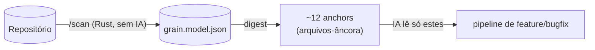
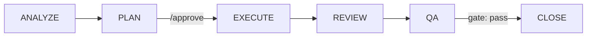

# Mustard

**Português** · [English](README.en.md)

> *Harness* de desenvolvimento de software assistido por IA — impõe um pipeline disciplinado, auditável e econômico em contexto sobre o Claude Code.

O **Mustard** envolve o Claude Code e transforma "peça uma feature para a IA" em um **pipeline orientado a especificação** (Spec-Driven Development / SDD): fases nomeadas, portões bloqueantes e um rastro de eventos auditável. A disciplina não depende da boa vontade do modelo — a **máquina a impõe** via *hooks* e *gates*.

A tese do projeto é **mínimo de IA, máximo de determinismo**: tudo que pode ser resolvido por estatística, grafo ou regra fica num núcleo em Rust; a IA aparece só na orquestração e no raciocínio, nunca embutida no motor.

---

## Princípio central

> **O código-fonte nunca é lido em massa.**



1. **`/scan`** minera o repositório **uma vez** para um modelo durável (`grain.model.json`) — de forma **determinística, sem IA e agnóstica de linguagem/arquitetura**: módulos, declarações, grafo de dependências, *roles*, *slices*, contratos e *touchpoints*.
2. Os comandos de pipeline consomem esse modelo via **digest** (`mustard-rt run feature`, `scan spec`) e leem apenas as ~12 *anchors* que o digest aponta.
3. Resultado: **economia de contexto** — o digest acha *onde olhar*, não substitui ler.

> O peso real do harness não são os comandos, e sim a **reinjeção da cerimônia no contexto a cada turno**. Por isso o roteamento escolhe sempre o **caminho mais barato que serve** — o pipeline completo é a exceção que precisa se justificar (≥2 camadas/subprojetos **ou** entidade nova), não o default.

---

## Pipeline canônico



| Escopo | Detecção | Fluxo |
|---|---|---|
| **Light** | 1-2 camadas, ≤5 arquivos, padrão conhecido | Pula o PLAN: `ANALYZE → EXECUTE → REVIEW → QA → CLOSE` |
| **Full** | 3+ camadas ou entidade nova | Completo, com **aprovação humana** entre PLAN e EXECUTE |

Cada fase emite eventos; os *gates* bloqueiam o avanço. O **close-gate** não deixa fechar sem um `qa.result` com `overall=pass`; editar a spec depois de um QA aprovado marca o pass como *stale* e re-bloqueia até o QA rodar de novo.

---

## Comandos

### Pipeline (core)

| Comando | Papel |
|---|---|
| `/scan` | Minera o repositório em `grain.model.json` (determinístico, sem IA). Produto durável que alimenta todo o resto. |
| `/feature` | Pipeline completo de feature: entende, pesquisa via digest, planeja, implementa. |
| `/bugfix` | Diagnóstico + correção autônomos. *Fast path* (1-2 arquivos) ou *full path* (spec enxuta). |
| `/spec` | *Picker* único — aprova uma spec planejada ou retoma uma em andamento. |
| `/review` | Revisão adversarial por subprojeto (auto-detecta o PR do branch ou aceita número/URL). |
| `/qa` | Executa os critérios de aceitação (AC) e reporta pass/fail. Bloqueia o CLOSE em falha. |
| `/close` | Verifica build/review/QA, arquiva a spec e emite o banner de conclusão. |
| `/tactical-fix` | Cria uma sub-spec ligada a um pai, preservando a pureza do SDD. |
| `/prd` | Lapida uma intenção em texto livre num PRD JSON para o dashboard. |

### Apoio (fora do pipeline)

| Comando | Papel |
|---|---|
| `/task` | Delegação de trabalho sem spec (analyze, audit, refactor, docs…). |
| `/git` | Commit/push/sync/merge — lê o *git flow* do `mustard.json`. Apenas operações reversíveis. |
| `/maint` | Higiene do projeto: dependências, validate, sync, doctor. |
| `/status` · `/stats` | Estado do pipeline e da entidade · métricas (DORA, economia de tokens). |
| `/knowledge` | Base de conhecimento, padrões, convenções, auditoria de memória. |
| `/skill` | Instala/cria/lista/otimiza/avalia *skills*. |
| `/unhook` · `/rehook` | Desliga / religa o harness (hooks). |

---

## Spec-Driven Development

As specs vivem num layout **plano** em `.claude/spec/{name}/`:

- **`spec.md`** — pura narrativa (sem metadata de lifecycle).
- **`meta.json`** — fonte única de verdade do ciclo de vida (`stage` + `outcome` + `flags`). Não há pastas `active/`, `completed/` ou `superseded/`: arquivamento é semântico (um evento `pipeline.status`), não um *move* de filesystem.
- **`wave-plan.md`** + `wave-N-{role}/spec.md` — para o escopo full (uma sub-spec por onda).

Mudanças no meio do caminho são auto-registradas (`change-requests.ndjson` + `change-log.md` legível) — nada se perde, e a narrativa congelada não é tocada.

---

## Arquitetura (monorepo)

| Caminho | Crate/App | Stack | Papel |
|---|---|---|---|
| `apps/rt` | `mustard-rt` | Rust | **Núcleo determinístico** — scan-digest, eventos, gates, hooks, comandos do pipeline. É o motor. |
| `apps/scan` | `scan` | Rust | Minerador do repositório → `grain.model.json`. |
| `apps/cli` | `mustard` | Rust | Instalação e *scaffold* — `init`, gramáticas, git-flow, fontes. |
| `apps/mcp` | — | Rust | Servidor MCP. |
| `packages/core` | `core` | Rust | Tipos e lógica compartilhados (ex.: `ProjectConfig`). |
| `apps/dashboard` | `mustard-dashboard` | Tauri + React | UI de telemetria (specs, runs, trace, métricas). Lê NDJSON; fora do workspace Cargo. |

O `cargo build --workspace` cobre os crates Rust; o dashboard é construído via `pnpm`.

---

## Instalação

Requer **Rust** (`cargo`), **pnpm** e **PowerShell** (o instalador é `pwsh`).

```powershell
# Compila os três binários (scan, mustard-rt, mustard) em release,
# instala em ~/.cargo/bin e roda `mustard init` no projeto-alvo.
.\install.ps1                  # alvo = diretório atual (com prompt)
.\install.ps1 -Target ..\app   # instala em outro projeto (sem prompt)
.\install.ps1 -Force           # sobrescreve um .claude/ existente
```

Os *hooks* em `.claude/settings.json` invocam `mustard-rt` pelo PATH; por isso os binários vão para `~/.cargo/bin`. Pacotes pré-compilados (Windows/Linux) podem ser gerados via `packaging/build-packages.ps1` → `dist/*.zip` + `*.tar.gz`.

---

## Build & testes

```bash
# Rust (workspace)
cargo build --workspace            # ou: pnpm build:rust
cargo test  --workspace            # ou: pnpm test:rust
cargo clippy --workspace           # lint

# Dashboard (Tauri + React)
pnpm dashboard:dev                 # dev com HMR
pnpm dashboard:build               # build de produção

# Tudo junto
pnpm build                         # workspace Rust + dashboard
pnpm test                          # idem
```

---

## Configuração

O `mustard.json` na raiz é a **fonte única** de configuração do projeto:

```jsonc
{
  "git":  { "flow": { "*": "dev", "dev": "main" }, "provider": "github" },
  "buildCommand": "cargo build",
  "testCommand":  "cargo test",
  "lintCommand":  "cargo clippy",
  "typeCheckCommand": "cargo check",
  "specLang": "pt-BR",      // idioma dos artefatos gerados
  "tone":     "didactic",   // tom da prosa gerada
  "runtime":  { "kind": "native", "os": "windows", "arch": "x86_64" },
  "version":  "3.1.36"
}
```

O Mustard é **agnóstico** de linguagem e de arquitetura: o que é gerado segue `specLang` + `tone`; os comandos de build/test/lint são lidos daqui.

---

## Estrutura do repositório

```
apps/
  rt/         mustard-rt — núcleo determinístico (Rust)
  scan/       minerador do repositório (Rust)
  cli/        mustard — instalador/scaffold (Rust)
  mcp/        servidor MCP (Rust)
  dashboard/  Tauri + React — telemetria
packages/
  core/       tipos/lógica compartilhados (Rust)
packaging/    scripts de empacotamento Win/Linux
docs/         análises e redesenhos arquiteturais
.claude/      config do harness (hooks, skills, refs, specs, grain.model.json)
install.ps1   instalador (build + scaffold)
mustard.json  configuração do projeto
```

---

## Documentação

- **[MUSTARD-COMMANDS.md](MUSTARD-COMMANDS.md)** — referência visual de cada comando e seu fluxo (diagramas Mermaid).
- **[.claude/pipeline-config.md](.claude/pipeline-config.md)** — regras, fases, naming, *role rules* e hooks.
- **[docs/](docs/)** — redesenhos arquiteturais (índice/digest agnóstico, detecção de stack multissinal, léxico auto-enriquecido, loop de outcome).

---

*Projeto privado. Versão 3.1.36.*
