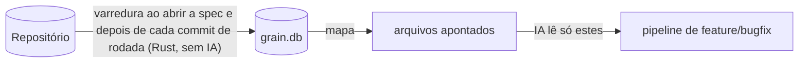
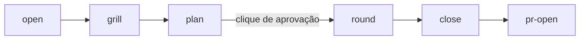

# Mustard

**Português** · [English](README.en.md)

> *Harness* de desenvolvimento de software assistido por IA — impõe um pipeline disciplinado, auditável e econômico em contexto sobre o Claude Code.

O **Mustard** envolve o Claude Code e transforma "peça uma feature para a IA" em um **pipeline orientado a especificação** (Spec-Driven Development / SDD): fases nomeadas, portões bloqueantes e um rastro de eventos auditável. A disciplina não depende da boa vontade do modelo — a **máquina a impõe** via *hooks* e *gates*.

A tese do projeto é **mínimo de IA, máximo de determinismo**: tudo que pode ser resolvido por estatística, grafo ou regra fica num núcleo em Rust; a IA aparece só na orquestração e no raciocínio, nunca embutida no motor.

---

## Princípio central

> A busca começa na evidência local; o modelo expande a leitura do código quando necessário.


```mermaid
flowchart LR
    repo[("Repositório")] -->|"varredura ao abrir a spec e depois de cada commit de rodada (Rust, sem IA)"| model[("grain.db")]
    model -->|mapa| anchors["arquivos apontados"]
    anchors -->|"IA lê só estes"| work["pipeline de feature/bugfix"]
```

1. A **varredura** minera o repositório para um modelo durável (`grain.db`, um banco SQLite em blocos que só regrava o bloco que mudou) — de forma **determinística, sem IA e agnóstica de linguagem/arquitetura**: módulos, declarações, grafo de dependências, *roles*, *slices* e contratos. Roda na instalação, ao abrir a spec e depois de commits da rodada; `mustard-rt run scan` atualiza explicitamente. Limites de parse e origem das relações ficam visíveis.
2. Os comandos do fluxo consultam esse modelo pelo **mapa** (`mustard-rt run map`) e preparam trechos atuais com referências. Dependências e testes candidatos orientam a descoberta; não provam comportamento ou cobertura.
3. Resultado: **economia de contexto** — o mapa acha *onde olhar*, não substitui ler.

> O binário cuida de estado, recuperação, contexto, orquestração, validação, cálculos e geração de páginas. O modelo raciocina e implementa. Jev só julga ambiguidades pertinentes depois da recuperação local, por uma interface de provedor e cache versionado. Grep/rg literais preservam seus argumentos e não chamam Jev por rotina.

---

## Instalação

Pré-requisito único em todos os ambientes: **[Claude Code](https://docs.claude.com/claude-code)** instalado e logado (`claude --version` responde). Você **não** precisa de Rust, Node ou qualquer ferramenta de desenvolvimento — os instaladores trazem tudo pré-compilado.

### Passo 1 — instalador do seu sistema

No Windows e no macOS, baixe **um** arquivo na página de [**Releases**](https://github.com/rubensrpj/mustard/releases) (seção *Assets*); no **Linux**, uma linha de terminal resolve. Cada instalador traz o CLI completo (`mustard`, `mustard-rt`, `scan`, `rtk`):

| Sistema | O que baixar | O que fazer |
|---|---|---|
| 🪟 **Windows** 10/11 | `Mustard_<versão>_x64-setup.exe` | Duplo-clique. No aviso do SmartScreen (o instalador não é assinado): **"Mais informações" → "Executar assim mesmo"**. Ao final, **abra um terminal novo** — o PATH só vale em terminais abertos depois da instalação. |
| 🍎 **macOS** 11+ (Intel + Apple Silicon) | `Mustard-<versão>-universal.pkg` | O pacote não é assinado: **botão direito → Abrir** (Gatekeeper). Siga o assistente e abra um terminal novo. |
| 🐧 **Linux** (Ubuntu 22.04+) | nenhum — instale numa linha:<br>`curl -fsSL https://github.com/rubensrpj/mustard/releases/latest/download/install.sh \| sh` | O script baixa o `.deb` do último Release e chama o `apt` (que resolve as dependências). Rota manual, para quem quer conferir o `sha256` antes: baixe `mustard_<versão>_amd64.deb` + `install.sh` na mesma pasta e rode `chmod +x install.sh && ./install.sh` — os assets do Release chegam **sem** a permissão de execução, e sem o `chmod` o shell responde `Permission denied`. |

Verifique num terminal novo:

```bash
mustard --version
mustard-rt --version
```

O passo a passo completo de cada sistema (incluindo problemas comuns e desinstalação) está nos *Assets* de cada release: `TUTORIAL-WINDOWS.md`, `TUTORIAL-MACOS.md`, `TUTORIAL-LINUX.md`.

### Passo 2 — plugin no Claude Code

O harness (comandos `/mustard:*`, hooks, gates e agentes) é distribuído como **plugin do Claude Code**:

```
/plugin marketplace add rubensrpj/mustard
/plugin install mustard@mustard-local
```

Reinicie (ou recarregue) o Claude Code para os hooks entrarem. O `add` registra o repositório do Mustard como *marketplace* (é ele que traz o `.claude-plugin/marketplace.json`); o `@mustard-local` no `install` é o **nome do marketplace**, não um caminho. O `add` também aceita o caminho de um clone local deste repositório — a raiz que contém `.claude-plugin/marketplace.json` — e a URL completa do repositório (`https://github.com/rubensrpj/mustard.git`), que é a forma a usar quando o atalho `owner/repo` não consegue clonar.

> **Binários automáticos:** o plugin não carrega binários no git. Na **primeira sessão**, o bootstrap (`mustard-boot`) baixa o pacote `mustard-bins-<versão>-<sistema>` dos *Assets* do Release correspondente à versão do plugin e o instala dentro do próprio plugin — silencioso e à prova de falha (sem rede, a sessão segue normal e ele tenta de novo na próxima). Quem instalou pelo Passo 1 já tem o CLI no PATH de qualquer forma; os dois caminhos convivem.

### Passo 3 — preparar um projeto

Na **raiz do repositório git** do seu projeto (o `init` recusa subpastas de um repo — num monorepo, tudo vive na raiz):

```bash
cd /caminho/do/seu/projeto
mustard init
```

Isso cria `mustard.json`, configurações locais, mapa de início da sessão e agentes de onda/revisão, e monta o mapa do projeto. Abra o Claude Code no projeto e descreva o trabalho. Os comandos nativos indicam o próximo passo; os ganchos registram e protegem o fluxo. A atualização preserva regras, modelos e esforço pessoais.

### Para desenvolvedores deste repositório

```powershell
# Compila os três binários em release numa chamada só (`cargo build --release --locked`),
# copia para ~/.cargo/bin e roda `mustard init` no alvo:
.\install.ps1                  # alvo = diretório atual (com prompt)
.\install.ps1 -Target ..\app   # outro projeto (sem prompt)
```

---

## O fluxo


```mermaid
flowchart LR
    A["open"] --> G["grill"]
    G --> P["plan"]
    P -->|clique de aprovação| R["round"]
    R --> C["close"]
    C --> PR["pr-open"]
```

Cada comando indica o próximo passo. `open` abre a spec; `grill` levanta pontos abertos; `plan` confere o plano para aprovação do usuário. `round` despacha ondas em cópias separadas, integra entregas autorizadas, executa build e provas pertinentes, comita e libera dependentes. `close` executa lint, suíte geral e critérios sobre o código integrado, reaproveitando apenas validação vigente. Um revisor final usa resumos para orientar a conferência no código/diff, inclusive com uma única onda. Falhas abrem consertos rastreáveis. `pr-open` abre o pull request; merge exige pedido do usuário.

O fechamento não fecha enquanto algum critério não tiver a última execução aprovada no `spec.ndjson`, enquanto o lint ou a suíte do projeto falharem, ou enquanto a revisão final do conjunto não tiver sido aprovada.

---

## Comandos

O plugin fornece comandos de fluxo `/mustard:*` e comandos imediatos de Mods para acompanhamento local. Um pedido que muda arquivos abre uma spec; cada comando nativo indica o próximo passo.

| Comando | Papel |
|---|---|
| `/mustard:continue` | Retoma a spec de onde parou. É o botão de reserva: a retomada já acontece no início da sessão. |
| `/mustard:pr` | Abre o pull request, revisa o de um colega ou faz o merge, só a pedido. |
| `/mustard-panel` | Projeto, specs, execução e consumo local, atualizados sem turno do modelo. Requer suporte a Mods (CLI 2.1.287+). |
| `/mustard-pages` | Publicação explícita de `project`, `spec [nome]` ou `report <arquivo.md>` pelo adaptador nativo Cloudflare Pages. Sem configuração, entrega arquivos locais; sem turno do modelo. |
| `/mustard:upsert` | Instala ou atualiza o Mustard no projeto e diagnostica a instalação. Para desligar o Mustard num projeto, ponha `"enabled": false` no `mustard.json`. |

A referência completa — o fluxo, os ganchos e cada comando `mustard-rt run` — está em [`MUSTARD-COMMANDS.md`](MUSTARD-COMMANDS.md).

---

## Spec-Driven Development

As specs vivem em `.claude/spec/{name}/`. `spec.ndjson` é o registro canônico de eventos: requisitos, decisões, tarefas, ondas, leituras, entregas, validação e revisão. O binário grava e consulta projeções por `mustard-rt run write` e `mustard-rt run read`. Pedidos no meio da obra entram nesse mesmo histórico.

O painel Mods reúne projeto/specs e dados da statusline. Eventos de ferramentas, turnos, compactação e agentes atualizam o estado; a consulta a cada 2 s cobre mudanças externas. A publicação do projeto não exige spec aberta; a spec padrão vem da branch atual. Análises e resumos para gestores em Markdown solicitado usam o mesmo layout existente. Páginas externas são geradas só sob pedido explícito, como snapshots datados. `run publish` gera HTML/JSON/manifesto e envia pelo adaptador nativo Cloudflare Pages configurado. Só uma publicação pronta informa `published:true` e URL confirmada; sem configuração, os arquivos ficam locais. Início de sessão e término de onda não sincronizam páginas remotas. `run spend` mede localmente; `--publish`/`--republish` geram/publicam o snapshot estático completo de gasto por pedido explícito. A configuração está em `MUSTARD-COMMANDS.md`; o token fica no ambiente.

---

## Arquitetura (monorepo)

| Caminho | Crate/App | Stack | Papel |
|---|---|---|---|
| `apps/rt` | `mustard-rt` | Rust | **Núcleo determinístico** — scan, mapa, eventos, gates, hooks, comandos do pipeline. É o motor. |
| `apps/scan` | `scan` | Rust | Minerador do repositório → `grain.db` (SQLite). |
| `apps/cli` | `mustard` | Rust | Instalação, configuração do projeto e fontes opcionais. |
| `packages/core` | `core` | Rust | Tipos e lógica compartilhados (ex.: `ProjectConfig`). |
| `plugin/` | — | — | O plugin do Claude Code: comandos, hooks, agentes e o bootstrap `mustard-boot` (baixa os binários do Release na primeira sessão). |

O `cargo build --workspace` cobre todos os crates Rust.

---

## Build & testes

```bash
cargo build --workspace --locked
cargo build --profile mustard-dev --locked  # desenvolvimento incremental
cargo test --workspace --locked
cargo clippy --workspace --all-targets --locked -- -D warnings
```

**Release oficial:** uma tag `vX.Y.Z` dispara o workflow que gera um instalador completo por sistema + os pacotes `mustard-bins-*` (consumidos pelo bootstrap do plugin) e publica tudo num GitHub Release. A versão da tag **deve** bater com `plugin/.claude-plugin/plugin.json` — o workflow recusa tag dessincronizada. O disparo manual (Actions → Release → Run workflow) faz um **ensaio**: builda tudo sem publicar.

---

## Configuração

O `mustard.json` na raiz é a **fonte única** de configuração do projeto:

```jsonc
{
  // "flow" é OPCIONAL e não restringe nada: ele apenas pré-seleciona a base
  // no seletor. De onde uma unidade pode sair vem do git;
  // onde o commit direto é recusado vem do branch padrão do remoto, mais o que
  // "protected" acrescentar. Uma instalação nova não grava "flow".
  "git":  { "provider": "github" },
  "buildCommand": "cargo build",
  "testCommand":  "cargo test",
  "lintCommand":  "cargo clippy",
  "typeCheckCommand": "cargo check",
  "language": {             // os dois idiomas, cada um na sua chave
    "text": "pt-BR",        // conversa, specs, páginas, comentários e commits
    "code": "en-US"         // nomes no código: variáveis, funções, testes, arquivos, comandos e tabelas; sem a chave, inglês
  }
}
```

O Mustard é **agnóstico** de linguagem e de arquitetura: o texto gerado segue `language.text`; os nomes no código (variáveis, funções, testes, arquivos, comandos e tabelas do banco) seguem `language.code`. A instalação pergunta os dois idiomas e grava só o que você escolher; sem escolha, os nomes no código ficam em inglês. Os comandos de build/test/lint são lidos daqui. Regras de monorepo: todo o estado vive na **raiz** do repositório git; um subprojeto só é um projeto Mustard próprio quando é um repositório git independente (submódulo).

---

## Estrutura do repositório

```
apps/
  rt/         mustard-rt — núcleo determinístico (Rust)
  scan/       minerador do repositório (Rust)
  cli/        mustard — instalador/scaffold (Rust)
packages/
  core/       tipos/lógica compartilhados (Rust)
plugin/       plugin do Claude Code (comandos, hooks, agentes, bootstrap)
packaging/    instaladores Win/macOS/Linux + tutoriais
docs/         análises e redesenhos arquiteturais
.claude/      config do harness (hooks, skills, refs, specs, grain.db)
install.ps1   instalador de desenvolvimento (build + scaffold)
mustard.json  configuração do projeto
```

---

## Documentação

- **[MUSTARD-COMMANDS.md](MUSTARD-COMMANDS.md)** — referência visual de cada comando e seu fluxo (diagramas Mermaid).
- **Tutoriais de instalação** — `packaging/installer/TUTORIAL-{WINDOWS,MACOS,LINUX}.md` (também anexados a cada release).
- **[docs/](docs/)** — redesenhos arquiteturais (índice agnóstico, detecção de stack multissinal, validação do plugin).

---

*Distribuído sob a licença MIT.*
