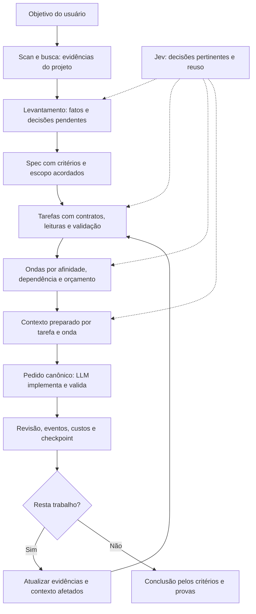
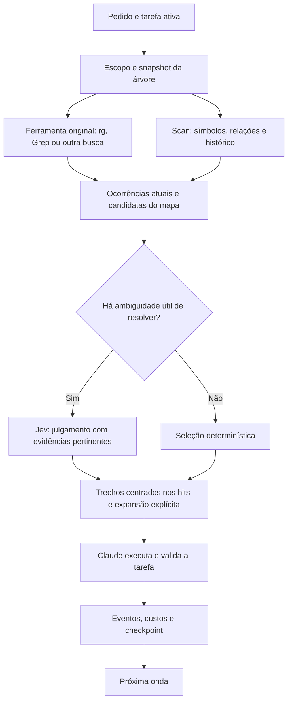
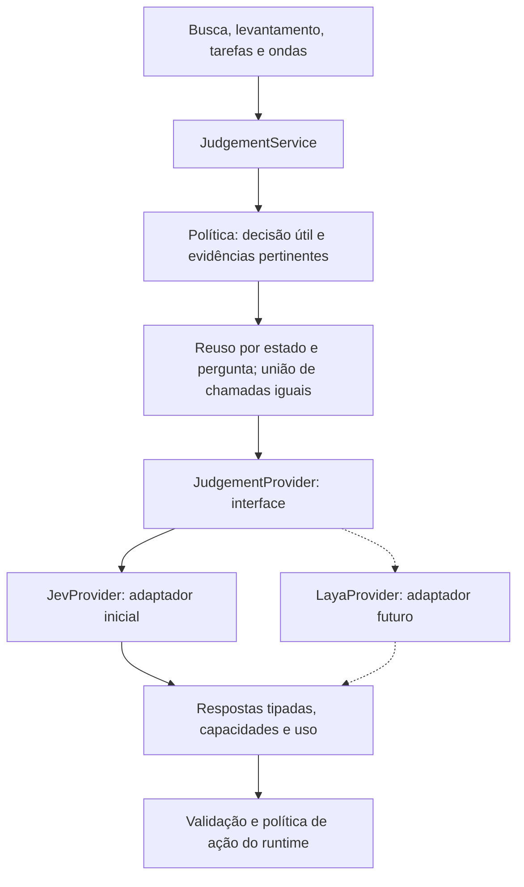

# Plano de evolução do Mustard: specs, ondas, scan, Jev e integração com Claude Code

> Atualização em 07/10/2026: este arquivo é memória da análise de 05/10. Para implementação, usar o [prompt consolidado de 07/10](/home/rubens/projetos/atiz/mustard/docs/2026-10-07-prompt-implementacao-mustard.md), confrontado com `feature/validacao-leve-por-trecho` em `18ef6eed`. Ele incorpora a validação leve aprovada e prevalece sobre contratos divergentes deste plano, especialmente lint/suíte e código novo sem uso por rodada. O item 16 sobre resumos na revisão final foi autorizado pelo usuário.

Data: 05/10/2026. Base revisada: `32fcf441eb6a4a29e2ed9c1f1091191e3128b4fc` (`32fcf441`), branch `fix/levantamento-sem-script`. A análise original usou `2aac13ee`. O usuário definiu implementação pelo Claude Code e validação independente pelo Codex. Este documento reúne requisitos, contratos, propostas e evidências históricas; a seção 0 orienta sua execução quando o usuário a solicitar ao Claude. O Codex nesta conversa continua responsável por análise, revisão do documento e futura validação. Nenhum código do produto, configuração da instalação em uso ou recurso externo foi alterado nesta preparação. Notas sobre ausência de autorização nas auditorias descrevem aquelas etapas, sem impedir uma execução posteriormente autorizada. O código atual é a referência; o README descreve partes de uma arquitetura anterior.

## 0. Instruções para execução pelo Claude Code

### 0.1. Papel deste documento e responsabilidades

Este é o documento de referência da implementação. As seções 1–6 e 9 registram motivação, contratos e decisões; a seção 7 define entregas e critérios; a seção 8 define provas. Claude Code implementa e executa suas verificações. Codex faz a validação independente a partir de commits identificados e evidências. A confirmação do executor de que os testes passaram não é aprovação do Codex.

A execução começa com a instrução do usuário ao Claude. As notas de “não implementar” nas auditorias descrevem a autorização do Codex durante a análise, não uma proibição permanente para o executor. O fluxo vigente do Mustard continua responsável por levantamento, plano, aprovação, ondas, revisão e fechamento; o documento não substitui os registros da spec nem suas aprovações.

As entregas 1–12 descrevem o escopo funcional a preparar e implementar conforme suas dependências. A entrega 13 reúne experimentos opcionais, sem adoção automática. Criar condições para outro provedor faz parte da interface; implementar Laya, fine-tuning ou outro adaptador não faz parte do escopo inicial. Integração com ChatGPT e Cloud Sessions permanecem fora deste trabalho.

### 0.2. Decisões de produto a preservar

- Mustard conduz specs, tarefas, ondas e validação, com melhor instrução ao LLM e menor custo total por trabalho aceito.
- `rg`/ferramenta original encontram ocorrências atuais; scan prepara estrutura e relações com proveniência. Ausência no mapa não prova ausência no projeto.
- Jev é o provedor inicial de julgamentos tipados, por interface. Recuperar evidências localmente, decidir se há julgamento útil, reutilizar estado válido e tratar incerteza. Não substituir esse trabalho por novos tetos de gasto, cortes arbitrários de candidatos ou julgamento de toda ferramenta.
- Regras, dependências, prioridade explícita do usuário, reservas, gravação de estado, aprovação e critérios obrigatórios são determinados pelo runtime; não são decisões delegadas ao Jev.
- O runtime Rust concentra regras e projeções. Mods oferecem painel local e comandos; hooks mantêm o fluxo essencial. Painel e statusline não chamam Jev nem iniciam turno do modelo para renderizar.
- Projeto, specs, ondas e consumo aparecem no painel local. Página/banco externos são gerados somente por ação explícita; a primeira implementação publica snapshots e os atualiza somente quando solicitado.
- Preservar decisões do usuário, configurações pessoais e histórico. Não apagar publicações existentes, migrar a instalação em uso ou publicar o pacote como consequência automática de editar código.

### 0.3. Antes de editar: confrontar o plano com o código

1. Registrar branch, commit-base e estado do checkout escolhido. O snapshot analisado é `32fcf441`; a branch principal pode continuar mudando. Comparar o delta posterior e identificar o que já foi resolvido, mudou de contrato ou afeta a entrega. Não reverter uma evolução recente só para reproduzir uma hipótese antiga deste documento. Confirmar que este arquivo está presente no checkout de execução: nesta preparação ele ainda não está versionado, portanto outro clone/worktree não o recebe pelo checkout de um commit; copiá-lo ou versioná-lo conforme a orientação do usuário.
2. Ler as regras vigentes do repositório e das áreas afetadas. O README não é autoridade quando divergir do código. Conferir as skills contra os contratos atuais antes de aplicar exemplos; a seção 9 registra incompatibilidades concretas.
3. Relacionar a entrega autorizada a tarefas/ondas delimitadas no fluxo existente. Para cada tarefa, definir comportamento anterior e esperado, contratos afetados, critério observável e prova. O executor pode resolver detalhes internos rotineiros e registrar a escolha; dúvida sobre decisão de produto segue a porta existente de esclarecimento.
4. Estabelecer a referência de comparação antes da mudança: commit, casos, configuração, modelo/esforço e métricas disponíveis. Ausência de dados é desconhecida; não é custo zero nem prova de economia.
5. Trabalhar numa cópia coerente e preservar alterações concorrentes. Linhas e links da auditoria ajudam a localizar código, mas símbolos e arquivos devem ser resolvidos no checkout em execução. Caminhos absolutos nos links pertencem à máquina da análise; caminhos depois da raiz `mustard/` são relativos ao repositório. Não ler evidência da raiz principal como se fosse conteúdo da worktree.

### 0.4. Dependências e ordem de trabalho

| Bloco | Entregas | Condição para avançar |
| --- | --- | --- |
| Correção de busca e julgamento | 1 → 2 | Contratos da ferramenta e medição corretos; interface/fallback verificáveis; orientar agentes pelo mesmo comportamento implementado |
| Evidências e execução | 3 → 4; 2/3 → 5/6 | Scan com origem/confiança; levantamento com fatos; afinidade/contexto preservam tarefas, prioridade, obrigações e retomada |
| Estado e interface | 7 → 8 | Projeção local coerente e consumo sem dupla contagem; painel usa essa projeção e preserva fallback |
| Publicação externa | 7/8/9 → 10 | Transporte demonstrado e erros observáveis; publicação por snapshot explícito, sem dependência para aprovar/concluir spec |
| Modelos e distribuição | Medição confiável → 11; entregas adotadas → 12 | Comparação isolada por modelo/esforço; pacote e atualização testados com comportamento final |
| Experimentos | 13 | Finalidade e avaliação específicas; inclusão depende de decisão posterior |

A tabela define dependências, não obrigação de bloquear todo o projeto enquanto um transporte externo é investigado. Recuperação e scan têm interseção com as entregas 1/2; o núcleo pode avançar sem o painel. Entregas podem ser subdivididas em ondas mantendo critérios e uma sequência de commits revisável. Não migrar toda a interceptação para mods como parte implícita da primeira interface.

### 0.5. Regras técnicas e provas por entrega

Na busca, preservar comando completo, flags, status e efeitos; proteger pipes/redirecionamentos e fallback. Ocorrências e sugestões têm identidades distintas. Cache depende do conteúdo, árvore, pergunta, rubrica e provedor/modelo pertinentes, com invalidação e coordenação entre processos verificadas. Não presumir que um mapa compartilhado seja cache de prompt do Claude.

Na orquestração, preservar leitura obrigatória do pedido/itens, `sent_tasks`, propriedade vigente, `join_unmet`, `undone`, prioridade, exclusão de escrita, retomada e conserto. Usar `answer` para resposta/fechamento de ponto; omitir texto opcional sem valor; manter o resumo vigente em Estado, Feito, Decidido, Fatos e Dúvidas. Não recriar o gate de tamanho da entrega removido em `23cd7a9b`. A decisão de continuar/entregar ocorre no término da tarefa; checkpoint intermediário não pode simular esse término.

Na implementação da interface, partir dos contratos reais `MapFilter` e dos consumidores das ondas. Os nomes da seção 6.12 são esquemáticos: fixar tipos e localização conforme as camadas atuais, preservando semântica de respostas, capacidades, erros e medição. Jev implementa o primeiro adaptador; os consumidores ficam livres de transporte e tipos concretos do fornecedor.

Na interface visual e publicação, confirmar versões/capacidades na documentação oficial e no ambiente alvo. Os nomes `/mustard-panel` e `/mustard-publish` são propostas; registrar a superfície final, implementar e verificar paridade entre código e instruções. Transporte inacessível impede declarar a publicação pronta; não implementar um botão que só sugere uma operação sem informá-la ao usuário.

Executar testes relevantes à mudança, provas por processo quando o contrato depender de processo e integração pelo caminho real do usuário. No Mustard, a prova de instalação usa o binário compilado do checkout em revisão, numa pasta temporária vazia: `<checkout>/target/debug/mustard init --yes`. Confirmar atualização, configurações preservadas, templates entregues e funcionamento do fallback. Não usar o binário do PATH como prova da mudança.

Separar testes com provedor falso, replay de recuperação e comparação com julgamentos reais. Teste offline comprova contrato; não comprova qualidade semântica ou economia remota. Comparar ferramentas/casos com dados fixos, registrar o uso observado e incluir falhas. Não definir um percentual arbitrário de economia como verdade nem relaxar qualidade para reduzir tokens. Se um resultado depende de calibração, deixar o critério e a evidência explícitos.

### 0.6. Material a entregar para validação pelo Codex

Cada bloco implementado deve vir com:

1. Identificação da entrega/spec, commit-base, commit final ou intervalo e configuração relevante.
2. Comportamento alterado e critérios atendidos; separar o que já existia na base e o que este bloco implementou.
3. Comandos de verificação, resultados, provas de integração e casos ainda não executados.
4. Compatibilidade/migração, preservação de configurações e modo de desativar/reverter a mudança sem perder estado. Não inventar migração quando nenhuma for necessária.
5. Medição de uso/custo quando disponível, método e limitações. Não declarar economia validada apenas porque o código passou nos testes.
6. Pendências técnicas ou decisões de produto, com impacto sobre as entregas seguintes.

Codex revisa esse snapshot, reproduz verificações pertinentes e reporta falhas com evidências. Commits posteriores são um novo delta; não herdam automaticamente a conclusão da revisão anterior. Manter o progresso na spec e um registro conciso de decisões/validação para que a retomada não dependa de reler toda a conversa.

### 0.7. Mensagem sugerida para iniciar no Claude Code

O prompt foi consolidado em 07/10. Para iniciar a execução, usar o documento novo; a mensagem abaixo encaminha ao contrato atualizado:

```text
Leia docs/2026-10-07-prompt-implementacao-mustard.md e implemente conforme
seus contratos e dependências. Comece pela trilha A de validação leve;
o item A16 foi autorizado. Busca/scan/Jev e painel seguem em specs próprias.
Confronte o delta desde 18ef6eed e registre commits, provas e métricas
para validação independente pelo Codex.
```

## 1. Decisão proposta

O Mustard conduz a criação da spec, transforma seu escopo em tarefas, forma ondas e orquestra execução e validação. O objetivo central é instruir melhor o LLM com baixo consumo ao longo desse processo. O scan passa a fornecer evidências estruturais desde o levantamento até a revisão e a retomada; a ferramenta original encontra ocorrências no conteúdo atual. Jev julga relevância e afinidade em perguntas específicas, acionado seletivamente. O uso é orientado pela utilidade da decisão e pela evidência necessária: eliminar julgamentos dispensáveis, preparar estado pertinente e reutilizar resultados válidos. A auditoria da seção 2.2 e os critérios da seção 6 orientam as prioridades P0; acrescentar tetos de gasto não é a solução proposta para o consumo excessivo. O runtime Rust combina essas decisões, preserva os contratos e prepara o contexto de cada tarefa/onda. Claude planeja, implementa e valida com esse material. Mods oferecem interface, comandos diretos e medição; hooks continuam como integração compatível.

A economia deve começar antes da primeira busca do agente: aproveitar evidências existentes para melhorar o levantamento, evitar replanejamento e reduzir a redescoberta de código a cada onda. Medir custo e tempo por tarefa concluída e por spec aceita, mantendo qualidade. Uma resposta curta isoladamente não demonstra economia: ela pode omitir o trecho necessário, provocar novas buscas e aumentar o custo total.

Não começar por migração integral para mods ou troca de todos os agentes para Opus. Primeiro corrigir os contratos da busca e a medição; depois comparar alternativas com os mesmos dados. O painel e a publicação externa são entregas separadas: corrigir busca não depende da interface, e usar o painel não depende de publicar. A integração com ChatGPT fica para um plano futuro, fora desta primeira sequência.

## 2. O que existe e o que precisa mudar

| Evidência no código atual | Consequência | Intervenção proposta |
| --- | --- | --- |
| `plugin/hooks/hooks.json` encaminha PreToolUse e PostToolUse com matcher `.*`; o registro seleciona as regras internamente | O custo de entrada acontece em todas as chamadas, mas algumas observações precisam dessa abrangência | Medir chamadas que passam sem ação e custo de inicialização; separar observação leve de análise de busca. Preservar os avisos de tamanho |
| `bash_reading` retorna Deny da chamada Bash inteira quando a busca é respondida | Pipes e redirecionamentos podem deixar de executar | Classificar chamada completa antes de substituir; comandos compostos conservam execução e saída |
| O parser de busca ignora algumas opções; a busca interna usa Rust regex e lista de arquivos do Git | Pode divergir de `rg`, `grep` e `git grep` | A ferramenta original passa a ser autoridade das ocorrências. Opções desconhecidas desabilitam transformação |
| A resposta cravada pode trazer candidatos do mapa mesmo sem ocorrência literal | Sugestão estrutural pode parecer resultado da regex | Separar claramente ocorrência comprovada e sugestão do mapa; resultado vazio literal permanece vazio |
| Os corpos mostrados começam na função e são limitados a 40 linhas | Um hit no fim da função pode ficar fora do código entregue | Produzir janelas em torno das ocorrências e metadados exatos do conteúdo entregue |
| `ruler::shown_of` considera o intervalo do cabeçalho da função quando vê código | Pode contar como entregue uma linha que nunca foi exibida | Medir intervalos realmente mostrados, preferencialmente por representação estruturada compartilhada |
| Jev da busca recebe candidatos estruturais; as declarações encontradas pela busca textual não são unidas nessa entrada | Relevância fica limitada à seleção anterior do mapa | Unir candidatos textuais e estruturais antes do julgamento |
| Trechos para Jev são lidos a partir de `request.root` e intervalos do candidato | Há risco de julgar conteúdo da raiz principal quando a tarefa usa worktree | Vincular árvore, caminho, conteúdo e versão ao mesmo snapshot; provar em integração |
| Templates usam `sonnet`/`xhigh`; neste checkout, `mustard.json` e os agentes instalados usam `opus`/`xhigh` | O padrão do produto não é o modelo efetivo deste projeto; alias e esforço influenciam custo | Registrar configuração aplicada e modelo efetivo; preservar escolhas explícitas ao comparar políticas |
| Composição usa alvo de 150 mil tokens, início estimado de 40 mil e crescimento de 35/65/95/125 mil; continuação é decidida ao término da tarefa | A calibração não representa necessariamente modelos novos, e o alvo não bloqueia tarefa em andamento | Recalibrar composição e admissão por modelo/esforço/tarefa, preservando o término; contexto e quota são orçamentos diferentes |
| `survey::map_facts` consulta o mapa principalmente na lacuna sobre dependentes e nomes citados no objetivo | Evidências estruturais entram pouco nas demais perguntas do levantamento | Localizar fluxo, contratos, consumidores e testes relevantes antes de formular perguntas |
| `BoardTask`/`board_parts` enviam descrição, arquivos e dependências declaradas ao Jev, sem resumo estrutural de impacto | Julgamento depende do escopo que a tarefa já declarou | Acrescentar evidências curtas do scan para avaliar afinidade, interfaces e lacunas de escopo |
| `pack_by_kind` agrupa por tipo de trabalho mesmo sem arquivos em comum | Tarefas do mesmo tipo podem exigir contextos diferentes | Comparar agrupamento por afinidade e reutilização de contexto, preservando dependências e reservas |
| `chain_dependents` acrescenta tarefas em espera depois do agrupamento, sem incluí-las na soma de crescimento | A estimativa inicial pode deixar de representar a onda final | Recalcular o orçamento da composição completa antes de despachar |
| O pedido já usa testes, padrões, exemplos, receitas do histórico e `must_read` | Há base para instruir melhor sem reconstruir a preparação | Melhorar seleção, atualidade e leitura agrupada, preservando registros obrigatórios |
| `pattern_example` escolhe por nome do arquivo ou primeiras declarações | O exemplo pode seguir o padrão sem ser o mais pertinente à tarefa | Julgar poucos exemplos candidatos com Jev quando a escolha determinística for ambígua |

Pontos de código principais (linhas da auditoria; resolver símbolos no checkout vigente):

- [Entrada Bash](/home/rubens/projetos/atiz/mustard/apps/rt/src/hooks/bash/reading.rs:90), [busca e composição](/home/rubens/projetos/atiz/mustard/apps/rt/src/shared/word_search.rs:579), [Grep/Read](/home/rubens/projetos/atiz/mustard/apps/rt/src/hooks/write/write_gate.rs:268).
- [Régua de busca](/home/rubens/projetos/atiz/mustard/apps/rt/src/shared/word_search/ruler.rs:139), [porta de candidatos](/home/rubens/projetos/atiz/mustard/apps/rt/src/shared/search_door.rs), [Jev](/home/rubens/projetos/atiz/mustard/apps/rt/src/shared/jev.rs:311), [combinação de lotes](/home/rubens/projetos/atiz/mustard/packages/core/src/domain/map_filter.rs:274).
- [Configuração de agentes](/home/rubens/projetos/atiz/mustard/packages/core/src/domain/config.rs:474), [tamanho de tarefa](/home/rubens/projetos/atiz/mustard/apps/rt/src/shared/task_size.rs:35), [contexto de ondas](/home/rubens/projetos/atiz/mustard/apps/rt/src/hooks/session/conversation_size.rs:72).
- [Contrato de hooks](/home/rubens/projetos/atiz/mustard/packages/core/src/domain/model/contract.rs:362), [serialização da resposta](/home/rubens/projetos/atiz/mustard/apps/rt/src/hook_output.rs), [despacho](/home/rubens/projetos/atiz/mustard/apps/rt/src/dispatch.rs).

### 2.1. Revisão da branch e impacto sobre este plano

Comparações realizadas: `2aac13ee..32fcf441` para mudanças posteriores à análise original e `edf4dd94..32fcf441` para o conjunto da branch em relação à `dev` local. O primeiro intervalo tem sete commits e quarenta e oito arquivos alterados; o segundo tem dezesseis commits e sessenta e oito arquivos. Nove commits já estavam na base original. Após a auditoria dos Markdown em `23cd7a9b`, entraram `35624891` (resposta atômica de ponto, campos opcionais e resumo de retomada) e `32fcf441` (prioridade das tarefas na montagem das ondas). Esses deltas foram inspecionados em código nesta preparação; as execuções de testes continuam vinculadas aos commits indicados na seção 8.

Os quadros do Jev e o algoritmo do scan não mudaram nesse último intervalo; a montagem em `dag.rs`/`backlog.rs` passou a respeitar prioridade determinística. A evolução de afinidade preserva essa precedência, dependências, vagas, arquivos ocupados e limpeza por último. Mantêm-se a medição informativa de linhas e o controle de contexto por tarefa, sem reinstalar a recusa por tamanho retirada em `23cd7a9b`. O levantamento usa a porta `answer` para registrar resposta e fechamento; a retomada aproveita o resumo vigente que acompanha as tarefas. A seção 9 foi ajustada para esses contratos.

Na conferência final, o checkout avançou para `05e1b1f24250ad1da603593edbbc808128b33a2e` (`05e1b1f2`). Esse delta também foi lido: a recusa de remoção de ponto aberto agora ensina `run answer`, em ambos os idiomas, e a regressão existente foi ampliada para verificar o fechamento pelo comando sugerido. Isso já atende parte da orientação de resposta da entrega 4; preservá-lo, sem reimplementar. Nenhum teste desse delta foi executado nesta preparação. Os intervalos e contagens acima continuam referidos a `32fcf441`.

| Contrato existente confirmado | Impacto sobre o plano |
| --- | --- |
| `35624891` acrescenta `run answer`: grava item da resposta e fechamento do ponto sob a mesma trava, ou fecha como não aplicável com motivo; recusa não deixa gravação parcial | Entrega 4 reutiliza essa porta e seus gates. Não pedir ao LLM para duplicar item/fechamento em chamadas independentes; preservar proveniência da mensagem do usuário |
| `35624891` exige omitir texto opcional sem valor; `changes_decision` ausente indica que não há troca de decisão | Não gravar string vazia como ausência. Replanejamento sem troca de decisão segue o contrato atual; troca de decisão mantém autorização do usuário |
| `35624891` organiza a entrega de retomada em Estado, Feito, Decidido, Fatos e Dúvidas; o resumo acompanha as tarefas restantes em quantas ondas saírem e o novo substitui o anterior | Entregas 6/7 usam esse formato, a leitura obrigatória e o resumo vigente. Não criar memória concorrente nem reabrir escolhas já registradas na mesma situação |
| `32fcf441` lê `priority` como motivo textual dado pelo usuário: a tarefa marcada antecede a ordem usual, sem ultrapassar dependências, arquivos ocupados ou vagas; limpeza continua por último e o lote prioritário dispensa espera para crescer | Afinidade e Jev preservam prioridade explícita; o modelo não cria nem julga essa marca. Mudança de precedência não exige reclassificar tamanho intrínseco da tarefa |
| `grill` grava pontos abertos com autor binário, fatos disponíveis e lembretes; repeti-lo não duplica pontos. Sem `--kinds`, usa o tipo gravado ou o prefixo da branch da spec | Entrega 4 amplia evidências nessa porta. Não propor um novo ciclo em que o LLM copie e grave toda a lista |
| `drop_stale_facts` descarta referências inválidas; `write point` com `replaces` e `facts` acrescenta fatos. Resposta que fecha um ponto exige fatos, salvo o caso de não aplicação com motivo | Manter a gravação e os gates existentes. Existência do caminho/linha não prova atualidade semântica; acrescentar versão de conteúdo e pertinência |
| Despacho normal identificado pelo título da onda é reduzido ao título e ao comando de leitura do pedido canônico; texto extra do condutor sai | Preparar contexto dentro de `wave_prompt` e do contrato de leitura. Mod ou condutor não adicionam instruções avulsas ao despacho |
| Conserto por `SendMessage` usa o trecho da recusa referente à onda; ele é associado à volta pendente e trechos antigos são varridos | Não substituir por resumo genérico do Jev nem por nova lista de ordens. Usar o trecho vigente como entrada do contexto de conserto |
| Medição do agente chega ao fim da tarefa, por `write step` com código de tarefa; manda seguir ou entregar e guarda a decisão por agente, atravessando `/clear` | Preservar o ponto de término e distinguir contexto da conversa de consumo acumulado. Checkpoint intermediário não pode usar esse mesmo sinal como se a tarefa tivesse terminado |
| Uma tarefa em andamento não é bloqueada pelo tamanho da conversa. Ao terminar, entrega quando passou de 150 mil ou o restante é menor que o crescimento da maior tarefa terminada; depois da ordem há trava de ferramentas | O teto é alvo para composição e continuação, não bloqueio rígido no meio da tarefa. Calibrar admissão antes de começar sem interromper trabalho pela metade |
| Em `026e0c8e`, o trecho em disco do conserto da volta pendente reabre a trava do agente, inclusive acima do alvo; nova entrega muda a identidade da volta e fecha novamente | Preservar essa exceção no controle de contexto. Não apagar a marca de entrega nem tratar a reabertura como reset do contexto ou da quota. Painel distingue encerramento e conserto liberado |
| Onda recusada cujo Claude do envio encerrou pode receber agente novo, pedido canônico e trecho do conserto na mesma cópia; `900f2288` registra esse despacho sob trava e impede um segundo agente enquanto o novo remetente está aberto | Retomada e painel distinguem agente ativo e espera por substituição; preservar exclusão de escrita, identidade da onda e consumo das tentativas |
| A conferência de `undone` usa tarefas do despacho e resolve versões vigentes; tarefa reassumida por outra onda fica com ela | Não reconstruir retorno só pela marca atual da onda nem recolocar toda tarefa citada no backlog. Preservar histórico de envio e propriedade vigente |
| `join_unmet` associa item não cumprido à tarefa devolvida, acrescentando `covers`, arquivos e orientação; trabalho já coberto não ganha tarefa duplicada | Afinidade e cache consideram a versão completa da tarefa, inclusive novas obrigações. Reaproveitar esse mecanismo na retomada |
| Em `6a8d5ba2`, remover onda sem entrega devolve suas tarefas ao backlog; números de ondas removidas não são reutilizados | Recalcular propriedade e composição, reaproveitando julgamentos intrínsecos quando o conteúdo semântico da tarefa não mudou |
| Scan participa da conferência antes do commit para importações e restos de remoção; recusas têm ciclo de conserto e limite. Desde `23cd7a9b`, tamanho da entrega só informa linhas/arquivos, sem recusa por linhas ou quantidade de testes | Entregas 3/6 antecipam evidências e preservam as conferências vigentes. Jev não aprova entrega nem reinstala a recusa de tamanho removida |
| O mapa da sessão manda incorporar erro, melhoria ou ajuste do mesmo assunto na spec por `write request`; assunto diferente vira pendência e troca de decisão mantém sua autorização | Usar scan/Jev para apoiar a classificação, sem transformar dúvida em mudança automática nem ampliar escopo silenciosamente |
| O início da sessão ainda solicita publicação da página do projeto, e há teste dessa instrução junto do mapa | Entrega 10 remove esse gatilho e atualiza a expectativa dos testes, preservando o mapa e a retomada |

Entradas verificadas: [grill](/home/rubens/projetos/atiz/mustard/apps/rt/src/commands/flow/grill.rs:198), [fatos e fechamento de ponto](/home/rubens/projetos/atiz/mustard/packages/core/src/domain/spec_events/against.rs:362), [despacho e conserto](/home/rubens/projetos/atiz/mustard/apps/rt/src/hooks/task/subagent_inject.rs:137), [término da tarefa](/home/rubens/projetos/atiz/mustard/apps/rt/src/hooks/session/conversation_size.rs:417), [agente de substituição](/home/rubens/projetos/atiz/mustard/apps/rt/src/commands/flow/round/queue.rs:304), [tarefas do envio](/home/rubens/projetos/atiz/mustard/apps/rt/src/commands/flow/round/sent_tasks.rs:17), [itens não cumpridos](/home/rubens/projetos/atiz/mustard/apps/rt/src/commands/flow/round/agreed.rs:206), [validação pelo scan](/home/rubens/projetos/atiz/mustard/apps/rt/src/commands/flow/round/commit.rs:859) e [mapa da sessão](/home/rubens/projetos/atiz/mustard/packages/core/templates/mustard/pt-BR/session-map.md:18).

### 2.2. Auditoria de custo do Jev: corrigir o uso antes de expandir

O usuário informou gasto de US$ 8 nesta branch no dia. A captura posterior mostra US$ 11,98, 299.187.965 tokens e 12.469 requisições, com filtros “All traffic” e “Last 24 hours”; não atribuir esse total automaticamente ao dia local ou à branch. Conciliar janela, fuso, chave/conta, outros projetos e requisições sem registro local antes de declarar equivalência. A tabela abaixo é a soma dos eventos `call` com filtro `jev` ou `jev:<falha>` da spec `levantamento-sem-script`, em 05/10/2026 no fuso America/Sao_Paulo, entre 10:19:03 e 18:09:34. É um recorte dos registros disponíveis, não uma fatura completa.

| Origem | Eventos de chamada | Requisições registradas | Tokens de entrada registrados | Custo local calculado |
| --- | ---: | ---: | ---: | ---: |
| Busca (`word search`) | 170 | 4.591 | 106.668.768 | US$ 4,480085 |
| Formação de ondas (`wave assembly`) | 21 | 21 | 55.146 | US$ 0,002315 |
| Seleção de itens (`wave items`) | 27 | 27 | 88.007 | US$ 0,003700 |
| Total | 218 | 4.639 | 106.811.921 | US$ 4,486100 |

Dos 218 eventos, 215 têm filtro `jev`, dois `jev:network` e um `jev:timeout`. Requisições/tokens/custo são os campos gravados, não o número comprovado de todas as tentativas HTTP. O custo local é estimado com o preço fixado no código e o uso devolvido pelo serviço. O preço publicado para Jev 1.13 continua US$ 0,042 por milhão de tokens de entrada; saída é gratuita. O total de tokens da captura não deve ser convertido como se fosse apenas entrada. [Modelos e preços oficiais](https://docs.typesafe.ai/models).

**99,87% do custo registrado nessa spec veio das buscas.** Um evento (`id=692`, às 13:48:15) enviou 8.794 candidatos em 79 requisições, registrando 1.900.360 tokens de entrada e US$ 0,079815. Outro (`id=1144`, às 17:57:44) enviou 7.242 candidatos em 76 requisições para retornar uma peça. Esses exemplos demonstram amplitude excessiva de seleção; não provam que cada peça retornada tenha sido usada pelo agente.

A soma de todas as specs presentes neste checkout no dia é US$ 5,334046, em 5.506 requisições registradas. Não fecha o valor informado nem o painel do fornecedor. Há chamadas soltas da máquina e tráfego que pode pertencer a outros projetos; não somar sem estabelecer propriedade. Não assumir erro de preço, cobrança duplicada ou falha no teto apenas pela diferença.

Contratos e problemas confirmados:

- A busca do hook já chama Jev somente quando a triagem é parcial e há candidatos; consultas repetidas idênticas possuem memória por sessão/agente. Apesar desses controles, a seleção do mapa reúne listas inteiras sem teto de candidatos. Cada candidato leva declaração completa, documentação e histórico; a divisão em lotes amplia as requisições. Limitar somente a resposta entregue ao Claude não reduz essa entrada paga.
- A memória existente evita nova intervenção na mesma busca daquele agente; não guarda julgamentos reutilizáveis entre agentes, sessões ou ondas. Cache de decisão precisa de conteúdo/snapshot, objetivo, consulta/flags, modelo e versão das perguntas; compartilhar uma resposta entre conversas não significa compartilhar tokens de contexto do Claude.
- `jev.monthly_budget_usd` existe e tem padrão US$ 10. A configuração atual deste checkout não declara esse campo nem `search.filter`. O padrão é mensal, sem teto diário/spec/busca. A reserva é atômica entre threads do mesmo processo, mas processos concorrentes podem ler o mesmo saldo antes de registrar gastos.
- Se um lote falha, `send_all` devolve erro do conjunto. A medição do chamador não preserva o uso dos lotes que tiveram sucesso antes dessa falha; a reserva não reconcilia a diferença entre estimativa e uso efetivo. Uso ausente aparece como zero no parser. São lacunas de contabilização a investigar na conciliação, não prova de que explicam todo o valor faltante.
- `search.filter: "none"` e orçamento mensal zero já impedem Jev também na formação das ondas e na escolha dos itens, pois a habilitação é compartilhada. Mantêm os caminhos locais de fallback. Ainda não existe nessa porta um controle independente para desligar só o Jev das buscas e preservá-lo nas ondas.

Direção corrigida após o esclarecimento do usuário: a solução deve reduzir trabalho sem utilidade, preservando o Jev onde ele melhora a condução da spec. Os controles de orçamento existentes são uma característica do runtime; não propor novos tetos diários/spec como resposta principal. A entrada deixa de ser determinada por “todos os candidatos cabem em vários lotes” e passa a ser determinada pela pergunta, pelo escopo e pelas evidências que permitem respondê-la.

A entrega 2 permanece P0 por redesenhar a decisão da busca: ferramenta original e scan fazem recuperação; Jev julga pertinência onde isso muda a próxima ação. A quantidade recuperada depende da qualidade e cobertura da seleção, não de um número arbitrário de candidatos. O agente conserva acesso à busca original e à expansão do conteúdo quando houver evidência faltante. As políticas detalhadas por etapa estão na seção 6.

Os usos de ondas custaram pouco neste recorte, mas também precisam evitar reavaliação desnecessária. A melhoria deve ser medida por contexto descoberto, tarefa/spec aceita, retrabalho e custo total Claude + Jev. Menos requisições isoladamente não demonstra ganho. Conciliar registros e fornecedor continua necessário para explicar o gasto; essa medição não depende de criar novos limites. Nenhuma configuração foi alterada nem chamada paga ao Jev foi feita nesta auditoria.

Referências: [registro da spec](/home/rubens/projetos/atiz/mustard/.claude/spec/levantamento-sem-script/spec.ndjson), [seleção sem teto](/home/rubens/projetos/atiz/mustard/packages/core/src/io/map_search.rs:930), [entrada do julgamento](/home/rubens/projetos/atiz/mustard/apps/rt/src/shared/search_door.rs:335), [envio e reserva](/home/rubens/projetos/atiz/mustard/apps/rt/src/shared/jev.rs:311), [orçamento por processo](/home/rubens/projetos/atiz/mustard/apps/rt/src/shared/jev_budget.rs:1), [teto padrão](/home/rubens/projetos/atiz/mustard/packages/core/src/io/jev_gate.rs:68) e [memória por agente](/home/rubens/projetos/atiz/mustard/apps/rt/src/shared/word_search.rs:303).

## 3. Processo desejado

### 3.1. Ciclo da spec e da orquestração



O scan fornece relações e referências, sem decidir sozinho comportamento ou intenção. Jev avalia perguntas delimitadas sobre essas evidências. O runtime governa estado, dependências, limites e persistência. Decisões de produto continuam com o usuário; implementação e análise de comportamento exigem leitura e validação pelo LLM. Num projeto novo, usar requisitos e decisões acordadas enquanto o mapa ainda não oferece evidências suficientes.

### 3.2. Busca durante o processo



Essa é a arquitetura proposta para busca de código. Um pipe como `rg ... | wc -l` retorna a contagem normal; um redirecionamento cria o arquivo solicitado. Não se transforma o resultado de uma computação em uma lista de funções.

Na primeira implementação, executar a ferramenta normalmente e transformar apenas resultados de consultas de código reconhecidas, em PostToolUse. Preservar o objeto de resposta da ferramenta, stderr, falhas e indicadores de interrupção. Saída JSON, contagem, listagem, redirecionamento, comandos compostos ou formato desconhecido passam sem compactação. A transformação também exige saber se a saída original foi truncada.

Para uma ferramenta própria futura, pode-se executar `rg` uma vez com argumentos estruturados e combinar suas ocorrências com o mapa. Esse caminho exige contrato próprio; não pode se passar por uma execução equivalente de qualquer comando Bash. `grep` e `git grep` continuam com seus respectivos motores quando o usuário ou o agente os solicitar.

Quando o resultado excede o orçamento de contexto, indicar quantidade e áreas omitidas, intervalos mostrados, motivo da seleção e meio de expansão. Manter acesso à saída completa por artefato ou consulta explícita com escopo e validade definidos. Não apresentar uma seleção como busca exaustiva.

## 4. Onde os recursos novos entram

### Painel local principal e publicação externa sob demanda

Decisão consolidada: o painel local do mod concentra projeto, spec em curso, outras specs, estados, gastos por spec e consumo geral. A página publicada do projeto deixa de fazer parte do fluxo automático. A publicação externa fica disponível para compartilhar uma spec com alguém fora da máquina: criar seu database e sua página somente após solicitação explícita. Sessão, aprovação e conclusão de ondas não acionam criação ou publicação por conta própria.

| Superfície | Informação proposta | Ritmo de atualização |
| --- | --- | --- |
| Painel local do mod | Projeto, specs e seus estados, ondas/tarefas, consumo por spec e geral, modelo/esforço, scan, Jev, testes e checkpoint | Eventos locais e consulta de estado, sem exigir publicação ou novo turno do modelo |
| Statusline | Projeto/spec, fase, progresso, contexto, modelo/esforço e avisos; indicação de `/mustard-panel` e link externo quando houver publicação | Leitura de resumo local já calculado, sem scan ou chamada Jev durante a renderização |
| Página externa sob demanda | Projeção da spec selecionada com status, ondas, critérios, resultados e consumo autorizado para compartilhar | Snapshot enviado somente por publicação/atualização explícita |

O comando `/mustard-panel` é proposto para abrir as abas Projeto, Specs, Execução e Consumo. Não representa uma URL. Os hyperlinks atuais do statusline abrem páginas no navegador; um link desse tipo não prova que seja possível abrir o painel. Usar o comando e os controles suportados pelo mod, verificando a interação em cada superfície. A barra permanece compacta, e o painel concentra os detalhes.

#### Publicar a partir do painel

Na spec selecionada, oferecer o botão **Publicar acompanhamento**. Fluxo proposto:

1. O usuário seleciona a spec e aciona o botão.
2. O runtime prepara a projeção compartilhável e, pelo transporte validado, cria o database e a página externa.
3. O painel mostra o estado da operação e, após sucesso, **Abrir página** e **Copiar link**. O statusline pode apresentar o link persistido.
4. Novas operações usam a publicação existente, com versões e retomada após falha, evitando duplicar página ou banco.

Um comando como `/mustard-publish <spec>` pode oferecer a mesma ação fora do painel e no fallback sem mods. O nome é ilustrativo e o comando ainda não existe. Botão e comando devem chamar a mesma operação do runtime, sem duplicar regras de publicação no JavaScript.

**Modo da primeira implementação: snapshot com atualização explícita.** Seguindo o pedido de gerar banco/página só ao publicar, **Publicar acompanhamento** envia o estado daquele momento e **Atualizar publicação** envia um novo snapshot quando solicitado. Não há escrita remota automática entre essas ações. A página externa informa a versão e o horário do estado; o painel local continua atualizando pelo estado do runtime.

A página observa o database, mas só reflete alterações que chegam a ele. Essa observação não autoriza o Mustard a sincronizar continuamente. Acompanhamento remoto contínuo fica fora do escopo inicial e exige decisão posterior. Publicar/atualizar e retirar acesso externo são operações distintas; não prometer remoção de acesso sem confirmar a capacidade do transporte. O recorte inicial de compartilhamento é a spec selecionada: status, ondas, critérios e resultados; consumo apenas quando incluído explicitamente. Não enviar código, conversas integrais, segredos ou caminhos absolutos da máquina.

#### Estado unificado no runtime

O runtime Rust permanece responsável por estado, regras, métricas e publicação. O mod é uma camada fina de consulta e interação. Painel, statusline e página externa recebem projeções do mesmo estado persistido; a página externa recebe apenas o recorte escolhido para compartilhamento.

Antes da interface, criar uma porta de consulta estruturada com identificação do projeto, raiz/worktree, spec, sessão/agente, versão do estado e horário da medição. A leitura deve produzir um snapshot coerente de fases, ondas, tarefas, testes, pendências e checkpoint. Para ondas, distinguir execução, volta gravada ainda não assumida, conserto, espera por novo agente, troca de decisão aguardando autorização e parada no limite de consertos. Exibir versão vigente, histórico de despacho e propriedade atual das tarefas; uma volta recebida não significa entrega aceita ou commit concluído. Durante conserto válido, indicar que a execução está liberada mesmo acima do alvo de contexto; após nova entrega, retornar ao estado de espera da conferência, sem zerar consumo. Aproveitar os eventos existentes da spec, incluindo prioridade e o resumo vigente em cinco blocos; não criar um segundo histórico independente no mod. Abertura e atualização do painel consultam dados diretamente, sem iniciar turnos do Claude apenas para redesenhar a interface.

Separar tokens de entrada, saída e cache; custo Jev; estimativa de custo API do Claude; e quota compartilhada da conta. Modelo efetivo e esforço acompanham cada medição. Dados ausentes aparecem como desconhecidos, não como zero. Correlacionar sessão, agente, turno e requisição para impedir dupla contagem de subagentes. Consumo geral precisa declarar seu escopo e período; contexto de uma sessão e quota de conta não são orçamentos exclusivos de cada spec.

#### Dependência técnica da publicação

O fluxo existente usa template e banco: o runtime prepara arquivos/lotes, o orquestrador os envia pelo ArtifactData e a página observa o database. A preparação em Rust não é um cliente remoto de publicação. A existência de APIs de processo, HTTP e MCP em mods também não comprova acesso direto ao ArtifactData. [API de mods](https://code.claude.com/docs/en/plugins/mods/api).

Antes de prometer publicação pelo botão sem turno do modelo, provar como iniciar a criação e enviar dados: transporte suportado, autenticação, retorno dos identificadores e URL, erros e retomada. Se o caminho disponível ainda exigir participação do orquestrador, documentar essa dependência e medir seu consumo. Não atribuir custo zero à publicação externa sem essa prova. A consulta local e o cálculo de métricas continuam independentes desse transporte.

Remover os gatilhos automáticos somente na migração da publicação. Publicação deixa de ser pré-requisito para aprovar ou concluir a spec. Projetos/specs não compartilhados não geram bancos, páginas ou escritas remotas. Preservar referências e histórico de páginas já publicadas, sem apagar recursos externos automaticamente.

Pontos de integração: [projeto](/home/rubens/projetos/atiz/mustard/packages/core/templates/pages/project.html), [spec](/home/rubens/projetos/atiz/mustard/packages/core/templates/pages/spec.html), [contrato dos templates](/home/rubens/projetos/atiz/mustard/packages/core/src/platform/page_templates.rs), [preparação da cópia](/home/rubens/projetos/atiz/mustard/apps/rt/src/commands/spec_events/pages/copy.rs), [avisos de início da sessão](/home/rubens/projetos/atiz/mustard/apps/rt/src/hooks/session/session_start_inject.rs) e [statusline](/home/rubens/projetos/atiz/mustard/apps/rt/src/commands/statusline/mod.rs). Copiar dados não troca sozinho o HTML publicado; mudanças de layout exigem tratamento próprio conforme a política existente.

### Mods: interface e observação primeiro

Mods executam handlers JavaScript/TypeScript dentro do Claude Code e podem oferecer painéis e comandos sem turno do modelo. Requerem v2.1.287 ou posterior. A interface gráfica do mod aparece no terminal e no Desktop; outras superfícies têm suporte diferente. [Documentação oficial de mods](https://code.claude.com/docs/en/plugins/mods/overview).

A versão observada nesta máquina foi 2.1.289, acima do mínimo documentado. Isso confirma o requisito de versão, mas não substitui teste de instalação, eventos e abertura do painel. [Referência do SDK](https://code.claude.com/docs/en/plugins/mods/reference).

Proposta para o Mustard: uma camada fina no plugin que consulta o runtime Rust e mostra projeto/specs, onda, tarefas, impedimentos, idade do mapa, custo Jev e orçamento da sessão. Comandos propostos como `/mustard-status` e `/mustard-search-expand` executam código diretamente. São nomes de interface planejados, não comandos existentes.

Os eventos `turn.step` e `turn.complete` permitem observar uso reportado, incluindo cache e modelo, também em subagentes. [Eventos de mods](https://code.claude.com/docs/en/plugins/mods/events). Correlacionar esses eventos com sessão, agente, onda e tarefa. Deduplicar totais por request/turno; não somar os mesmos tokens duas vezes.

Colocar indicadores variáveis no painel, evitando acrescentá-los repetidamente ao prompt. Manter as regras em Rust e um único contrato de decisão. Executar só um adaptador responsável por cada transformação, para evitar julgamento duplo por mod e hook. Caso a medição confirme custo relevante de processos, avaliar IPC com runtime persistente, com invalidação de estado por mudança de árvore. A mera troca para JavaScript não elimina subprocessos Rust.

### Wrap-Up Allowance: finalizar a etapa e persistir a retomada

A tolerância é automática para contas elegíveis, exige Claude Code v2.1.277 ou posterior, é limitada e conta na quota semanal. Não se aplica a API key; pode acabar sem completar a tarefa. [Regras oficiais](https://support.claude.com/en/articles/17040437-claude-code-wrap-up-allowance).

Proposta: estado de encerramento que impede abrir novas ondas e prioriza registrar alterações, resultado dos testes, pendências e próxima ação. Reutilizar o registro de eventos da spec e a retomada já existentes. Não marcar tarefa concluída só porque a sessão acabou; testes ainda não executados ficam pendentes.

Aproveitar os passos, entregas, resumos e bloco de retomada já existentes; ampliar registro de progresso sem depender de um último turno de texto. Checkpoint de edição não deve gravar `write step` com código da tarefa antes de ela terminar: esse comando já dispara a decisão de seguir ou entregar. Distinguir encerramento por tamanho da conversa, fim da sessão e allowance; a medição por término de tarefa não é um sinal de quota ou de wrap-up. Confirmar se a versão alvo expõe um sinal estruturado de wrap-up; se não expuser, usar pedido explícito de encerramento e sinais disponíveis, sem depender de scraping da mensagem da interface. Isso também atende cancelamentos e interrupções sem allowance.

### Opus 5.5: decisões difíceis e revisão de maior alcance

O alias `default` resolve atualmente para Opus 5.5 em diversos tipos de conta, com exceções e configurações superiores; isso não substitui um `model: sonnet` explícito. [Resolução de modelos](https://code.claude.com/docs/en/model-config).

Proposta: Opus para arquitetura, diagnóstico sem causa clara, migrações amplas e revisão de alterações que cruzam áreas. Configurar por papel e complexidade, registrar modelo realmente usado e medir custo por tarefa aceita. A seleção é política configurável; Jev pode sugerir complexidade, mas não deve mudar de modelo continuamente a cada busca.

### Sonnet 5.5: execução delimitada com esforço medido

Proposta: Sonnet como primeira opção para implementação de tarefas bem especificadas e testes. Comparar medium/high/xhigh no conjunto do Mustard antes de alterar o padrão existente. Os preços API publicados são US$ 2/10 por milhão de tokens de entrada/saída para Sonnet 5.5 e US$ 4/20 para Opus 5.5; cache de leitura custa US$ 0,20 em ambos. [Anúncio do Sonnet 5.5](https://www.anthropic.com/claude-sonnet-5-5).

Esses preços não são conversão direta da quota de assinatura. As melhorias anunciadas em benchmarks não são estimativas de economia do Mustard. Comparar custo, tempo, retrabalho e aprovação nos mesmos tickets; fixar versões no experimento para que aliases não alterem a comparação.

### Diretório de plugins: instalação e distribuição

O diretório é um caminho de distribuição, além de marketplace próprio; publicação exige empacotamento e validação. [Publicar plugins](https://code.claude.com/docs/en/plugins/publish).

Proposta: primeiro tornar o pacote reproduzível em máquina limpa: versão do runtime, binários por plataforma, hooks, agentes, configuração, diagnóstico e atualização. Exibir o custo de contexto permanente e o custo quando invocado. Publicar somente depois de provar instalação, upgrade e fallback sem mods.

### Limites de cinco horas e reset: admissão de trabalho

Separar contexto de uma conversa, quota compartilhada de conta e custo próprio do Jev. Um reset promocional é ocasional e depende da oferta disponível; não é capacidade permanente. [Limites e tamanho](https://support.claude.com/en/articles/11647753-how-do-usage-and-length-limits-work), [reset](https://support.claude.com/en/articles/17007452-what-is-a-limit-reset).

Proposta: quando houver informação confiável sobre quota, reduzir admissão de novas ondas e concorrência perto do limite, preservando capacidade de encerramento. Sem essa informação, mostrar quota desconhecida e usar a política conservadora configurada. Não inferir quota restante só dos tokens da sessão. `/compact` libera contexto, mas não devolve quota de uso. Recalibrar tamanho de onda pelo histórico de modelos/esforços novos.

## 5. Scan e Jev ao longo da criação da spec e da orquestração

O scan é uma fonte central de contexto no conceito do Mustard: ajuda a fundamentar a spec, estimar impacto, formar ondas e orientar execução, revisão e retomada. `rg` fornece ocorrência atual; o scan fornece estrutura. A busca literal básica continua funcionando sem mapa. Estrutura ausente, parcial ou velha aparece como limitação explícita e permite recuperação pelo conteúdo atual.

O código já possui normalização, sinônimos, histórico, relações de rotas e conexões entre chamadas frontend e handlers. A preparação da onda já consulta testes, padrões, exemplos e receitas do histórico. O plano amplia o uso e a confiança nessas informações.

### 5.1. Pontos de uso e benefício esperado

| Momento | Papel do scan | Papel seletivo do Jev | Benefício esperado |
| --- | --- | --- | --- |
| Levantamento da spec | Localizar fluxo existente, contratos, consumidores, testes e specs relacionadas | Selecionar evidências pertinentes e classificar lacunas a investigar ou decisões ausentes | Menos exploração inicial e perguntas sobre fatos já disponíveis |
| Definição do escopo | Apresentar áreas possivelmente afetadas e a origem de cada relação | Comparar candidatos com objetivo e limites acordados | Menos descobertas tardias e replanejamento |
| Criação das tarefas | Sugerir símbolos, arquivos, leituras, testes e exemplos relacionados | Avaliar coerência do escopo e necessidade de decisão prévia | Instruções concretas e tarefas com validação definida |
| Formação das ondas | Apresentar contexto compartilhado, interfaces e relações entre tarefas | Julgar afinidade e interferência provável | Menos preparação repetida e conflitos de integração |
| Preparação do agente | Recuperar trechos atuais e referências necessários à tarefa | Ordenar material complementar sob orçamento e selecionar exemplos | Menos buscas para descobrir onde começar |
| Execução e expansão | Recuperar evidências adicionais por dúvida, símbolo ou trecho | Desempatar candidatos plausíveis | Contexto ampliado de forma dirigida |
| Validação e revisão | Relacionar alterações a consumidores, testes e critérios | Priorizar áreas para inspeção | Revisão focada e menos relações esquecidas |
| Retomada e aprendizado | Identificar mudanças desde o contexto anterior e invalidar referências afetadas | Selecionar decisões e lições pertinentes ao trabalho restante | Menos reconstrução da história entre ondas |

Esses benefícios são hipóteses de melhoria a medir. Associação de testes não prova cobertura de execução; chamadas, imports e histórico não provam comportamento ou causalidade. Critérios, provas e gates continuam explícitos.

### 5.2. Levantamento fundamentado em evidências

Antes de formular perguntas, recuperar um conjunto pequeno de evidências do projeto e separar: fatos verificados, hipóteses com referências, decisões do usuário e lacunas ainda sem evidência. O scan encontra os locais candidatos; leitura e validação confirmam o comportamento. Jev pode julgar separadamente se a evidência é pertinente, se uma lacuna pede investigação de código ou se requer decisão de produto. Incerteza conserva a lacuna aberta.

Exemplo: onde uma configuração é persistida e quem a consulta pode ser investigado no código; decidir se ela deve ser global ou específica por projeto continua sendo uma escolha do usuário. O julgamento não encerra automaticamente uma pergunta nem inventa um requisito. Uma falta de resultado no mapa não significa ausência de implementação.

Ampliar a entrada do mapa hoje concentrada na lacuna sobre dependentes para os pontos pertinentes de fluxo, contratos, compatibilidade e validação. A criação idempotente de pontos já ocorre em `grill`: enriquecer `survey::Sources/build` e o caminho de preparação/validação de fatos nessa porta. Acrescentar fatos conferidos com `write point`, `replaces` e `facts`, mantendo o gate de fechamento com evidências. A limpeza existente de caminhos/linhas inválidos é ponto de partida; validar também versão e conteúdo na árvore relevante. Reutilizar specs anteriores e lições que o levantamento já consulta, preservando a origem e o estado vigente de cada decisão.

Entradas principais: [condução e gravação dos pontos](/home/rubens/projetos/atiz/mustard/apps/rt/src/commands/flow/grill.rs:198) e [levantamento e fatos do mapa](/home/rubens/projetos/atiz/mustard/packages/core/src/domain/survey.rs:887).

### 5.3. Tarefas e ondas por afinidade e contexto compartilhado

Ao propor tarefas, associar objetivo e critérios a símbolos/arquivos candidatos, contratos, leituras e validação. Usar o impacto encontrado para conferir lacunas na lista declarada, com justificativa; não reservar automaticamente toda a vizinhança do grafo como área de edição.

A formação atual com Jev agrupa por tipo de trabalho, mesmo sem arquivos em comum, respeitando a soma estimada. Acrescentar três dimensões separadas ao julgamento:

- **Afinidade:** as tarefas pertencem ao mesmo fluxo, contrato ou área?
- **Reutilização:** quanto de leituras, decisões e testes elas compartilham?
- **Interferência:** uma alteração muda pressupostos ou interfaces usados pela outra?

Enviar ao Jev um resumo estrutural curto junto das descrições existentes, sem transmitir o grafo inteiro. Gerar candidatos a agrupamento por relações locais antes do julgamento; evitar comparação indiscriminada de todos os pares de tarefas.

O runtime preserva dependências explícitas, exclusão por arquivos de edição, reservas, ordem e critérios atendidos. Uma relação consumidor/fornecedor não impõe execução sequencial por si só: a necessidade depende da mudança e da compatibilidade. Dependências novas inferidas são propostas rastreáveis, não regras silenciosas. Compartilhar leitura também não significa conflito de escrita. Incorporar item não cumprido pelo mecanismo existente de `join_unmet`; conferir `undone` pelas tarefas do envio com `sent_tasks`, preservando tarefa já reassumida por outra onda. Mudanças de `covers`, arquivos, instruções e decisões invalidam o julgamento anterior mesmo sem alteração nos arquivos de código.

Estimar a onda completa, incluindo tarefas dependentes adicionadas ao lote, contexto comum e conteúdo exclusivo de cada tarefa. `chain_dependents` acrescenta trabalho depois da soma inicial; conferir o orçamento após essa composição. Comparar a estimativa com consumo real e distinguir contexto de entrada de crescimento previsto da conversa. Preservar a medição e a decisão existentes ao término de tarefa; 150 mil não é bloqueio no meio de uma tarefa. Estimar o custo antes de iniciar a próxima, sem reintroduzir uma interrupção por tamanho em toda ferramenta. Preservar a exceção da trava durante conserto: a existência do trecho vigente da volta pendente permite corrigir mesmo acima do alvo. Nova entrega fecha a trava sem apagar marcas, e um arquivo de conserto antigo não a reabre.

Reavaliar a espera de lotes com menos de seis arquivos enquanto outra onda roda: número de arquivos pode não representar afinidade ou custo de preparação. Ajustar apenas mediante comparação que considere latência, ocupação das vagas, contexto repetido e qualidade. Ondas pequenas repetem preparação; ondas amplas demais acumulam contextos distintos.

Entradas: [quadro enviado ao Jev](/home/rubens/projetos/atiz/mustard/apps/rt/src/shared/jev.rs:999), [formação dos lotes](/home/rubens/projetos/atiz/mustard/apps/rt/src/shared/dag.rs:490), [inclusão de dependentes](/home/rubens/projetos/atiz/mustard/apps/rt/src/shared/dag.rs:564) e [despacho do backlog](/home/rubens/projetos/atiz/mustard/apps/rt/src/commands/flow/round/backlog.rs).

### 5.4. Contexto preparado por tarefa e onda

Produzir material de planejamento para elaborar escopo e material de execução específico para a onda. Esse material entra na montagem canônica em `io::wave_prompt` e `domain::wave_prompt` e na porta de leitura correspondente: o despacho normal mantém o título na primeira linha e o comando de leitura, sem anexos do condutor ou do mod. Relacionar cada seleção ao envio e aos itens registrados, preservando os contratos de leitura e retorno. Cada conjunto precisa conter apenas o necessário à etapa, preservando conteúdo obrigatório:

- Objetivo, critérios, decisões e contratos aplicáveis.
- Símbolos e trechos atuais onde a mudança começa.
- Interfaces e consumidores a considerar, com razão da ligação.
- Testes relacionados e comandos de validação.
- Exemplo pertinente do padrão do projeto e lições aplicáveis.
- Pendências e resultado da etapa anterior quando necessário.
- Fontes, raiz/worktree, versão do conteúdo, limitações e meio de expansão.

Conservar o que já existe no pedido e melhorar a seleção. O exemplo atual pode vir do nome do arquivo ou de suas primeiras declarações; quando houver ambiguidade, Jev escolhe entre poucos exemplos estruturais pertinentes à tarefa. Limitar material complementar sem excluir critérios, decisões obrigatórias ou evidência necessária para implementá-los.

Comparar referências curtas seguidas de várias leituras com uma leitura agrupada dos itens necessários. Se adotada, ela entrega os conteúdos integrais exigidos e registra cada item lido pelos mesmos contratos da spec; um resumo não substitui uma leitura obrigatória. Medir chamada adicional, texto total e reutilização, não apenas linhas do pedido inicial.

Reutilizar a parte comum na montagem e entregar o recorte de cada agente. Um artefato compartilhado não implica automaticamente economia de tokens entre conversas: medir uso e cache efetivamente reportados. Atualizar somente o contexto afetado por alterações ou integração de ondas, propagando invalidação quando as relações relevantes mudarem. Validar os trechos na worktree da execução antes de enviar.

Entradas: [montagem do pedido](/home/rubens/projetos/atiz/mustard/packages/core/src/io/wave_prompt.rs:784), [itens e leituras](/home/rubens/projetos/atiz/mustard/packages/core/src/io/wave_prompt.rs:595), [padrões e exemplos](/home/rubens/projetos/atiz/mustard/packages/core/src/io/wave_prompt.rs:1050), [escolha de declaração para exemplo](/home/rubens/projetos/atiz/mustard/packages/core/src/io/wave_prompt.rs:1116) e [seleção de itens pelo Jev](/home/rubens/projetos/atiz/mustard/apps/rt/src/commands/flow/round/item_choice.rs:106).

### 5.5. Validação, retomada e aprendizado

Relacionar o diff real aos critérios, consumidores e testes para preparar a revisão; Jev prioriza investigação, sem aprovar a alteração ou declarar teste aprovado. Manter as validações obrigatórias. O scan já compara mapas antes/depois da integração para conferir importações e restos de remoção antes do commit. Desde `23cd7a9b`, linhas/arquivos são medidos para informação e mensagem de commit; a recusa por tamanho ou quantidade de testes foi retirada. Antecipar os achados pertinentes no pedido para reduzir consertos, mantendo a conferência final no runtime; Jev não libera `role_pair` nem altera limiares ou resultado desses gates. Na retomada, aproveitar o resumo em cinco blocos de `35624891` (Estado, Feito, Decidido, Fatos e Dúvidas), sua substituição pelo resumo novo e seu acompanhamento das tarefas restantes; acrescentar apenas informação pertinente ainda ausente. Não refazer decisões ou verificações já registradas para a mesma situação. Conserto usa o trecho vigente associado à volta recusada, não um resumo alternativo gerado pelo Jev. Se o Claude do envio ainda está ativo, o conserto vai ao agente existente; se encerrou e há recusa pendente com trecho válido, a porta existente pode despachar um agente novo na mesma cópia; `900f2288` impede dois agentes novos concorrentes enquanto o remetente da substituição está aberto. Preservar a identidade da onda, histórico de tentativas e limpeza dos trechos antigos. A correção pode ocorrer com a conversa acima do alvo: a trava de entrega se abre somente enquanto existir o trecho correspondente à volta pendente e se fecha com a nova entrega, mesmo que o trecho anterior ainda esteja em disco. Esse vínculo depende da spec, da onda e da identidade vigente da volta, não apenas de um estado visual de “conserto”.

Reutilizar notas e lições existentes. Conteúdo reaproveitado precisa de origem, escopo e validade; verificar o conteúdo atual antes de usar uma nota associada ao blob do mapa. Julgamento novo de lições pode ser experimento posterior, enquanto a invalidação de contexto e a retomada fazem parte da preparação principal.

Achado novo do mesmo assunto segue a política do mapa da sessão por `write request` na mesma spec. Usar evidências e Jev como apoio para distinguir relação com o objetivo; dúvida pede esclarecimento e mudança de decisão respeita a autorização existente. Assunto diferente segue para pendência. Em spec fechada ou com PR aberto, respeitar a porta de reabertura antes de registrar a solicitação.

### 5.6. Confiança e custo do scan

| Mudança | Entrada no código | Benefício esperado |
| --- | --- | --- |
| Registrar cobertura de parsing: linguagem ausente, falha do parser, árvore parcial e padrões descartados | `apps/scan/src/extract.rs` | Mostrar onde a estrutura é confiável e quando deve haver fallback |
| Separar referência externa conhecida, interna não resolvida e ambígua | `apps/scan/src/graph.rs` | Reduzir falsa confiança em impacto e dependências |
| Preservar razão da ligação de teste: import, uso ou histórico | `apps/scan/src/testmap.rs` | Explicar seleção e evitar vender associação como cobertura de execução |
| Cachear medidas locais por conteúdo; refazer a comparação global necessária | `apps/scan/src/quality.rs`, `apps/scan/src/main.rs` | Reduzir custo de scan incremental sem invalidar indicadores globais |
| Associar versão de conteúdo a intervalo de declaração; atualizar arquivo modificado quando necessário | `word_search.rs`, `jev.rs`, store do mapa | Garantir que hits, snippets e julgamento pertençam à mesma árvore |
| Manter testes, configurações e documentos relevantes no resultado textual | Busca e seleção de candidatos | Evitar que limites do mapa excluam código importante para a tarefa |

Medir tempo de scan completo/incremental, cobertura do parser, resolução do grafo e impacto sobre descoberta. O scan não deve impor uma demora obrigatória a cada busca.

## 6. Jev: critérios de uso verificados na documentação oficial

Documentação consultada em 05/10/2026 para o modelo fixado no Mustard, `jev-1.13.0`. As orientações do fornecedor estão resumidas na seção 6.1; os desenhos das seções seguintes são propostas para este código, não funcionalidades atuais nem garantias do fornecedor. O objetivo é usar o Jev para decisões úteis com estado adequado, sem depender de novos tetos financeiros para corrigir desperdício.

### 6.1. Princípios oficiais e aplicação ao Mustard

| Orientação verificada | Aplicação proposta |
| --- | --- |
| Perguntas delimitadas e decisões tipadas, combinadas por código | Cada julgamento tem finalidade e ação associada; o runtime conserva cálculo e orquestração. [Introdução](https://docs.typesafe.ai/introduction) |
| Estado estruturado com partes nomeadas; conteúdo separado das perguntas | Enviar objetivo, evidência e alternativas identificados. O pacote de execução do Claude e o estado de julgamento do Jev têm necessidades diferentes. [State](https://docs.typesafe.ai/concepts/state) |
| Choice escolhe numa taxonomia completa; incluir alternativa residual quando necessário | Manter todos os tipos válidos de tarefa. Não confundir categorias com o corpus de código recuperável. [Choice](https://docs.typesafe.ai/primitives/choice) |
| Recuperação rápida primeiro, reranking depois | O scan/índice/rg recuperam material plausível; julgamento semântico recebe a seleção. O exemplo do fornecedor usa BM25 e Noul, sem impor seu tamanho de lista ao Mustard. [Re-ranking](https://docs.typesafe.ai/cookbooks/rerank_typesafe) |
| Perguntas sobre o mesmo estado podem ser enviadas juntas, inclusive condicionais | Aproveitar a entrada compartilhada e aplicar respostas pertinentes em Rust. Separar chamadas quando precisam de evidências diferentes. [Fan-out](https://docs.typesafe.ai/patterns/fan-out) |
| Noul avalia uma proposição; Score usa níveis descritivos de uma dimensão | Separar afinidade, risco de interferência e pertinência. Não interpretar probabilidade como intensidade. [Noul](https://docs.typesafe.ai/primitives/noul), [Score](https://docs.typesafe.ai/primitives/score) |
| Choice/Score retornam distribuição e confiança; Noul expressa incerteza na probabilidade | Política de ação calibrada por consequência e dados do Mustard. Incerteza não exige repetir a mesma pergunta. [Confidence](https://docs.typesafe.ai/confidence) |
| Jev 1.13 tem dificuldades com material irrelevante, indireção, cálculos e precisão numérica do Score | Recuperar antes de julgar, explicitar relações e manter contagem/cálculo no runtime. Investigar a conversão atual de Score em tokens. [Limitações de Jev 1.13](https://docs.typesafe.ai/model-jaggedness/jev-1.13) |

Agrupar perguntas necessárias que compartilham um estado suficiente aproveita o serviço. Acrescentar perguntas tem custo de entrada; o ganho de latência não significa custo gratuito. Não enviar um estado enorme para reunir artificialmente todas as decisões do projeto. Também não criar uma cadeia de chamadas para tipo, tamanho e pertinência quando a mesma evidência permite responder juntas. A orientação de agrupamento está em [Primitives](https://docs.typesafe.ai/primitives).

### 6.2. Contrato de utilidade de cada decisão

Antes de enviar, o runtime identifica: qual decisão está aberta, qual ação pode mudar, quais evidências sustentam o julgamento, o que já é determinístico e qual resultado anterior ainda vale. Isso é uma política local; não chamar Jev apenas para decidir se outra chamada ao Jev é necessária.

Não chamar quando o resultado é calculável, o pedido já declara a escolha aplicável, o contexto já foi selecionado sem disputa relevante ou nenhuma resposta possível mudaria a próxima ação. Chamar quando há uma decisão semântica pertinente que código/scan não resolveram e o estado disponível permite avaliar. Não usar simplesmente a marca de busca parcial, a criação de uma onda ou a atualização da spec como prova de necessidade.

Para cada resultado, guardar estado/pergunta versionados, origem das evidências, distribuição/confiança disponível e a ação tomada. Medir se houve material pertinente localizado, leitura evitada, agrupamento melhor ou retrabalho reduzido. Resultado que não mudou a seleção não é automaticamente inútil: pode confirmar uma decisão; a confirmação precisa ter utilidade e qualidade demonstradas no experimento.

### 6.3. Busca literal e descoberta conceitual — uso atual

**Problema confirmado:** `word_search::reply` chama o filtro quando a triagem é parcial; `search_door::classify` volta ao índice e carrega todas as declarações admitidas e seu histórico. A triagem parcial descreve insuficiência lexical, não a utilidade de julgamento semântico. Uma busca exata por nome/regex pode exigir apenas a ferramenta original.

**Melhoria proposta:**

1. Preservar a consulta original e sua execução. Para ocorrência, contagem, arquivos, símbolos inequívocos e flags especiais, usar busca/parser diretamente. Sugestão estrutural continua identificada separadamente.
2. Construir candidatos pela união das ocorrências atuais e do ranking estrutural existente, considerando escopo pedido e objetivo da tarefa vigente. Explorar caminhos alternativos quando o mapa é parcial; não restringir a busca aos arquivos já declarados na tarefa.
3. Distinguir candidatos sustentados por nome/assinatura/hit, relações de fluxo e associação fraca de palavras. Deduplicar sem apagar lugares semanticamente distintos; preservar candidatos de áreas plausíveis diferentes.
4. Se houver disputa semântica que muda o ponto de investigação, preparar estado com objetivo, pergunta e evidências pertinentes dos candidatos. Usar assinatura/contrato/hit para localização; fornecer corpo e dependências necessárias quando a pergunta trata de comportamento. Não substituir evidência por um prefixo arbitrário.
5. Consultar histórico/revisões quando a pergunta envolver decisão anterior, regressão ou motivo da mudança. Na localização corrente, esse material não vai automaticamente em cada candidato. A história integral continua disponível quando necessária.
6. Para encontrar um único ponto de entrada, comparar Choice com opção de nenhum candidato adequado, mais verificação da suficiência da evidência. Para vários trechos que podem servir simultaneamente, comparar Noul por candidato com critérios de pertinência específicos; perguntas podem compartilhar um estado pequeno. Não transformar todas as declarações do corpus em perguntas individuais.
7. Tratar resposta negativa como insuficiência daquela seleção. Ampliar por evidência faltante, região ou consumidor pertinente e revelar a mudança de escopo; não concluir ausência de código no projeto pela resposta do Jev.

**Reuso:** consulta, intenção/objetivo, escopo/flags, evidências e versão das perguntas identificam o julgamento. Para Choice, o conjunto de opções faz parte da identidade. Consultas distintas não são equivalentes apenas por compartilhar palavras. Uma mudança de modelo ou evidência invalida o resultado; trocar sessão/agente não basta para invalidá-lo. A entrega ao novo agente continua respeitando seu registro de leitura.

**Entrada:** `word_search.rs:579`, `search_door.rs:335`, `map_search.rs:942/964`, `jev.rs:330`. Comparar cobertura/qualidade antes e depois da recuperação. Noul para pertinência é inspirado no cookbook de reranking, mas agrupar vários pares num estado é uma adaptação que exige teste. Probabilidades de Choices com universos distintos não formam automaticamente um ranking global.

### 6.4. Levantamento, escopo e novas solicitações — extensão proposta

**Resolver localmente:** localizar nomes, produtores/consumidores, contratos, testes e fatos já gravados. Aproveitar `grill`, `survey::Sources/build` e a porta de `write point`. Não pedir Jev para confirmar existência de um caminho ou calcular impacto numérico do grafo.

**Julgamento útil:** quando há evidências plausíveis concorrentes para um ponto, avaliar proposições como “este trecho sustenta a afirmação de persistência neste ponto?”. Quando a natureza da lacuna permanece ambígua, usar categorias explícitas para investigação de código, decisão de produto ou informação insuficiente. Dar o ponto, o objetivo acordado e evidências atuais; não enviar todas as specs/conversas. Respostas sobre o mesmo ponto/evidência podem compartilhar a chamada.

**Critério:** Jev ajuda a escolher o que investigar; fato só se consolida após leitura/validação. Pedido que já muda uma decisão acordada continua pela autorização existente. Para achado novo, primeiro conferir spec/critério/fluxo referenciados; julgamento sobre mesmo assunto só entra se resta ambiguidade e evita classificação pior. Não chamar em cada mensagem, fechar ponto só por probabilidade ou transformar hipótese em requisito.

**Reuso:** ponto e suas evidências/decisões. Novo evento de consumo ou alteração da página não invalida fatos; `replaces`, requisito novo ou alteração do contrato pertinente podem invalidar. Benefício: perguntas mais bem instruídas e menos redescoberta, medidos antes da aprovação.

### 6.5. Tarefas: tipo, tamanho e lacunas — uso atual e extensão

**Tipo:** hoje `board_parts` pergunta novamente por cada tarefa pronta do quadro. Propor julgamento reutilizável por versão semântica da tarefa, com todos os `TaskKind` válidos e distinções claras. Uma tarefa explicitamente tipada de modo válido não precisa ser reclassificada. Novo evento de execução, outra vaga livre ou novo número de onda não são motivos para perguntar seu tipo outra vez.

**Tamanho:** o Score atual avalia volume de leitura/alteração; `level_in` usa apenas `score`, e `growth_tokens` interpola 35/65/95/125 mil. Essa tabela tem calibração empírica, portanto não deve ser descartada como se fosse um número inventado. Porém a média dos níveis não descreve sozinha a incerteza: preservar distribuição/confiança e comparar a previsão com medidas reais por modelo/esforço. Separar volume conhecido pelo scan, dificuldade semântica e crescimento observado; aritmética fica em Rust. Julgar dificuldade quando as medidas/histórico não esclarecem a composição. Comparar previsão por faixas e estimativa empírica com intervalos, sem apresentar casas decimais do Score como precisão de tokens.

**Lacunas:** arquivos, leituras e dependências existentes são recuperados em código. Jev pode avaliar um par candidato “tarefa X / obrigação Y” quando a relação declarada é incerta; critérios e trechos relevantes bastam. Não gerar descrição ou decomposição de tarefas com Jev. Se uma omissão for inferida, a orientação ao Claude e a gravação preservam os contratos da spec.

**Reuso:** objetivo, texto, `covers`, decisões aplicáveis e evidências de escopo. Tipo, tamanho e relação com uma obrigação têm dependências diferentes e podem ser invalidados separadamente. Reaproveitar tipo/tamanho ao formar ondas; se precisarem ser julgados com o mesmo estado, enviá-los juntos. `join_unmet` altera obrigações e pode tornar a previsão antiga insuficiente. Já o retorno ao backlog por remoção de onda em `6a8d5ba2` pode mudar só a associação: invalidar composição/propriedade, sem descartar tipo e dificuldade cujo estado semântico permaneceu igual.

**Entradas:** `jev.rs:999`, `task_size.rs:45/58/67`, `backlog.rs:322`, `agreed.rs:206`. Benefício: instrução e previsão melhores por tarefa, sem repetir todo o quadro apenas porque a rodada foi chamada.

### 6.6. Afinidade, interferência e formação de ondas — uso atual e extensão

**Problema confirmado:** `dispatch_backlog` já evita Jev sem vaga ou sem tarefas prontas. Havendo vaga, julga antes da seleção final dos lotes; depois, arquivos reservados, sobreposição ou espera de lote pequeno podem impedir todo despacho. O quadro reúne tipo/tamanho e comparação entre cada tarefa pronta e cada onda aberta, sem cache de decisão nessas portas.

**Melhoria proposta:** calcular prontidão, reservas e impedimentos determinísticos primeiro; reutilizar classificações intrínsecas das tarefas. Não iniciar comparação semântica por mera existência de vaga, nem repetir tipo/tamanho quando só mudaram ondas abertas. Cuidado: espera de lote pequeno depende do agrupamento; não excluir tarefas isoladas que juntas podem formar uma onda útil.

Gerar candidatos a agrupamento por fluxo, contrato, contexto comum e relações locais do scan. Onde a relação já é explícita, usar a regra existente. Onde permanece incerteza relevante, perguntar dimensões separadas: mesmo resultado funcional, leitura reaproveitável e alteração de contrato compartilhado. Dar as duas tarefas e a relação encontrada; o Jev não precisa reconstruir todo o grafo. Reutilização quantificável de arquivos/trechos já é calculada no runtime.

Conflito exato de escrita e dependência acordada permanecem em Rust. Interferência semântica entre arquivos distintos pode exigir julgamento sobre o contrato e o comportamento proposto; simples relação de chamada não prova que as tarefas devem ficar juntas ou sequenciais. Comparar somente pares plausíveis, conservando ressalva de cobertura quando o mapa não resolve relações. Agrupar perguntas do mesmo pequeno conjunto de tarefas; não substituir um quadro de backlog por centenas de chamadas individuais.

Prioridade explícita do usuário é decisão determinística existente em `32fcf441`. Jev não escolhe essa precedência, não ultrapassa dependências/reservas/vagas e não faz limpeza sair antes das demais tarefas. Um lote prioritário não espera crescer; preservar também a formação de ondas que carregam resumos vigentes.

**Reuso:** tipo/tamanho por tarefa; afinidade por par e evidência da relação; interferência pela mudança de contrato e contraparte da onda aberta. Uma onda nova só invalida comparações que dependem dela. O runtime recalcula composição completa e dependentes, usando o histórico de envio e a propriedade vigente, sem nova consulta para somar tokens ou ordenar o DAG.

**Entradas:** `backlog.rs:206`, `jev.rs:999`, `dag.rs:490/564`, `sent_tasks.rs:17`. Benefício: menos preparação repetida, conflitos e espera; o baixo custo dessa porta no recorte atual não elimina a necessidade de corrigir sua pertinência.

### 6.7. Itens e instruções da onda — uso atual

**Problema confirmado:** cada onda pronta com candidatos ganha julgamento; os candidatos incluem itens gerais/ligados aos arquivos e itens sem ligação. O quadro omite o vínculo estrutural dos itens, e seu texto é cortado aos primeiros 300 caracteres. O modelo pode receber pouco da cláusula que importa enquanto julga muitos itens já localizáveis. No recorte da seção 2.2, 24 de 27 chamadas não mudaram a seleção; isso sugere investigar utilidade, não prova inutilidade de cada confirmação.

**Melhoria proposta:** separar conteúdo obrigatório do complementar antes do julgamento, preservando critérios cobertos, decisões aplicáveis, itens da onda e `every_wave`. Usar a ligação existente com arquivos, contratos e tarefa para selecionar candidatos. Para complementar, julgar somente quando há disputa de pertinência que altera instrução/leitura do agente. Não pedir Jev para redescobrir a propriedade do item que a spec já declara.

Enviar cláusula aplicável com condições/exceções necessárias, tarefa e relação estrutural explícita. Evitar prefixos que terminem antes de uma restrição. Noul pode responder “esta orientação governa a alteração proposta neste contrato?”; inclusão e exclusão têm consequências diferentes. Uma resposta incerta conserva a obrigação potencialmente aplicável e sinaliza o ponto, sem varrer todos os itens novamente.

**Reuso:** relação entre orientação vigente e tarefa/contrato. Se duas ondas trabalham com essa mesma relação, reaproveitar o julgamento; a montagem final respeita obrigações/identidade de cada envio. Um critério obrigatório não vira complementar porque o Jev o considerou pouco pertinente.

**Entradas:** `domain/wave_prompt.rs:812/870`, `item_choice.rs:54/106`, `jev.rs:1193`. Benefício: instruir melhor mantendo o necessário, não só reduzir caracteres do pedido.

### 6.8. Exemplos, testes e leituras complementares — extensão proposta

Scan e histórico recuperam locais com padrão, contrato e papel compatíveis. Exemplo único adequado, `must_read` ou prova obrigatória não exigem escolha pelo Jev. Quando há exemplos concorrentes plausíveis, Choice seleciona o mais útil para a mudança com opções claras e possibilidade de inadequação; estado contém os trechos que mostram a diferença, tarefa e padrão exigido.

Para selecionar várias leituras complementares, avaliar pertinência separadamente, agrupando perguntas com evidência compartilhada. A associação de teste pelo grafo não comprova cobertura de comportamento; executar provas continua necessário. Não fazer uma consulta para cada import, teste ou função vizinha. Não gerar resumo com Jev: seleção é estruturada; o runtime monta e o Claude interpreta/implementa.

Reutilizar pertinência por tarefa/padrão/versão do exemplo. Revisar quando o padrão, interface ou implementação pertinente mudar. Atualizar somente esse recorte do pedido canônico. Benefício: menos buscas até a primeira alteração correta e menos uso de um exemplo inadequado.

**Entradas:** `io/wave_prompt.rs:1050/1116`, `round/item_choice.rs`. Toda seleção preserva leituras obrigatórias e sua gravação.

### 6.9. Revisão, conserto e retomada — extensão proposta

Resultados dos testes, validação de imports, restos de remoção, tamanho observado, retorno vigente e tarefa restante são determinados pelos contratos existentes. A medição de tamanho da entrega não é mais motivo de recusa em `23cd7a9b`. Não usar Jev para aprovar entrega, recalcular gate ou escolher se uma trava deve abrir. A correção de `026e0c8e` permanece guiada pela volta vigente.

Usar julgamento quando o diff e consumidores recuperados apontam dúvidas relevantes de comportamento/critério a investigar. Estado contém alteração e contrato afetados, critério e contraparte pertinente; perguntas tratam de uma dúvida por vez. Scan prepara vizinhança, sem exigir avaliação do diff inteiro contra todo o projeto. O LLM lê/valida as consequências que exigem raciocínio extenso.

Na retomada, mudanças já identificadas invalidam decisões e trechos dependentes. Sem mudança pertinente, aproveitar contexto e julgamentos anteriores; não chamar Jev por `/clear`, reinício ou retorno recusado em si. Se a recusa acrescentou obrigação/contrato, reavaliar somente a relação afetada. O trecho vigente do conserto conserva sua autoridade e não é substituído por nova interpretação do Jev.

**Entradas:** `round/commit.rs:859`, `round/agreed.rs:206`, `round/queue.rs:304`, `session/conversation_size.rs:507`. Benefício: revisão focada e retomada com menos reconstrução, preservando os gates e a reabertura/fechamento da trava por entrega.

### 6.10. Lições, qualidade de respostas e política de modelos — experimentos

Lições já entram no pedido existente. Primeiro recuperar por contrato, padrão, falha e origem; só usar Jev quando lições concorrentes tornam a instrução menos clara ou há dúvida de aplicação. Não converter toda nota histórica em nova consulta por onda. Referências e validade continuam conferidas localmente.

Qualidade de uma resposta de ponto pode usar dimensões separadas de pertinência e contradição explícita, com resposta e decisão referenciada. Não consultar toda resposta automaticamente nem substituir fechamento com fatos. Julgamento útil deve mudar a investigação ou orientar correção.

Modelo/esforço continua por política explícita e histórico medido. Jev pode ajudar numa classificação de dificuldade inédita e pertinente; aproveitar a evidência da tarefa já julgada. Não chamar novamente para escolher modelo por busca ou inferir quota/reset. Texto de spec/pedido/checkpoint continua com Claude ou templates, não é produzido por Jev. [Uso com agentes de código](https://docs.typesafe.ai/introduction/coding-agents).

Esses experimentos exigem ganho adicional sobre o núcleo já melhorado, com qualidade preservada. Não fazem parte da correção do grande volume de buscas observado.

### 6.11. Reuso, agrupamento e medição em todas as portas

Cachear a decisão com o estado/pergunta efetivamente enviados e suas dependências. Para julgamento por par, manter as evidências necessárias daquele par; para Choice, guardar também o conjunto das opções. As chaves de `word_search::memory_path/key_of` são memória de intervenção por agente, não esse cache. Preserve a memória atual e acrescente reaproveitamento no serviço de julgamento.

Chamadas concorrentes com mesmo estado/pergunta compartilham o resultado em andamento, em vez de enviar cópias pagas. Novos eventos só invalidam dependências pertinentes. Falha transitória não se registra como resposta semântica negativa; resposta válida “nenhum destes” vale apenas para aquele estado. Cache não pode perder a árvore, o escopo ou o contexto necessário à pergunta para aparentar reaproveitamento.

Perguntas do mesmo estado são agrupadas antes do envio; o estado deve ser suficiente e pertinente para todas elas. O batching por onda atual e o quadro de tipo/tamanho já aproveitam parte dessa orientação e devem ser preservados onde adequados. Comparar agrupamento e avaliação isolada em corpus fixo; não assumir que acrescentar todas as tarefas e histórias à chamada deixa os julgamentos intactos.

Medir finalidade, motivo de acionamento, origem/versão das evidências, campos enviados, entrada/saída, lotes/tentativas, confiança e efeito observado. Preservar uso de lotes bem-sucedidos quando outro falha. Acerto de cache referencia a requisição original e registra reaproveitamento; o custo dessa requisição não é somado novamente por cada consumidor. Sem nova requisição, há uso remoto novo zero conhecido, distinto de uma resposta de rede cujo uso é desconhecido. Comparar qualidade da recuperação local com a do julgamento, material realmente usado pelo agente, contexto total, correções e custo por spec aceita. Não exigir que o runtime conheça antecipadamente uma economia exata para decidir chamar: calibrar políticas com casos reais e revisar causas de erro.

Prontidão, arquivos, contagem, cálculo de gasto, orçamento, tamanho observado, invalidação por conteúdo, painel, statusline e publicação são operações do runtime. Jev não participa da renderização e não é um observador universal de hooks. Os controles financeiros existentes permanecem independentes desta política de uso.

### 6.12. Serviço de julgamento por interface e adaptadores de provedor

Decisão de arquitetura solicitada pelo usuário: os usos de julgamento dependem de uma interface, permitindo Jev agora e outro provedor futuramente, como o Laya mencionado no início da análise. Isso reintroduz a possibilidade de um adaptador futuro, não uma segunda integração nesta entrega. Em Rust, a abstração é um `trait`; a classe/serviço comum corresponde a uma `struct` que recebe sua implementação.

**Ponto de partida real:** a busca já usa `MapFilter` por interface, em `packages/core/src/domain/map_filter.rs:202`, e `search_door::Assembled` guarda `Box<dyn MapFilter>`. Porém o fluxo de ondas depende de `JevFilter`, `Board`, `ItemsBoard` e outros tipos em `shared/jev.rs`; `item_choice` recebe o provedor concreto. Portanto não basta criar outra interface somente para a busca. Desacoplar busca, perfil de tarefa, afinidade e seleção de itens do transporte Jev, aproveitando os contratos existentes.

Desenho proposto, com nomes ilustrativos:



| Componente | Responsabilidade | O que permanece fora |
| --- | --- | --- |
| Consultas de busca/spec/ondas | Definir finalidade, pergunta e ação possível | Endpoint, autenticação e parsing do fornecedor |
| Recuperação de evidências | Scan, rg, estado da spec e leitura atual na árvore correta | Pedir ao provedor que redescubra o projeto |
| `JudgementService` | Necessidade da consulta, preparação específica, cache, união de pedidos iguais, agrupamento, medição e tratamento da incerteza | Regras de commit, DAG e aprovação da spec |
| `JudgementProvider` | Aceitar estado preparado e perguntas; informar capacidades; devolver respostas/uso ou erro | Selecionar todos os candidatos ou refazer contexto por conta própria |
| `JevProvider` | Converter contrato para API Jev, autenticar, aplicar protocolo de rede e interpretar resposta | Política global de escopo, relevância e orquestração |
| Adaptador futuro | Traduzir o mesmo contrato conforme capacidades e avaliação do modelo escolhido | Presumir equivalência de probabilidades ou thresholds entre modelos |

Contrato esquemático, ainda não implementado:

```rust
trait JudgementProvider: Send + Sync {
    fn capabilities(&self) -> ProviderCapabilities;
    fn evaluate(&self, request: &JudgementRequest)
        -> Result<JudgementResponse, ProviderError>;
}

struct JudgementService {
    provider: std::sync::Arc<dyn JudgementProvider>,
    // Política por finalidade, reuso e observação pertencem ao serviço.
}
```

`JudgementRequest` deve conter finalidade, objetivo/escopo pertinente, evidências já recuperadas, versão do estado e perguntas tipadas. O contrato expressa escolha categórica, avaliação ordinal e proposição binária; nomes comerciais como Noul ficam no adaptador. Cada pergunta conserva instrução, alternativas/critérios e identificação. A interface aceita um grupo de perguntas sobre o mesmo estado, para preservar o agrupamento recomendado pelo Jev.

`JudgementResponse` distingue categoria, distribuição ordinal e probabilidade binária; informa provedor/modelo efetivos, confiança quando disponível e medição. Confiança ausente é desconhecida. Classificação, score bruto e probabilidade calibrada não são valores intercambiáveis. Validar alternativas e tipos; não criar uma distribuição fictícia para adaptar a saída de outro modelo. Custo remoto usa entrada/saída e regra de cobrança daquele provedor; custo de execução local é informado separadamente quando medido. O formato atual `FilterUsage` não serve sozinho como contrato universal, porque embute preço de entrada do Jev e não representa todos esses casos.

`ProviderCapabilities` registra tipos suportados, semântica das saídas/confiança, versão do modelo e restrições de entrada relevantes. O serviço prepara estado adequado antes de chamar; particionar deve preservar o sentido da decisão. Se o provedor futuro não sustentar uma capacidade, usar o caminho determinístico/LLM já existente para essa finalidade, sem simular paridade nem trocar silenciosamente de provedor.

Factory/configuração escolhe o adaptador explicitamente. A troca futura altera o adaptador e a configuração; as regras de busca, tarefas, spec, waves e painel continuam no runtime. Algumas políticas de interpretação precisam de calibração por provedor/modelo/pergunta, por isso a troca não pode prometer comportamento idêntico sem avaliação. Cache inclui identidade de provedor/modelo e contrato das perguntas; resultados Jev não são usados como se fossem previsões do novo modelo.

**Migração proposta:** primeiro extrair a porta comum e adaptar Jev mantendo a execução vigente; integrar as melhorias de utilidade pelas fachadas de busca/tarefa/onda; somente depois experimentar outro adaptador com o mesmo conjunto de casos. Preservar `MapFilter` como fachada durante a transição. Seu `Scored` descreve uma probabilidade relativa entre opções: pertinências independentes de vários candidatos não podem ser normalizadas para caber nele e depois tratadas como a mesma confiança. Ajustar esse contrato explicitamente na evolução da busca.

Critérios de revisão da abstração: nenhum consumidor de julgamento exige `JevFilter` concreto; um provedor falso permite verificar pedidos, respostas e erros sem chamadas pagas; regras determinísticas e obrigatórias funcionam sem provedor; capacidades insuficientes e confiança ausente são tratadas; cache não atravessa provedores indevidamente; agrupamento e relatórios conservam sua semântica. Esses critérios descrevem validação futura, não testes realizados nesta revisão documental.

Referências do acoplamento atual: [interface de busca](/home/rubens/projetos/atiz/mustard/packages/core/src/domain/map_filter.rs:202), [montagem do filtro](/home/rubens/projetos/atiz/mustard/apps/rt/src/shared/search_door.rs:200), [provedor e tipos das ondas](/home/rubens/projetos/atiz/mustard/apps/rt/src/shared/jev.rs:226), [seleção de itens](/home/rubens/projetos/atiz/mustard/apps/rt/src/commands/flow/round/item_choice.rs:38) e [injeção na montagem](/home/rubens/projetos/atiz/mustard/apps/rt/src/commands/flow/round/backlog.rs:145).

## 7. Ordem de implementação e critérios de saída

### Entrega 1 — contratos corretos e medição da utilidade do Jev (P0)

Arquivos: `reading.rs`, `write_gate.rs`, `word_search.rs`, `word_search/ruler.rs`, `hook_output.rs`, `jev.rs`, `jev_budget.rs`, `jev_gate.rs`, medição/persistência de chamadas e contrato de hooks.

Entregar proteção para chamadas compostas e flags desconhecidas, distinção mapa/ocorrência, intervalos exatos e snippets centrados no hit. Iniciar compactação PostToolUse com feature flag e teste na versão real do Claude Code. A capacidade existe na documentação atual, mas exige objeto compatível com a ferramenta e prova de que a substituição foi aceita. [Contrato oficial de saída](https://code.claude.com/docs/en/hooks).

Registrar também a finalidade, motivo de acionamento, evidências/estado e ação associada a cada julgamento; registrar uso dos lotes bem-sucedidos mesmo quando outro falha e marcar cobrança desconhecida. Separar política de uso por finalidade da habilitação financeira compartilhada. A melhoria central é corrigir a necessidade e o estado de cada decisão, conforme a seção 6; não acrescentar novos tetos de gasto como solução.

Critérios: pipes, redirecionamentos, JSON, regex sem match, códigos de saída, contexto e glob mantêm comportamento original. Um hit na linha 76 aparece no trecho ou é explicitamente omitido. A régua não conta o cabeçalho como corpo entregue. Em versão incompatível, passar a busca normalmente. Uso ausente não conta como custo conhecido zero; relatório distingue chamadas lógicas, lotes e tentativas e permite avaliar se a decisão alterou ou confirmou uma ação útil. Métricas não iniciam julgamentos por conta própria.

### Entrega 2 — serviço por interface, busca híbrida e Jev criterioso (P0)

Arquivos: `word_search.rs`, `search_door.rs`, `jev.rs`, `map_filter.rs`, `map_search.rs`, `flow/round/backlog.rs`, `flow/round/item_choice.rs`, contrato/serviço de julgamento proposto, store de mapa e orientação de busca nos templates dos agentes (seção 9).

Extrair a interface e o serviço da seção 6.12, usando Jev como adaptador inicial. Aproveitar `MapFilter`, removendo a dependência concreta de Jev também nas ondas; o adaptador Laya permanece futuro.

Entregar união de candidatos, snapshot de worktree consistente, recuperação local de evidências pertinentes antes de carregar corpos/histórico, contrato de utilidade da decisão, cache de julgamento compartilhável e expansão dirigida. O estado mantém condições necessárias à resposta, sem um corte arbitrário por quantidade; consultas literais exatas não dependem do Jev. Separar essa política do filtro da orquestração. Medir modo normal, scan sem Jev e scan com Jev. Preservar diferenças de flags na identidade da consulta. Não interpretar a segunda busca silenciosamente como uma expansão equivalente se seu escopo mudou.

Critérios: arquivo novo ou símbolo fora do mapa permanece descobrível; Jev recebe conteúdo da worktree correta; ranking mantém qualidade ao alterar partição de lotes; timeout não impede executar a busca original. A expansão recupera a evidência omitida de maneira previsível. A entrada paga deixa de crescer com todas as declarações candidatas; consultas equivalentes com mesmo estado reaproveitam o julgamento, incluindo entre agentes, sem reutilizar conteúdo velho. Medir recall e custo total por spec aceita. Busca e orquestração passam pela interface comum sem perder contratos; provider/modelo entram na identidade do cache; medições e confiança desconhecidas permanecem explícitas.

### Entrega 3 — scan confiável (P1)

Arquivos: `extract.rs`, `graph.rs`, `testmap.rs`, `quality.rs` e `main.rs` do scan.

Entregar diagnóstico de cobertura, proveniência das ligações e cache incremental medido. As entregas de busca e scan podem avançar independentemente do painel, preservando os contratos da entrega 1.

Critérios: fallback correto com parsing parcial; motivos de testes visíveis; resultados incrementais equivalentes ao scan completo nas mudanças relevantes; ausência de mapa não impede busca textual.

### Entrega 4 — levantamento da spec com evidências (P1)

Arquivos: `flow/grill.rs`, `survey.rs`, validação/gravação de fatos em `spec_events`, consultas do mapa, leitura de specs/decisões anteriores e perguntas tipadas do Jev.

Recuperar evidências pertinentes antes de formular perguntas, com separação entre fato verificado, hipótese, decisão de produto e lacuna. Ampliar o uso estrutural hoje concentrado nos dependentes, sem transformar ausência no mapa em ausência no projeto. Usar recuperação local e Jev seletivo; preparar também o caminho para projeto novo ou mapa parcial. Reutilizar gravação idempotente dos pontos pelo `grill`, atualização por fatos e resposta/fechamento atômicos por `run answer`; não introduzir gravação duplicada pelo LLM.

Critérios: referências atuais e origem explícita; perguntas de produto preservadas; lacunas incertas continuam abertas; comportamento confirmado por leitura/validação; menos exploração ou replanejamento medido sem perda de requisitos. Esta entrega depende da recuperação e da confiança das entregas 2/3.

### Entrega 5 — tarefas e ondas por afinidade (P1)

Arquivos: `flow/round/backlog.rs`, `dag.rs`, quadro/perguntas do Jev e estimativa de tamanho de tarefa/onda.

Associar tarefas aos contratos, leituras e validação; comparar agrupamento atual com afinidade, contexto compartilhado e interferência. Aplicar as seções 6.5/6.6: reaproveitar tipo/tamanho por tarefa, calcular impedimentos exatos primeiro e julgar apenas relações semânticas pertinentes. Incorporar distribuição/confiança do tamanho e validar sua conversão empírica em tokens. Acrescentar evidências curtas do scan ao julgamento. Recalcular orçamento após incluir dependentes e medir a política de espera de lotes pequenos. Preservar `sent_tasks`, `join_unmet`, propriedade vigente, prioridade explícita de `32fcf441` e a decisão de continuar/entregar no término de tarefa.

Critérios: dependências, reservas, exclusão de escrita, prioridade dada pelo usuário e critérios preservados; relação de leitura não cria bloqueio falso; onda completa cabe na política ou exige divisão explícita; menor repetição de contexto sem aumento de conflitos, retrabalho ou espera. Inferências novas são rastreáveis e não substituem dependências acordadas; tarefa reassumida não volta ao backlog nem gera conserto duplicado; ajustes de obrigações invalidam contexto/cache; não bloquear tarefa em andamento só por passar do alvo de contexto; conserto vigente reabre execução acima do alvo e nova entrega fecha a trava.

### Entrega 6 — contexto preparado e expansão por onda (P1)

Arquivos: `io/wave_prompt.rs`, `domain/wave_prompt`, `flow/round/item_choice.rs`, consulta/expansão do mapa, registros de leitura, templates dos agentes, mapa de sessão e seleção de regras/skills (seção 9).

Aproveitar a montagem existente para entregar critérios, decisões, trechos atuais, contratos, consumidores, testes e exemplos pertinentes. Comparar seleção determinística com Jev para material complementar pelas seções 6.7/6.8; vínculo explícito e material obrigatório não dependem de revalidação semântica. Reusar escolhas por relação tarefa/contrato/exemplo e revisar só o estado afetado. Avaliar leitura agrupada e invalidação seletiva entre ondas, revisão e retomada. Integrar ao pedido canônico e aos itens do envio, preservando título/comando no despacho, trecho de conserto por volta e conferências antes do commit.

Critérios: conteúdos obrigatórios completos e cada leitura registrada; mesma árvore entre evidências e execução; exemplo pertinente à tarefa; expansão recupera omissões; mudanças invalidam contexto afetado; consumo total, buscas e leituras posteriores melhoram ou justificam revisão da política. Artefato compartilhado não conta como cache ou economia sem medição; conserto antigo não reaparece nem reabre trava; nova entrega invalida a autorização de conserto anterior; agente novo retoma na cópia correta sem perder obrigações; contexto preparado não dribla gates de importação, remoção e provas, nem restaura a recusa por tamanho da entrega removida em `23cd7a9b`. Regras obrigatórias do projeto alcançam o executor mesmo com `omitClaudeMd`; módulos de instrução acompanham a fase e a versão do pedido, sem buscas redundantes para evidências já entregues.

### Entrega 7 — consulta unificada, consumo e checkpoint (P1)

Arquivos: ciclo de ondas, observadores de sessão, persistência de spec, consulta de estado e cálculo do statusline no runtime.

Entregar a projeção estruturada compartilhada pelo painel e statusline, medição correlacionada e ampliação dos checkpoints/retomada já existentes. Separar checkpoints intermediários do passo que termina tarefa; aproveitar marcas por agente, resumos e bloco de retomada em vez de criar um ciclo paralelo de controle. Reutilizar a persistência da spec e definir escopo de projeto/worktree, sessão e agente. A saída externa será uma projeção desse estado, não sua fonte.

Critérios: leitura coerente por versão; dados ausentes explícitos; totais sem duplicação de subagentes; interrupção não perde pendências ou marca conclusão falsa; retomada idempotente; encerramento não abre onda nova; checkpoint não dispara término falso de tarefa; espera por agente e por decisão aparecem separadas; volta recebida não vira conclusão antes de ser assumida; conserto liberado não zera contexto, consumo ou quota. Métricas podem ser consultadas sem Jev, publicação ou novo raciocínio do modelo.

### Entrega 8 — painel local e statusline (P1)

Arquivos: adaptador de mod no plugin, porta de consulta do runtime e módulos do statusline.

Entregar abas Projeto, Specs, Execução e Consumo, atualização por eventos/consulta local e resumo compacto na barra. O painel passa a cumprir a visualização interna hoje oferecida pela página do projeto. A remoção dos gatilhos externos fica para a entrega 10. O primeiro mod observa e oferece comandos diretos; migrar interceptação só depois de medir overhead e provar equivalência com hooks.

Critérios: painel mostra spec em curso e outras specs com gastos e estados; distingue ordem de entrega, conserto liberado e nova volta aguardando conferência, inclusive acima do alvo de contexto; atualização local não injeta números continuamente no prompt nem cria turnos do modelo; renderização da barra não executa scan/Jev; mod desligado mantém fluxo essencial via hooks; link externo aparece apenas se houver publicação persistida. Validar na versão e superfície efetivamente utilizadas.

### Entrega 9 — prova do transporte de publicação (P1, antes da entrega 10)

Arquivos: preparação da cópia, integração ArtifactData e adaptador disponível no ambiente.

Provar criação inicial, escrita de um snapshot e recuperação de URL/identificadores a partir da ação local. Documentar quais operações rodam diretamente e quais dependem do orquestrador, incluindo consumo e autenticação. A prova deve ser feita apenas quando a implementação for autorizada, com uma spec de teste.

Critérios: capacidade demonstrada de criar e atualizar dados por transporte suportado; erro e retomada observáveis; repetição não duplica recursos; nenhum pressuposto de acesso direto ao ArtifactData ou de publicação sem tokens. Se o transporte não permitir a interação desejada, revisar a integração antes de apresentar o botão como funcional.

### Entrega 10 — publicação externa opcional e migração do fluxo (P2)

Arquivos: templates de páginas, contrato de layouts, preparação da cópia, marcos da spec, avisos de sessão e controles do painel/statusline.

Depende da prova de transporte. O modo inicial é snapshot com atualização explícita, conforme a seção 4. Entregar **Publicar acompanhamento** na spec selecionada e uma operação equivalente por comando, com **Abrir página** e **Copiar link** após sucesso. Criar banco/página apenas por essa ação. Remover publicação automática de projeto/spec e dependências de publicação na aprovação/conclusão. Alinhar `session-map.md`, `continue.md`, `upsert.md`, output styles e os textos retornados pelo runtime ao painel local e à publicação explícita (seção 9). Preservar histórico das páginas existentes. Atualizar os testes que hoje exigem a instrução de publicar a página do projeto no início da sessão, mantendo entrega do mapa e retomada completos.

Critérios comuns: sem solicitação não há criação nem escrita remota; painel local funciona sem publicação; falha de publicação não altera conclusão da tarefa; HTML, versão e dados permanecem compatíveis; estado publicado inclui horário; repetir a operação recupera a publicação existente. Após a criação inicial, só **Atualizar publicação** envia novo estado. Não implementar sincronização remota contínua nesta entrega. Retirada de acesso externo exige contrato específico e suporte comprovado do transporte.

### Entrega 11 — política de modelos e calibração de ondas (P2)

Arquivos: `config.rs`, geração de agentes, `task_size.rs`, `conversation_size.rs` e montagem de backlog.

Usar a medição confiável para comparar Sonnet medium/high/xhigh e Opus nas tarefas adequadas. Introduzir política por papel/tarefa preservando escolhas explícitas do usuário; recalibrar tamanho de onda com modelo e esforço efetivos. Separar este experimento das mudanças de busca/Jev para identificar a causa de cada ganho.

Critérios: modelo/esforço aplicado rastreável; custo, tempo e qualidade comparados nas mesmas tarefas; nenhum ganho obtido relaxando validação; aliases resolvidos e versões registradas.

### Entrega 12 — pacote de distribuição (P2)

Entregar instalação e atualização em ambiente limpo. Confirmar compatibilidade das superfícies e versões, com diagnóstico dos Markdown distribuídos e configurados, paridade entre idiomas e verificação das skills mantidas (seção 9). Atualizar README com o comportamento comprovado e preparar pacote para marketplace/diretório.

Critérios: falha de Jev tem fallback; instalação e atualização funcionam sem caminhos da máquina do autor; pacote validado com hooks e com o mod opcional; modo sem mods mantém consulta e publicação por comandos suportados.

### Entrega 13 — experimentos opcionais (P3)

Jev adicional para lições e qualidade das respostas da spec, runtime persistente e roteamento avançado de modelos. Seleção de evidências para o levantamento já integra a entrega 4. Cada experimento depende dos critérios de utilidade da seção 6 e precisa demonstrar melhoria adicional em custo/tempo por tarefa aceita. Nenhum deles é requisito para entregar painel ou publicação sob demanda.

A numeração indica a sequência recomendada de revisão. Depois dos contratos, recuperação e confiança do scan, as prioridades do núcleo são levantamento com evidências, ondas por afinidade e contexto preparado. A projeção/painel tem dependências próprias e pode avançar sem esperar essas extensões; o núcleo não depende de publicação. O transporte precisa ser comprovado antes da migração externa. O usuário define o início e o escopo da execução pelo Claude conforme a seção 0; a elaboração e revisão deste documento pelo Codex não iniciam implementação.

## 8. Como comprovar benefício

Usar tarefas reais de busca exata, descoberta conceitual, regex ampla, função longa, testes, arquivo novo, alteração em worktree e mapa incompleto. Incluir specs com decisões de produto pendentes, fluxos com vários consumidores, tarefas do mesmo tipo em áreas distintas, dependentes adicionados ao lote, retomada após integração e projeto novo. Incluir ponto automático sem fato, citação apagada, despacho com texto extra, conserto regravado, trava reaberta acima do alvo e fechada após nova entrega com trecho antigo ainda em disco, Claude do envio encerrado, tarefa acima do alvo durante execução, término atravessando `/clear`, tarefa reassumida e obrigação incorporada à devolução. Comparar ambientes e versões fixas. Replay serve para recuperação; tarefas executadas de ponta a ponta são necessárias para provar economia real e qualidade final.

| Métrica | Regra de medição |
| --- | --- |
| Correção dos comandos | Saída, status e efeitos observáveis equivalentes nos casos em que se preserva execução; transformação de apresentação documentada |
| Descoberta | Recall@k e acerto do trecho necessário sobre todas as buscas, incluindo alvos ausentes do mapa e candidatos |
| Levantamento e escopo | Exploração antes da aprovação, perguntas repetidas sobre fatos disponíveis, requisitos omitidos e replanejamento por impacto descoberto tardiamente |
| Formação das ondas | Contexto compartilhado/repetido, erro da estimativa da composição final, espera, conflitos de integração e retrabalho |
| Preparação do agente | Uso completo de entrada/cache, chamadas até a primeira alteração pertinente, leituras adicionais, expansões e exemplos efetivamente utilizados |
| Consumo | Uso reportado de entrada, saída e cache; estimativa separada e rotulada quando faltar dado |
| Utilidade do Jev | Motivo da consulta, suficiência/pertinência do estado, resposta/confiança, mudança ou confirmação útil, material usado, acerto de cache, redundância entre agentes e diferença entre registros e fornecedor na mesma janela |
| Economia de tarefa/spec | Custo total Claude + Jev + execução local pertinente, incluindo levantamento, preparação, revisão e retomada, por tarefas/specs aceitas; falhas entram no custo |
| Eficiência | Turnos, buscas repetidas, leituras posteriores, duração até validação, latência p50/p95 dos hooks e Jev |
| Qualidade | Testes, revisão, retrabalho e retorno à tarefa após aceitação |
| Retomada | Interrupções e consertos recuperados sem tarefa duplicada, perda de diff, reabertura por trecho antigo ou falso estado de conclusão; consumo das tentativas permanece no total |
| Painel e statusline | Latência de atualização local, coerência entre vistas e ausência de turnos do modelo para renderização |
| Publicação externa | Criações/escritas somente após ação autorizada, custo do transporte, versão/horário visíveis e retomada sem duplicação; frequência conforme o modo escolhido |

A comparação inicial é entre execução normal, scan com seleção local e scan com Jev, mantendo modelo/esforço constantes. Em seguida, comparar separadamente levantamento com evidências, agrupamento por afinidade e contexto preparado, usando as mesmas specs e registrando o custo adicional do Jev. Uma melhoria pode reduzir tokens no Claude e aumentar custo total; ambos precisam aparecer. Depois comparar modelos/esforços. O painel de observação pode ser entregue antes; testar mods como substituição do adaptador de interceptação exige experimento separado, para não confundir as causas do ganho.

Na análise anterior foram reproduzidos, em projeto temporário, desvios com pipe, redirecionamento, `--json`, `--max-depth 0`, regex sem ocorrência e hit no fim de uma função longa. Os testes existentes de leitura Bash (38) e régua (28) passaram: demonstram que os contratos novos precisam de regressões próprias. Isso não constitui validação das mudanças propostas neste documento.

Na revisão da branch em `376d185f`, passaram 125 testes existentes selecionados: 2 de tarefas do envio/retorno, 84 de levantamento, medição por tarefa, despacho, importações e tamanho, 9 de itens não cumpridos e despacho canônico, e 30 de integração de levantamento, formação das ondas e mapa da sessão. O binário da cópia foi recompilado e `target/debug/mustard init --yes` foi executado numa pasta temporária vazia; o `SessionStart` confirmou o mapa completo, a regra de incorporar achados do mesmo assunto e o aviso atual de publicação do projeto. A conferência manual usou o idioma padrão pt-BR do projeto recém-instalado.

Depois da atualização para `026e0c8e`, o runtime foi recompilado pelos testes e passaram outros 29 testes selecionados de contexto e despacho, incluindo a nova regressão que libera leitura, edição e testes no conserto e volta a recusá-los após a nova entrega, mesmo com o trecho anterior em disco. Esses 29 são uma nova execução, com sobreposição aos testes anteriores; não somá-los como casos distintos.

Esses resultados verificam contratos nos commits testados; não validam implementação das propostas, funcionamento real de mods, economia de tokens ou chamadas reais ao Jev. Não foi executada a suíte inteira. Os deltas posteriores foram inspecionados em código; as execuções acima permanecem vinculadas aos commits indicados. Na auditoria dos Markdown em `23cd7a9b`, passaram 24 testes existentes: 5 de orientação de busca pelos agentes, 5 de entrega do mapa da sessão e 14 de paridade entre prosa e comandos. CLI e runtime foram recompilados, e o CLI local instalou o Mustard numa pasta temporária vazia. O runtime local entregou o mapa completo em `startup`, `clear`, `compact` e `resume`, com 2.942 bytes de contexto em cada caso e aviso de publicação do projeto. Prova preservada em `/tmp/mustard-md-review-23cd7a9b-mkbj_28h`. Nenhum modelo foi invocado nessa conferência. Somente este documento foi alterado; não houve publicação externa nem alteração do runtime.

Não há percentual de economia prometido. Autorizar adoção por evidência: equivalência de comandos obrigatória, descoberta e qualidade preservadas, e melhoria medida no custo ou no tempo da tarefa. Se reduzir texto aumentar retrabalho, a política precisa ser revista.

## 9. Auditoria dos Markdown e preparação das instruções

Esta revisão lê os Markdown como entradas do produto, não como ordens para executar seus procedimentos. Nenhum template, agente instalado, skill, configuração ou código foi alterado. O documento incorpora propostas; a instalação em uso permanece como estava.

### 9.1. O que entra no contexto e quando

| Entrada verificada | Tamanho da fonte pt-BR | Porta e alcance |
| --- | ---: | --- |
| `packages/core/templates/mustard/pt-BR/session-map.md` | 36 linhas; 2.379 bytes | Instalado em `.claude/mustard/session-map.md`; `mustard.json#inject` entrega seu texto no `SessionStart`, inclusive após limpeza e compactação |
| `plugin/output-styles/mustard-pt-BR.md` | 67 linhas; 4.155 bytes | Estilo selecionado pela configuração local; orienta a conversa principal |
| `packages/core/templates/agents/pt-BR/wave.md` | 51 linhas; 7.109 bytes | Corpo das instruções do agente de execução; frontmatter define ferramentas, modelo, esforço e omissão de `CLAUDE.md` |
| `packages/core/templates/agents/pt-BR/review.md` | 51 linhas; 5.360 bytes | Instruções do revisor, usadas para revisão final, levantamento e PR de colega |
| `plugin/commands/{continue,upsert,pr,measure}.md` | 1.125 / 3.234 / 2.065 / 88 bytes | Descrições auxiliam descoberta; procedimentos entram quando os comandos são invocados. `pr` declara `disable-model-invocation: true` |
| `CLAUDE.md`, `apps/cli/CLAUDE.md` e regras condicionais de projetos atendidos | Variável | Regras do projeto. O Mustard seleciona regras da raiz e dos diretórios afetados para o revisor; os agentes distribuídos usam `omitClaudeMd: true` |
| `apps/rt/.claude/skills/{refazer-gancho,add-hook-rule,add-run-command}/SKILL.md` | 10.910 / 6.493 / 8.556 bytes | Skills locais de desenvolvimento do Mustard, fora dos templates distribuídos. A montagem procura skills nomeadas pela tarefa nas pastas afetadas e na raiz |
| Pedido canônico, itens e lições lidos por comandos | Variável | Contexto dinâmico montado pelo runtime. Não são uma coleção de Markdown carregada indiscriminadamente |

Também foi inspecionado o template de PR remanescente em `apps/cli/templates/.github/pull_request_template.md`: ele sugere link para `.claude/spec/<nome>/spec.md`, comandos de teste exemplificativos e critérios copiados. Não usar um caminho local como acompanhamento externo nem `npm test` como comando universal; o corpo montado pelo runtime e o provedor são a referência, e evidências/links externos entram apenas quando existentes e pertinentes. `MUSTARD-COMMANDS.md` ainda descreve o revisor como conferindo uma onda e o despacho principalmente pelo bilhete legado; sua atualização deve refletir revisão final e despacho canônico, além da migração de publicação proposta. Esses documentos não são carregados automaticamente como instruções em toda chamada.

Os tamanhos da tabela refletem os templates em `32fcf441`. Os dois idiomas dos templates e dos estilos foram conferidos. O projeto recebe o idioma configurado, não ambas as versões. `MUSTARD-COMMANDS.md`, README, planos antigos e demais documentos não se tornam contexto obrigatório só por existirem no repositório; contam quando alguma porta ou leitura os inclui. O README defasado não foi usado como autoridade do comportamento.

Bytes e linhas não são tokens nem custo. Também não se pode somar esses arquivos e multiplicar pelo número de chamadas: o corpo do agente entra quando ele é iniciado; subagentes comuns têm contexto próprio; o estilo não se propaga a eles, salvo forks. A documentação recomenda descrições curtas e detalhes no corpo do agente. [Subagentes do Claude Code](https://code.claude.com/docs/en/sub-agents). O estilo acrescenta instruções à conversa principal e pode aumentar a saída; o cache de prompt reduz parte do custo de entrada recorrente. [Output styles](https://code.claude.com/docs/en/output-styles).

O código já protege a entrega do início da sessão: `session_start_inject` tem alvo de 3.000 bytes, prioriza mapa/retomada e retira avisos secundários antes deles. A prova com o binário de `23cd7a9b` entregou 2.942 bytes e o mapa completo nas quatro origens verificadas. Não propor um novo limite como otimização: retirar rotinas de publicação e gasto do caminho do LLM e tornar as instruções pertinentes à fase é a intervenção útil. `once:true` não elimina a necessidade de reinjeção depois de `/clear` ou compactação.

### 9.2. Problemas e mudanças concretas

| Evidência atual | Consequência possível | Mudança proposta e encaixe |
| --- | --- | --- |
| `wave.md` manda começar com `map search`; depois orienta buscar normalmente com `Grep`/`rg`, também interceptados | Duas consultas para a mesma descoberta; a segunda pode reacender seleção semântica. A redação oferece caminhos sobrepostos, mas esta auditoria não quantificou quantas repetições ela causou | **P0, entrega 2:** uma orientação de busca coerente com o runtime híbrido. Usar primeiro a evidência do pedido; buscar quando faltar informação; evitar repetir a mesma pergunta por outra porta |
| `summary` antes de abrir arquivo, `users` antes de mudar declaração e `tests` para o arquivo são apresentados como passos gerais | O agente pode redescobrir declarações, consumidores e testes já preparados | **Entrega 6:** o pedido informa quais evidências atuais já trouxe e o que falta. Comandos do mapa são consultas por necessidade, mantendo conferência de impacto quando ainda necessária |
| `map tests` é explicado como localizar os testes que “cobrem” o arquivo; `history` como saber por que o código ficou assim | Associação estrutural pode ser tratada como cobertura comprovada; histórico pode não registrar a motivação | Indicar testes candidatos e histórico disponível, com origem/confiança. Cobertura exige ler a regra/teste e validar o comportamento; motivo exige evidência registrada |
| O mapa é descrito como respondendo no lugar da busca; não explicita suficientemente a diferença entre sugestão e ocorrência | O agente pode interpretar candidato relevante como correspondência da regex | **Entregas 1/2:** alinhar texto e resposta à autoridade de `rg`, intervalos exibidos e sugestões separadas; casos parciais preservam o contrato da ferramenta original |
| Dois agentes declaram `omitClaudeMd`; `Material.project_rules` é vazio para ondas e `review_rules` atende apenas o revisor | Uma regra de execução do projeto pode chegar só na revisão, quando a violação já custa retrabalho | **Prioridade de correção na entrega 6:** entregar ao executor as regras pertinentes da raiz/pastas afetadas. Não omitir proteção obrigatória por julgamento de relevância. Neste repositório, preservar, por exemplo, a proibição de o instalador escrever `.git/config` |
| Um só `review.md` mistura revisão final, conferência do levantamento, PR de colega e conserto | Procedimentos de testes, cortes e entrega final podem aparecer em uma revisão que só precisa verificar levantamento ou conserto | Compor instruções conforme finalidade, mantendo ferramentas e independência do revisor. Na revisão final, conservar provas e veredito obrigatório; em conserto, conferir o trecho vigente e impacto relacionado |
| O estilo manda explicar toda resposta em quatro etapas, com exemplo real, um ponto por mensagem e pergunta final de sim/não | Uma resposta de status ou pergunta já respondida pode gerar texto e turnos desnecessários; há tensão com a instrução do próprio estilo de responder diretamente | Manter o português simples e o modo didático aprovado. Aplicar explicação extensa às decisões novas do levantamento; status/respostas factuais são diretos. Perguntar quando há decisão pendente, preservando aprovações exigidas pelo fluxo |
| O estilo exclui arquivo/linha da conversa e exemplos com números medidos | Pode dificultar diagnóstico fundamentado e apresentação de consumo, especialmente com a proposta de medir utilidade | Permitir evidência técnica e números medidos quando o pedido for diagnóstico/medição. Separar resultados observados de exemplo ilustrativo; explicar unidades, intervalo e fonte |
| O estilo encaminha qualquer JSON, tabela ou documento a `run page`; `continue.md` relaciona aprovação à página publicada | Pequenas respostas podem exigir ferramenta/artefato adicional; a retomada mantém uma dependência que a proposta remove | **Entrega 10:** painel local como acompanhamento; página externa apenas por ação explícita. Documento avulso local continua opcional. `run page` hoje gera HTML local: ele sozinho não publica nem cria banco remoto |
| `wave.md` proíbe reler arquivo depois de editar; `review.md` repete a frase | Pode impedir conferir mudança concorrente, corte revertido, edição incerta ou linha cujo número mudou | Evitar releitura idêntica sem necessidade, permitindo conferência dirigida quando o conteúdo mudou ou a validação exige. Evidência anterior precisa indicar versão; edição não prova funcionamento |
| O mapa da sessão recomenda delegar investigação que abre muitos arquivos; `SubagentInject::explore` também consulta a porta de busca | Abrir agente pode acrescentar contexto e julgamento para informação já disponível; quantidade de arquivos sozinha não demonstra benefício | Consultar evidência preparada primeiro. Delegar investigação separável que demande exploração real e retorne evidência verificável; preservar a intervenção criteriosa da busca também nessa porta |
| O texto diz que cada resposta relê a conversa inteira | Confunde contexto apresentado com tokens faturados e cache; simplifica demais o contexto de subagentes | Recomendar leituras independentes agrupadas por reduzir viagens e turnos. Medir entrada, saída e cache separadamente; não prometer economia proporcional ao número de chamadas |
| `map note` vem como rotina após ler; há também observador de glossário após edição | Anotações podem repetir informação ou promover inferência não comprovada a evidência durável | Gravar explicação de negócio quando nova, pertinente e sustentada. O observador automático registra palavras da busca, não substitui explicação validada. Jev não deve gerar prosa nem atualizar notas a cada ferramenta |

Os templates atuais já têm salvaguardas úteis: conclusão da tarefa antes de entregar, resposta de continuação emitida pelo binário, critérios com testes reais, prova pelo caminho do usuário, cortes agrupados quando independentes, proteção contra conflitos entre ondas, `undone`/`agreed`, leitura da spec pela porta oficial e conserto limitado ao pedido vigente. Enxugar não significa retirar essas obrigações.

Também já há deduplicação: `Listing` monta pedido e lista de leituras pela mesma passagem e cada item da spec entra uma vez. O pedido costuma listar título/referência e mandar ler o item integralmente; não presumir que essas leituras sejam redundantes. Leitura agrupada futura deve entregar o conteúdo integral vigente e registrar cada item/versão para os gates existentes. Não liberar entrega apenas porque um resumo foi exibido.

### 9.3. Skills de desenvolvimento: defasagens confirmadas

As três skills locais foram lidas integralmente. São procedimentos para desenvolver o Mustard, não instruções a serem aplicadas automaticamente nesta análise. Sua atualização proposta precisa acompanhar as fontes reais:

| Skill | Defasagem verificada | Correção proposta |
| --- | --- | --- |
| `refazer-gancho` | Define “os nove que ficam” e proíbe qualquer outro no registro. O registro atual tem quatorze módulos, incluindo `copy_witness`, `wave_alive_observer`, `glossary_witness`, `precompact_notice` e `size_notice` | Substituir a lista fechada por leitura do registro e contrato de responsabilidades. Preservar observação de vida, contexto, retomada e publicação enquanto o respectivo contrato existir |
| `refazer-gancho` | Afirma que `PreCompact` admite apenas observer; o registro atual usa um check. Mistura teto genérico de 10.000 caracteres com regras locais de tamanho e mensagens | Verificar `registry.rs`, `hook_output.rs`, serialização e documentação do evento; registrar limites efetivos por porta. Não converter o hook atual só para fazê-lo caber na skill antiga |
| `add-hook-rule` | Ensina `Finding::Warn`, que não existe no enum atual; o exemplo espera `Inject` na correção de clareza e descreve política antiga de bloqueio | Usar `Finding::Block` quando há bloqueio; clareza fora do idioma pode bloquear, os demais defeitos são guardados para a entrada seguinte. Referenciar o teste atual em vez de copiar expectativa obsoleta |
| `add-run-command` | Indica `apps/cli/templates/**` e `RUNTIME_WHITELIST`; a localização ativa dos templates mudou e essa whitelist já não existe no teste citado | Apontar para `packages/core/templates/**`, `plugin/**` e contrato atual de paridade. Não criar texto obrigatório no agente só para satisfazer uma regra de superfície; documentar na porta em que o comando é útil |
| `add-run-command` | Exemplo longo de escrita acopla reconstrução de páginas à gravação e não representa toda a porta atual de autorização/eventos | Referenciar a implementação vigente de `write`/`record` e distinguir gravar estado de preparar/publicar acompanhamento. Preservar fase, autoria, trava e recusas; publicação futura é projeção acionada explicitamente |

Proposta comum: entrada curta com finalidade, invariantes, portas atuais e lista de verificações. Exemplos extensos vão para referências específicas, lidas quando necessários, com revisão vinculada às fontes. Isso pode reduzir contexto de execução e evitar código incorreto, mas apenas mover blocos para outro arquivo não prova economia: o corpo da skill já carrega sob demanda e uma referência adicional também custa leitura. [Carregamento de skills e comandos](https://code.claude.com/docs/en/skills).

Referências locais: [skills de hooks](/home/rubens/projetos/atiz/mustard/apps/rt/.claude/skills/refazer-gancho/SKILL.md), [regras de hooks](/home/rubens/projetos/atiz/mustard/apps/rt/.claude/skills/add-hook-rule/SKILL.md), [comandos run](/home/rubens/projetos/atiz/mustard/apps/rt/.claude/skills/add-run-command/SKILL.md), [registro](/home/rubens/projetos/atiz/mustard/apps/rt/src/registry.rs:98) e [Finding/TurnRule](/home/rubens/projetos/atiz/mustard/apps/rt/src/hooks/task/end_of_turn_check.rs:73).

### 9.4. Contrato proposto para as instruções

Separar as responsabilidades do conteúdo permite enviar menos material irrelevante sem deixar o executor desinformado:

1. **Instruções estáveis do papel.** Objetivo, ferramentas, limites de atuação, obrigações de registro e formato de entrega. Manter descrições curtas para descoberta. Elementos comuns podem ter uma única fonte de autoria e ser incorporados pelo gerador; não exigir que cada agente abra várias referências para compreender suas obrigações básicas.
2. **Contexto da fase e da onda.** Pedido canônico com tarefa, critérios integrais, decisões aplicáveis, regras obrigatórias do projeto, arquivos/declarações, consumidores, testes candidatos, padrões e evidências atuais. Distinguir fato observado, inferência e ausência de informação. Conteúdo preparado substitui redescoberta, não validação do comportamento.
3. **Expansão quando falta evidência.** Comando já suportado para item, trecho, usos, teste, histórico ou skill específica, com caminho e versão. Pedir expansão pela dúvida concreta; o runtime decide recuperação e eventual julgamento. O agente não manda Jev examinar o repositório inteiro para cada falta de informação.

As regras do projeto já têm seleção determinística por diretórios afetados, glob `paths`, inclusão e deduplicação em `io/wave_prompt/rules.rs`. Reaproveitar esse mecanismo para o executor; recalcular quando a tarefa acrescentar arquivo em outra pasta. Preservar restrições aplicáveis e não resumir regra obrigatória de modo a perder exceções. Conferir a compatibilidade de regras condicionais com a versão instalada do Claude; não duplicar automaticamente toda a hierarquia do projeto. [Regras por caminho](https://code.claude.com/docs/en/memory).

O texto de usuário da spec continua sendo fonte das decisões aprovadas. A parte técnica para o agente aponta implementação e provas; não precisa repetir toda a pedagogia da conversa, mas não pode substituir o requisito por uma interpretação. Quando ambos contêm informação exclusiva, ambos são necessários. A montagem resolve referências e omite apenas duplicação demonstrada, preservando identidade/versão e o registro de leitura.

Revisão de levantamento, execução, conserto e revisão final recebem módulos próprios. O conserto mantém a identidade da volta vigente e os achados relacionados; o agente novo continua único na cópia. Instruções de medição de linhas não recriam a recusa retirada em `23cd7a9b`. Modelo e esforço aplicados aparecem como metadados observáveis, respeitando `opus`/`xhigh` deste projeto.

Fontes da montagem: [pedido e leituras](/home/rubens/projetos/atiz/mustard/packages/core/src/domain/wave_prompt/request.rs:28), [regras do projeto](/home/rubens/projetos/atiz/mustard/packages/core/src/io/wave_prompt/rules.rs:36), [ausência de regras nas ondas](/home/rubens/projetos/atiz/mustard/packages/core/src/io/wave_prompt.rs:897) e [regras no despacho ao revisor](/home/rubens/projetos/atiz/mustard/apps/rt/src/hooks/task/subagent_inject.rs:306).

### 9.5. Onde scan e Jev entram nessa preparação

| Ponto | Trabalho local/scan | Jev criterioso | Benefício a medir |
| --- | --- | --- | --- |
| Levantamento | Encontrar fluxo, consumidores, testes e documentação pertinente; distinguir lacuna factual de decisão de produto | Julgar se uma evidência candidata ajuda a esclarecer um ponto realmente aberto | Menos exploração repetida e perguntas sobre fatos já disponíveis |
| Compor pedido de execução | Resolver critérios, versões, referências, regras por caminho e material obrigatório | Selecionar exemplos ou contexto complementar quando há candidatos plausíveis e a escolha muda a execução | Menos chamadas antes da primeira alteração útil, com requisitos completos |
| Buscar informação que falta | `rg` recupera ocorrências atuais; scan associa declarações e relações, com confiança e proveniência | Avaliar relevância conceitual dos candidatos pertinentes que continuem ambíguos | Melhor descoberta sem uma nova varredura semântica geral |
| Conferir conserto | Relacionar diff, retorno vigente, obrigações e áreas afetadas | Selecionar material complementar quando o vínculo não for determinístico | Menos releitura da obra inteira, sem deixar regressão relacionada escapar |
| Escolher skill | Usar skill declarada e contrato de aplicabilidade; localizar arquivo existente | Desempatar procedimentos plausíveis apenas quando a escolha é material e não está declarada | Evitar receita inadequada e retrabalho; validar primeiro seleção local |
| Manter instruções/painel | Paridade de comandos, paths, enums, eventos, versões, estados e custos | Não há motivo para julgamento semântico rotineiro nessas operações | Nenhuma chamada ao Jev por renderizar painel ou sincronizar statusline |

A interface da seção 6.12 atende essas finalidades. O runtime monta o material; Jev retorna julgamentos tipados sobre questões específicas, não escreve Markdown nem atua como planejador da onda. Restrições, aprovações e leituras obrigatórias não são perguntas probabilísticas. Essa separação corresponde ao modelo oficial de perguntas atômicas, estado pertinente e composição no código. [Princípios do Jev](https://docs.typesafe.ai/introduction).

Templates e instruções entram na chave de reutilização apenas quando alteram a pergunta, a rubrica ou o significado da tarefa. Mudar exemplo de redação, link do painel ou horário da spec não invalida todos os julgamentos de código. Mudar critério, regra aplicável, conteúdo da declaração, modelo ou versão da pergunta invalida os resultados afetados.

### 9.6. Atualidade da instalação e migração para o painel

A instalação foi comparada novamente em `32fcf441`: o mapa instalado ainda contém a redação antiga de pedido novo e não indica `run answer`; o agente de onda ainda orienta `changes_decision` vazio, enquanto o template atual exige ausência do campo quando não há troca de decisão. O corpo do revisor corresponde ao template. A diferença `model: opus` é a configuração do projeto, não defasagem. `refresh_agent_texts` já atualiza esses dois agentes a partir do binário e da configuração; `upsert` regrava os textos próprios do Mustard. Portanto, não propor um atualizador de agentes que já existe. O mapa merece diagnóstico de conteúdo/versão efetiva, além da marca global de release, respeitando a política de propriedade de cada arquivo.

Essa atualização da instalação em uso não foi executada. Em implementação futura, diagnosticar template distribuído, texto instalado e configuração aplicada; mostrar diferenças relevantes e preservar arquivos pessoais. Manter a origem gerada e o estado efetivamente carregado rastreáveis, especialmente em builds da mesma release.

O painel/mod consulta o runtime para projeto, specs, onda em curso, consumo e status. Instruções Markdown ensinam quando usar essas portas; não precisam narrar nem atualizar o painel a cada ação. A statusline aponta para a mesma projeção local. Publicação externa fica numa ação explícita do painel e numa porta equivalente por comando; nome e transporte ainda precisam de implementação/prova. Revisar também o exemplo do output style que promete atualização automática da página, o passo de aprovação de `continue.md`, permissões/instruções de `upsert.md` e mensagens dinâmicas de sessão, gravação e fechamento.

### 9.7. Prioridade e comprovação específica

**Antes de expandir o Jev:** corrigir a recuperação/seleção da busca e alinhar sua orientação nos agentes; corrigir referências de skills incompatíveis com o código. A diferença no mapa instalado exige diagnóstico, não autorização implícita para migrar este projeto.

**Na preparação de contexto:** incluir regras obrigatórias no executor, compor módulos por fase, informar evidências já disponíveis e agrupar leituras mantendo conteúdo e registro. Na migração da interface, retirar instruções e dependências de publicação automática. O plano continua com treze entregas; esta auditoria detalha sobretudo 2, 6, 10 e 12, sem exigir implementar tudo para corrigir o gasto atual.

Comparar instruções atuais e propostas mantendo busca, modelo, esforço e tarefas constantes. Depois medir a combinação com o runtime híbrido. Registrar:

- Contexto inicial efetivo por papel e fase, tokens de entrada/saída/cache e regras recebidas; bytes são só inventário.
- Buscas e julgamentos repetidos para a mesma dúvida/snapshot, leituras extras e tempo até a primeira alteração pertinente.
- Critérios/regras omitidos, replanejamento, erros de procedimento, correções de escrita e rodadas de pergunta desnecessárias.
- Uso e custo Claude + Jev por tarefa/spec aceita, incluindo retomada, revisão e falhas.
- Atualização de instalação, paridade entre idiomas e comandos, e recuperação do mapa completo após compactação.

Os 24 testes existentes executados nesta revisão verificam a prosa distribuída e a entrega do mapa. Eles não provam que o agente segue o procedimento nem cobrem automaticamente a semântica das três skills locais: as incompatibilidades foram encontradas pela leitura cruzada com o código. A implementação deverá acrescentar verificações úteis de referências e contratos, sem tratar contagem de palavras ou repetição exata de frases como prova de qualidade.

**Avaliação honesta:** há oportunidades concretas de reduzir redescoberta, turnos e retrabalho nos Markdown. O tamanho estático deles, isoladamente, não explica os 106,7 milhões de tokens registrados nas buscas do Jev. A maior economia provável continua na necessidade da chamada, recuperação dos candidatos e estado enviado. As instruções precisam acompanhar essa correção para que os agentes aproveitem o contexto preparado; percentual de ganho continua dependente de comparação real.

Na preparação para execução pelo Claude, foram inspecionados os deltas até `32fcf441` de resposta atômica, retomada, campos opcionais e prioridade, e o complemento de orientação de fechamento em `05e1b1f2`, sem nova execução de testes nem alteração de código. A autoria da implementação e a validação independente estão definidas na seção 0.
